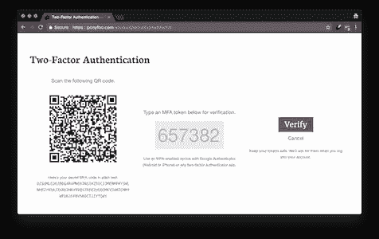
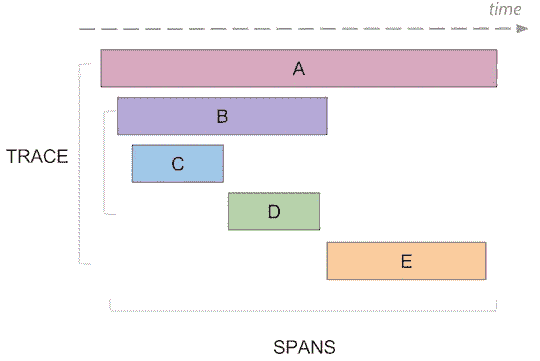
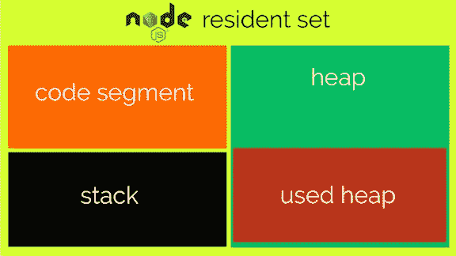
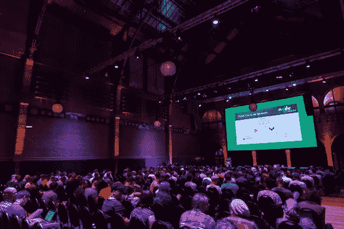

# Node.js 每周更新—2017 年 7 月 14 日

> 原文：<https://medium.com/hackernoon/node-js-weekly-update-14-july-2017-3989f29d5d3d>

**下面你可以找到**[**rising stack**](https://risingstack.com/)**最重要的 Node.js 更新、项目、教程&本周起 Node 相关会议:**

## [节点 v8.1.4(当前)发布](https://nodejs.org/en/blog/release/v8.1.4/)

新版本中的显著变化:

*   **构建:**禁用 V8 快照—快照中嵌入的 hashseed 当前对于二进制文件的所有运行都是相同的。这使得 node 容易受到碰撞攻击，从而导致拒绝服务。在找到更可靠的解决方案之前，我们暂时禁用了快照。
*   **deps:**CVE-2017–1000381-用于解析 NAPTR 响应的 c-ares 函数`ares_parse_naptr_reply()`，如果传入的 DNS 响应数据包是以特定方式制作的，则可能会被触发来读取给定输入缓冲区之外的内存。在处理记录之前，该补丁检查 NAPTR 记录的必需元素是否有足够的数据(2 int16，字符串长度为 3 字节)。

## [2017 年 7 月所有活动发布线的安全更新](https://nodejs.org/en/blog/vulnerability/july-2017-security-releases/)

现在，所有活动的 Node.js 发行版和 7.x 发行版都有更新。其中包括对初始公告中确定的高严重性漏洞的修复，4.x 发行版中一个额外的较低优先级 Node.js 漏洞，以及对当前发行版中 Node.js 依赖项的一些较低优先级修复。

> ***下载:***

*   [*Node.js v8【当前】*](https://nodejs.org/en/blog/release/v8.1.4/)
*   [*Node.js v7*](https://nodejs.org/en/blog/release/v7.10.1/)
*   [*Node.js v6 (LTS“硼”)*](https://nodejs.org/en/blog/release/v6.11.1/)
*   [*Node.js v4 (LTS“氩”)*](https://nodejs.org/en/blog/release/v4.8.4/)

> *注意:0.10.x 和 0.12.x 发行版也容易受到常量哈希表种子漏洞的攻击。我们建议这些发行版的用户升级到受支持的 LTS 发行版。*

关于这些缺陷的更多信息，请阅读文章。

## [为 Node.js 应用程序设置 2FA](https://ponyfoo.com/articles/setting-up-2fa-for-nodejs-applications)

2FA 依赖于我们将提供给用户的独一无二的共享秘密。然后，用户可以在他们的手机或任何其他 OTP 设备上使用这些共享秘密来生成基于时间的六位数令牌，以登录我们的网站。这比简单的基于密码的身份验证更安全:除了获得用户密码的访问权，恶意参与者还需要共享的秘密来泄露他们的帐户。

> *让我们来看看如何为我们的 web 应用快速制定出正确的双因素认证(2FA)解决方案。首先，让我们算出所需的流程。*

## [介绍 npx:NPM 包裹运送商](/@maybekatz/introducing-npx-an-npm-package-runner-55f7d4bd282b)

将 npm 升级到其最新版本[【电子邮件保护】](https://community.risingstack.com/cdn-cgi/l/email-protection)的人可能会注意到，它会在通常的 npm: npx 旁边安装一个新的二进制文件。

> *npx 是一个工具，旨在帮助完善使用 npm 注册表中的软件包的体验——与 npm 使安装和管理注册表上托管的依赖项变得非常容易一样，npx 也使使用注册表上托管的 CLI 工具和其他可执行文件变得非常容易。*

## [使用 Node.js 和 OpenTracing 的微服务分布式跟踪](https://blog.risingstack.com/distributed-tracing-opentracing-node-js/)

微服务是一种强大的架构模式，具有许多优势，但它也带来了关于调试的新挑战，因为它是一种分布式架构，将复杂性转移到了网络上。

分布式跟踪(和 OpenTracing)通过提供足够的关于跨进程通信的可见性和信息提供了一个解决方案。

> *本文解释了分布式跟踪的基础知识，并展示了一个用于调试基于 Node.js 的微服务应用程序的开源解决方案。*

## [如何检查 Node.js 中进程的内存使用情况](https://www.valentinog.com/blog/memory-usage-node-js/)

虽然每个人似乎都同意过早的优化可能是有害的，但您必须关心性能:在最简单的情况下，您可能想知道给定的 Node.js 进程在执行期间使用了多少内存。

> *在本帖中，我们将看到如何使用 Node.js 内置方法来获取任何给定进程的内存使用情况。*
> 
> ***你将学到什么:***

*   如何获取 Node.js 进程的内存信息
*   Node.js 如何组织内存

## [node . js 互动主题演讲关注平台的未来](/@nodejs/keynotes-for-node-js-interactive-focus-on-the-future-of-the-platform-3de77e6ad28c)

大会*(10 月 4 日至 6 日，加拿大温哥华)*包括主题演讲、演示和研讨会，旨在帮助 Node.js 用户更好地了解如何使用 Node.js 和 JavaScript，以及为项目做出贡献的最佳实践。

> *目前已公布的主题演讲:*

*   Node.js 技术指导委员会主任 James Snell:在他的主题演讲中，James 将提供 Node.js 未来几个月的路线图。
*   **Rachel White，技术专家、艺术家、虚拟机器人:** Rachel 将通过 Node.js 探索创造力，并提供一瞥人们正在由 Node.js 驱动的艺术作品，他们如何使用它以及他们正在整合哪些服务。
*   **Mark Hinkle，Node.js 基金会执行董事:**在他的主题演讲中，Mark 将回顾 Node.js 的进展和成功，以及基金会和项目的未来。
*   **Anna Henningsen，Node.js 核心技术委员会成员:** Anna 将在 Node.js 的技术方面工作一周，想开始为项目做贡献吗？来这个主题演讲。
*   **Franziska(Franzi)hinkel Mann，谷歌软件工程师:** Franzi 将在 Node.js 中讨论她对 Chrome V8 的看法，以及 Chrome V8 团队正在做些什么来继续支持 Node.js。

## [在线培训:测试 Node.js 应用](https://ti.to/risingstack/testing-node-js-applications-online)

“测试 Node.js 应用程序”课程为期四周，包括两个小时的网络研讨会(共 3 次)和针对您的特殊需求量身定制的一对一会议。

> 在这四周里，你将学习如何对你的应用进行单元测试，编写集成和端到端测试。网络研讨会将被录制并分发给与会者。

# Node.js 每周更新前情提要

在之前的 [Node.js 每周更新](https://community.risingstack.com/node-js-weekly-update-30-june/)中，我们了解了 Prometheus 的性能监控，使用 IBM Watson 和 Raspberry Pi &构建情绪分析机器人，使用 Node.js 交易加密货币、外汇、大宗商品股票等

我们还帮助您每天更新 Node.js。查看我们的 [*Node.js 新闻*](https://news.risingstack.com/) *页面及其* [*推特供稿*](https://twitter.com/NodeJS_Daily) *！*

*原载于 2017 年 7 月 14 日*[*community.risingstack.com*](https://community.risingstack.com/node-js-weekly-update-14-july/)*。*