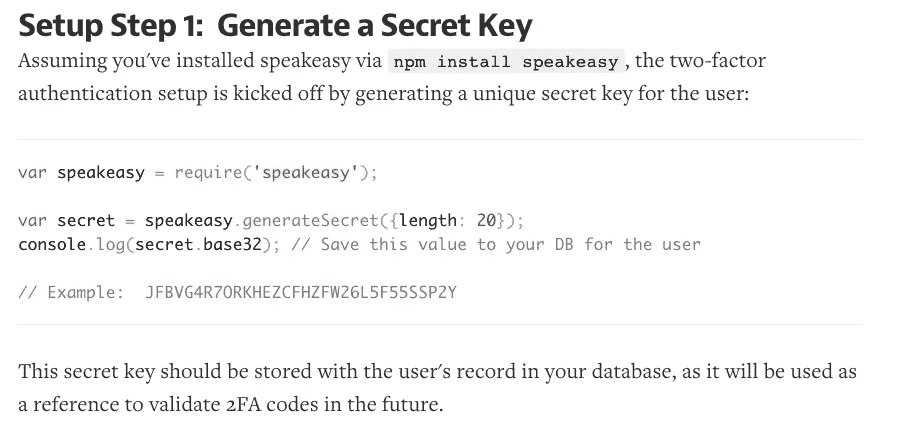
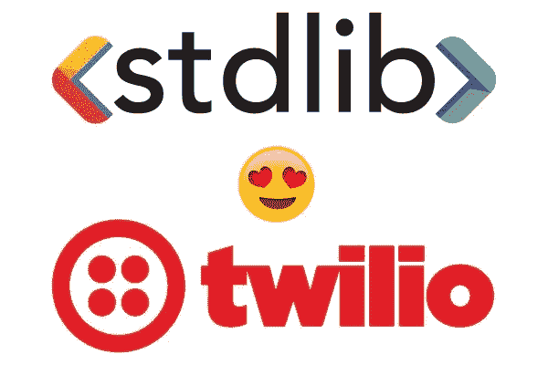
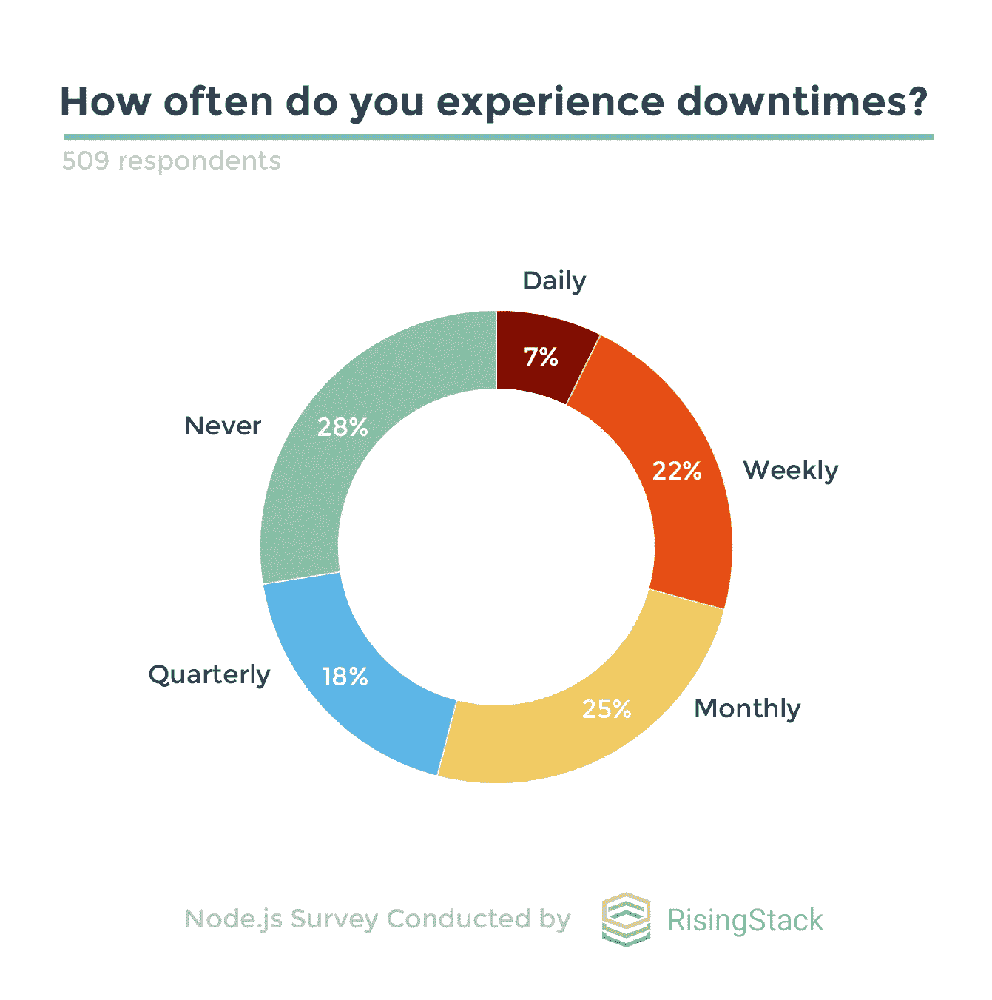
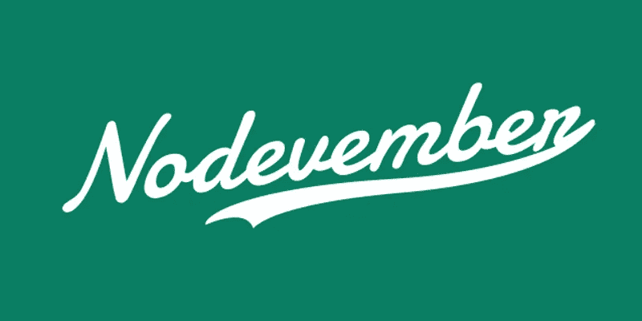

# Node.js 每周更新—2017 年 6 月 16 日

> 原文：<https://medium.com/hackernoon/node-js-weekly-update-16-june-2017-6322a85bb630>

**下面你可以找到**[**rising stack**](https://risingstack.com/)**最重要的 Node.js 更新、项目、教程&本周起 Node 相关会议:**

## [使用 Node.js 的双因素认证](https://davidwalsh.name/2fa)

密码可以被猜测，电话号码可以被伪造，但使用双因素身份认证本质上要求用户拥有一个装有 Google Authenticator 等应用程序的物理设备，该应用程序加载了给定应用程序的密钥，从而提供了额外的安全层。

> *因为我经常使用 2FA，所以我想看看开发者是如何为用户管理这个过程的。这将包括生成密钥，创建其 QR 码表示，将代码扫描到 Google Authenticator(由用户完成)，然后根据用户的密钥验证 GA 给定的代码。我找到了一个易于使用的 Node.js 库，speakeasy，来做这件事！*

## [一个快乐节点黑客的习惯 2017](https://blog.heroku.com/node-habits-2017)

以下是 2017 年更新的快乐节点黑客的 8 个习惯。它们是专门为应用程序开发人员设计的，而不是模块作者，因为这些群体有不同的目标和约束。

## [使用 Node.js + StdLib 在 7 分钟内构建一个“无服务器”Twilio SMS +呼叫转移机器人](https://hackernoon.com/build-a-serverless-twilio-sms-call-forwarding-bot-in-7-minutes-using-node-js-stdlib-411697c3cc1b)

了解如何使用 StdLib 在 7 分钟内构建一个 Twilio 消息中心！

> *你事先需要什么:*

*   1 个 Twilio 帐户
*   1x 命令行终端
*   7x 分钟(或 420x 秒)

## [调查:Node.js 开发人员与调试斗争&停机](https://blog.risingstack.com/survey-node-js-developers-struggle-with-debugging-and-downtimes/)

在本文中，我们总结了我们从最新的调查中了解到的关于 Node.js 调试、停机、微服务和其他痛点的开发者问题。

> ***node . js 调查的主要结果*** *:*

*   29.27%的 Node.js 开发人员每周至少经历一次生产系统停机，54.02%的开发人员每月至少经历一次。
*   27.50%参与调查的节点开发人员从未经历过停机。
*   42.82%的受访者每周花费超过 2 小时调试他们的 Node.js 应用程序，其中 17.09%的人花费超过 5 小时。
*   使用 Node 构建微服务架构的开发人员会花更多时间进行调试。微服务+节点的优势体现在宕机时间更少。

## [关于 Node.js 数字转型的免费网络研讨会](https://event.on24.com/eventRegistration/EventLobbyServlet?target=reg20.jsp&partnerref=nodejs&eventid=1440549&sessionid=1&key=7DE2249594D6A35008CAAA23B68BC7D3&regTag=&sourcepage=register)

有兴趣了解 Node.js 如何帮助简化您的数字流程以及该应用平台的最新趋势吗？

> *在本次互动在线研讨会中，我们将揭示 Capital One、Slack、Skycatch 和 NASA 等公司如何从使用 Node.js 中受益，从实现快速数据实验到在互联设备上构建创新体验。*
> 
> *在现场 Q & A 环节中，您将有机会就具体的使用案例提问，并了解为什么 Node.js 是构建数字体验的首选平台。*

## [2017 年 11 月 11 日车票已发售](https://www.eventbrite.com/e/nodevember-2017-tickets-34928136998)

Node 11 月是一个为期两天的会议，涉及 Node 和 JavaScript 的所有方面。该会议包括研讨会，讲习班，教程，代码冲刺，和闪电谈话。

> *第四届年会将于 2017 年 11 月 27 日和 28 日在田纳西州纳什维尔举行。*

# 节点核心变更:

## [⬢节点 v8.1.1(当前)](https://nodejs.org/en/blog/release/v8.1.1/)

*   **子进程**
*   `stdout`和`stderr`现在在对`child_process.exec`的`util.promisify()` ed 版本调用失败的错误输出上可用。
*   **HTTP**
*   破坏了 HTTP 与`cluster`模块一起使用的某些场景的回归已被修复。
*   **HTTPS**
*   `rejectUnauthorized`选项现在对 unix 套接字工作正常。
*   **读取线**
*   中断了`npm init`的更改和在同一个输入流中多次使用`readline`的其他代码被恢复。

## [⬢节点 v8.1.2(当前)](https://nodejs.org/en/blog/release/v8.1.2/)

修复 8.1.1 中损坏的`process.release`属性，这些属性会导致无法在 Windows 以外的平台上编译本机插件。这是 Node.js 构建过程中的一个修复，因此在 8.1.1 之上没有包含额外的代码提交。

## 打开 CFP 的

*   日本东京法政大学 [**NodeFest 东京**](https://docs.google.com/forms/d/e/1FAIpQLSf0TDlTdLWFE7yAnCyt3T_MCtJW-7u3T4XEpOVuZM61SnzG6w/viewform?c=0&w=1)
*   [**节点峰会**](http://www.nodesummit.com/speakers/become-a-speaker/) ，美国旧金山
*   [**法国巴黎 dot 会议**](https://www.dotconferences.com/blog/new-call-for-papers-for-all-our-conferences)

## 即将举行的活动

*   德国慕尼黑(6 月 18 日)
*   [**写/说/码**](https://docs.google.com/forms/d/e/1FAIpQLSfhg1WZQ17oiXTI7wzBp57K-9aI2DFCyZe-VcC0K0bSAh_6yQ/viewform?c=0&w=1) ，美国波特兰(俄勒冈州)(6 月 20 日)
*   [**NodeConf EU**](http://www.nodeconf.eu/) ，爱尔兰基尔肯尼(6 月 30 日)
*   [**开源峰会欧洲**](http://events.linuxfoundation.org/events/open-source-summit-europe) ，捷克布拉格(7 月 8 日)
*   [**非二进制技术**](http://nonbinary.tech/) ，英国伦敦(7 月 15 日)
*   [**CloudNativeCon+kube con 北美 2017**](http://events.linuxfoundation.org/events/cloudnativecon-and-kubecon-north-america/program/cfp) ，美国奥斯汀(TX)(8 月 21 日)
*   [**古巴哈瓦那**](https://www.papercall.io/cubaconf2017)(8 月 31 日)

*来源:节点基金会简讯*

# 发现易受攻击的 npm 软件包:

## 跨站点脚本(XSS)

*   [**下一包**](https://snyk.io/vuln/npm:next:20170607) ，版本< 2.4.3

## 目录遍历

*   [**city predict . whau willer 包**](https://snyk.io/vuln/npm:citypredict.whauwiller:20170516) ，所有版本
*   [**dmcquay . lab 6 包**](https://snyk.io/vuln/npm:dmmcquay.lab6:20170525) ，所有版本
*   [**byucslabsix 包**](https://snyk.io/vuln/npm:byucslabsix:20170525) ，所有版本
*   [**jikes 包**](https://snyk.io/vuln/npm:jikes:20170518) ，所有版本
*   [**斯科特-布兰奇-天气-app 套装**](https://snyk.io/vuln/npm:scott-blanch-weather-app:20170505) ，所有版本
*   [节点简单路由器包](https://snyk.io/vuln/npm:node-simple-router:20170523)，所有版本
*   [**wff server 包**](https://snyk.io/vuln/npm:wffserve:20170525) ，所有版本
*   [**埃尔丁包**](https://snyk.io/vuln/npm:elding:20170525) ，所有版本
*   [**下一包**](https://snyk.io/vuln/npm:next:20170601) ，版本<2 . 4 . 1 |>= 3 . 0 . 0-beta 1 ❤.0.0-beta7
*   [**服务包**](https://snyk.io/vuln/npm:serve:20170601) ，版本< 5.2.0 || =5.2.1

# Node.js 每周更新前情提要

在之前的 [Node.js 每周更新](https://community.risingstack.com/node-js-weekly-update-9-june-2017/)中，我们了解了 Node 8 的 util.promisify()，用 [MySQL & Node.js](https://blog.risingstack.com/node-js-mysql-example-handling-hundred-gigabytes-of-data/) 处理 100 的数据，了解了 npm 5 中的锁文件和 Node 6 & 8 的一个 comaprison。

*我们还会帮助您每天更新 Node.js。查看我们的* [*Node.js 新闻*](https://news.risingstack.com/) *页面及其* [*推特供稿*](https://twitter.com/NodeJS_Daily) *！*

*最初发表于 2017 年 6 月 16 日*[*community.risingstack.com*](https://community.risingstack.com/node-js-weekly-update-16-june-2017/)*。*

> [黑客中午](http://bit.ly/Hackernoon)是黑客如何开始他们的下午。我们是 [@AMI](http://bit.ly/atAMIatAMI) 家庭的一员。我们现在[接受投稿](http://bit.ly/hackernoonsubmission)，并乐意[讨论广告&赞助](mailto:partners@amipublications.com)机会。
> 
> 如果你喜欢这个故事，我们推荐你阅读我们的[最新科技故事](http://bit.ly/hackernoonlatestt)和[趋势科技故事](https://hackernoon.com/trending)。直到下一次，不要把世界的现实想当然！

