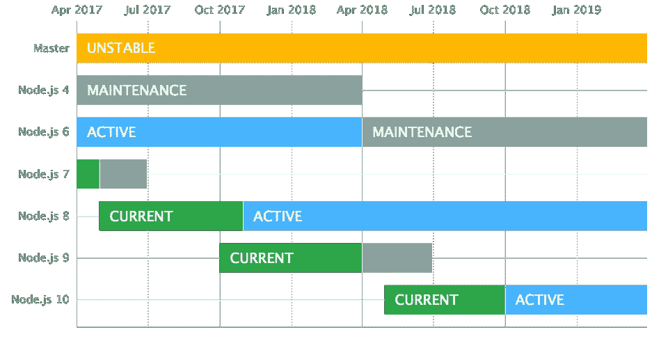
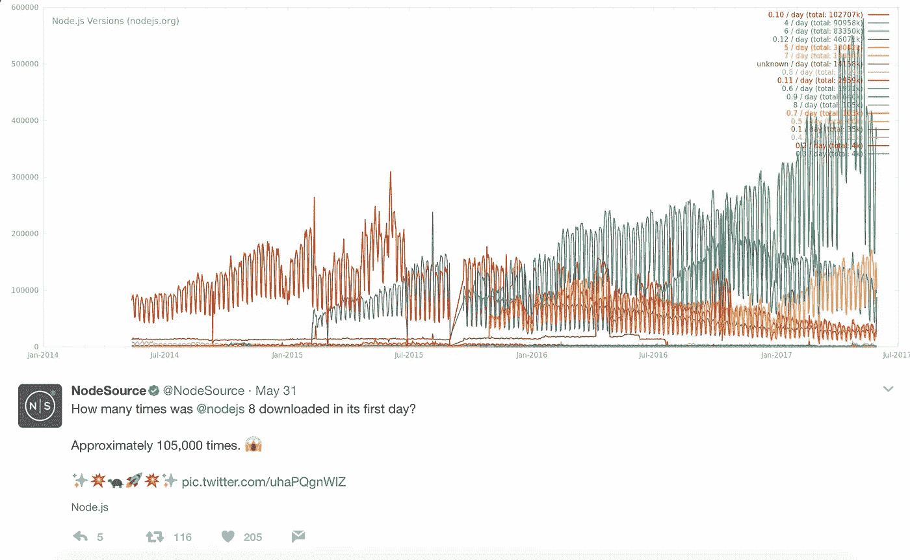
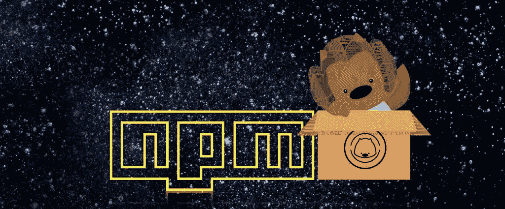
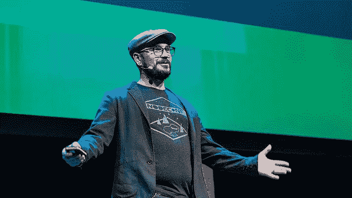
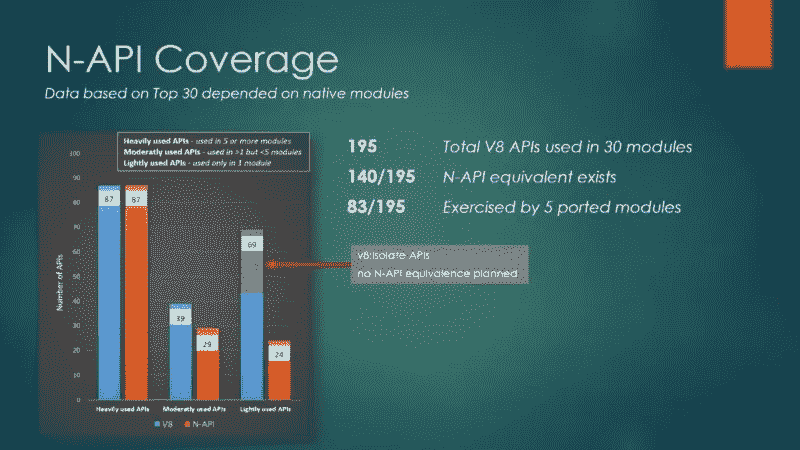
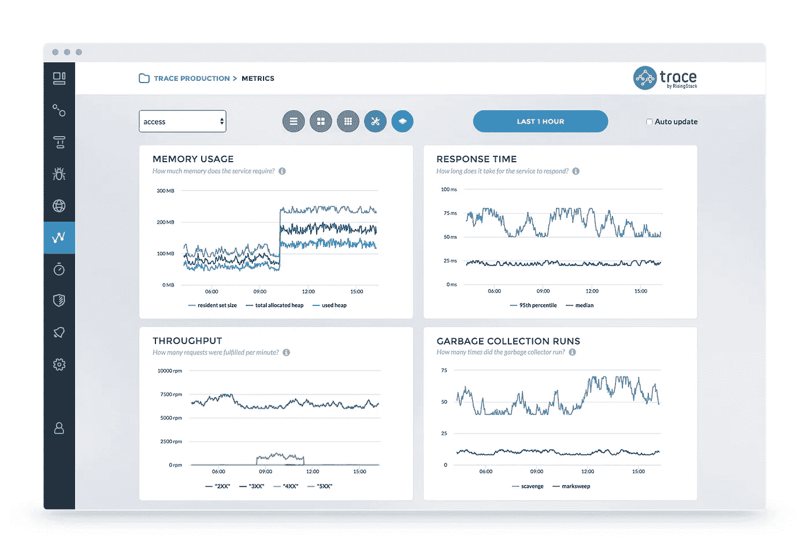

# Node.js 每周更新—2017 年 6 月 2 日

> 原文：<https://medium.com/hackernoon/node-js-weekly-update-2-june-2017-a37fad3a5c13>

**下面你可以找到**[**rising stack**](https://risingstack.com/)**最重要的 Node.js 新闻、项目、更新、不安全的 npm 包&节点相关 CFP 本周起:**

## [1。节点 v8.0.0(当前)发布](https://nodejs.org/en/blog/release/v8.0.0/)

本文总结了 Node.js 下一个主要版本中最重要的变化和特性。

## [2。Node.js 8 的重要特性和修复](https://blog.risingstack.com/important-features-fixes-node-js-version-8/)

随着 Node.js 版本 8 的发布(5 月 30 日)，我们得到了最新的 LTS(长期支持)版本，该版本具有一系列新功能和性能改进。

> 在本帖中，我们将介绍 Node.js 8 新版本最重要的特性和修复。

## [3。npm v5.0.0 版发布](http://blog.npmjs.org/post/161081169345/v500)

v5 将 npm 向前推进了一大步，显著提高了它在几乎所有常见情况下的性能，修复了一堆由于架构造成的旧错误，并且总体上使它更加健壮和容错。

> *它带来了一些改变，让做 monorepos 的人、想要一致性/安全性保证的用户的生活变得更容易，并为 git 依赖项带来了 semver 支持。*

## [4。迈克·罗杰斯:谢谢。再见。但也不尽然。](/@mikeal/thank-you-good-bye-but-not-really-48edf832f5b2)

> 我对 Node.js 过去几年所取得的成就感到无比自豪。虽然我将永远成为这个社区的一员，但我已经准备好从基础阶段迈向下一个挑战。
> 
> 这个项目一如既往地强大，有很多新的项目负责人，他们肯定会填补我留下的任何空缺，这个项目最终会因此变得更加强大。

## [5。N-API:用于本机模块的下一代 Node.js APIs】](/@nodejs/n-api-next-generation-node-js-apis-for-native-modules-169af5235b06)

现有的本机模块是用 C/C++编写的，直接依赖于 V8 和/或 NAN APIs。这种依赖的结果是缺乏 API/ABI 的稳定性保证，需要为每个主要的 Node.js 版本更新或重新编译本机插件。

> 下一代，ABI 稳定的 Node.js API for native modules 或 N-API 旨在解决这个问题，它为 JavaScript 虚拟机中的本机 API 提供了一个 ABI 稳定的抽象层。

## [6。公告:On-premises Node.js 监控工具现已推出](https://blog.risingstack.com/trace-on-premises-node-js-monitoring/)

Trace，RisingStack 的 Node.js 监控工具帮助开发人员和运营团队轻松调试和监控 Node.js 基础设施。

> *我们很高兴地宣布，Trace 现在也可以作为内部解决方案提供。要了解更多信息，请查看我们的* [*内部部署 Node.js 监控*](https://trace.risingstack.com/on-premises) *页面。*

## [7。发布具有持续集成的可维护 NPM 模块](https://blog.codeship.com/publishing-a-maintainable-npm-module-with-continuous-integration/)

在这个由两部分组成的系列文章中，您将学习如何构建、测试和发布一个 JavaScript 模块到 NPM，以及如何使用持续集成来更新它，这将自动测试和发布新版本。

> *这篇文章将集中于测试、构建和发布一个模块，而第二部分将集中于设置持续集成以更新模块。*

## [8。赢取 Node Interactive 北美的免费门票](http://events.linuxfoundation.org/events/node-interactive/extend-the-experience/tshirt)

Node.js 基金会今年想让你设计 Node.js 官方互动 t 恤！

> *详情:*

*   该基金会将在 6 月 12 日周一之前收集 t 恤艺术作品。
*   获奖设计将于 7 月 10 日(星期一)公布。
*   t 恤设计大赛的获胜者将获得 Node.js Interactive 的完全访问通行证。

## [9。培训:使用 Node.js 构建微服务—6 月 29 日至 30 日](https://ti.to/risingstack/build-microservices-with-node-js-30-june)

与 RisingStack 的 CTO Peter Marton 一起进行为期两天的实践培训，以掌握 Node.js 的微服务。

> *这个课程是为你准备的如果*

*   您正在考虑为您的组织提供微服务，
*   你想更好地了解微服务，
*   你想迁移到微服务，
*   您希望获得使用 Node.js 构建微服务的实践经验。

# 本周发现的易受攻击的 npm 软件包:

## 中等严重性

*   [跨站点脚本(XSS)](https://snyk.io/vuln/npm:rendr-handlebars:20140722)—**rendr-handlers**包，版本< 1.0.0
*   [跨站点脚本(XSS)](https://snyk.io/vuln/npm:octotree:20160613) — **八叉树**包，版本< 2.0.11
*   [跨站点脚本(XSS)](https://snyk.io/vuln/npm:octotree:20140514) — **八叉树**包，版本< 1.1
*   [跨站脚本(XSS)](https://snyk.io/vuln/npm:ghost:20170110) — **ghost** 包，版本< 0.11.4 > =0.8.0
*   [跨站点脚本(XSS)](https://snyk.io/vuln/npm:ghost:20161007) — **ghost** 包，版本<1 . 0 . 0-α5>= 1 . 0 . 0-α1 | |>= 0 . 8 . 0<0 . 11 . 2
*   [跨站点脚本(XSS)](https://snyk.io/vuln/npm:ghost:20150303-2) — **ghost** 包，版本< 0.5.9
*   [跨站点脚本(XSS)](https://snyk.io/vuln/npm:easyxdm:20130110) — **easyxdm** 包，版本< 2.4.19
*   [跨站点脚本(XSS)](https://snyk.io/vuln/npm:bootstrap-markdown:20140826)—**bootstrap-markdown**包，所有版本
*   [认证旁路](https://snyk.io/vuln/npm:ghost:20150303-4) — **ghost** 包，版本< 0.5.9
*   [认证旁路](https://snyk.io/vuln/npm:ghost:20150303-3) — **ghost** 包，版本< 0.5.9
*   [中间人(MitM)](https://snyk.io/vuln/npm:hotel:20160322) — **酒店**套餐，所有版本
*   [打开重定向](https://snyk.io/vuln/npm:ghost:20160823) — **ghost** 包，版本< 0.10.0
*   [信息披露](https://snyk.io/vuln/npm:ghost:20150303) — **ghost** 包，版本< 0.5.9
*   [拒绝服务](https://snyk.io/vuln/npm:ghost:20150303-5) — **ghost** 包，版本< 0.5.9
*   [身份欺骗](https://snyk.io/vuln/npm:ghost:20150303-1) — **ghost** 包，版本< 0.5.9

# 打开 Node.js CFP 的

*   东京 [NodeFest](https://docs.google.com/forms/d/e/1FAIpQLSf0TDlTdLWFE7yAnCyt3T_MCtJW-7u3T4XEpOVuZM61SnzG6w/viewform?c=0&w=1)
*   [节点峰会](http://www.nodesummit.com/nodetalks/)，旧金山(加州)
*   [点会议](https://www.dotconferences.com/blog/new-call-for-papers-for-all-our-conferences)，巴黎
*   [Nordic.js](http://cfp.nordicjs.com/) ，斯德哥尔摩
*   【2017 年神奇女侠科技大会，长滩(加州)

# 前情提要

在之前的 [Node.js 每周更新](https://community.risingstack.com/node-js-weekly-update-26-may-2017/)中，我们读到了 npm auth 变得有限，一个伟大的 Node.js 流指南，一个关于即将到来的节点会议的 AWS Lambda & Nod 教程&。

*我们还会帮助您每天更新 Node.js。查看我们的* [*Node.js 新闻*](https://news.risingstack.com/) *页面及其* [*推特供稿*](https://twitter.com/NodeJS_Daily) *！*

*原载于 2017 年 6 月 2 日*[*community.risingstack.com*](https://community.risingstack.com/node-js-weekly-update-2-june-2017/)*。*

> [黑客中午](http://bit.ly/Hackernoon)是黑客如何开始他们的下午。我们是 [@AMI](http://bit.ly/atAMIatAMI) 家庭的一员。我们现在[接受投稿](http://bit.ly/hackernoonsubmission)并乐意[讨论广告&赞助](mailto:partners@amipublications.com)机会。
> 
> 如果你喜欢这个故事，我们推荐你阅读我们的[最新科技故事](http://bit.ly/hackernoonlatestt)和[趋势科技故事](https://hackernoon.com/trending)。直到下一次，不要把世界的现实想当然！

