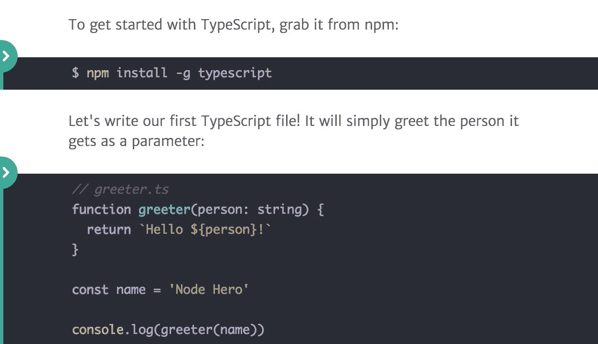
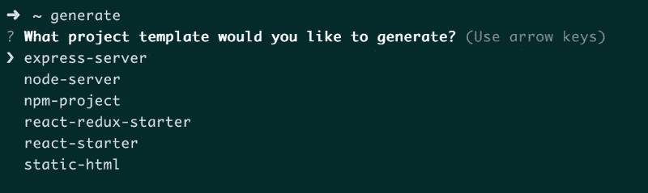

# Node.js 每周更新—2017 年 6 月 23 日

> 原文：<https://medium.com/hackernoon/node-js-weekly-update-23-june-2017-c8a930565c5a>

**下面你可以找到**[**rising stack**](https://risingstack.com/)**最重要的 Node.js 更新、项目、教程&本周起 Node 相关会议:**

## Node.js 将在一年内超越 Java

Mikeal Rogers 从第一天起就在 Node.js 基金会工作。作为基金会的社区经理，他的工作包括亲自监督运营，从沟通和营销到会议规划，再到主持董事会会议

[Photo credit](https://thenewstack.io/open-source-profile-mikeal-rogers-node-js/)

> *Rogers 接受了 New Stack 的采访，讲述了他在开源世界起步、在 Node.js 基金会工作以及成为开源治理负责人的经历。*

## [用 TypeScript 教程构建 node . js App](https://blog.risingstack.com/building-a-node-js-app-with-typescript-tutorial/)

本教程介绍如何构建、构建、测试和调试用 TypeScript 编写的 Node.js 应用程序。为此，我们使用一个示例项目，您可以在以后的任何时候访问它。

> *管理大规模的 JavaScript 项目可能很有挑战性，因为你需要保证各个部分能够相互配合。您可以使用单元测试、类型(JavaScript 实际上没有)或者两者结合来解决这个问题。*
> 
> 这就是 TypeScript 发挥作用的地方。TypeScript 是 JavaScript 的类型化超集，它编译成普通 JavaScript。

## [以下是你需要了解的关于 npm 5 的内容](https://blog.pusher.com/what-you-need-know-npm-5/)

我相信你现在已经听到这个消息了，npm5 已经上市，它比以前更快、更稳定、更安全！

## [测试 Node.js 应用程序(网络研讨会)](https://ti.to/risingstack/testing-node-js-applications-online)

“测试 Node.js 应用程序”课程为期四周，包括两个小时的网络研讨会(共 3 次)和针对您的特殊需求量身定制的一对一会议。

> 这个课程是为你准备的，如果

*   您想了解如何正确测试 Node.js 应用程序，
*   您希望软件的缺陷更少，
*   你希望更多地致力于特性而不是修复 bug。

## [创建带有节点](/@harrietty/creating-a-project-generator-with-node-29e13b3cd309)的项目生成器

在本教程结束时，您将能够在计算机上的任何地方键入$ generate，选择您想要创建的 starter 项目以及您想要为它指定的名称，它将会为您创建。

> 在这篇文章中，我将带你了解如何创建一个简单的项目生成器，它是用 NodeJS 构建的，可以在你的计算机上全局安装，并用于在你需要的任何地方、任何时候创建一个启动项目。

## [企业对话第 13 集:Node.js 和英特尔](https://www.youtube.com/watch?v=SBR6WcSIqBE)

英特尔的 Monica Ene-Pietrosanu 讨论了英特尔如何使用 Node.js，以及该公司在促进开源技术和多样性方面所做的努力。

## [收集薄弱的国家预防机制证书](https://github.com/ChALkeR/notes/blob/master/Gathering-weak-npm-credentials.md)

或者我是如何获得 13%的 npm 包(包括流行包)的直接发布权限的。通过依赖链潜在可达的包的估计数量是 52%。

> *在这篇文章中，我谈到了收集凭证的三种方式——暴力攻击、从其他来源(非 npm)泄漏的已知帐户以及 GitHub(和其他地方)上泄漏的 npm 凭证。*

# 即将举办的 Node.js 和 JavaScript 活动

*   [美国明尼阿波利斯市 Eyeo 音乐节](http://eyeofestival.com/)——6 月 26 日至 29 日
*   [JSConf 中国](http://2017.jsconf.cn/en/)，中国上海——7 月 15 日至 16 日
*   [节点峰会](https://www.eventbrite.com/e/node-summit-2017-san-francisco-tickets-32032284425?discount=NodeFoundation)，美国加利福尼亚州旧金山——7 月 25 日至 27 日
*   [全栈节](https://2017.fullstackfest.com/)，西班牙巴塞罗那——9 月 4 日至 8 日
*   瑞典斯德哥尔摩——9 月 7 日至 8 日
*   [node . js Interactive North America](http://events.linuxfoundation.org/events/node-interactive)，不列颠哥伦比亚省温哥华——10 月 4 日至 6 日
*   [GitHub Universe](https://github.com/blog/2296-save-the-date-github-universe-2017) ，美国加州旧金山——10 月 10 日至 12 日
*   阿根廷布宜诺斯艾利斯——10 月 26 日至 28 日
*   11 月 5 日至 8 日，爱尔兰基尔肯尼

*来源:节点基金会简讯*

# Node.js 每周更新前情提要

在之前的 [Node.js 每周更新](https://community.risingstack.com/node-js-weekly-update-16-june-2017/)中，我们了解了 Node.js 的双因素认证、黑客习惯、最新的 Node.js 调查以及更多内容..

*我们也每天帮助您更新 Node.js。查看我们的* [*Node.js 新闻*](https://news.risingstack.com/) *页面及其* [*推特供稿*](https://twitter.com/NodeJS_Daily) *！*

*原载于 2017 年 6 月 23 日*[*community.risingstack.com*](https://community.risingstack.com/node-js-weekly-update-23-june/)*。*

> [黑客中午](http://bit.ly/Hackernoon)是黑客如何开始他们的下午。我们是阿美族家庭的一员。我们现在[接受投稿](http://bit.ly/hackernoonsubmission)并乐意[讨论广告&赞助](mailto:partners@amipublications.com)机会。
> 
> 如果你喜欢这个故事，我们推荐你阅读我们的[最新科技故事](http://bit.ly/hackernoonlatestt)和[趋势科技故事](https://hackernoon.com/trending)。直到下一次，不要把世界的现实想当然！

