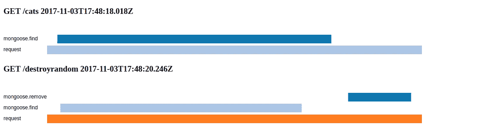

# Node.js 每周更新—2017 年 11 月 24 日

> 原文：<https://medium.com/hackernoon/node-js-weekly-update-24-november-2017-fb53ef751559>

**下面你可以找到**[**rising stack**](https://risingstack.com/)**的集合最重要的 Node.js 更新，本周项目&教程:**

## [戴上头盔—保护您的 Express 应用](https://www.twilio.com/blog/2017/11/securing-your-express-app.html)

Express 是使用 Node.js 构建 web 服务器的一种很好的方式，但是，开箱即用的 Express 并不符合所有的安全最佳实践。让我们看看如何使用像`helmet`这样的模块来提高应用程序的安全性。

## [人脸识别 node . js+OpenCV](/@muehler.v/node-js-opencv-for-face-recognition-37fa7cb860e8)

今天我们将看看在 OpenCVs 的 face 模块中实现的 Fisher、Eigen 和 LBPH 人脸识别器，并构建一个简单的 Node.js 人脸识别示例。

## [监控 Node.js web 应用程序的性能](https://blog.sqreen.io/diy-node-apm/)

本文以清晰的可视化方式解释了构建监控工具的关键要素——从检测代码到报告收集的数据。

## [用 Rust 编写快速安全的 native Node.js 模块](https://blog.risingstack.com/node-js-native-modules-with-rust/)

> 去年，RisingStack 面临了一个令人震惊的事件:我们达到了 Node.js 当时所能提供的最大速度，而我们的服务器成本却高得惊人。

如果你面临类似的问题，你能做什么？在 Node.js 代码中实现 Rust 模块是一个可能的解决方案。在这个 Rust 教程中，我们将告诉你如何去做。

## [调查:2018 年 Learning node . js](https://rstck.typeform.com/to/lqxo1P)

我们创建了一个 2 分钟的调查，询问 Node.js 社区他们希望在 2018 年学习什么。让我们知道哪些方面对您来说比较麻烦，我们会确保解决这些问题。

[https://rstck.typeform.com/to/lqxo1P](https://rstck.typeform.com/to/lqxo1P)

## [节点颜色日志](https://github.com/tigercosmos/node-color-log)

`node-color-log`是一个 Node.js 包，可以用彩色字体和彩色背景来记录文本。它在开发应用程序时提供了更好的编码体验。下面是如何设置它。

## [如何在本地 Windows 或 Linux 机器上设置 Node.js 服务器](https://securitytraning.com/setup-node-js-server-local-windows-linux-machine/)

本文将指导您在 PC 上安装 Node.js 服务器——如果您还没有安装的话。

# Node.js 每周更新前情提要

在之前的 [Node.js 每周更新](https://community.risingstack.com/node-js-weekly-update-november-17/)中，我们收集了 Node.js 的最新消息，如 Node v9.2.0，以及关于调试内存泄漏、节点安全性、本机模式以及用 Node 和 Express 连接 GraphQL 服务器的最佳教程。[错过了就点击](https://community.risingstack.com/node-js-weekly-update-november-17/)！

*我们还帮助您每天更新 Node.js。查看我们的* [*Node.js 新闻*](https://news.risingstack.com/) *页面及其* [*推特供稿*](https://twitter.com/NodeJS_Daily) *！*

*原载于 2017 年 11 月 24 日 community.risingstack.com**的* [*。*](https://community.risingstack.com/node-js-weekly-update-november-24/)