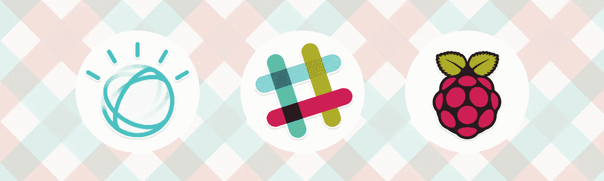
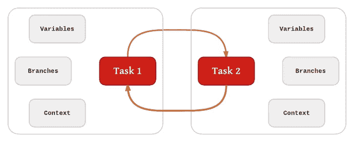

# Node.js 每周更新—2017 年 6 月 30 日

> 原文：<https://medium.com/hackernoon/node-js-weekly-update-30-june-2017-e7311c5e6304>

**下面你可以找到**[**rising stack**](https://risingstack.com/)**最重要的 Node.js 更新、项目、教程&本周起 Node 相关会议:**

## 【2017 年 7 月所有活动发布线的安全更新

Node.js 项目将在 2017 年 7 月 10 日这一周发布其所有活动发布线(4.x、6.x、8.x)和 7.x 的新版本，以纳入安全修复。

> *从 v4.x 到 v8.x 的所有当前版本都容易受到外部攻击者利用来导致拒绝服务的问题的攻击。此漏洞的严重性很高，受影响版本的用户应该计划在修补程序可用时进行升级。*

## [使用 Prometheus 进行 Node.js 性能监控](https://blog.risingstack.com/node-js-performance-monitoring-with-prometheus/)

Prometheus 是 Node.js 监控和警报的开源解决方案。它为时间序列数据提供了强大的数据压缩和快速的数据查询。

> *当我们想用 Prometheus 监控 Node.js 应用程序时，我们需要解决以下挑战:*

*   检测:以最小的性能开销安全地检测我们的代码
*   度量公开:用 HTTP 端点公开我们的普罗米修斯度量
*   托管普罗米修斯:运行配置良好的普罗米修斯
*   提取值:编写统计上正确的查询
*   可视化:构建仪表板并可视化我们的查询
*   警报:设置有效的警报
*   寻呼:通过对寻呼应用升级策略来获得警报通知

## [在线培训:测试 Node.js 应用](https://ti.to/risingstack/testing-node-js-applications-online)

“测试 Node.js 应用程序”课程为期四周，包括两个小时的网络研讨会(共 3 次)和针对您的特殊需求量身定制的一对一会议。

> 在这四周里，你将学习如何对你的应用进行单元测试，编写集成和端到端测试。网络研讨会将被录制并分发给与会者。

## 用 IBM Watson 和 Raspberry Pi 构建情感分析机器人

你有没有想过你的队友是如何看待你的聊天信息的？也许你听起来很英勇！或者不愉快。也许你甚至没有注意到你发出的刺耳的声音！

> *这个项目使用 Node.js，所以要确保你的机器上安装了 Node.js。您还需要一个 IBM Bluemix 帐户，并添加 Watson Tone Analyzer。*

## [使用 Node.js](https://pusher.com/sessions/meetup/london-node-user-group/trading-cryptocurrencies-forex-commodities-stocks-and-more-using-nodejs) 交易加密货币、外汇、商品股票等

我们将看看@flyingunicorn222 在涉足比特币和以太坊交易(后来证明是基于技术分析和一些不可靠的统计数据进行各种交易)后，在过去几年中开发的库和工具。

## [在 NodeJS 中读写内存(通过 node addon)(终于！)](https://github.com/Rob--/memoryjs)

特点:

*   打开一个流程
*   关闭进程(句柄)
*   列出所有打开的流程
*   列出与进程关联的所有模块
*   查找与流程相关联的某个模块
*   读取内存
*   写入内存
*   模式扫描

> *这是一个节点插件(最近一次测试是在 6.9.1 版上进行的)，因此需要 node-gyp 才能使用。*
> 
> `*npm install memoryjs*`

## [记忆 API 和其他流畅编码的技巧](https://chrismm.com/blog/memorizing-apis-and-other-tips-for-coding-fluently/)

在“你的大脑在工作”中，David Rock 博士快速介绍了神经科学的现状，并继续就如何处理办公室生活的危险给出了大量建议，我们大多数开发人员可能都有同感。

> *这篇文章将尝试从这本书中获取主要思想，并将它们应用到常见的软件开发情况中。*

# 即将举办的 Node.js 和 JavaScript 活动

## 现在打开 CFP 的:

*   日本东京法政大学
*   [法国巴黎 dot 会议](https://www.dotconferences.com/blog/new-call-for-papers-for-all-our-conferences)
*   [美国 DC 华盛顿州神奇女侠科技 2017](https://wonderwomentech.com/wpgforms/speaker-submission/)

## 即将举行的活动

**6 月 30 日:** [雷普莱恩斯](https://cfp.techlahoma.org/events/thunderplains-2017)，美国俄克拉荷马城(OK)

6 月 30 日:爱尔兰基尔肯尼

**7 月 8 日:** [开源峰会欧洲](http://events.linuxfoundation.org/events/open-source-summit-europe)，捷克布拉格

**7 月 15 日:** [非二进制科技](http://nonbinary.tech/)，英国伦敦

**7 月 24 日:** [Codemotion 米兰](http://milan2017.codemotionworld.com/call-for-papers-guidelines/)，意大利米兰

**8 月 6 日:** [美国西雅图](http://seagl.org/news/2017/06/19/CFP-open.html)

**8 月 21 日:**[CloudNativeCon+kube con 北美 2017](http://events.linuxfoundation.org/events/cloudnativecon-and-kubecon-north-america/program/cfp) ，美国奥斯汀(TX)

8 月 31 日:古巴哈瓦那

# Node.js 每周更新前情提要

在之前的 [Node.js 每周更新](https://community.risingstack.com/node-js-weekly-update-23-june/)中，我们读到了 Node.js 在一年内超越 Java，一个很棒的 TypeScript 教程，一个 npm 5 指南，以及英特尔如何使用 Node.js。

我们还帮助您每天更新 Node.js。查看我们的 [*Node.js 新闻*](https://news.risingstack.com/) *页面及其* [*推特供稿*](https://twitter.com/NodeJS_Daily) *！*

*原载于 2017 年 6 月 30 日 community.risingstack.com***。**

******

> *[黑客中午](http://bit.ly/Hackernoon)是黑客如何开始他们的下午。我们是 [@AMI](http://bit.ly/atAMIatAMI) 家庭的一员。我们现在[接受投稿](http://bit.ly/hackernoonsubmission)并乐意[讨论广告&赞助](mailto:partners@amipublications.com)机会。*
> 
> *如果你喜欢这个故事，我们推荐你阅读我们的[最新科技故事](http://bit.ly/hackernoonlatestt)和[趋势科技故事](https://hackernoon.com/trending)。直到下一次，不要把世界的现实想当然！*

**