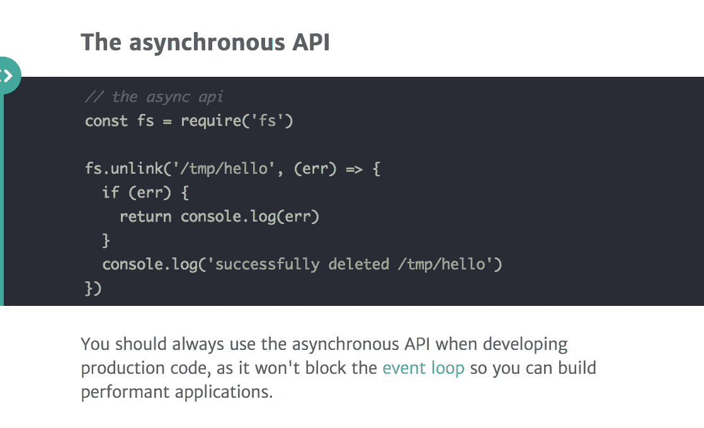
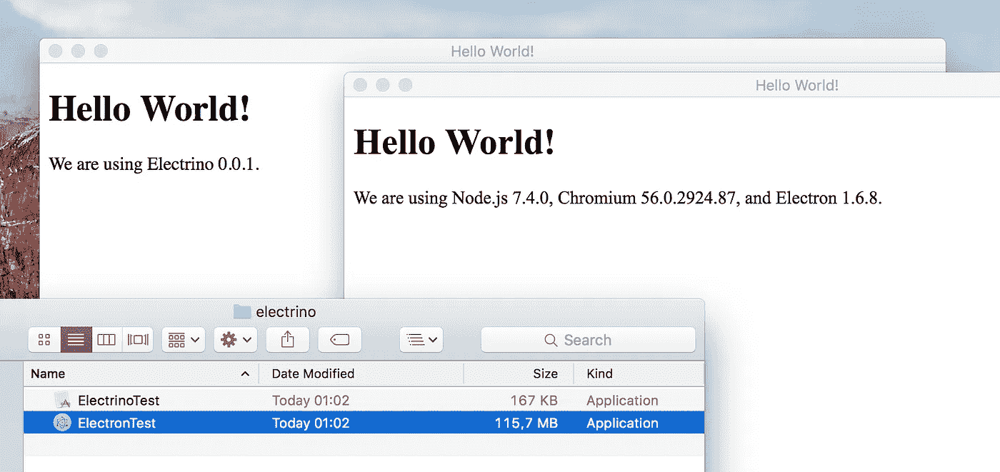
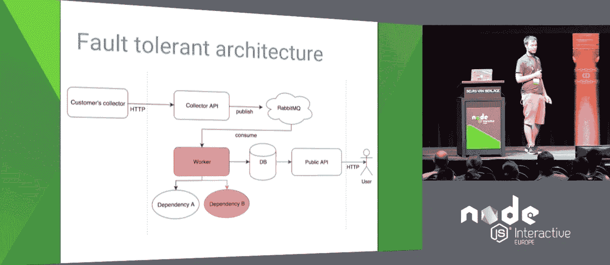

# Node.js 每周更新—2017 年 5 月 5 日

> 原文：<https://medium.com/hackernoon/node-js-weekly-update-5-may-2017-4aacf12d1dae>

**下面可以找到**[**rising stack**](https://risingstack.com/)**最重要的 Node.js 新闻、项目、更新&本周安全泄密:**

## [1。Node.js 8.0.0 已经延迟，将于 5 月 30 日左右发货](/the-node-js-collection/node-js-8-0-0-has-been-delayed-and-will-ship-on-or-around-may-30th-cd38ba96980d)

这篇文章是由 Myles Borins 带给你的，他是@nodejs ctc 成员/@ Google cloud 的开发者倡导者。现在有了这个背景，让我们深入了解 Node.js 8.0.0 延迟的“原因”。

> ***为什么？简而言之:*** *我们想给自己一个选项，让 Node.js 8.x 发布线搭载涡扇+点火管道，这将成为 V8 5.9 中的默认。这将允许我们的下一个 LTS 发布线运行在一个更现代的编译器+ jit 管道上，使反向移植更容易，并从 V8 团队给我们一个更长的支持合同。*

## [2。掌握 Node.js 核心模块—文件系统& fs 模块](https://blog.risingstack.com/mastering-the-nodejs-core-modules-file-system-fs-module/)

在本文中，我们将了解文件系统核心模块、文件流和一些 fs 模块替代方案。

> *在这个新的掌握 Node.js 核心模块系列中，您可以了解核心模块有哪些隐藏/鲜为人知的功能，以及如何使用它们。我们还将提到扩展其行为的模块，它们是您日常开发流程的重要补充。*

## [3。让你的电子应用程序与电子一起节食](/@pauli/put-your-electron-app-on-a-diet-with-electrino-c7ffdf1d6297)

满足使用 web 技术构建的桌面应用程序 99.9%的减肥计划。

> 因此，每个电子应用程序本质上都带有一个操作系统。电子版的“Hello World”应用程序重 115 MB。对于小应用程序，有另一种方法。他们可以使用系统提供的 web 运行时，而不是将 web 运行时与每个应用捆绑在一起。

## [4。问&关于 Snyk 的安全性、npm 和 Node.js 基础](https://hackernoon.com/q-a-with-snyk-on-security-npm-and-the-node-js-foundation-39a035c33120)

Node.js 基金会最近与 Snyk 的联合创始人兼首席执行官 Guy Podjarny 坐在一起，就 Snyk、为更大的 Node.js 软件包生态系统创建更好的安全性以及 Snyk 加入基金会的原因进行了更多的讨论。

> ***问:为什么包生态系统中的安全性如此重要？***
> 
> 答:npm 和其他包管理器给开发世界带来的转变是惊人而复杂的。

## [5。Zeit/PKG:将 Node.js 项目打包成可执行文件](https://github.com/zeit/pkg)

这个命令行界面使您能够将 Node.js 项目打包成一个可执行文件，该文件甚至可以在没有安装 Node.js 的设备上运行。

## [6。使用 Node.js 构建微服务—2017 年 6 月 22 日至 23 日](https://ti.to/risingstack/build-microservices-with-node-js-22-23-june-2017)

RisingStack 的联合创始人兼首席技术官 Peter Marton 在加利福尼亚州旧金山举办了为期两天的 Node.js 微服务实践培训。

> *这个课程是为你准备的如果*

*   您正在考虑为您的组织提供微服务，
*   你想更好地了解微服务，
*   你想迁移到微服务，
*   您希望获得使用 Node.js 构建微服务的实践经验。

# 最近的 Node.js 版本:

## [○节点 v6.10.3 (LTS)](https://nodejs.org/en/blog/release/v6.10.3/)

*   **模块:**加载全局回退到节点可执行文件目录的模块现在可以在 Windows 上正常工作。
*   **src:** 修复罕见边缘情况下的 base64 解码
*   **tls:** 使用 tls 时修复罕见的分段错误

## [○节点 v7.10.0(当前)](https://nodejs.org/en/blog/release/v7.10.0/)

*   **加密:**添加随机填充和随机填充同步
*   **meta:** 添加了新的合作者
    将 lucamaraschi 添加到合作者
    将 DavidCai1993 添加到合作者
    将 jkrems 添加到合作者
    将 AnnaMag 添加到合作者
*   **流程:**修复承诺拒绝为符号时的崩溃
*   **url:** 让 WHATWG 的 url 更符合规范
*   **v8:** 修复递归方法中的堆栈溢出
    用 g++ 7 修复构建错误

## [○节点 v4.8.3(维护)](https://nodejs.org/en/blog/release/v4.8.3/)

*   **模块:**加载全局回退到节点可执行文件目录的模块现在可以在 Windows 上正常工作。
*   **src:** 修复罕见边缘情况下的 base64 解码
*   **tls:** 使用 tls 时修复罕见的分段错误

# 发现易受攻击的 npm 软件包:

## 高严重性

*   [通过不安全协议](https://snyk.io/vuln/npm:ec2-price:20170418) — **ec2-price** 包下载资源，版本< 0.5.0

## 中等严重性

*   [目录遍历](https://snyk.io/vuln/npm:sencisho:20170418) — **sencisho** 包，版本< 0.3.3
*   [目录遍历](https://snyk.io/vuln/npm:guaycuru:20170418) — **guaycuru** 包，版本< 0.2.4
*   [任意代码注入](https://snyk.io/vuln/npm:growl:20160721) — **咆哮**包，版本< 1.9.3
*   [任意代码注入](https://snyk.io/vuln/npm:protojs:20160407) — **protojs** 包，版本< 1.0.6
*   [任意代码注入](https://snyk.io/vuln/npm:microservicebus.node:20160408)—**microservice bus . node**包，版本< 0.4.3
*   [任意代码注入](https://snyk.io/vuln/npm:mongo-parse:20160408) — **mongo-parse** 包，所有版本
*   [任意代码注入](https://snyk.io/vuln/npm:kmc:20160407) — **kmc** 包，所有版本
*   [任意代码注入](https://snyk.io/vuln/npm:mongo-edit:20160408)—**mongo—编辑**包，所有版本
*   [任意代码注入](https://snyk.io/vuln/npm:mongui:20160408) — **蒙贵包**，所有版本
*   [任意代码注入](https://snyk.io/vuln/npm:mock2easy:20160408) — **mock2easy** 包，所有版本
*   [任意代码注入](https://snyk.io/vuln/npm:mongoosemask:20160408)—**mongose mask**包，所有版本
*   [任意代码注入](https://snyk.io/vuln/npm:mongoosify:20160408) — **mongoosify** 包，版本< 0.0.4
*   [任意代码注入](https://snyk.io/vuln/npm:modjs:20160407) — **modjs** 包，所有版本
*   [任意代码注入](https://snyk.io/vuln/npm:m-log:20160408) — **m-log** 包，所有版本
*   [任意代码注入](https://snyk.io/vuln/npm:modulify:20160407) — **模块化**包，所有版本
*   [任意代码注入](https://snyk.io/vuln/npm:nd-validator:20160408) — **nd-validator** 包，所有版本
*   [任意代码注入](https://snyk.io/vuln/npm:nameless-cli:20160408) — **无名 cli** 包，所有版本
*   [任意代码注入](https://snyk.io/vuln/npm:m2m-supervisor:20160408) — **m2m-supervisor** 包，所有版本
*   [任意代码注入](https://snyk.io/vuln/npm:mobile-icon-resizer:20160408)—**mobile-icon-resizer**包，版本< 0.4.3
*   [任意代码注入](https://snyk.io/vuln/npm:mixin-pro:20160407) — **mixin-pro** 包，版本< 0.6.7

# 前情提要

在之前的 [Node.js 每周更新](https://community.risingstack.com/node-js-weekly-update-28-april-2017/)中，我们读到了 Node + Robotics，一个详细的调试工具集，制作 RESTful Web 服务，等等..

*原载于 2017 年 5 月 5 日 community.risingstack.com**[*。*](https://community.risingstack.com/node-js-weekly-update-5-may-2017/)*

> [黑客中午](http://bit.ly/Hackernoon)是黑客如何开始他们的下午。我们是 [@AMI](http://bit.ly/atAMIatAMI) 家庭的一员。我们现在[接受投稿](http://bit.ly/hackernoonsubmission)并乐意[讨论广告&赞助](mailto:partners@amipublications.com)机会。
> 
> 如果你喜欢这个故事，我们推荐你阅读我们的[最新科技故事](http://bit.ly/hackernoonlatestt)和[趋势科技故事](https://hackernoon.com/trending)。直到下一次，不要把世界的现实想当然！

