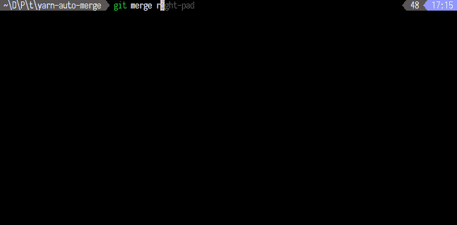
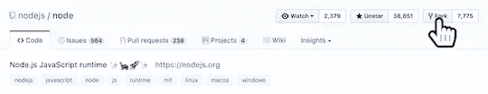
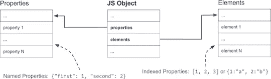
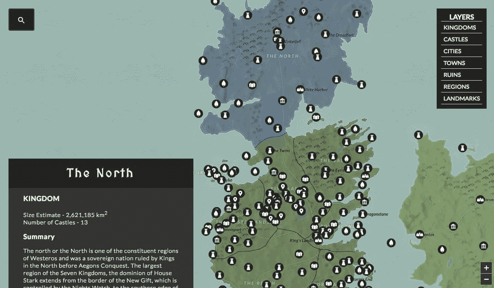
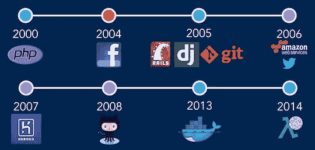

# Node.js 每周更新—2017 年 9 月 8 日

> 原文：<https://medium.com/hackernoon/node-js-weekly-update-8-september-2017-40c7ba03e96a>

**下面你可以找到**[**rising stack**](https://risingstack.com/)**最重要的 Node.js 更新的集合，本周项目&教程:**

## [Node.js 6.11.3 (LTS)已发货](https://github.com/nodejs/node/releases/tag/v6.11.3)

这个 LTS 版本提供了 152 个提交。这包括 75 个与测试相关，25 个与文档相关，21 个与构建/工具相关，3 个提交是对依赖项的更新。

> *显著变化*

*   **构建:**
*   代码设计在 macOS 上是固定的(埃文卢卡斯)
*   **deps:**
*   快照已重新打开！！！(杨果)
*   **路径:**
*   win32 卷相对路径又开始工作了！(顾震霆)
*   **工具:**
*   v6.x 现在可以用 59 号加护病房建造了

## [宣布纱线 1.0](https://code.facebook.com/posts/274518539716230)

今天，我们很兴奋地宣布 Yarn JavaScript 包管理器 1.0 的发布，这是该项目的重要一步。

> *1.0 的新功能:*

*   纱线工作空间
*   锁定文件的自动合并
*   选择性版本分辨率

## [介绍 Fastify，一个快速的 Node.js Web 框架](https://thenewstack.io/introducing-fastify-speedy-node-js-web-framework/)

以下是 Node.js 核心技术委员会成员 Matteo Collina 的一篇文章，总结了他将于 10 月 4 日至 6 日在温哥华举行的 Node.js 互动大会上的讲话。

> 为什么我们还要为 Node.js 编写另一个 web 框架？我致力于让 Node.js 平台更快、更稳定、更具扩展性。2016 年，我和大卫·马克·克莱门茨(David Mark Clements)创办了 Pino，它被设计成 Node.js 最快的日志程序，现在它有四个活跃的维护者和一个由数百个模块组成的生态系统。

> Fastify 是一个受哈比神、Restify 和 Express 启发的新网络框架。Fastify 是作为通用 web 框架构建的，但在构建使用 JSON 作为数据格式的极快 HTTP APIs 时，它大放异彩。这些在 web 和移动软件架构中非常常见，因此 Fastify 可以提高大多数应用程序的吞吐量。

## [贡献 Node.js 核心的 6 步指南](https://blog.risingstack.com/contributing-to-the-node-js-core/)

本文的目的是帮助您首次提交到 Node.js 核心！

> 对 Node.js 的贡献可以通过很多不同的方式来完成。你可以开始为某个工作组(如网站、诊断或事后分析小组)做贡献，或者开始在节点学校教书，这样你的同龄人就可以向你学习。

> *你也可以直接在 Node.js 核心上开始工作，无论你是通过回答问题，还是实际向项目添加代码。*

## [V8 中的快速属性](https://v8project.blogspot.hu/2017/08/fast-properties.html)

这篇文章解释了处理整数索引和命名属性的区别。之后，它展示了 V8 如何在添加命名属性时维护 HiddenClasses，以便提供一种快速识别对象形状的方法。

> 然后，我们将继续深入了解如何根据使用情况优化命名属性以实现快速访问或快速修改。在最后一节中，我们将详细介绍 V8 如何处理整数索引属性或数组索引。

## [用 Node.js、Postgis & Redis](https://blog.patricktriest.com/game-of-thrones-map-node-postgres-redis/) 构建一个交互式的《权力的游戏》地图

你是不是不关心《权力的游戏》，却还想要一本用 PostgreSQL 和 Redis 设置 Node.js 服务器的指南？

> *在这个 20 分钟的教程中，我们将构建一个 Node.js API 来服务来自 PostgreSQL(带有 PostGIS 扩展)和 Redis 的地理空间“权力的游戏”数据。*

## [node . js 世界正在内爆](https://theoutline.com/post/2206/the-node-js-code-of-conduct-diversity-tech)

一个联系紧密的技术社区陷入混乱，这场辩论始于一项行为准则，并迅速升级为一场关于多样性倡议的公投。

> 一周过去了，紧张局势似乎有所缓和。核心技术委员会吸收了技术指导委员会(在 Vagg 投票之前，这一变化已经在进行中)，这减轻了辞职的影响。但仍有一种感觉，Node 是另一个隐藏在表面下对多样性倡议和推动这些倡议的人怀有敌意的技术社区。

## [Node.js 理事会关于 TSC 行动的声明(Mark Hinkle 的新评论)](https://github.com/nodejs/board/issues/67#issuecomment-327641411)

> 在 8 月 29 日定期召开的 Node.js Foundation 理事会会议上，理事会提供了关于更改的反馈，我们希望这些更改将改善 Node.js 社区治理。理事会还于 8 月 31 日再次召开会议，进一步讨论如何更好地支持 Node.js 社区。理事会致力于提供更多资源并改善与 TSC(node . js 基金会的技术管理机构)和社区其他领域的互动，以增加对其动态的了解并支持其工作。此外，我们将继续关注社区领导层的变化，并随时随地提供支持。

作为一种惯例，董事会给出反馈，但尽量不对开源项目的领导层规定解决方案，并鼓励 Node.js 社区就他们认为最好的达成最终共识。

## [功能即服务的兴起:20 年前 PHP 如何设定“无服务器”阶段](/@keithwhor/rise-of-functions-as-a-service-how-php-set-the-serverless-stage-20-years-ago-ccb560c5f422)

过去二十年的主要创新都集中在一个目标上，即开发速度。为了理解这些技术和公司是如何围绕这个概念的，我们将简要回顾一下过去二十年基于 web 的软件开发。

> *我们将从 21 世纪初的 PHP 开始，追溯历史:Django，然后是 Rails、AWS、Heroku、GitHub 和 Docker。我们将记下我们在这个过程中学到了什么，以及我们如何实现“功能即服务”和 AWS Lambda。*

# Node.js 每周更新前情提要

在之前的 [Node.js 每周更新](https://community.risingstack.com/node-js-weekly-update-1-september)中，我们读到了对 Ryan Dahl 的精彩采访，这是一篇关于并发 JavaScript 的教程& RisingStack 的 Node Bootcamp 被外包。

*我们还帮助您每天更新 Node.js。查看我们的* [*Node.js 新闻*](https://news.risingstack.com/) *页面及其* [*推特供稿*](https://twitter.com/NodeJS_Daily) *！*

*原载于 2017 年 9 月 8 日 community.risingstack.com**的* [*。*](https://community.risingstack.com/node-js-weekly-update-8-september/)