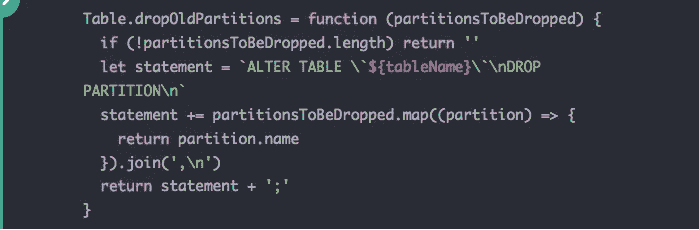
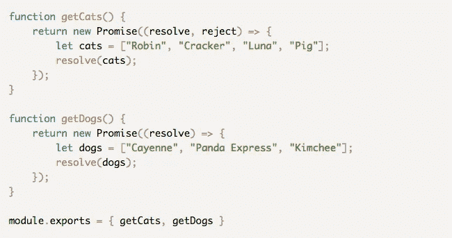
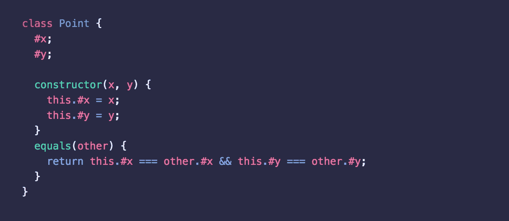
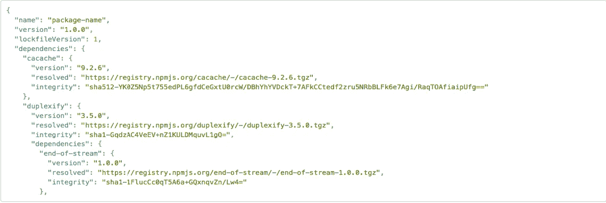
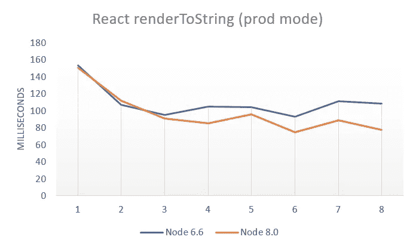

# Node.js 每周更新—2017 年 6 月 9 日

> 原文：<https://medium.com/hackernoon/node-js-weekly-update-9-june-2017-58cd5702185>

**下面可以找到**[**rising stack**](https://risingstack.com/)**最重要的 Node.js 更新、项目、教程&本周起 Node 相关会议:**

## [1。Node.js 8: util.promisify()](http://2ality.com/2017/05/util-promisify.html)

Node.js 8 新增了一个实用函数:util.promisify()。它将基于回调的函数转换为基于承诺的函数。

`npm install util.promisify`

学习如何使用它。

## [2。使用物理按钮在 Raspberry Pi 上运行节点服务器](https://trevordmiller.com/blog/raspberry-pi-button)

设置一个带有物理按钮的树莓派所需的所有组件。包括购买硬件、运行 Raspberry Pi、连接物理按钮、使用最新的节点和 npm，以及创建一个节点服务器以便在按钮被按下时发送文本消息。

## [3。Node.js + MySQL 示例:处理 100 千兆字节的数据](https://blog.risingstack.com/node-js-mysql-example-handling-hundred-gigabytes-of-data/)

本 Node.js + MySQL 示例教程展示了如何高效地处理占据数百 GB 存储空间的数十亿行。

> 大多数人认为，如果有人拥有数百万/数十亿行，他们应该使用 NoSQL 解决方案，如 Cassandra 或 Mongo。不幸的是，这些解决方案不是 ACID 兼容的，这使得它们在数据一致性极其重要的时候很难使用。
> 
> *然而，通过良好的索引和适当的规划，MySQL 可以像上面提到的 NoSQL 替代品一样适合这项任务。*

## [4。将 OpenWhisk 与您的节点应用程序集成](https://www.raymondcamden.com/2017/06/02/integrating-openwhisk-with-your-node-application/)

想象一个执行一组功能的简单节点应用程序。您可以将这些功能中的一项或多项迁移到无服务器系统中。

> *拥抱无服务器并不意味着摧毁你剩下的每一台服务器，在无服务器中有些事情根本没有意义。因此，我想我应该构建一个简单的节点应用程序来演示这可能是什么样子。*

## [5。JavaScript 的新#私有类字段](/the-thinkmill/javascripts-new-private-class-fields-93106e37647a)

它们是什么，它们是如何工作的，以及它们为什么是这样。

> 私有类字段现在处于 JavaScript 标准流程的第二阶段。它还没有最终确定，但是 JavaScript 标准委员会希望这个特性能够被开发出来并最终包含在标准中(尽管它仍然可能会改变)。

## [6。了解 NPM 锁文件 5](http://jpospisil.com/2017/06/02/understanding-lock-files-in-npm-5.html)

NPM 的下一个主要版本在速度、安全性和其他一些漂亮的东西方面比前一个版本有了很多改进。然而，从用户的角度来看，最突出的是新的锁文件。实际锁定文件。

> *与以前的版本不同，锁文件现在包括一个完整性字段，该字段使用子资源完整性来验证已安装的软件包没有被篡改或无效。*
> 
> *文件现在没有的是 from 字段，众所周知，当在代码审查期间查看文件的差异时，这个字段和有时不一致的版本是痛苦的来源。*

## [7。从节点 6 升级到节点 8:实际性能比较](https://hackernoon.com/upgrading-from-node-6-to-node-8-a-real-world-performance-comparison-3dfe1fbc92a3)

8 号节点已经关闭了，你听说了吗？而且速度更快，至少他们是这么说的。但是没有任何数字，‘更快’只是字母。

> *老实说，对于 Node 8，我预计可能会有几个百分点的改进，如果这没有转化为现实，我也不会感到惊讶。但是减少四分之一的服务器渲染时间和三分之一的 NPM 安装时间是惊人的。*

# 节点核心变更:

## [⬢节点 v8.1.0(当前)](https://nodejs.org/en/blog/release/v8.1.0/)

*   **异步挂钩**
*   当一个`Promise`导致新`Promise`的创建时，父`Promise`将被识别为触发器
*   **依赖关系**
*   libuv 已更新至 1.12.0
*   npm 已更新到 5.0.3
*   **文件系统**
*   `fs.exists()`功能现在可以与`util.promisify()`一起正常工作
*   fs。统计时间现在也可以用数字显示
*   **督察**
*   现在可以使用`--inspect=0`绑定到随机端口
*   **Zlib**
*   Zlib 模块中的一个回归使得不能正确的子类化`zlib.Deflate`和其他 Zlib 类已经被修复。

## [⬢节点版本 6.11.0 (LTS)](https://nodejs.org/en/blog/release/v6.11.0/)

*   **构建:**
*   支持构建 mips64el
*   **集群:**
*   disconnect()现在返回对断开连接的工作线程的引用。
*   **加密:**
*   能够在运行时选择证书存储
*   使用系统 ca，而不是使用捆绑的 ca
*   `Decipher`方法`setAuthTag()`和`setAAD`现在返回`this`。
*   再次添加对 OPENSSL_CONF 的支持
*   让 LazyTransform 与 Streams 相媲美 1
*   **部门:**
*   将 libuv 升级到 1.11.0
*   将 libuv 升级到 1.10.2
*   将 libuv 升级到 1.10.1
*   将 libuv 升级到 1.10.0
*   **域名系统:**
*   对`resolve4()`和`resolve6()`执行`{ttl: true}`。
*   **流程:**
*   添加 NODE *NO* WARNINGS 环境变量
*   **阅读线:**
*   添加选项以停止历史中的重复
*   **src:**
*   支持“-”后“-e”作为选项的结尾
*   **tls:**
*   新 tls。TLSSocket()支持 sec ctx 选项
*   允许明显的密钥/密码组合。

## Node.js 相关会议

*   **，科罗拉多州丹佛市(美国)——*(6 月 15 日至 16 日)***
*   **[**Eyeo Festival**](http://eyeofestival.com/) ，明尼阿波利斯，明尼阿波利斯(美国)——*(6 月 26 日至 29 日)***
*   **[**CodeConf**](https://github.com/blog/2363-codeconf-is-back-and-electronconf-is-here) ，华盛顿州西雅图市(美国)——*(7 月 11 日至 12 日)***
*   ****【电子会议】，西雅图，华盛顿(美国)——*(7 月 12 日至 13 日)*****
*   ****[**JSConf 中国**](http://2017.jsconf.cn/en/) ，中国上海—*(7 月 15 日至 16 日)*****
*   ****[**节点峰会**](https://www.eventbrite.com/e/node-summit-2017-san-francisco-tickets-32032284425?discount=NodeFoundation) ，美国加州旧金山—*(7 月 25 日至 27 日)*****
*   ****[**全栈节**](https://2017.fullstackfest.com/) ，西班牙巴塞罗那—*(9 月 4 日至 8 日)*****
*   ****[**Nordic.js**](http://nordicjs.com/) ，瑞典斯德哥尔摩*(9 月 7 日至 8 日)*****
*   ****[**影响会议**](https://affectconf.com/) ，俄勒冈州波特兰市(美国)——*(9 月 15 日至 16 日)*****

*****来源:节点基金会简讯*****

# ****前情提要****

****在之前的 [Node.js 每周更新](https://community.risingstack.com/node-js-weekly-update-2-june-2017/)中，我们读到了关于 Node 8 & npm 5 的发布，Mikeal Rogers steps down，一个很棒的 N-API 教程，以及 RisingStack 宣布的[内部节点监控](https://trace.risingstack.com/)。****

*****我们还帮助您每天更新 Node.js。查看我们的* [*Node.js 新闻*](https://news.risingstack.com/) *页面及其* [*推特供稿*](https://twitter.com/NodeJS_Daily) *！*****

*****原载于 2017 年 6 月 9 日 community.risingstack.com***。******

******************************

> *****[黑客中午](http://bit.ly/Hackernoon)是黑客如何开始他们的下午。我们是 [@AMI](http://bit.ly/atAMIatAMI) 家庭的一员。我们现在[接受投稿](http://bit.ly/hackernoonsubmission)并乐意[讨论广告&赞助](mailto:partners@amipublications.com)机会。*****
> 
> *****如果你喜欢这个故事，我们推荐你阅读我们的[最新科技故事](http://bit.ly/hackernoonlatestt)和[趋势科技故事](https://hackernoon.com/trending)。直到下一次，不要把世界的现实想当然！*****

**********