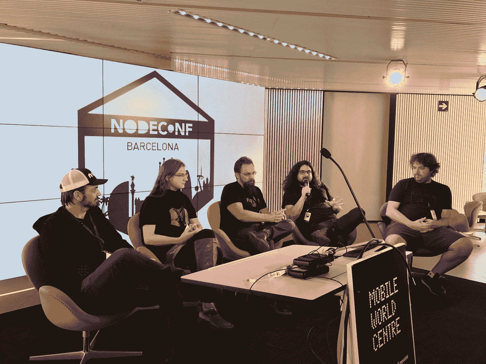

# NodeConf 巴塞罗那 2017 回顾展

> 原文：<https://medium.com/hackernoon/nodeconf-barcelona-2017-a-retrospective-e7df8ba539ae>

Podiums discussion at NodeConf Barcelona 2017

这里的团队带着巨大的热情和快乐工作，不知疲倦地将另一个 [NodeConf 带到巴塞罗纳](http://barcelona.nodeconf.com/)。

但是，这不是关于我们，这是关于事件本身。所以，事不宜迟，让我们开始回顾。让我们看看我们做得好的地方，以及我们下次可以做得更好的地方。

# 系统地

NodeConf Barcelona 2017 是在巴塞罗那举办的第二届 NodeConf(第三届，如果你算上 [WeNode](http://wenode.barcelonajs.org/) )。2015 年，首届 NodeConf 巴塞罗那会议吸引了大约 100 名与会者，13 名发言者大多来自欧洲，13 名发言者中有 4 名(31%)是女性。

今年，巴塞罗那 NodeConf 吸引了来自 15 个国家的 150 名与会者。我们有 12 位来自欧盟内外的演讲者，其中 5 位是女性(42%，增加了 11%)。

但不仅仅是从数字上看，NodeConf 巴塞罗那在 2017 年表现出色，与会者和演讲者的反馈也非常出色。

> *与*[*@ NodeConfBcn*](https://twitter.com/NodeConfBcn)*的人们交流的这几天真是太棒了——感谢这场精彩的活动。直到下次*[*@ PatrickHeneise*](https://twitter.com/PatrickHeneise)*！*
> 
> *—admc(@ admc)*[*2017 年 4 月 9 日*](https://twitter.com/admc/status/851035579391156224)
> 
> [*@ abrauseweter*](https://twitter.com/abrausewetter)*[*@ node BCN*](https://twitter.com/NodeBCN)*[*@ PatrickHeneise*](https://twitter.com/PatrickHeneise)*这是一场精彩绝伦的会议，组织得非常好！***
> 
> ***—卢卡·马拉斯基(@ lucamaraschi)*[*2017 年 4 月 8 日*](https://twitter.com/lucamaraschi/status/850678770822459392)**

# **鼓舞人心的谈话**

**今年，我们邀请了 12 位出色的演讲者，分享他们对各种 NodeJS 和 DevOps 主题的学习和想法。一如既往，我们努力在我们的会议上实现多样性和更大的代表性。因此，我们非常欢迎来自欧洲以外的演讲者，并且 12 位演讲者中有 5 位(42%)是女性。希望明年，我们能在这一点上跨越 50%的界限！**

# **简·伦哈特:杀死所有人类**

**简以他“可怕”的演讲开始了这一天:“杀死所有的人类”。幸运的是，所有的与会者都挺过了这个关于开发工具自动化的信息会议。**

**虽然你应该自己在线观看 Jan 的会议，但我们最喜欢的要点是:**

*   **hauptversionsnummernerhhungsgst:德语单词，表示害怕增加主版本号**
*   **语义版本控制使生态系统和库的使用变得可靠，你可以从数字上看出这是否是对你的代码的重大改变**
*   **Greenkeeper 让您的图书馆保持最新**

> ***感谢所有在*[*@ NodeConfBcn*](https://twitter.com/NodeConfBcn)*的伟大观众。有任何关于*[*@ greenkeeperio*](https://twitter.com/greenkeeperio)*[*@ hoodiehq*](https://twitter.com/hoodiehq)*或*[*@ couch db*](https://twitter.com/CouchDB)*的问题，找我✌️****
> 
> ***—扬·莱纳尔特(@ janl)*[*2017 年 4 月 7 日*](https://twitter.com/janl/status/850266998076358657)**

**[观看视频](https://opbeat.com/community/posts/kill-all-humans-by-jan-lenhardt/)**

# **迈尔斯·鲍恩斯:金矿中的金丝雀——烟雾测试**

**“杀死所有人类”，现在又是金丝雀？我开始在这里看到一个令人担忧的主题…但是，Myles 用他关于冒烟测试的深刻见解保持轻松，以及你如何测试你的代码中潜在的项目突破性变化。**

**“亲爱的日记，今天我们断网了。”—我听说过的最好的日记，一个发行经理的惊人故事。**

**查看[幻灯片](https://kni.sh/nodeconf-barcelona-2017/)并查看 [Github](https://github.com/MylesBorins/the-citgm-diaries) 上的源代码**

**[观看视频](https://opbeat.com/community/posts/canary-in-the-gold-mine-smoke-testing-by-myles-borins/)**

# **布赖恩英语:图章:安全卷曲管巴什。说真的。**

**在他的会议中，Brian English 谈到了 Signet，这是一个用于安全管理软件包和安装软件的工具。**

**[观看视频](https://opbeat.com/community/posts/signet-safely-curl-pipe-bash-no-seriously-by-bryan-english/)**

# **Anna Henningsen: Node.js:字符编码**

**了解 UTF-8 和字符编码如何破坏你的软件。即使在表情符号丰富的今天。Anna 分享了她以 Unicode 形式存储和传输字符串的最佳实践。**

**[观看幻灯片](https://addaleax.net/et/)和[观看视频](https://opbeat.com/community/posts/nodejs-character-encodings-by-anna-henningsen/)**

# **伊琳娜·舍斯塔克:敲门-敲门-谁在那里-文件-压缩-talkFINAL2.tar.trz.bz2.gz**

**在她的演讲中，Irina 分享了一些关于有效使用压缩来加速 NodeJS 应用程序和站点的知识。**

**[观看幻灯片](https://lrlna.github.io/shiny-talks/nodeconf-bcn-2017/#0)和[观看视频](https://opbeat.com/community/posts/knock-knock-who-there-file-compression-talkfinal2tartrzbz2gz-by-irina-shestak/)**

# **威廉·卡普克:Node.js 组织:幕后**

**Node.js 的绿色窗帘背后到底发生了什么？节点基础是什么？你怎么能参与进来？威廉姆在这个有趣而有启发性的演讲中回答了你所有的问题。**

**[观看视频](https://opbeat.com/community/posts/the-nodejs-organization-behind-the-scenes-by-william-kapke/)**

# **托马斯·沃森:打造你自己的 JavaScript 动力收音机**

**把收音机拿回来！黑掉你的车钥匙。通过托马斯·沃森关于硬件入侵无线电频率的演讲，让 Javascript 与现实世界互动。**

**[观看幻灯片](https://github.com/watson/talks/tree/master/2017/04%20NodeConf%20Barcelona)和[观看视频](https://opbeat.com/community/posts/build-your-own-javascript-powered-radio-by-thomas-watson/)**

**在分布式网络世界中，公告板和新闻系统将如何工作？在他的演讲中，Luca 分享了他如何使用 UpRing 构建了一个可扩展的 pub/sub 系统，以及您如何也能做到这一点。**

**[观看幻灯片](https://github.com/upringjs/scale-pubsub/tree/nodeconf-barcelona)和[观看视频](https://opbeat.com/community/posts/building-a-scalable-pubsub-system-with-upring-by-luca-maraschi/)**

# **丹妮拉·马托斯·德·卡瓦略:我们来玩玩 HTTP/2**

**HTTP/2 不是下一个出现的，它已经出现了。准备好您的服务器，并了解如何使用这一重要协议的下一代产品提供更好的 web 性能。**

**[观看幻灯片](http://slides.com/sericaia/lets-play-with-http2)和[观看视频](https://opbeat.com/community/posts/lets-play-with-http2-by-daniela-matos-de-carvalho/)**

**有用的链接:**

# **洛根·麦克唐纳:在无服务器的世界中使用节点…**

**您能在没有高成本的服务器和基础设施的情况下运行您的应用程序或服务吗？洛根认为你们中的一些人可以，我们中的大多数人将来也可以。看看她前瞻性的谈话。**

**[观看视频](https://opbeat.com/community/posts/using-node-in-a-serverless-world-by-logan-mcdonald/)**

**我们都知道聊天机器人和对话式用户界面是未来的趋势，但是你如何构建它们呢？Eva 非常友好地与我们分享了她对创建对话机器人的见解，以及如何使用 Amazon Lex 开始构建它们。**

> **我开始意识到在悠闲的氛围和新干线准时的情况下举办一场活动有多难！恭喜[*@ PatrickHeneise*](https://twitter.com/PatrickHeneise)*[*@ NodeConfBcn*](https://twitter.com/NodeConfBcn)***
> 
> ***—伊娃(@ lavigi)*[*2017 年 4 月 10 日*](https://twitter.com/lavigi/status/851331548062392320)**

**[观看幻灯片](https://www.dropbox.com/s/s9bzifra22bu77w/VoiceServicesPresoDefinitiva.pdf?dl=0)或[观看视频](https://opbeat.com/community/posts/creating-conversational-bots-with-amazon-lex-by-eva-sanchez-guerrero/)**

# **James Snell:node . js 流程，做出影响大型生态系统的决策**

**你如何做出影响全球数百万创造者和消费者的决策？事实证明，正如詹姆斯·斯内尔所分享的，只要一点点小心和大量的计划。**

**[观看视频](https://opbeat.com/community/posts/the-nodejs-process-making-decisions-that-impact-a-massive-ecosystem-by-james-snell/)**

# **合作者问答**

**在这个简短的会议中，我们 2017 年的一些演讲者和节点合作者回答了您关于 NodeJS 现在和未来的问题。**

**[观看对话](https://opbeat.com/community/posts/node-collaborator-qa/)**

# **透明度报告**

**为了透明起见，以下是 NodeConf 巴塞罗那 2017 的财务数据。如果你想了解更多关于这些费用的信息，或者关于资助你自己的会议的一些建议，我们很乐意与你交谈。请联系 nodeconf@blended.io。**

**请在此处查看整个报告[(然后滚动到结尾)。](https://blog.blended.io/nodeconf-barcelona-2017/)**

# **结论和感谢**

**首先，非常感谢[移动世界中心](https://www.mobileworldcentre.com/)及其团队对我们的接待和支持！**

**如果非要用一个词来形容 NodeConf 巴塞罗那 2017，那就是“鼓舞人心”。看到这么多人参加今年的会议真是太好了。将来自世界各地的优秀演讲者聚集在一起，谈论他们最关心的话题。见到这么多对 NodeJS 及其未来感到兴奋的人。**

**必须感谢所有促成今年会议的人。感谢我们所有的演讲者，感谢我们的赞助商，感谢组织这次会议的 Blended.io 团队，感谢那些使这次活动成为可能并令人愉快的与会者。没有这个伟大社区的辛勤工作和贡献，我们不可能做到这一点。**

**今年的大会非常成功，所以[请在 Twitter](https://twitter.com/NodeConfBcn) 上关注我们，了解下一届大会的最新消息。**

****感谢阅读。**我们在 [blended.io](https://www.blended.io/?ref=medium) 对 fintech、investtech 和 industry 4.0 中软件设计和工程的潜在创新飞跃感到无比兴奋和热情。[取得联系！](http://www.blended.io/contact.html?ref=medium)**

## **保持在边缘**

**[获取关于创新、体验设计或工程的实用文章](https://confirmsubscription.com/h/t/3BFD03FDC169B5FE)！没有垃圾邮件和**有价值的内容** **只有**。**

***原载于 2017 年 4 月 11 日*[*blog . blended . io*](https://blog.blended.io/nodeconf-barcelona-2017/?ref=medium)*。***

************

> **[黑客中午](http://bit.ly/Hackernoon)是黑客如何开始他们的下午。我们是 [@AMI](http://bit.ly/atAMIatAMI) 家庭的一员。我们现在[接受投稿](http://bit.ly/hackernoonsubmission)，并乐意[讨论广告&赞助](mailto:partners@amipublications.com)机会。**
> 
> **如果你喜欢这个故事，我们推荐你阅读我们的[最新科技故事](http://bit.ly/hackernoonlatestt)和[趋势科技故事](https://hackernoon.com/trending)。直到下一次，不要把世界的现实想当然！**

****