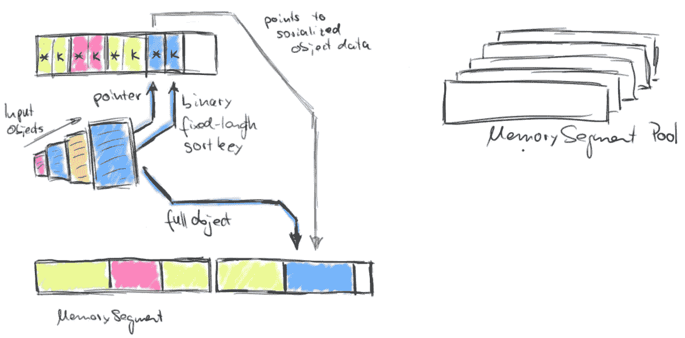

# 关于缓冲区的一些事情

> 原文：<https://medium.com/hackernoon/nodejs-javasript-react-buffer-understand-tutorial-example-easy-step-create-read-utf8-ce37866ddd8c>



[https://flink.apache.org/news/2015/05/11/Juggling-with-Bits-and-Bytes.html](https://flink.apache.org/news/2015/05/11/Juggling-with-Bits-and-Bytes.html)

> 在 node.js 中，缓冲区是原始字节的容器。 ***一个字节*** 只是表示 ***八位*** ， ***一位*** 只是一个 0 或者 1。所以一个字节可能看起来像 10101010 ( [*出自艾伦*](https://allenkim67.github.io/programming/2016/05/17/nodejs-buffer-tutorial.html) )。

# 1-缓冲区看起来像什么？

基本上，缓冲剂可以以两种主要形式出现

```
**const** Buffer **=** require('buffer').Buffer;

**const** buf **=** Buffer.from([0x68, 0x65, 0x6c, 0x6c, 0x6f, 0x20, 0x77, 0x6f, 0x72,
 0x6c, 0x64]);
```

形式 1，原始内存块

```
console.log(buf);
*// outputs <Buffer 68 65 6c 6c 6f 20 77 6f 72 6c 64>*
```

形式 2，解码格式(可能是`utf16le, utf8 etc. [*more*](https://www.tutorialspoint.com/nodejs/nodejs_buffers.htm)`)

```
console.log(buf.toString('utf16le'));
*// outputs '敨汬潷汲'* console.log(buf.toString('utf8'));
*// outputs 'hello world'*
```

# 2-创建缓冲区

这是摘自 [***约什***](https://docs.nodejitsu.com/articles/advanced/buffers/how-to-use-buffers/) ***的注释部分。*** 创建新缓冲区有几种方法:

## n 个八位字节的未启动缓冲区

```
**var** buffer = **new** Buffer(8);
```

## 来自给定数组的缓冲区

该缓冲区未初始化，包含 8 个字节。

```
**var** buffer = **new** Buffer([ 8, 6, 7, 5, 3, 0, 9]);
```

## 给定字符串的缓冲区。

这将缓冲区初始化为此数组的内容。请记住，数组的内容是表示字节的整数。

```
**var** buffer = **new** Buffer("I'm a string!", "utf-8")
```

# 3-操作

*缓冲器带来更多乐趣*

*   写入缓冲区
*   从缓冲器中读取`buf.toString(‘utf8’,0,5)`
*   将缓冲区转换成 JSON `var json = buf.toJSON(buf);`
*   连接缓冲器`var buffer3 = Buffer.concat([buffer1,buffer2]);`
*   比较缓冲区`buf.compare(otherBuffer);`
*   复制缓冲器`buffer1.copy(buffer2);`
*   切片缓冲器`var buffer2 = buffer1.slice(0,9);`
*   缓冲长度`buffer.length`

## 参考:

[https://nodejs . org/docs/latest/API/buffer . html # buffer _ buffer _ from _ buffer _ alloc _ and _ buffer _ allocunsafe](https://nodejs.org/docs/latest/api/buffer.html#buffer_buffer_from_buffer_alloc_and_buffer_allocunsafe)

[https://docs . node jitsu . com/articles/advanced/buffers/how-to-use-buffers/](https://docs.nodejitsu.com/articles/advanced/buffers/how-to-use-buffers/)

[https://allenkim 67 . github . io/programming/2016/05/17/nodejs-buffer-tutorial . html](https://allenkim67.github.io/programming/2016/05/17/nodejs-buffer-tutorial.html)

[https://www.tutorialspoint.com/nodejs/nodejs_buffers.htm](https://www.tutorialspoint.com/nodejs/nodejs_buffers.htm)

[https://flink . Apache . org/news/2015/05/11/杂耍比特和字节. html](https://flink.apache.org/news/2015/05/11/Juggling-with-Bits-and-Bytes.html)