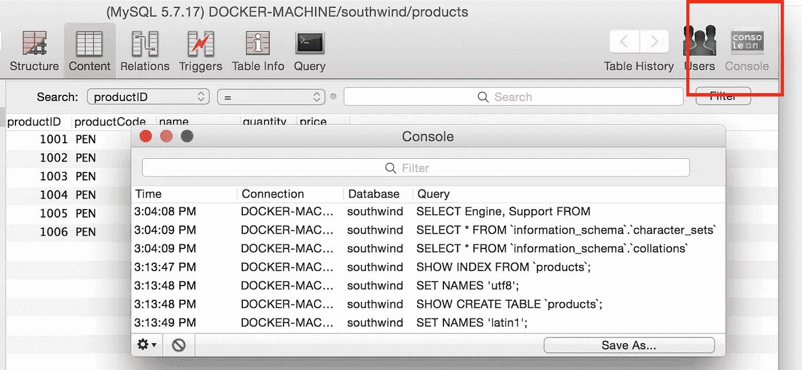
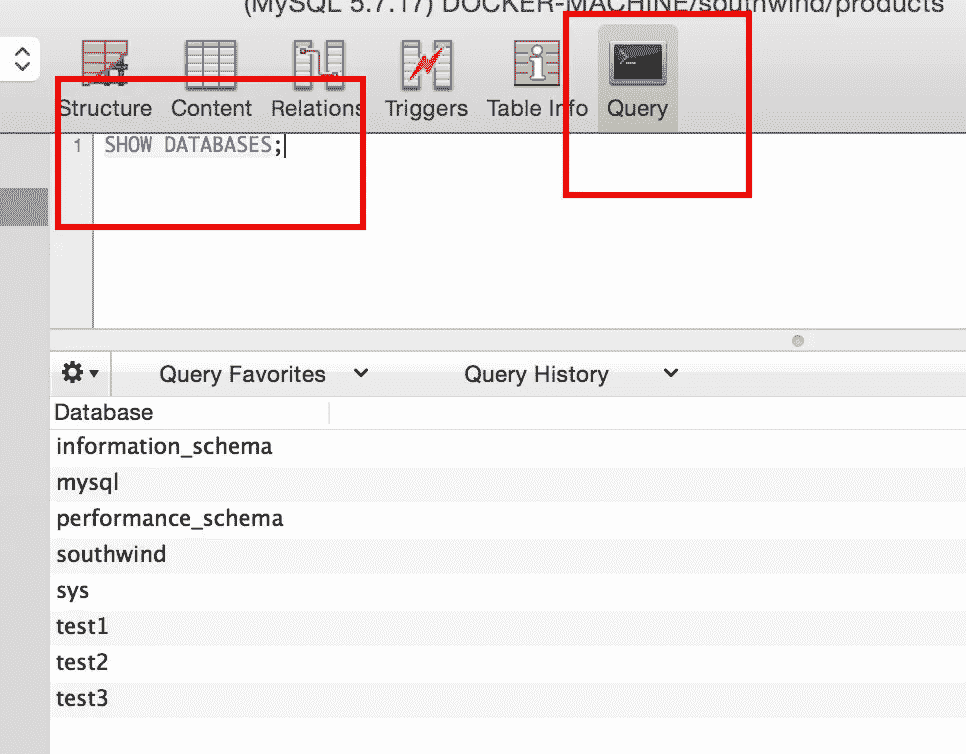
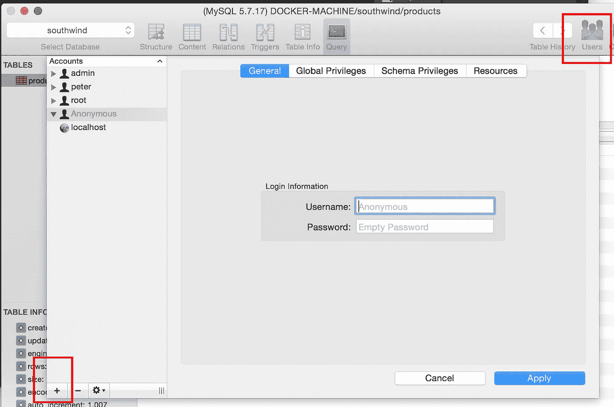

# [Nodejs]快速设置 MySQL 并在 Node.js 中运行

> 原文：<https://medium.com/hackernoon/nodejs-mysql-install-setup-tutorial-example-connection-insert-query-fd5c5032d3b0>


首先，我们需要什么如果我们需要建立一个现代化的应用程序，我们需要一个用户使用的前端平台(或 web)。但是用户希望与其他用户交流，并希望与他们交换内容/信息，我们需要一个存储信息的地方和获取这些有价值内容的途径，即数据库。

这是一个配置 MySQL 数据库的注意事项，目的是在***node . js***server***中远程连接和查询。***

# 内容:

1.  在虚拟机上设置 MySQL
2.  设置 GUI 工具(续)
3.  [创建管理员帐户](https://hackernoon.com/mysql-note-create-admin-user-5e77b43ecc8e#.d35h8s3uh)
4.  在 Node.js 中连接

# 1-设置 MySQL 环境

首先，我们需要一台运行 MySQL 的机器，可以是 Macbook、Windows 或 Linux，因为谷歌上有足够多的教程来在所有这些操作系统上安装 MySQL，并且你会享受到发现安装的乐趣。

我设置 MySQL 服务器的方法，运行 Docker 机器并通过命令运行 Docker 映像:

```
[docker run --name mysql -e MYSQL_ROOT_PASSWORD=***mysqlpw*** -p 3306:3306 -d mysql](https://www.blogger.com/blogger.g?blogID=1229041620781457011#editor/target=post;postID=1699931676231264255;onPublishedMenu=overviewstats;onClosedMenu=overviewstats;postNum=0;src=postname)
```

所发生的是用“[***mysqlpw***](https://www.blogger.com/blogger.g?blogID=1229041620781457011#editor/target=post;postID=1699931676231264255;onPublishedMenu=overviewstats;onClosedMenu=overviewstats;postNum=0;src=postname)***”***作为密码创建一个 root 用户，并且打开一个外部端口，以便我们能够通过 MySQL 客户端工具远程连接。

# 2-设置 Sequel、MySQL GUI 工具(可选)

安装 ***MySQL*** 客户端 GUI 工具 Sequel，帮助你理解数据库表行如何以可视化的方式工作，有两个功能对我很有帮助:

**2*2。控制台*** 事实上，客户端和 MySQL 之间的任何操作都是通过 TCP 协议进行通信的，Sequel 只是一个将 UI 动作翻译成 MySQL 能够理解的命令的工具。控制台，在右上方，提供了由 Sequel 翻译的 SQL 命令的每个日志。



***2。查询*** 它能做的和终端 MySQL 客户端一样。对我来说，它是一个更好的编辑器，加快了复制粘贴和鼠标操作的速度(这是终端所不能做到的)。一个好的编辑器对于程序员变得高效是非常重要的，这就是为什么有这么多编辑器:Sublime，VSCode，Atom 等等。



# ***3-创建一个管理员帐号，并停止使用 Root 用户***

[通过 SQL 命令创建管理员帐户](https://hackernoon.com/mysql-note-create-admin-user-5e77b43ecc8e#.ianfe97a2)



# 4-在 Node.js 中开始编码

安装 npm 模块***MySQL***

```
$ npm install mysql
```

创建一个名为 ***connect.js*** 的文件，并将下面的代码复制粘贴到其中:

```
var mysql = require("mysql");// First you need to create a connection to the db
var con = mysql.createConnection({
  host: "12.34.56.78",
  user: "peter",
  password: "1234",
  database: "southwind"
});con.connect(function(err){
  if(err){
    console.log('Error connecting to Db');
    return;
  }
  console.log('Connection established');
});con.end(function(err) {
  // The connection is terminated gracefully
  // Ensures all previously enqueued queries are still
  // before sending a COM_QUIT packet to the MySQL server.
  if(err) console.log('err: ', err);
  else console.log('Terminated done: ');
});
```

## 运行:

```
$ node connect.jsConnection established
terminated done:
```

# 摘要

对我来说，我花了大部分时间在第二部分。设置 MySQL Docker-Machine 很容易，只需一个命令。Node.js 连接和查询也非常流畅。然而，理解 SEQUEL 中的 SQL 命令(query)并不是很简单，我需要一些时间来从 MongoDB 中挑选现有的命令并"*"*翻译成我能理解的东西。

# 你可能也喜欢

*   [MySQL 手册](/curiousian/mysql-handbook-tutorial-example-for-beginner-setup-admin-query-curd-relation-583b05106c1f#.v7tni8uoj)
*   [【MySQL】注意:在 Node.js 中快速设置和运行](https://hackernoon.com/nodejs-mysql-install-setup-tutorial-example-connection-insert-query-fd5c5032d3b0#.hpp65qg28)
*   [【MySQL】注意:创建管理员用户](https://hackernoon.com/mysql-note-create-admin-user-5e77b43ecc8e#.uncmszepg)
*   [【MySQL】注:数据库凝乳](https://hackernoon.com/mysql-note-database-curd-b62a21404678#.jm4eqcmgu)
*   [【MySQL】注:排凝乳](/hacker-daily/mysql-tutorial-query-limit-offset-condition-row-foreign-key-join-select-d3835b28e1a#.dob477vn4)
*   [【MySQL】注:关系:1–1，1-n，n-n，嵌套](https://hackernoon.com/mysql-tutorial-example-relation-foreign-key-database-funtion-join-table-query-one-namy-nest-41dd09648fbd)

# 参考:

[https://www . site point . com/using-node-MySQL-JavaScript-client/](https://www.sitepoint.com/using-node-mysql-javascript-client/)

[](http://bit.ly/HackernoonFB)[](https://goo.gl/k7XYbx)[](https://goo.gl/4ofytp)

> [黑客中午](http://bit.ly/Hackernoon)是黑客如何开始他们的下午。我们是阿美族家庭的一员。我们现在[接受投稿](http://bit.ly/hackernoonsubmission)并乐意[讨论广告&赞助](mailto:partners@amipublications.com)机会。
> 
> 如果你喜欢这个故事，我们推荐你阅读我们的[最新科技故事](http://bit.ly/hackernoonlatestt)和[趋势科技故事](https://hackernoon.com/trending)。直到下一次，不要把世界的现实想当然！

