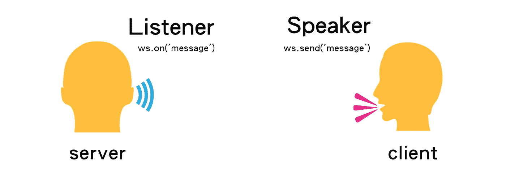
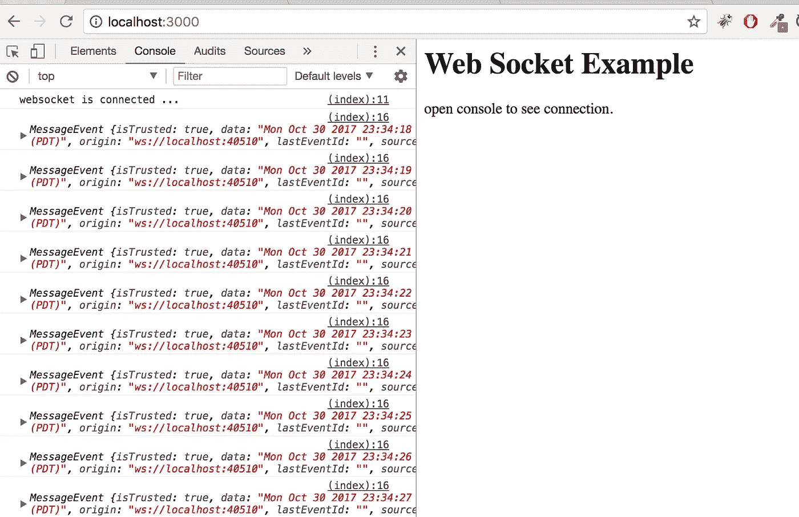

# [Node.js]分三步设置 Websocket + Express + HTML 服务

> 原文：<https://medium.com/hackernoon/nodejs-web-socket-example-tutorial-send-message-connect-express-set-up-easy-step-30347a2c5535>



websocket nodejs serve rclient browser

Web Sockets 现在在你周围的使用可能比你想象的要多，大多数实时交互的东西很可能都是通过这些小宝石运行的。

它们非常适合将数据从一台机器即时传输到一个或多个其他连接的客户端，用于即时聊天、协作草图环境等等。

# 步骤 1:设置 Express 服务器

Express 扮演 HTTP 服务器的角色，提供 HTML 文件和 Websocket 服务

```
var express = require('express')**var ws = require('./ws')**var app = express()app.get('/', function (req, res) {
   **res.sendfile(__dirname + '/ws.html');**
})app.listen(3000, function () {
   console.log('Example app listening on port 3000!')
})
```

# 步骤 2:设置客户端 HTML 文件

`websocket client`是浏览器支持的对象。

下面将介绍三个重要的功能:

*   `ws.onopen`:连接时发出
*   `ws.send`:向 websocket 服务器发送发送事件
*   `ws.onmessage`:接收消息时发出的事件

([阅读更多](https://developer.mozilla.org/en-US/docs/Web/API/WebSockets_API/Writing_WebSocket_client_applications))

```
<script>
    var ws = new WebSocket('ws://localhost:40510'); // event emmited when connected
    ws.onopen = function () {
        console.log('websocket is connected ...') // sending a send event to websocket server
        ws.send('connected')
    } // event emmited when receiving message 
    ws.onmessage = function (ev) {
        console.log(ev);
    }
</script>
```

# 步骤 3:设置 Websocket 服务

服务器代码很简单，我想你会明白的

```
var WebSocketServer = require('ws').Server,
  wss = new WebSocketServer({port: 40510})wss.on('connection', function (ws) {
  ws.on('message', function (message) {
    console.log('received: %s', message)
  }) setInterval(
    () => ws.send(`${new Date()}`),
    1000
  )
})
```



# 成为一个懒惰的人

```
$ git clone git@github.com:wahengchang/nodejs-websocket-example.git$ npm install$ npm start
```

打开浏览器

```
[http://localhost:3000/](http://localhost:3000/)
```


# 卸载 ws

`ws`是一个 WebSocket 客户端和服务器实现，快速，易用(【阅读更多】([https://stack overflow . com/questions/16392260/which-web socket-library-to-use-with-node-js](https://stackoverflow.com/questions/16392260/which-websocket-library-to-use-with-node-js)))。

# 参考

*   [https://github.com/wahengchang/nodejs-websocket-example](https://github.com/wahengchang/nodejs-websocket-example)
*   [https://github.com/websockets/ws](https://github.com/websockets/ws)
*   [https://websockets.github.io/ws/](https://websockets.github.io/ws/)
*   【http://codular.com/node-web-sockets】