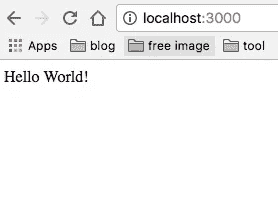

# [Nodemon]自动观察-重新加载 Node.js 文件

> 原文：<https://medium.com/hackernoon/nodemon-example-tutorial-npm-start-script-auto-watch-47cd702fe442>


我喜欢高效工作，并且总是在寻找高效工作的工具。现在我正在做一个 **React 同构**项目，自动观察设置在**服务器端**(当文件改变时重启服务器)和**客户端**(当文件改变时构建静态文件)是不同的。然而,**同构**的思想在服务器端和客户端共享相同的**反应组件**。有足够多的自动观察工具:webpack、grunt、gulp、nodemon 等，以及自动构建工具:webpack、grunt、gulp、browserify 等。

找到合适的工具来做合适的任务，一个接一个地玩它们，这就是这个例子的 [git](https://github.com/wahengchang/nodemon-example) ，希望有帮助。

## 1-创建一个简单的 Express 服务器

```
//app.js
var express = require('express')
var app = express() app.get('/', function (req, res) {
   res.send('Hello World!')
}) app.listen(3000, function () {
   console.log('Example app listening on port 3000!')
})
```

## 2-运行快速服务器

自动观察功能还没有开启。

```
**$ node app.js**Example app listening on port 3000!
```



## 3-通过 ***nodemon*** 运行相同的服务器

```
**$ npm install** **--save-dev nodemon
$** **./node_modules/nodemon/bin/nodemon.js app.js**[nodemon] 1.11.0
[nodemon] to restart at any time, enter `rs`
[nodemon] watching: *.*
[nodemon] starting `node app.js`Example app listening on port 3000!
```

## 4-使用配置文件运行 nodemon

Nodemon 支持本地和全局配置文件。这些通常被命名为`nodemon.json.`

可以用`--config <file>`选项指定一个替代的本地配置文件。

参见[样本 nodemon.json](https://github.com/remy/nodemon/blob/master/doc/sample-nodemon.md) ，

## 使用示例 nodemon.json 运行

```
**$ ./node_modules/nodemon/bin/nodemon.js app.js --config nodemon.json**[nodemon] 1.11.0[nodemon] reading config /Users/userA/nodemon-example/nodemon.json[nodemon] to restart at any time, enter `rs`[nodemon] ignoring: .git .nyc_output .sass-cache bower_components coverage /Users/userA/nodemon-example/node_modules/**/* .git node_modules/**/node_modules[nodemon] watching: test/fixtures/**/* test/samples/**/*[nodemon] watching extensions: js,json[nodemon] bind restart -> `osascript -e 'display notification "App restarted due to:'$FILENAME'" with title "nodemon"'`[nodemon] starting `node --harmony app.js`[nodemon] child pid: 6166[nodemon] watching 3 filesExample app listening on port 3000!
```

## 5-使用 nodemon 脚本安装 package.json

```
//package.json"scripts": {
   "start": "node app.js",
   "dev": "echo 'run dev' & npm start",
   "test": "echo \"Error: no test specified\" && exit 1",
   "nodemon": "./node_modules/nodemon/bin/nodemon.js --config nodemon.json --exec npm run dev "
},
```

## 奔跑

```
$ npm run nodemon
```

# 备注:

## execMap

在`nodemon.json`配置文件中，定义你自己的可执行文件:

```
{
  "execMap": {
     "pl": "perl"
  }
}
```

## nodemon 状态改变时触发事件

在`nodemon.json`配置文件中，定义事件的动作(阅读更多[事件列表](https://github.com/remy/nodemon/wiki/Events#states)):

```
{
  "events": {
    "restart": "osascript -e 'display notification \"app restarted\" with title \"nodemon\"'"
  }
}
```

# 参考:

[https://github.com/remy/nodemon#nodemon](https://github.com/remy/nodemon#nodemon)

[https://github.com/wahengchang/nodemon-example](https://github.com/wahengchang/nodemon-example)

[](http://bit.ly/HackernoonFB)[](https://goo.gl/k7XYbx)[](https://goo.gl/4ofytp)

> [黑客中午](http://bit.ly/Hackernoon)是黑客如何开始他们的下午。我们是 [@AMI](http://bit.ly/atAMIatAMI) 家庭的一员。我们现在[接受投稿](http://bit.ly/hackernoonsubmission)并乐意[讨论广告&赞助](mailto:partners@amipublications.com)机会。
> 
> 如果你喜欢这个故事，我们推荐你阅读我们的[最新科技故事](http://bit.ly/hackernoonlatestt)和[趋势科技故事](https://hackernoon.com/trending)。直到下一次，不要把世界的现实想当然！

