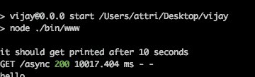

# 忍者基础 1.0-基础

> 原文：<https://medium.com/hackernoon/nodeninja-fundamentals-1-0-the-basics-6204edc475db>


全世界都迷恋 NodeJs。当我们谈论节点时，我们会听到很多术语，如异步、回调和承诺。从 C++的世界来看，流程是线性的，函数调用和返回方式非常简单，这似乎有点奇怪。你会听到很多变形的词，比如回调和承诺。

所以让我们一次一个地从这些术语开始。

异步和同步:

我们将通过两个场景来更好地理解这个概念。

场景 1。

假设你去酒吧。现在是星期五晚上。你去吧台的服务生那里，要一杯饮料，让我们。叫服务员克雷。但事实证明，Clay 是一个非常忙碌的人，高中毕业后，他在这方面有点迟钝。所以你看到他慢慢地给你斟酒。你真的在打哈欠。与此同时，一位美丽的女士从你身边走过，坐在酒吧的另一端。你现在很困惑。她似乎是个完美的约会对象。你想和她谈谈。但是这个服务员太慢了。所以你所做的。

你很聪明。你告诉侍者当你的饮料准备好的时候叫你，然后你直奔那位女士。你在和这位女士聊天，讨论生活。你听到了克莱的呼唤。所以，你回到克莱身边，感谢他并重新加入你美丽的公司，为快乐的时刻干杯..

场景 2。：

假设，粘土慢。他也有点粗鲁。当你恳求他斟满你的酒杯时，他指示你留下。否则别人会吞了你的 60 块。你没有选择。你看到蟒蛇先生走过去坐在那位女士旁边。你完蛋了。你的时间是世界上最重要的东西。你猜怎么着，克莱阻止了你，毁了你的周五。


现在，客观地看，假设 Clay 是一个昂贵的 DB 调用、一个 io 操作或一个文件读取。你永远不知道它们完成的确切时间。这些事情需要不同的时间。你就是执行这些指令的进程。这位女士是服务器上的另一个请求。

在场景 1 中，你所做的是不浪费时间。同时，您在等待耗时的调用完成，您为它的执行添加了一个提醒，并继续处理第二个请求。在这种情况下，您从 DB 获得一个操作已经完成的响应，因此您将第二个请求放入堆栈，并执行挂起的第一个请求。(事件机制)

这就是异步性。这就是 node 看起来很快的原因。只有一个执行线程。**其实 Javascript 并不是异步的，NodeJS 只是提供了异步 API。它需要这样的操作是非阻塞的。**

开始同步。

在场景 2 中，克莱挡住了你。在第二次请求到来的时候，你什么也做不了。Python 先生抢尽了风头。你拿起你的饮料，喝了它，然后回家。所以把 Python 先生当做另一个线程。

你正在处理第一个请求，它阻塞了，所以…与此同时，第二个请求来了。那么服务器进程做了什么，它产生了一个新的线程，并开始处理第二个请求。这就是 PHP 的工作方式。

这是一个概括。一个线程在任何时候都有自己的堆栈，它在自己的地址空间中执行函数。因此 Node 看起来有点像轻量级冠军，它只有一个执行线程——称为事件循环。它连续运行，执行一个事件循环的时间称为 tick。但是 Node 很好地处理了这种上下文切换，这就是它如此受欢迎的原因。

让我们考虑一下这在 NodeJS 中的含义。

所以 NodeJs 有两套东西。阻塞和非阻塞。(同步和 a-Sync)。你有文件读取函数，比如 fileReadSync 和 fileRead。考虑一个服务器进程，其中有 10 个 API，其中一个用来读取一个文件的内容。

Alice 和 Bob 是新手，正在申请 API。

使用 fileRead —异步方法

案例一。

Alice 和 Bob 向服务器请求 GET/my _ favorite _ seasons。作为节点进程的服务器开始执行调用，

a 的请求首先到达服务器，事件循环获得调用，开始执行它。它进入文件读取功能。但是文件读取是异步的，所以 NodeJs 添加了一个注释，在读取完成时附加一种事件作为某种通知，并再次开始监听。b 的请求来了，它开始服务它。快进几毫秒，A 和 B 很高兴从服务器上收到他们最喜欢的季节列表。

案例二。

让我们假设在这个场景中读取的文件是阻塞的。所以节点进程着手执行 A 的调用。它到达了文件读取函数，但是在这里被阻塞了。现在不是免费的。b 的请求来了，但是你猜怎么着，这个呼叫没有人服务。NodeJs 是一个人的军队，这个人正忙于将文件的内容转储到内存中。所以 B 会被卡住——它的请求会被延迟。因为事件循环很忙。或者只是服务器不接受连接。

当您在 API 中使用太多阻塞调用时，就会发生这种情况。如果您忽略了这些考虑因素，您的服务器可能会崩溃。

尝试在您的进程中添加一个无限循环，看看服务器如何运行。

你应该做的是用第一种方式做事。如果文件非常大，您应该在响应中流式传输文件。

所以说到溪流和缓冲区。

流和缓冲区:

我们经常听到这些术语。我的 youtube 视频正在缓冲，来自 spotify 的流..还有什么不可以。你每天都会听到这些。

它们到底是什么？

缓冲区:你正在从磁盘上读取一个文件。通常所做的是将文件的全部内容从磁盘复制到 RAM。文件存储在缓冲区中。当涉及到大文件时，使用缓冲区是绝对不行的(原因很明显，:D)。你应该做什么是我们下一个讨论的话题。所以继续吧。

流:流是流动的数据。是的，就像瀑布一样。数据流。您的流程调用了一个管道工。它修复了一个管道，直接从文件库到您的 ram，您的节点进程也位于 ram 中，当轮到执行时，CPU 从 ram 中获取它。

简单地说，获取解码执行。所以你打开水龙头。一点一滴的数据进入你的水桶。当它填满时，会生成一个数据事件，节点进程会读取数据。文件的全部内容都是分块读取的。在 RAM 中只分配了桶的大小，一切都按计划进行。这些是溪流。简而言之，这就是流媒体的工作方式。

对于一些非常好的参考资料，您可以参考:

[](https://stackoverflow.com/questions/17607280/why-is-node-js-asynchronous) [## node.js 为什么是异步的？

### 实际上没有人问过这个问题(从我得到的所有‘建议’中，也从我在这里提问之前的搜索中)。所以…

stackoverflow.com](https://stackoverflow.com/questions/17607280/why-is-node-js-asynchronous) [](https://stackoverflow.com/questions/24222883/is-an-infinite-loop-impossible-in-nodejs) [## nodejs 中无限循环是不可能的吗？

### 加入 Stack Overflow 社区 Stack Overflow 是一个由 730 万程序员组成的社区，就像你一样，帮助每一个…

stackoverflow.com](https://stackoverflow.com/questions/24222883/is-an-infinite-loop-impossible-in-nodejs) 

附加演示:

使用无限循环的含义

对于创建服务器和测试，只需使用 express:

> npm 快速安装-g
> 
> npm 安装快速发电机 g

```
#make sure you have node installed in your system
npm install express -g
npm install express-generator -g
express your-process-name
```

然后转到 routes/index.js，用下面的文件替换这个文件

```
var express = require('express');
var router = express.Router();/* GET home page. */
router.get('/', function(req, res, next) {
  console.log('hello');while(1){}
  // we will never reach here
  res.send();
});router.get('/async', function(req, res, next) {
  setTimeout(function(){
   console.log('it should get printed after 10 seconds');
   res.send();
  },10000);

});module.exports = router;
```

> 做一个“npm 开始”。它将设置服务器监听端口 3000。

所以，现在尝试首先调用异步方法，它将在 10 秒后打印“它应该在 10 秒后得到打印”并发送响应(空)。

```
curl -X GET [http://localhost:3000](http://localhost:3000)/async
```



所以现在调用/async 端点，然后尝试下面提到的 curl 请求。你将永远得不到服务器的响应。

```
curl -X GET [http://localhost:3000](http://localhost:3000)
```

真正发生的是回调被无限期推迟，因为事件循环在“/”API 中被阻塞。所以当你使用无限循环时就会发生这种情况。

这对一个高流量的服务器有很多影响。

所以伙计们，这就是基本面 1.0 的终结。如果你有任何疑问或觉得有什么不对的地方，请在评论中纠正我。

和平！！