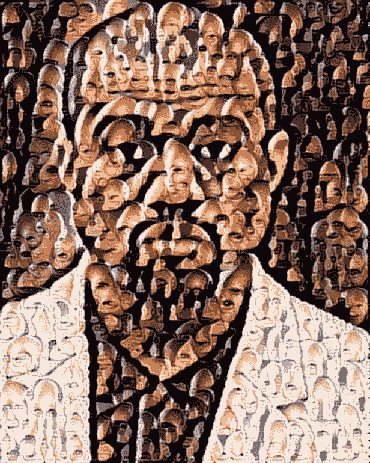
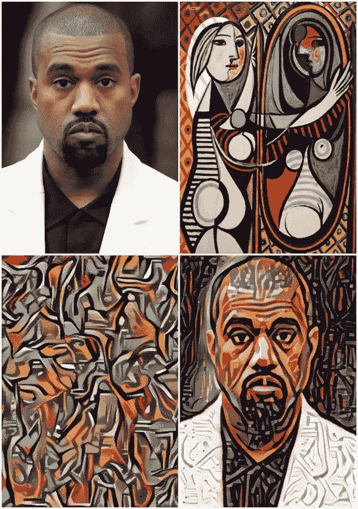
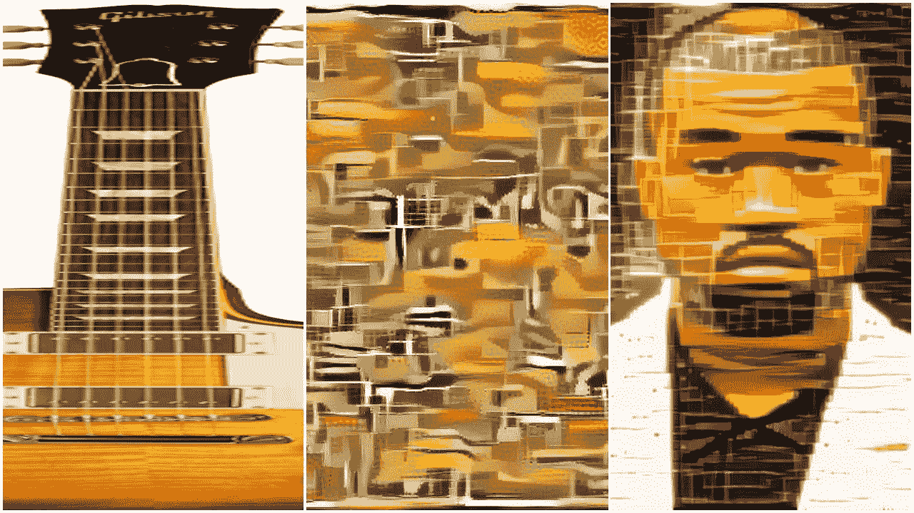
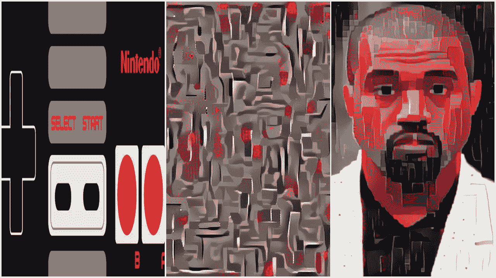
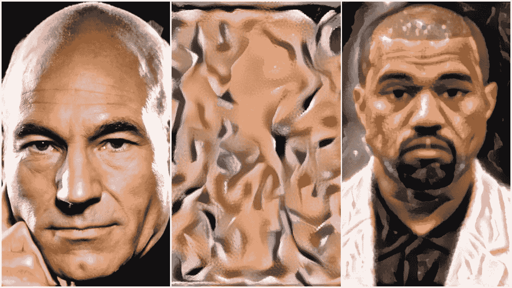
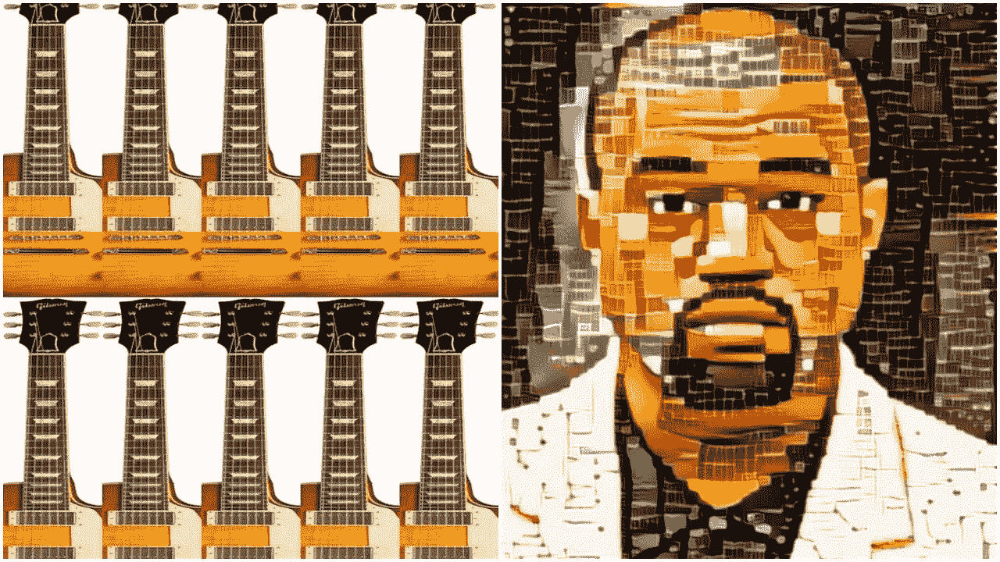
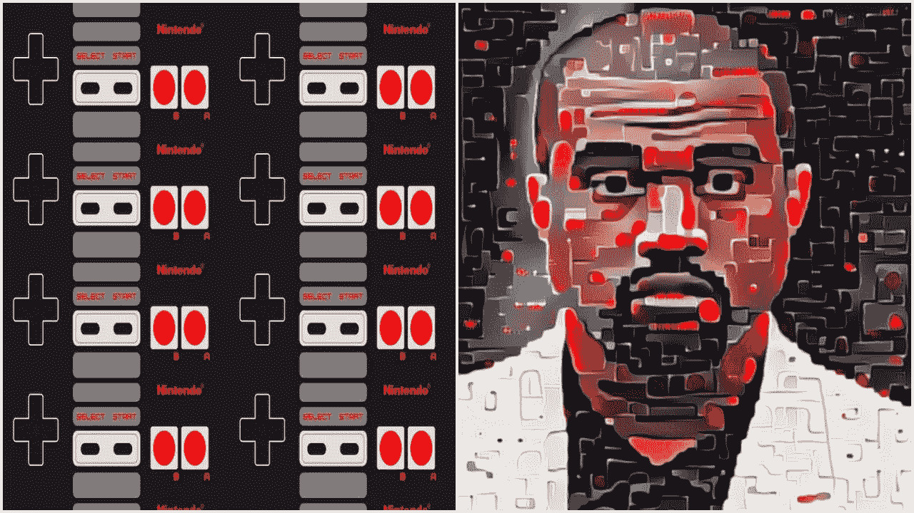
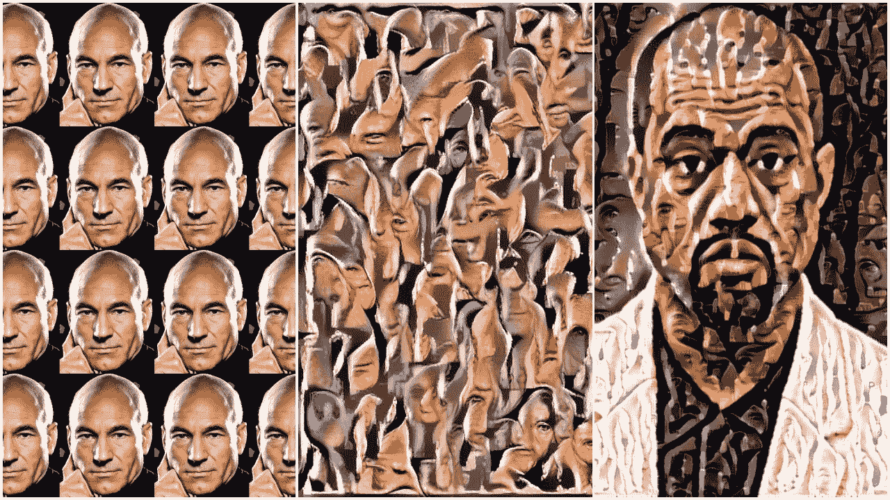
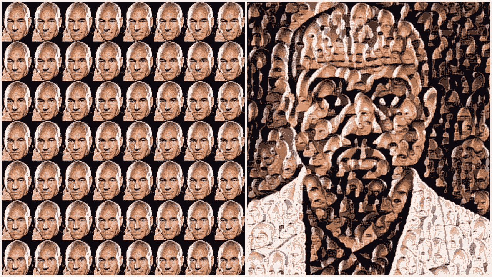
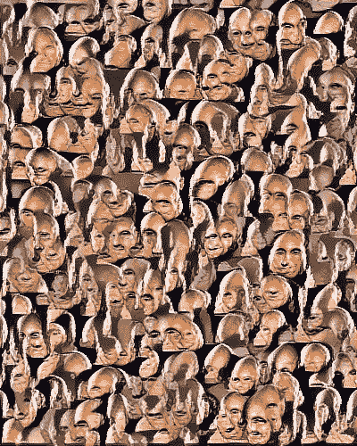

# 非艺术风格转移(或者怎么用皮卡德队长的脸画坎耶)

> 原文：<https://medium.com/hackernoon/non-artistic-style-transfer-or-how-to-draw-kanye-using-captain-picards-face-c4a50256b814>

*在* [*fast.ai*](http://fast.ai) *的* [*深度学习第二部分*](https://www.usfca.edu/data-institute/certificates/deep-learning-part-two) *与*[*@ Jeremy Howard*](https://twitter.com/jeremyphoward)*[*@ math _ Rachel*](https://twitter.com/math_rachel)*我们一直在学习生成模型，这启发我在一些新的方向上进行实验。我会在这里向你展示这些实验的结果，并描述它们是如何完成的。为了完整的理解，你应该熟悉 CNN，损失函数等；如果你不是，那就去看看* [*程序员实用深度学习，第一部分*](http://course.fast.ai/) *(本课程第一部分的 MOOC 版本)。**

*自从 [Gatys](https://arxiv.org/abs/1508.06576) 和朋友们引入艺术风格转移以来，深度学习社区一直热衷于以著名艺术家的风格创建图像。而且理由很充分！结果一直令人震惊；风格转移使我们能够用神经网络以简单的过滤器无法模仿的方式重新绘制图像。*

*对于那些不熟悉的人来说，艺术风格转移是一种用图像 X 的内容但用图像 y 的风格创建图像的方法。如果“卷积神经网络”、“MSE”和“反向传播”这些词对你来说是胡言乱语，请随意跳过接下来的三段(但请留意我即将推出的完整的非技术风格转移指南！).如果您熟悉这些主题，下面是对原始样式转换实现的简要概述。*

*[Gatys](https://arxiv.org/abs/1508.06576) 最初的方法是从三张图像开始，内容图像、风格图像和一张随机“噪声”图像，并让它们通过一些 CNN 的卷积层，这些 CNN 已经为图像识别进行了预训练(通常是 Vgg16/19)。该方法的损失函数是将内容和样式图像的卷积层输出与随机图像进行比较。然后，我们通过反向传播来更新随机图像的像素，以最小化这种损失。*

*“比较”的度量对于内容和风格图像是不同的；对于内容，我们的损失只是内容和随机图像输出之间的 MSE。这将更新随机图像以最终匹配内容图像。它与原始图像的精确匹配程度取决于用于比较的图层的深度。*

*在原始论文中得到的启示在于为该风格计算的损失；我们不是计算样式/随机图像的卷积输出之间的 MSE，而是计算这些输出的[格拉米矩阵](https://en.wikipedia.org/wiki/Gramian_matrix)之间的 MSE。这种损失的反向传播导致图像具有原始图像的风格，而没有任何内容。这种方法本质上是将风格图像解构为一个由原始艺术风格组成的图像，没有结构。我喜欢称之为风格图像的*调色板*。*

*风格转移是这两种方法的简单结合，它允许我们用一幅图片的内容和另一幅图片的风格来创建一幅图像。*

**

*The Life of Pablo’s Girl Before a Mirror*

*在上面的例子中，我的内容形象是坎耶·韦斯特，我的风格形象是巴勃罗·毕加索的《镜前少女》。左下角的图像是从绘画中解构的调色板的例子。最后一幅图像是重建图像时结合内容和风格损失的结果；我们用毕加索的风格重建了坎耶的形象。*

*然而,“艺术风格转移”这一说法略微低估了我们用这种方法实际能达到的效果。在文学中有许多将艺术作品的风格转移到图像的例子；然而，将非艺术风格转移到图像上的例子却很少。*

*试图将非艺术的“风格”应用于图像是艺术风格转移方法的自然延伸。例如，我们可能想知道是否可以将吉他的“风格”应用到图像中。*

**

*Style Image; Palette; Style-Transferred Image*

*这种实现是…最好的平庸。我们可以看到，我们的结果图像确实显示了一些指板风格，但它不是特别强烈，而且相对平滑。当我们查看从该图像中提取的调色板时，指板图案并不普遍。*

*这可能仅仅是因为图像选择不当。或许这也适用于其他非艺术图片:*

**

*Style Image; Palette; Style-Transferred Image*

**

*Style Image; Palette; Style-Transferred Image*

*没有。无论是 NES 管制员还是皮卡德上尉的形象都不能赋予这些形象“NES 管制员/皮卡德”的风格。与吉他一样，从这些图像中提取的调板并没有准确地捕捉到我们想要的效果。*

*如果你有一些风格转换的经验，这就不足为奇了。当我们在风格转换中说“风格”时，我们指的是图像绘制的风格。在这三幅图像中，没有画这些图像的“风格”。对于毕加索的《镜子前的女孩》，我们复制的风格由绘画中的笔触和印象派结构组成。因此，为了让 style-transfer 提取一种风格，它必须是在整个图像中普遍存在的东西。*

*我们如何构建一个包含我们希望传递的非艺术风格的图像？*

*贴瓷砖就好。*

****

*这种方法传播了我们想要传递的风格，比仅仅应用单一图像更加突出。吉他图像清楚地显示了我们可能归因于指板的多边形图案和线条。NES 控制器图像显示类似于 D-pad 上的矩形结构的图案，以及粗体红色按钮。*

*这种方法有效的原因是因为它允许我们对想要用来绘制新图像的调色板进行逆向工程。因为我们的目标是以 NES 控制器的风格绘制图像，所以我们需要一个已经以该风格绘制的图像来提取调色板。然而，由于这样的图像正是我们所追求的(并且可能不存在)，我们需要自己制造一个合成的例子。平铺正是这样做的。*

*但是我们到底能做到什么程度呢？我们能把这种平铺方法用于一种类似脸的“样式”吗？*

**

*这是更好的，我们可以看到调色板正在选择一个面的一部分作为样式。但是它失去了整个面部的结构。如果我们认为调色板是创建样式图像的笔触，那么直觉应该告诉我们，我们可以通过调整平铺的粒度来调整多少我们想要的图像构成“笔触”。因此，如果我们想要整个脸被一个笔刷所捕捉，我们应该把拼贴做得更小。*

**

*Ye is on the Bridge*

*神圣的烟雾。这显然是一个用皮卡德船长的脸型构造的图像！*

**

*The Many Faces of Captain Picard*

*查看拼贴图像的调色板，我们可以看到较小的拼贴提供了一种更好的风格，可以更好地转移整个面部，而不会失去我们想要的一些抽象。如果我们以同样的方式平铺吉他和 NES 控制器图像，我们可能会得到类似的结果。*

*我发现这种拼贴方法非常迷人，因为它将风格转移推到了美术领域之外。虽然艺术风格转移可以实现无限的可能性，但非艺术风格转移却打开了无限多可能性的大门。*

*如果你有兴趣尝试这些技术，(并可能用贾斯汀比伯画出你朋友的脸)，我推荐 Anish Athalye 的神经风格转移的 [python 实现](https://github.com/anishathalye/neural-style)。*

*如果你真的想了解这是如何工作的，请留意杰瑞米·霍华德在他的**程序员实用深度学习，第二部分**课程中关于这个主题的讲座，其中的 MOOC 将于 2017 年 5 月在[这里](http://course.fast.ai/)直播。*

*如果你没有神经网络方面的经验，并且想了解更多关于当前人工智能激增背后的技术以及如何实现它，我强烈建议你看看杰瑞米·霍华德和 [fast.ai](http://fast.ai) 的 [**程序员实用深度学习，第 1 部分**](http://course.fast.ai/) 课程(完全披露:我是 [fast.ai](http://fast.ai) 的实习生，也是**第 1 部分**课程笔记的主要撰稿人)。*

******

> *[黑客中午](http://bit.ly/Hackernoon)是黑客如何开始他们的下午。我们是 AMI 家庭的一员。我们现在[接受投稿](http://bit.ly/hackernoonsubmission)并乐意[讨论广告&赞助](mailto:partners@amipublications.com)机会。*
> 
> *如果你喜欢这个故事，我们推荐你阅读我们的[最新科技故事](http://bit.ly/hackernoonlatestt)和[趋势科技故事](https://hackernoon.com/trending)。直到下一次，不要把世界的现实想当然！*

**