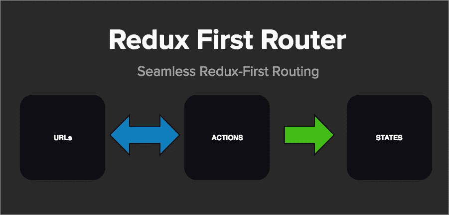
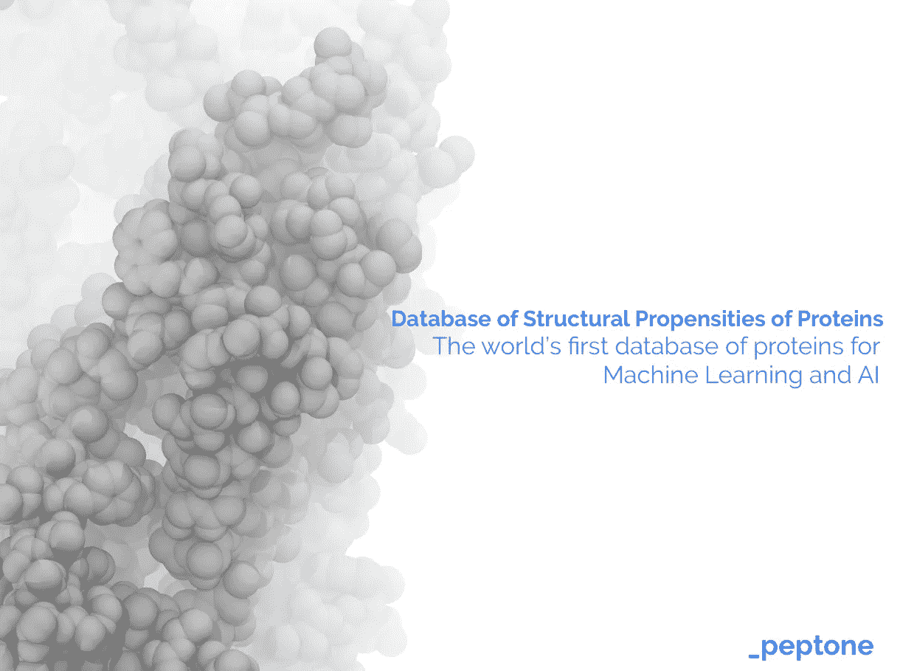

# …不仅仅是旧金山的另一场科技聚会#HackerNoon

> 原文：<https://medium.com/hackernoon/not-just-another-tech-party-in-san-francisco-hackernoon-fe6bf1ce80be>

当我得到第一份创业工作时，我的名片上写着“互联网爱好者”，这一点直到今天依然如此。 [Hacker Noon](http://hackernoon.com) 已经完全通过互联网发展到 2000+贡献者和 125000+订户。没有办公室。没有会议。没有派对——直到现在。我很高兴能亲自见到这个社区。今天的旧金山事件是一个里程碑。*如果您今天在旧金山地区，**[***使用折扣代码“@ami”获得我们就职活动***](https://goo.gl/Z7Lr6g) *的附赠票。**

*此外，以下是我们过去 3 天最喜欢的 7 篇文章:*

## *[**学习开发技能的最佳方式(在此过程中获得报酬)**](https://hackernoon.com/the-best-way-to-learn-development-skills-while-getting-paid-in-the-process-a31bfb138287) **由编码艺术家** [**迈克尔·曼吉亚拉迪**](https://medium.com/u/39cab1e520f8?source=post_page-----fe6bf1ce80be--------------------------------)*

**

## *[12 种令人惊叹的 JavaScript 速记技术](https://hackernoon.com/12-amazing-javascript-shorthand-techniques-fef16cdbc7fe)前端工程师&企业家[尤里·拉莫斯](https://medium.com/u/bf3027a42741?source=post_page-----fe6bf1ce80be--------------------------------)*

**

## *[Angular 的状态和版本 5 的到期日](https://hackernoon.com/the-state-of-angular-and-the-due-date-of-version-5-68374002267f)由全栈开发者[或 Moshe](https://medium.com/u/6107923b20dc?source=post_page-----fe6bf1ce80be--------------------------------)*

**

## *【JavaScript 机器学习:第一部分作者 [Abhishek Soni](https://medium.com/u/c21a9b1944af?source=post_page-----fe6bf1ce80be--------------------------------) ，他刚刚有了一个顿悟*

**

## *[律师如何会被区块链而不是机器学习杀死](https://hackernoon.com/how-lawyers-will-be-killed-by-the-block-chain-and-not-machine-learning-bfbf77376c54)被特立独行的[克里斯·赫德](https://medium.com/u/da7b665f3cc7?source=post_page-----fe6bf1ce80be--------------------------------)*

**

## *[预发布:Redux-First Router——超越 Redux-Little-Router](https://hackernoon.com/pre-release-redux-first-router-a-step-beyond-redux-little-router-cd2716576aea) 的一步，作者是 Javascript 的精神顾问 [James Gillmore](https://medium.com/u/a4a87902fa2d?source=post_page-----fe6bf1ce80be--------------------------------)*

**

## *[全球首个用于机器学习和 AI 的蛋白质数据库](https://hackernoon.com/the-worlds-first-protein-database-for-machine-learning-and-ai-1f6dff68a162)由生物技术 AI Boss [Kamil Tamiola](https://medium.com/u/c253ef9822fd?source=post_page-----fe6bf1ce80be--------------------------------)*

**

*直到下一次，不要把世界的现实想当然，*

*[大卫·斯穆克](https://medium.com/u/7f91547ce9c9?source=post_page-----fe6bf1ce80be--------------------------------)，[黑客中午](http://hackernoon.com)(对[阿米](https://medium.com/u/1fedc8fffada?source=post_page-----fe6bf1ce80be--------------------------------))*

****P.S.*** *阅读* [*最新*](http://hackernoon.com/latest) *和* [*趋势科技故事*](http://hackernoon.com/trending) *关于:* [*人工智能*](https://hackernoon.com/artificial-intelligence/home)*[*API*](https://medium.com/hacker-daily/api-stories/home)*[*开发者训练营*](https://medium.com/hacker-daily/developer-bootcamp/home) [*MVP 课程*](https://hackernoon.com/mvp-minimum-viable-product/home)*[*产品管理人生*](https://hackernoon.com/product-management-life/home)*[*倒计时*](https://hackernoon.com/the-countdown/home)*[*科技事业*](https://hackernoon.com/tech-careers/home)*&*[*风险投资。* ](https://hackernoon.com/venture-capital/home)******

*****p . p . s .***[***使用折扣代码“@ami”获得我们就职活动的附赠票***](https://goo.gl/Z7Lr6g) *。***

********