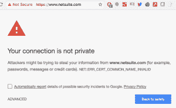
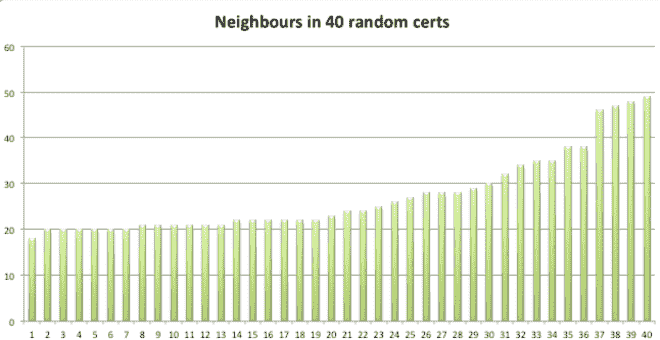
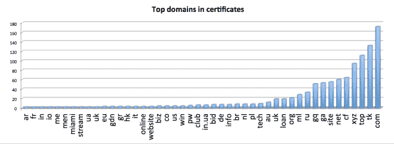

# 不是开玩笑。您与 ferraricentre 共享 SSL 密钥！(还有 luxurymobiletoilet)

> 原文：<https://medium.com/hackernoon/not-kidding-you-share-ssl-key-with-ferraricentre-and-luxurymobiletoilet-80b92dc77afc>

当我说你与成人内容网站、西萨塞克斯郡的道路清洁工、费拉里中心或试图冒充苹果的黑客共享加密密钥时，你可能会认为我在开玩笑。但这正是当你使用免费(CDN)服务时会发生的事情。

[*点击此处，与我们的 https://keychest.net 一起检查您的邻居，享受乐趣，并分享您的发现！*](https://keychest.net/)

在开发我们的网络安全扫描器和规划工具 [KeyChest](https://keychest.net/) 的时候，我们意识到免费网络安全[有它的缺点。我们使用](https://hackernoon.com/tagged/security) [Cloudflare](https://cloudflare.com/) 来处理这个博客的高峰流量。他们的免费服务之一是 HTTPS——你网址旁边的绿色挂锁或“安全”字样。

人们需要为他们的网站获得一个证书，以显示绿色、可信、放心的“安全”。如果你的访问者仍然决定访问你的网站，而不是警告你的网站不安全，或者一个红色的大三角形警告你的访问者前面有狮子的危险。

现在，Cloudflare 和其他内容交付网络(CDN)提供免费层服务。他们可以做到这一点，因为他们拥有所有的基础设施，他们需要缓存和加速您的网站。

他们唯一需要购买的东西是证书，他们试图变得聪明，将成本降至最低。他们可以做的事情之一是为几个域创建一个证书，以降低每个域的成本。如果你是一个自由层客户，你突然得到一堆邻居共享相同的加密密钥。

[*用我们的 https://keychest.net 检查你的邻居，玩得开心，分享你的发现！*](https://keychest.net/)

# 随机例子

我查看了为 CloudFlare 颁发的 40 个随机证书，下面是我发现的一些有趣的信息。

**你的邻居数量**

证书“邻居”数量的中位数是 23，但您可以拥有多达 48 个。

**你邻居的位置**

如果你想知道你的邻居是本地人还是来自世界的另一端，这是我找到的顶级域名分布。该图显示了至少有 2 台服务器的顶级域，还有另外 38 个只有一台服务器的顶级域。

。com 并不意外，。tk，。cf，还有。ga 是免费的域名服务。。top 是新域名之一，就像. xyz 一样。上图中第一个国家顶级域名是保加利亚，接下来是俄罗斯和英国。

**邻居是什么样的**

这开始变得有趣，但也有点尴尬。首先是好消息——只有 3 台服务器(总共 1090 台)试图假冒他人( [Unicode 域名钓鱼](https://www.xudongz.com/blog/2017/idn-phishing/))。

有许多服务器地址，要么不起作用，要么不欢迎随机的 web 访问者。

有可能至少有一个与你“共享”你的 HTTPS 密钥的邻居提供成人内容。

[你可能很幸运，有像](https://keychest.net/scan?uuid=e131a110-4add-11e7-93bd-6fc703b3ce7d&url=dostavka.tm)这样的邻居:

*   alimentaria.com.ar 的食品管理
*   土库曼斯坦运输 dostavka.tm
*   fifteencornwall.org 杰米·奥利弗餐厅
*   儿童拼图— fomuvi.ru
*   农业模拟器(俄语)— fs2015mod.ru
*   关于荞麦的博客——grechkalife . ru
*   …用一个有趣的奇怪的:有用的[技术](https://hackernoon.com/tagged/technology)链接— *有用的信息*

你可以有一些有趣的邻居，比如约翰·布拉德肖·甘斯，他住在:

*   西萨塞克斯郡的道路清扫工；
*   法拉利中心；
*   安全门装置；
*   出租厕所；
*   海洋工程埃塞克斯；
*   焊接机；或者
*   鹿特丹约会服务(不，这不是一个约会服务)。

你也可能很不幸，像一个不错的博客帮助人们巩固债务。他们有 46 个邻居，其中大多数是中国成人网站，如 1749554.top 或 2613239.top。

[*如果您使用 Cloudflare 或其他 CDN 服务，请随时查看您在 https://keychest.net 的邻居，享受乐趣，并分享您的发现！*](https://keychest.net/)

一个好消息

看起来 Cloudflare 正试图让这种不舒服的邻居见面的情况在合理的范围内变得可以忍受。如果您向 Cloudflare 注册主域，证书生成系统会将您的所有域放入同一个证书中。这减少了你有一个不想知道的邻居的机会。

> [黑客中午](http://bit.ly/Hackernoon)是黑客如何开始他们的下午。我们是 AMI 家庭的一员。我们现在[接受投稿](http://bit.ly/hackernoonsubmission)并乐意[讨论广告&赞助](mailto:partners@amipublications.com)机会。
> 
> 如果你喜欢这个故事，我们推荐你阅读我们的[最新科技故事](http://bit.ly/hackernoonlatestt)和[趋势科技故事](https://hackernoon.com/trending)。直到下一次，不要把世界的现实想当然！

