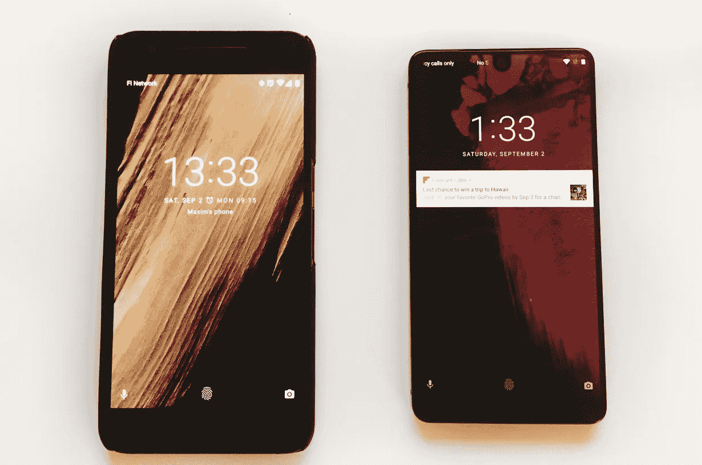
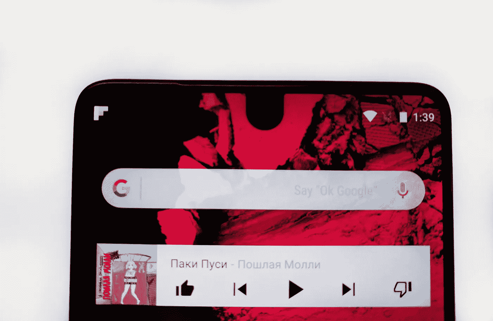
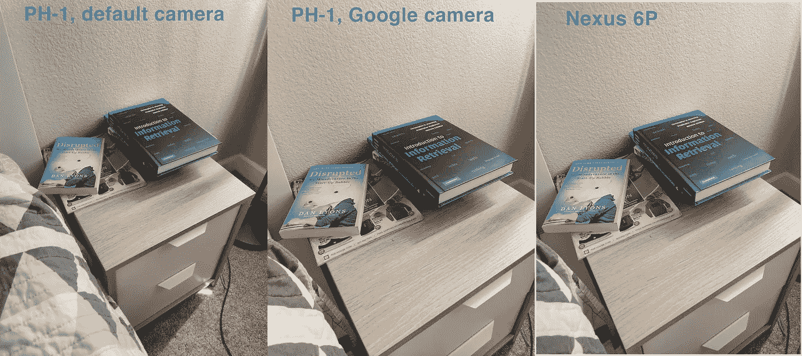
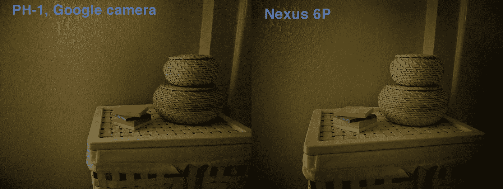
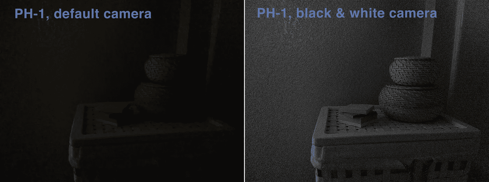
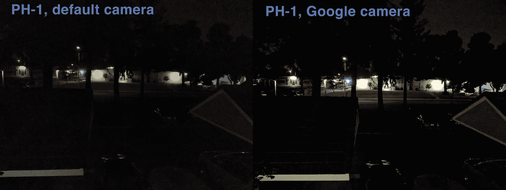

# 不太重要的手机

> 原文：<https://medium.com/hackernoon/not-so-essential-phone-ddcab1bb1f75>

TL；除非你有充分的理由，否则不要买它。

Nexus 6P and Essential PH-1

我的 Nexus 6P 已经用了两年，和所有安卓系统一样，越来越慢。电池也退化了，现在手机连半天的正常使用都支持不了。我一般两年换一次手机，几周前开始找新的。我在过去对供应商(三星)的调整有过糟糕的经历，所以 Android 是我的必需品。当我突然发现基本手机时，Pixel 手机还有一两个月的时间。

该网站承诺了一个非常有吸引力的设备，几乎是一个股票 Android 和一些前所未见的钛+陶瓷机身。他们还出售一款很酷的 360°相机，售价 50 美元，我觉得拥有它会很不错。我喜欢拍摄 360 度照片，目前为止我使用的唯一工具是 cardboard 相机应用程序。我不在乎一个耳机插孔，和一个我从来没有过的防水功能。这款手机刚刚上市，所以 YouTube 上所有的(预)评论都是正面的，我很快就买下了它。我下了订单，开始等待。

大多数新产品都会经历发货延迟，所以我对很快拿到它不抱太大希望。与此同时，第一批人收到了他们的电话，令人不安的消息开始到处出现。他们都是关于相机的。这款手机配备了双传感器摄像头，通过将普通照片与第二个传感器拍摄的更清晰的黑白照片相结合，可以拍摄出更好的照片。不幸的是，人们报告的图片质量比预期的差得多，每个人都在抱怨相机应用程序。我开始担心。相机是我每天都在使用的东西，我已经习惯了我的 Nexus 6P 拍摄的优质图片。Nexus 相机在弱光下表现尤为出色，这也是 Essential 最缺乏的地方。人们也对相机应用程序的质量不满意。

> 然而，不知何故，这最终使基本手机的相机成为我用过的最慢的相机之一。只要结果不错，我可以原谅一个有点慢的相机应用程序，但对于 Essential，没有任何借口。当这实际上是该公司为准备推出这款手机而必须开发的唯一应用程序时，情况尤其如此。希望这一切会随着时间的推移而改善。
> (来自 9to5google.com)

为了开始使用非谷歌手机，我不得不放弃谷歌项目 Fi，这是另一个牺牲。第二便宜的选择是 T-Mobile。T-Mobile ONE 要贵得多，而且是后付费计划(需要信用检查和长期承诺)。当然，它是“无限的”，但我很少在 Fi 上超过 2Gb，因为大多数时间我都在 WiFi 上。T-Mobile 也缺乏自动谷歌语音集成，总的来说，它似乎是一个更高价格的降级。尽管如此，我还是为自己和妻子订购了两张 sim 卡。

我的手机仍然没有发货，我知道了另一件“不太好”的事情——它使用普通的液晶显示器，而不是高级(AM)有机发光二极管。在这一点上，对我来说很明显，我支付了 700 多美元，几乎没有升级，而且在许多地方从我的两年前的 Nexus 6P 降级。我已经为我的旧手机订购了一个替换电池，并且第一次试图取消一个重要的订单。这就是事情变得奇怪的地方。首先，我无法在他们的网站上创建一个账户——社交登录被中断了，尽管脸书的登录进行了一半。用电子邮件注册也是不可能的，因为我的电子邮件账户是在脸书登录失败时预先创建的。退货政策建议我无论如何都要打电话给支持部门。于是，我拨打了 888–444–2222(想不到吧，哈？)第一次。我期望一个普通的机器人能让我感觉很棒，但我没想到它能充当语音信箱。它让我留下我的名字和电话号码，并答应给我回电话。这很奇怪，但我还是留了言。几个小时后没有人回电话，所以我又拨了一次，又留了一条信息——没有回应。第二天，我找到了一个[支持表单](https://support.essential.com/hc/en-us/requests/new)，发送了一个取消请求，得到了 Zendesk 的自动确认，然后……沉默。我试图在 Twitter 上联系他们的代表，但没有回应。与此同时，[这个](https://www.cnet.com/news/essential-admits-it-accidentally-leaked-customer-info/)发生了。正如其他人所指出的，在这一点上，Essential 看起来更像是一个 Kickstarter 项目，努力交付任何结果，而不是一个由 Android 教父创建的 10 亿美元公司。

最后，我的手机发货了，下面是对 Nexus 6P 的简要概述和比较。

## 建筑

我会跳过包装和配件，我真的不在乎它们。你首先注意到的是它的构造。构建是这款手机最强(也可能是唯一强)的特点。它很重，感觉就像你手里拿着一块金属。它比 6P 小，但由于无边框设计，显示屏实际上要长一点。在支持使用它的应用程序中，屏幕顶部看起来很棒，尤其是在主屏幕上。相机孔也不是问题，它不会与任何重要的东西重叠。

It looks much better IRL

## 屏幕

屏幕其实没问题。黑色在 Nexus 6P 上明显更好，Nexus 在晚上看起来更好，但除此之外，我对屏幕没有任何抱怨。最大的缺点是，这款手机需要(AM)有机发光二极管屏幕才能做白日梦，这很令人失望。我将无法从谷歌订购耳机并享受更好的质量 VR。我到底该怎么看 360 度相机拍的照片？
一些人报告说，触摸有时会错过你的手指，你必须轻敲多次。我不认为我注意到了很多，但有些东西在那里。不过，很有可能以后可以通过软件进行调整。下图说明了我在说什么。

Dots were supposed to be strokes, but the sensor didn’t recognize them

## 演出

我在 Nexus 上安装了所有的应用程序，PH-1 的性能明显更好。我用过的最糟糕的应用之一是 Skype。在 6P 上，它会周期性地挂起几秒钟，整体感觉非常迟钝。在新手机上，速度非常快。此外，尽管电池更小，但它比我的旧手机更能保持电量。所有最近的旗舰产品都有相似的硬件规格，所以我希望它们都有相似的表现。别担心，一年后任何安卓手机都会感觉变慢，两年后，你会想换掉它。事情就是这样的。

## 更丑的部分

众所周知，摄像头是这款智能手机最薄弱的地方。这在很大程度上要归功于软件。你可以找到一个装有谷歌相机应用程序的定制 APK ，用在 Pixel 手机上，亲眼看看这个软件实际上完成了所有的魔法。Essential 提供的相机应用程序是垃圾，所以最起码，你必须使用其他一些应用程序，这些应用程序不是官方支持的，并且不能利用第二个传感器。让我们来看一些图片。
白天光线下，必备相机没问题。Google app 表现稍好，与 Nexus 6P 不相上下。

The default camera photo is a bit more blurry, but overall not too bad

谷歌后期处理的神奇之处始于弱光条件。这是用谷歌相机在 Essential 和 Nexus 手机上拍摄的相同场景:

Nexus clearly wins here

这是用 Essential 的相机应用程序拍摄的同一个场景:

And that’s how bad is the default app

这是另一张夜景照片:

Google camera wins

很大的不同，对吧？您可以插值图像质量将如何随场景中的光线量而变化。我的照片中有一半，如果不是大部分，是在弱光下拍摄的，所以我认为 Essential 的相机性能是不可接受的。使用谷歌相机使它的性能几乎与 Nexus 的一样好，但经过两年的发展和更多的美元，我期待更好的东西。Essential 有微小的机会可以改进他们自己的应用程序，并充分利用第二个传感器，但鉴于我迄今为止的经验，我不太相信这一点。感觉该公司有许多其他问题要解决，软件工程甚至可能不是主要关注点。当然，我可以继续使用谷歌相机，但为什么不买 Pixel 呢？

360 相机还在路上，不过已经有人收到了。他们的经历又是一般般。你可以在这篇[美国消费者新闻与商业频道文章](https://www.cnbc.com/2017/09/02/essential-smartphone-360-camera-first-look.html)中找到一张样本照片。完全没有打动我。还是那句话，对于 360 来说你需要很多软件，Essential 感觉不像软件公司。

## 再多一点

对我来说，更多的缺点是缺乏防水和奇怪的情况。就像我说的，我从来没有过防水手机，但是我在冬天经常滑雪，我的手机总是湿的。所以，确保它的安全性不会有什么坏处。另一件事是，我在车里使用磁性手机支架，非常方便。它很小，我可以很快地把我的手机扣在上面，而不用处理笨重的弹簧和橡胶。唯一的一点是，我必须在我的手机上保留一个小金属板。我通常把它放在手机壳下面。然而，使用 Essential 时，使用外壳没有任何意义，因为手机会立即失去美感。但是如果没有这个案子，我将失去一个日常的便利，不太好。

## 现在是最丑陋的部分

这种支持——根本不存在。我每天都打他们的电话，留语音信息，没人回我电话。我再次提交了一份支持表格，并试图再次干扰 Twitter 用户——没有回应。我很想把手机还回去，这些事快把我逼疯了。有 15 天的退货期，如果 10 天后我没有收到他们的回复，我将向我的信用卡发行商提起诉讼。现在这一切感觉更像是一个骗局，而不是从一个值得信赖的供应商那里顺利购买。

UPD:

支持者终于向我伸出了手(5 天后)。他们对造成的不便表示歉意，并说他们现在遇到了很多技术问题。我仍然认为我最好把手机还回去，尽管我真的很喜欢它的构造。

UPD2:

自从我第一次就退货事宜联系 Essential support 以来，已经过去了 11 天。5 天后，我收到了一封询问详情的电子邮件回复。我已经马上把所有的细节发给他们了，还有…安静。昨天我又试了一次，得到了这样的回复:

> 嗨，马克西姆，
> 
> 感谢您的回复。您可能会在接下来的 3 到 5 个工作日内接到我们的电话，以确定退货流程并确认您的信息。
> 
> Essential Phone 是一款漂亮的设备，我们可以自信地说，如果您将来选择重新考虑，它将超出您的预期。谢谢你的时间，祝你有美好的一天！

再过 3 到 5 天，我甚至不确定他们是否会联系我。非常非常糟糕的支持体验。

## 摘要

谷歌(华为)Nexus 6P 两年前上市，起价 500 美元。它为我服务了两年，被证明是一个优秀的设备。它仍然接收 Android 更新，并配备了一个出色的摄像头，能够在没有光线的情况下拍照。Essential 售价 700 美元，相对于 6P(车身和性能)有一些改进。然而，它也有几个明显的缺点，显然经不起竞争。你花 700 美元买了一台设备，它比你的旧设备好不了多少(如果有的话),还带来了一大堆挫败感。所以，我觉得不值得买，除非你有非常具体的理由(比如你是一个强大的公司支持者，或者想开发一个仅限必备的 app)。我知道 Essential 是一家新公司，这是他们的第一个产品，第一次尝试没有什么是好的。但后来我不明白定价，它真的应该被定为一个中端设备，然后所有的买家将非常高兴。

## 附言

我没有抱怨耳机插孔，只是因为碰巧我有一个蓝牙耳机。这里还有一个[子编辑](https://www.reddit.com/r/essential/)的链接，在这里你可以找到很多不同的观点。有些人其实挺喜欢的。

是的，我知道[在](https://blog.onebar.io/product-hunt-will-test-your-architecture-if-you-dont-85498b64d409)发布日的感受，但客户支持仍然是必不可少的。

## UPD3: 360 摄像机

在我与支持者斗争的时候，360 摄像机终于来了。我玩了一个小时，我想我也不想要这个玩具了。360°概念很酷，我喜欢它捕捉我周围一切的想法，我喜欢磁性附着，但画质，我就是享受不到。这让我想起了我高中时的索尼爱立信手机相机。此外，基本的相机应用程序——它在 360°模式下只有 4 个按钮，仍然很容易使它完全冻结。不幸的是，与主摄像头不同，360 摄像头不太可能与任何其他应用程序配合使用。下面是一些照片样本。

Not so low light

Low light

Uploading 360 videos on YouTube is not very straightforward

我可以忍受视频质量，但照片是可怕的。