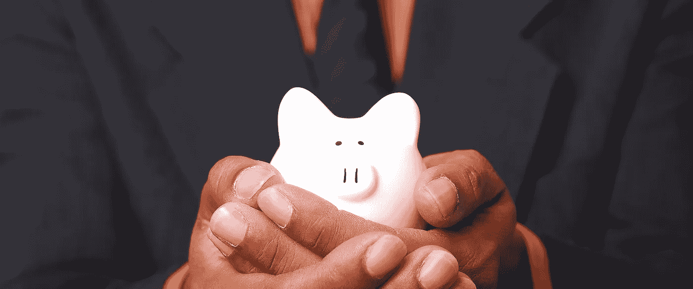
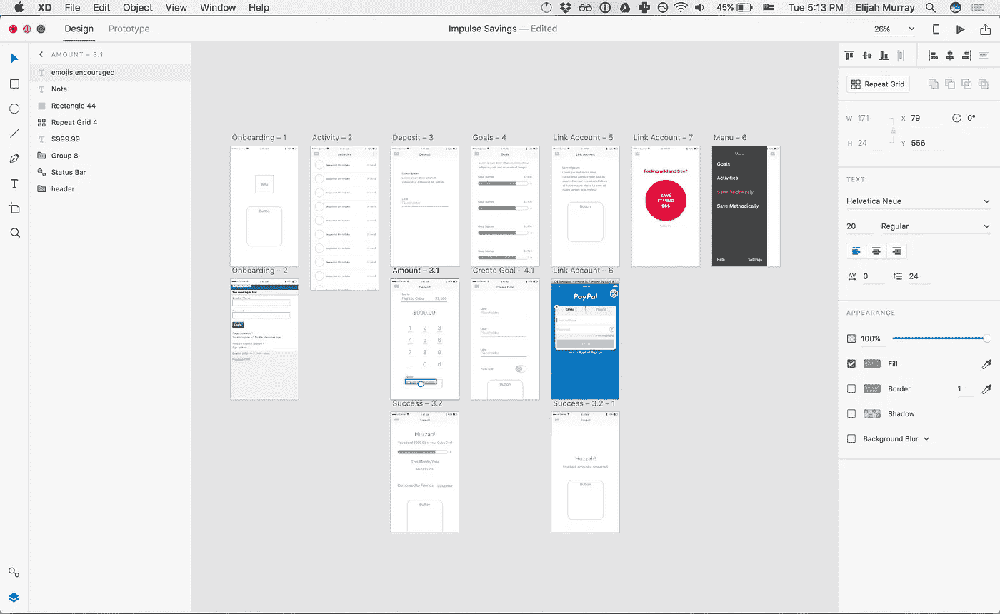
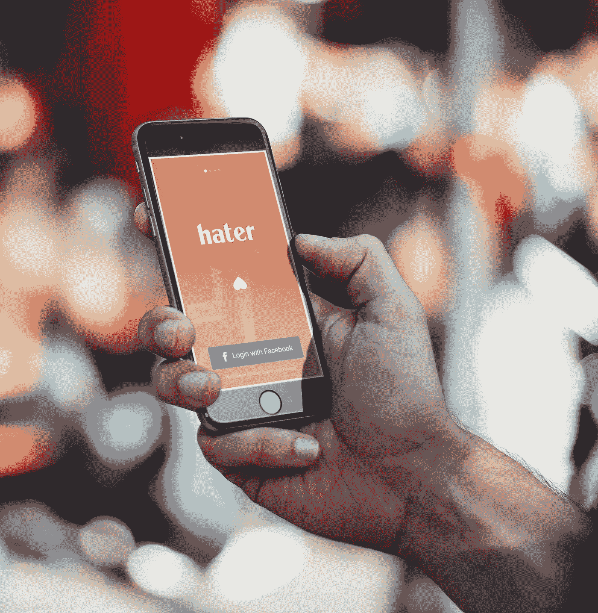
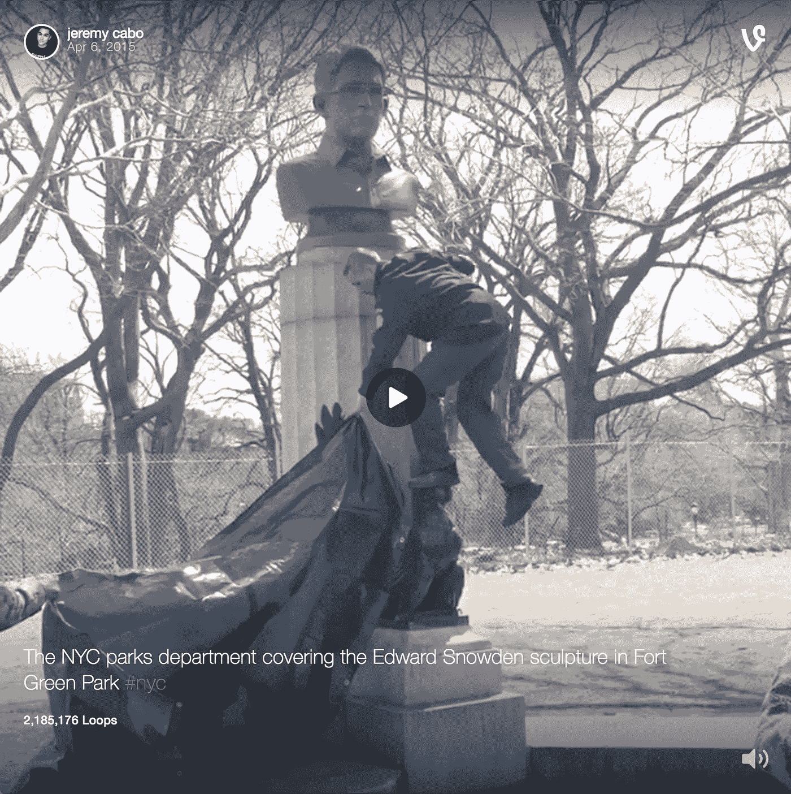
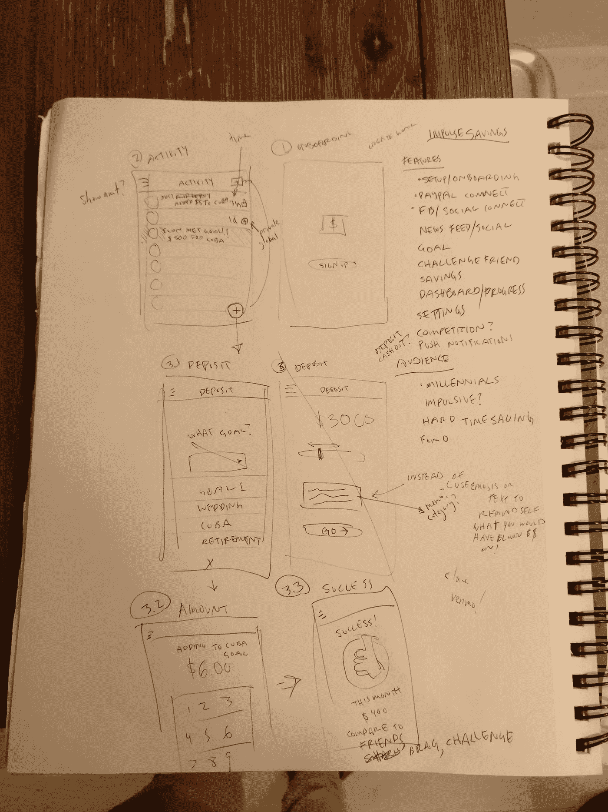

# 创业 2:第 1 周——为什么“欺骗”实际上是好的

> 原文：<https://medium.com/hackernoon/note-4-weeks-to-launch-is-an-ongoing-series-about-building-passive-income-across-multiple-startups-ad61aedc4332>

*注:距离* [*发布还有 4 周*](https://hackernoon.com/tagged/launch) *是一个正在进行的关于在多个创业公司之间建立被动收入的系列——每 4 周就有一个新的* [*创业公司*](https://hackernoon.com/tagged/startup) *。阅读* [*第 4 周发布*](http://4weekstolaunch.com/4-weeks-to-launchlaunch/) *入门，或* [*订阅每周更新*](http://4weekstolaunch.com/newsletter/) *。*

Millennials between 18 and 24 years old — 72% have less than $1,000 in their savings accounts and 31% have $0\. Source: [CNBC](http://www.cnbc.com/2016/11/23/heres-how-much-the-average-millennial-has-in-their-savings-account.html)

在接下来的 4 周里，我将设计、构建、发布和推广一个 iOS 应用程序(在朋友们的帮助下)。我们将分享从纸张到成品的整个过程，完全透明。

一家初创企业倒闭！如果你还没有，看看 [startup #1](http://jfdi.ninja) (这里是[metrics](https://docs.google.com/spreadsheets/d/17FkveYguYnoPUA5pfPttPnVfwYTx14TLCa_ln6iqXsI/edit#gid=0)，这里是[about it](http://4weekstolaunch.com/startup-1-week-1/))。这个月我们将重心从收入转移到用户。正如硅谷宣扬的那样，如果你获得了用户，你就可以在以后赚钱。我们将打造一款迎合千禧一代冲动倾向的 iOS 应用。让实验开始吧！

# 冲动储蓄(工作名称)

问题:千禧一代不擅长存钱。我们容易冲动，讨厌任何形式的长期承诺，也不担心未来(尽管我们应该担心)。现在的我如此快乐，为什么要为未来的我存钱呢？

**解决方案:**游戏化储蓄

存钱既无聊又不值得。冲动储蓄以你为中心，无论你是为退休储蓄还是疯狂购物。观察你朋友的进步——他们比你节省更多吗？–朝着你关心的目标努力。我个人很期待毛伊岛。

## 竞争

有几个以储蓄为中心的应用程序，主要分为两类。第一组被动地将小额资金从你的支票账户转移到储蓄账户。这很好，但没有什么激励，情感或其他方面，而且很难开始。第二组集中在建立一个定期存款。更没意思了。

存钱是一个抽象的概念，如果不依赖于一种情绪，就很难通过移动金钱而变得兴奋。离退休还有 50 亿年，所以我为什么要为此做计划呢？通过建立“想要”的目标而不是“应该做”的目标，存钱变得更有趣，尤其是在和朋友竞争的时候。

## 为什么是这样，为什么是现在？

无论你是富有还是贫穷，金钱都会影响你的一生。我觉得难以理解的是，为什么直到 11 年级才开始教授金融知识，尽管那时这还是一门选修课！就好像钱是没人喜欢谈论的丑陋的继子。理财教育落在了我们父母的肩上，我不想告诉父母，但他们很缺钱。这是一个需要解决的问题。

嘿，钱甚至没有那么可怕！这是一个游戏，如果你弄清楚了规则，你会做得很好。学习和内化规则才是最难的部分。花的比赚的少。让钱为你工作，不要为钱工作。投资赚取复利。省一便士就是赚一便士。虽然这些都是陈词滥调，但也有很多道理。是时候让冲动储蓄像冲动消费一样简单了。

# 打造梦之队

在制作 JFDI.ninja 的时候，我经常感到不知所措。总是有更多的事情要做！创业 1 号也不例外，所以这个月我决定请一些专家来分担工作。我向你们介绍这个团队，尼克·皮罗洛和 T2，安德鲁·泰德和 T3！

1.  尼克是个很棒的工程师，他是我多年的好朋友。看看他的最新应用 [HaterDater](https://www.haterdater.com/) ，在应用商店的第一周就获得了 100K+的下载量。
2.  安迪是一个营销成功不言自明的朋友。看看他放在格林公园的 100 磅重的斯诺登半身像，后来被纽约市公园部门没收。

## 找人帮忙不是作弊吗？

以利亚，我以为你会在一个月内建立一家新公司。怎么回事？

学校教育我们要独立工作。不要和其他人一起考试，那是作弊！如果你抄袭塔妮的作业，你就会失败，因为你不是自己学的！

然后一件不寻常的事情发生了。你毕业了(或者我退学了)，意识到你不必一个人做所有的事情。你可以向任何人寻求帮助。如果你能招募到一个专业的人，那就是成功，而不是欺诈。是的，要真诚，但是不要认为你必须像在学校一样自己做所有的事情。那是最慢也是最困难的成功之路。

创业者对此心知肚明。一个好的企业家知道他们的优势，但也知道如何为他们的弱点找到支持。卡梅伦·赫罗尔德讲述了他在大学是如何外包作业的。

> “在大学里，我连续 13 次雇佣孩子们做我的会计作业。但是作为一个企业家，你不做会计，你雇佣会计师。所以我早就发现了这一点。”

我们通过接近更好的人来学习。尼克是一个比我更强的工程师，安迪也有营销能力。让你周围的人迫使你成长，你会大大加快你的学习。

# 如何设计和制造产品

我将领导冲动储蓄产品。虽然没有工程或营销那么明显，但产品管理(PM)和用户体验(UX)对打造高质量的产品至关重要。

我是一个自学成才的设计师和项目经理。虽然我的方法可能不是来自商学院，但迄今为止它们对我很有用。到目前为止，我已经完成了该产品的草图和线框，并将在下周设计 pixel perfect 样机。如果有兴趣观看和学习更多关于产品设计的帖子，让我知道你想让我直播！

## 该问

*   想学手机 app 设计吗？让我知道为什么或为什么不在下面。
*   [如果你想在收件箱里看到这些每周更新，注册邮件列表](http://4weekstolaunch.com/newsletter/)。承诺，没有垃圾邮件，只有帖子。

> [黑客中午](http://bit.ly/Hackernoon)是黑客如何开始他们的下午。我们是 [@AMI](http://bit.ly/atAMIatAMI) 家庭的一员。我们现在[接受投稿](http://bit.ly/hackernoonsubmission)并乐意[讨论广告&赞助](mailto:partners@amipublications.com)机会。
> 
> 如果你喜欢这个故事，我们推荐你阅读我们的[最新科技故事](http://bit.ly/hackernoonlatestt)和[趋势科技故事](https://hackernoon.com/trending)。直到下一次，不要把世界的现实想当然！

