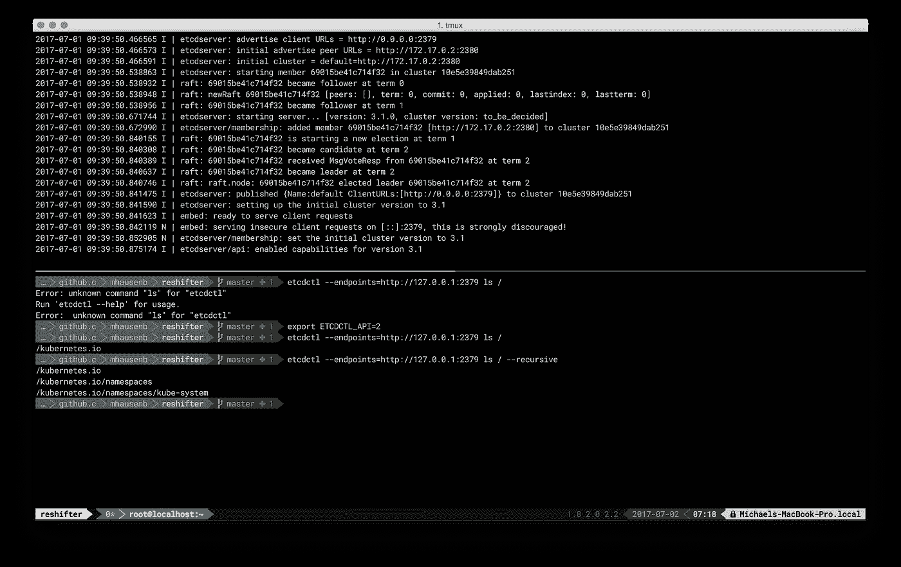

# 从 etcd2 迁移到 etcd3 的注意事项

> 原文：<https://medium.com/hackernoon/notes-on-moving-from-etcd2-to-etcd3-dedb26057b90>



TL；DR:从 etcd v2 到 v3 的迁移通常都有很好的记录，但是有一些问题你可能需要注意。

我是 ATM 工作人员，从事[ReShifter](http://reshifter.info)——一个用于[备份](https://hackernoon.com/tagged/backing-up)和恢复 [Kubernetes](https://hackernoon.com/tagged/kubernetes) 集群的工具——在这项工作的背景下，我遇到了一些与 etcd 相关的事情，这些事情确实花了我一些时间来整理，所以我想我在这里分享一下，以免你痛苦；)

总的来说，etcd v2 到 etcd v3 的迁移故事是有据可查的，参见这里的这篇[博文](https://coreos.com/blog/migrating-applications-etcd-v3.html)以及[官方文档](https://coreos.com/etcd/docs/latest/op-guide/v2-migration.html)。从 CLI 的角度(即使用`etcdctl`时)和 API 的角度(即从 Go 客户端库 [v2](https://godoc.org/github.com/coreos/etcd/client) 移动到 [v3](https://godoc.org/github.com/coreos/etcd/clientv3) )来看，有几件事情需要注意:

*   v2 数据模型是一棵树，也就是说，一个键标识一个目录(可能作为子树的根)或树中的一个叶，在这种情况下，有效负载实际上可以是一个值。一个键不能同时是叶节点和目录。在 v3 中，数据模型已经扁平化，也就是说，条目之间不再有层次结构信息。所以，虽然你可以假装，但以下是真的，在 v3 中你真的在处理(flat) [键范围](https://github.com/coreos/etcd/blob/master/Documentation/dev-guide/interacting_v3.md#read-keys):

```
/kubernetes.io/namespaces/kube-system -->/kubernetes.io
 └──namespaces
    └── kube-system
```

*   数据模型变化的一个结果是查询和操作 etcd2 和 etcd3 的代码看起来不同了。在前一种情况下，例如，您可以利用层次结构信息递归地遍历树；对于 etcd3，您可以有效地确定范围(start 和 end 键，非常类似于您在 HBase 中所做的)，然后迭代结果集；例如参见[换码器代码库](https://github.com/mhausenblas/reshifter/blob/master/pkg/discovery/visitors.go)中的`discovery.Visit2()`和`discovery.Visit3()`。
*   使用的有线协议(HTTP vs. gRPC)和使用的 API 版本/数据模型之间存在差异。例如，您可能正在运行 etcd3 服务器，但是在 etcd2 模式下使用它。请注意您是如何配置 etcd 的，以及在何种模式下与它通信。
*   有一件事确实让我有些痛苦:忘记设置环境变量`ETCDCTL_API=3`。这个不起眼的开关导致`etcdctl`从通话 v2 切换到 v3。在设置 env 变量之前和之后运行`etcdctl`,比较你已经得到的可用命令，例如 v2 中的`get/set`与 v3 中的`get/put`(参见本文顶部的截屏，显示`ls`仅在 v2 API 中可用)。
*   在 etcd3 服务器中，v2 和 v3 数据存储并行存在且相互独立，另请参见下面的终端会话。

现在让我们看看与 etcd3 的简单交互，以及如何使用 v2 和 v3 API。首先，我们推出了集装箱化的 etcd3:

```
$ docker run --rm -p 2379:2379 --name test-etcd \
  --dns 8.8.8.8 quay.io/coreos/etcd:v3.1.0 /usr/local/bin/etcd \
  --advertise-client-urls [http://0.0.0.0:2379](http://0.0.0.0:2379) \
  --listen-client-urls [http://0.0.0.0:2379](http://0.0.0.0:2379) \
  --listen-peer-urls [http://0.0.0.0:2380](http://0.0.0.0:2380)
```

现在，让我们使用 v2 API 向 etcd 中输入一个值:

```
curl [http://127.0.0.1:2379/v2/keys/kubernetes.io/namespaces/kube-system](http://127.0.0.1:2379/v2/keys/kubernetes.io/namespaces/kube-system) -XPUT -d value="value for v2"
```

接下来，我们切换到 v3 API:

```
$ export ETCDCTL_API=3
```

现在，我们首先检查是否可以读取之前使用 v2 API 设置的值:

```
$ etcdctl --endpoints=[http://127.0.0.1:2379](http://127.0.0.1:2379) get \
  /kubernetes.io/namespaces/kube-system
```

返回 empty，因此无法写入 etcd2 数据存储并通过 v3 读取。现在，让我们使用 v3 API 将一些内容放入 etcd，并在它之后立即查询它以确认写入:

```
$ etcdctl --endpoints=[http://127.0.0.1:2379](http://127.0.0.1:2379) put \
  /kubernetes.io/namespaces/kube-system "value for v3"
$ etcdctl --endpoints=[http://127.0.0.1:2379](http://127.0.0.1:2379) get \
  /kubernetes.io/namespaces/kube-system
/kubernetes.io/namespaces/kube-system
value for fv3
```

我将结束这篇文章，并希望你成功地从 etcd v2 迁移到 etcd v3！如果你对上述内容有更多的见解或评论，请在这里分享，在 [Twitter](https://twitter.com/mhausenblas) (DMs 开放)上联系我，或者来加入我们的 [Kubernetes Slack](http://slack.k8s.io) ，在那里我经常在#sig-cluster-lifecycle 和#sig-apps 上闲逛。

*最后但并非最不重要的一点，我想给 CoreOS 的*[*Serg*](https://twitter.com/_surbaniak)*巨大的荣誉:他耐心地帮助我解决了我在使用 v3 API 时遇到的问题。谢谢你，我欠你一次！*

[](http://bit.ly/HackernoonFB)[](https://goo.gl/k7XYbx)[](https://goo.gl/4ofytp)

> [黑客中午](http://bit.ly/Hackernoon)是黑客如何开始他们的下午。我们是 T21 家庭的一员。我们现在[接受投稿](http://bit.ly/hackernoonsubmission)并乐意[讨论广告&赞助](mailto:partners@amipublications.com)机会。
> 
> 如果你喜欢这个故事，我们推荐你阅读我们的[最新科技故事](http://bit.ly/hackernoonlatestt)和[趋势科技故事](https://hackernoon.com/trending)。直到下一次，不要把世界的现实想当然！

