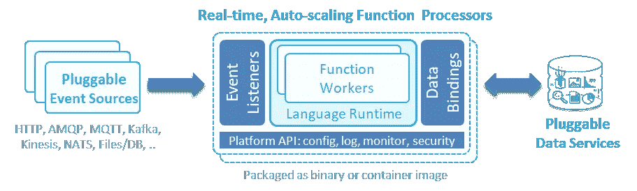
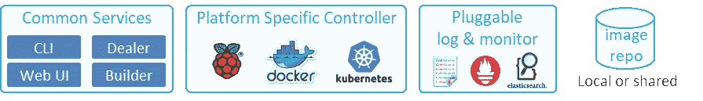
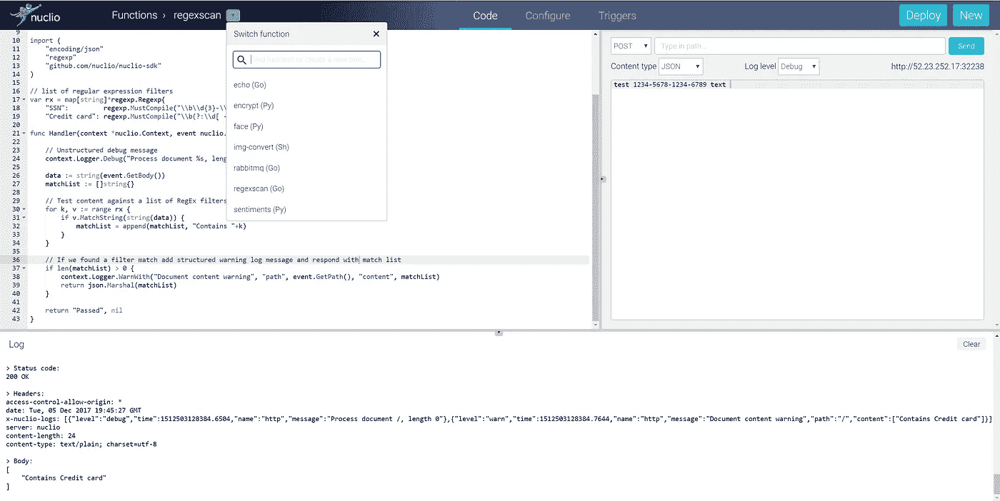

# 新的无服务器超级英雄

> 原文：<https://medium.com/hackernoon/nuclio-the-new-serverless-superhero-3aefe1854e9a>

我们已经习惯了总有一个权衡:如果某个东西是抽象的并且容易用作[无服务器](https://hackernoon.com/tagged/serverless)，那么它可能会很慢并且不灵活。或者，我们不得不以牺牲可用性为代价来获得最大的性能和满足独特的应用需求。但是 nuclio 的无服务器功能(【https://github.com/nuclio/nuclio】T2)让我们可以快速创建和运行代码，而没有基础设施的麻烦。nuclio 运行速度比裸机代码更快，适用于更广泛的应用，调试更简单，最重要的是，它可以在任何地方运行。

不久前，iguazio 需要一种方法在其实时数据平台中添加弹性和临时数据处理功能，因此我们为此开发了一个高速 FaaS 层。然后，我们利用从第一代产品中学到的知识，构建了一个独特的**开源**无服务器平台。我们称之为 [nuclio](https://github.com/nuclio/nuclio) :

*   提供实时性能和最大并行度
*   支持简单的调试、回归和多版本 CI/CD 管道
*   使用通用 API 支持可插拔的数据/事件源
*   可在低功耗设备、笔记本电脑、内部和公共云中携带

在我的文章中阅读更多关于无服务器[背景和当前挑战的信息](/@yaronhaviv/serverless-background-challenges-and-future-d0928df71758)

# 努克利奥的建筑

nuclio 的核心组件是函数处理器(用 Go 编写)。这个处理器通过抽象接口工作，是函数的“操作系统”，提供对事件、数据、日志等的所有访问。相同的功能代码可以从各种可插拔的事件源(目前支持 HTTP、 [Kinesis](https://aws.amazon.com/kinesis/) 、 [Kafka](https://kafka.apache.org/) 、 [RabbitMQ](https://www.rabbitmq.com/) 、 [MQTT](http://mqtt.org/) 、 [NATS](https://nats.io/) 、 [iguazio 的 V3IO、](https://www.iguazio.com/product/)和仿真器)中馈入。

nuclio’s function processor architecture

外部数据(对象、文件、数据库和流)通过数据绑定接口访问，该接口负责所有数据连接、安全和缓存方面。我们可以编写一个使用本地文件的函数，或者通过 HTTP 访问远程数据，或者通过 TCP 或 RDMA 实现极快的横向扩展数据库/流，而无需更改代码。

nuclio 处理器是实时的。对其“操作系统”事件和数据的访问是基于并行性、零拷贝、智能内存/线程重用和无阻塞 IO。编写自己的裸机函数可能比在 nuclio 处理器生态系统中运行它要慢。使用一个简单的 Go 函数，单个 nuclio 函数处理器每秒可以运行 400，000 次函数调用，或者使用 Python (PyPy)或 node.js 每秒可以运行多达 70，000 次事件，并且响应延迟不到 0.1 毫秒。这比大多数无服务器/FaaS 解决方案快 100 倍。基于 Go 的处理器和其他语言运行时之间的访问是通过低延迟共享内存访问来完成的，以消除上下文切换或进程启动开销。

nuclio 支持四种应用模式:同步、异步、流和批处理/交互式作业，并在处理器(经销商)之间动态分配事件、流和作业任务。这使得无服务器适用于新的工作负载，包括重量级后端和分析任务。

nuclio platform services

nuclio 注重可移植性和可重用性:

*   在低功耗设备、 [Docker](https://hackernoon.com/tagged/docker) 、Kubernetes 中工作，或者在使用 nuclio SDK 的 ide 中工作
*   事件/数据源在部署时映射到函数或版本/标签
*   日志和统计数据可以发送到多个目标类型，或者发送到 IDE 屏幕。
*   功能映像存储在共享存储库中，并被推送到多个集群/设备

可移植性允许用户使用 SDK 或 Docker 在笔记本电脑上测试和调试功能，将它们运送到不同云中的 Kubernetes 集群上运行，或将它们推送到多个边缘物联网设备上。它还简化了回归测试和诊断:函数从仿真事件中获取信息，并将输出写入结构化日志，与预期结果进行比较；如果他们自动通过，他们将被提升为测试版。

# 60 秒后开始使用 nuclio

部署一个完整的 Kubernetes 集群或一堆服务并不需要开始，只需用一体化的 Docker 版本测试一下 nuclio。在 Linux 中键入以下内容(假设安装了 Docker):

**docker run-p 8070:8070-v/var/run/docker . sock:/var/run/docker . sock-v/tmp:/tmp nucl io/playground:stable-amd64**

-然后在这个地址打开浏览器 HTTP:// <machine-ip>:8070 看 nuclio 游乐场 UI。</machine-ip>

nuclio 的 playground 附带了几个内置示例，解释了如何编写函数、使用日志以及通过行内注释或定义的事件添加包依赖关系。

要开始，从下拉列表中选择一个示例，编辑并重命名它，然后按 deploy。构建错误将显示在日志中，修复它们并重新部署。完成后，使用 invoke 选项卡生成手动事件并测试函数。使用日志级别选择器动态更改详细程度并调试问题。注意，在幕后，nuclio 从您的函数生成了 Docker 容器或 Kubernetes 部署。

您可以使用您最喜欢的 IDE 开发 nuclio 函数，导入或克隆 [nuclio-SDK](https://github.com/nuclio/nuclio-sdk) 并查看自述文件或示例。查看 nuclio 的[官方网站](https://nuclio.io/)或 [Github 文档](https://github.com/nuclio/nuclio/blob/master/README.md)以了解更多信息，我们在那里查看其架构，并提供关于用法和 [CLI](https://github.com/nuclio/nuclio/blob/master/docs/nuctl/nuctl.md) 的细节。也可以在 nuclio [slack channel](https://nuclio-io.slack.com/) 获得帮助。

nuclio 仍在开发中，它支持 Golang、Python 和 Node.js，Java 即将推出。给它一颗星，加入我们，加速新功能的开发。