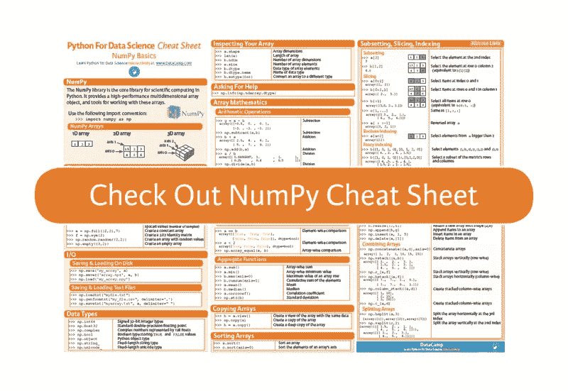

# NumPy 备忘单:Python 中的数据分析

> 原文：<https://medium.com/hackernoon/numpy-cheat-sheet-data-analysis-in-python-ed50e0b77d1f>

事实上，NumPy 是科学计算的基础包之一，如果你想用 Python 做数据科学，NumPy 是你必须能够使用并知道的包之一。它为 Python 列表提供了一个很好的替代方案，因为 NumPy 数组更紧凑，允许更快地读写项目，而且总体上更方便、更高效。

此外，它(部分)是用于数据操作和[机器学习](https://hackernoon.com/tagged/machine-learning)的其他重要软件包的基础，这些软件包你可能已经知道，即 Pandas、Scikit-Learn 和 SciPy:

*   Pandas 数据操作库建立在 NumPy 之上，但是它没有使用数组，而是使用了另外两种基本的数据结构:Series 和 DataFrames，
*   SciPy 构建于 NumPy 之上，提供了大量可以在 Numpy 数组上操作的函数，并且
*   机器学习库 Scikit-Learn 不仅构建在 NumPy 上，还构建在 SciPy 和 Matplotlib 上。

你看，这个 Python 库是必须知道的:如果你知道如何使用它，你也会更好地理解你肯定会使用的其他 Python 数据科学工具。

这个备忘单的意思是给你一个这个库提供的可能性的很好的概述。

自己去看看吧！

NumPy Cheat Sheet

*在这里下载备忘单:*[*https://www . data camp . com/community/blog/python-numpy-cheat-sheet*](https://www.datacamp.com/community/blog/python-numpy-cheat-sheet)

您将看到，这个备忘单涵盖了您需要开始使用的 NumPy 的基础知识:它简要解释了 Python 库必须提供的内容以及数组数据结构的样子，并继续总结了一些主题，如数组创建、I/O、数组检查、数组数学、数组的复制和排序、数组元素的选择以及形状操作。

NumPy 数组通常比 Python 列表更受欢迎，您将看到从数组中选择元素与从列表中选择元素非常相似。

你想知道更多吗？查看 DataCamp 的 [Python 列表教程。](http://www.datacamp.com/community/tutorials/18-most-common-python-list-questions-learn-python)

PS。不要错过我们针对数据科学的其他 Python 秘笈，包括 [Scikit-Learn](https://www.datacamp.com/community/blog/scikit-learn-cheat-sheet) 、 [Bokeh](https://www.datacamp.com/community/blog/bokeh-cheat-sheet-python) 、 [Pandas](https://www.datacamp.com/community/blog/python-pandas-cheat-sheet) 和 [Python 基础知识。](https://www.datacamp.com/community/tutorials/python-data-science-cheat-sheet-basics)

*最初发表于*[*www.datacamp.com*](http://www.datacamp.com/community/blog/python-numpy-cheat-sheet)*。*

> [黑客中午](http://bit.ly/Hackernoon)是黑客如何开始他们的下午。我们是 AMI 家庭的一员。我们现在[接受投稿](http://bit.ly/hackernoonsubmission)并乐意[讨论广告&赞助](mailto:partners@amipublications.com)机会。
> 
> 如果你喜欢这个故事，我们推荐你阅读我们的[最新科技故事](http://bit.ly/hackernoonlatestt)和[趋势科技故事](https://hackernoon.com/trending)。直到下一次，不要把世界的现实想当然！

