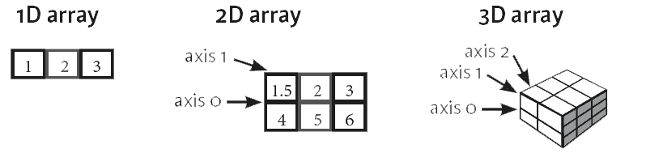
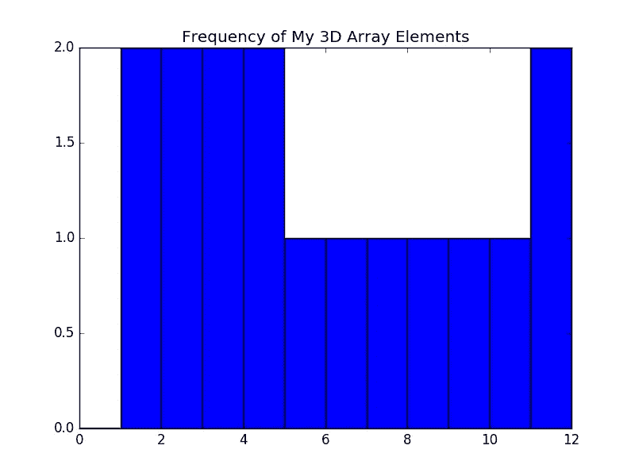
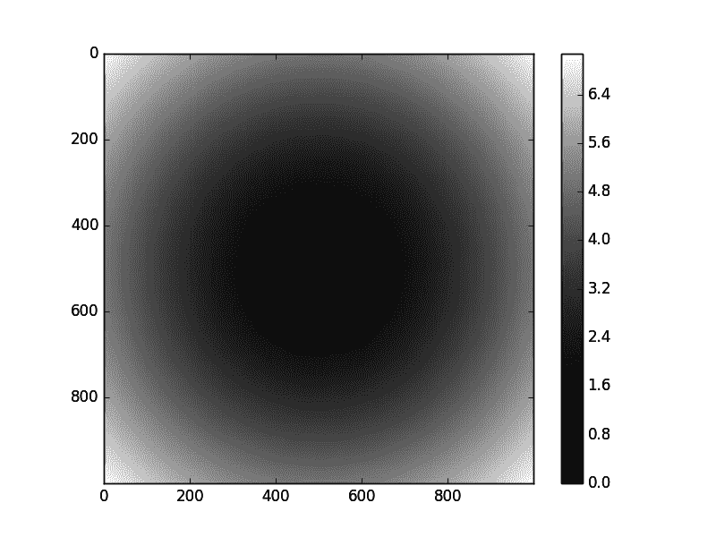

# NumPy 教程:Python 中的数组计算

> 原文：<https://medium.com/hackernoon/numpy-tutorial-array-computing-in-python-fb7321f417ba>

*本文原载于*[*https://www . data camp . com/community/tutorials/python-numpy-tutorial*](https://www.datacamp.com/community/tutorials/python-numpy-tutorial)

NumPy 是，就像 SciPy，Scikit-Learn，Pandas 等。这是你在学习[数据科学](https://hackernoon.com/tagged/data-science)时不可错过的一个包，主要是因为这个库为你提供了一个数组数据结构，它比 Python 列表有一些好处，比如:更紧凑，读写项目更快，更方便，更高效。

这些好处已经在我们的 [18 最常见的 Python 列表问题](https://www.datacamp.com/community/tutorials/18-most-common-python-list-questions-learn-python)博文中描述过了，这篇博文教你如何使用 Python 列表，如何在使用它们时解决一些棘手的问题，以及何时选择其他数据结构，比如 NumPy 数组。

今天的帖子将集中讨论最后一点。本 NumPy 教程不仅将向您展示 NumPy 数组实际上是什么以及如何安装 Python，而且您还将学习如何制作数组(即使您的数据来自文件！)，广播是如何工作的，你如何寻求帮助，如何操纵你的阵列以及如何可视化它们。

如果您想了解更多关于 NumPy 数组和数据科学之旅中需要的其他数据结构的信息？考虑一下 DataCamp 的[数据科学 Python 入门](https://www.datacamp.com/courses/intro-to-python-for-data-science)和[数据科学中级 Python](https://www.datacamp.com/courses/intermediate-python-for-data-science)课程。

## 什么是 NumPy 数组？

您已经在介绍中读到 NumPy 数组有点像 Python 列表，但同时又有很大的不同。对于那些刚接触这个话题的人，让我们来澄清一下它到底是什么，它有什么好处。

顾名思义，NumPy 数组是`numpy`库的中心数据结构。库的名字其实是“数值 Python”或者“数值 Python”的简称。

这已经让你知道你在处理什么了，对吗？

换句话说，NumPy 是一个 Python 库，是 Python 中科学计算的核心库。它包含一组工具和技术，可以用来在计算机上解决科学和工程中的数学模型问题。其中一个工具是高性能多维数组对象，这是一个强大的数据结构，用于高效计算数组和矩阵。为了处理这些数组，需要对这些矩阵和数组进行大量的高级数学运算。

那么，什么是数组呢？

当你看一对数组的打印时，你可以看到它是包含相同类型值的网格。该数组以结构化的方式保存和表示任何常规数据。

然而，你应该知道，在结构层次上，数组基本上就是指针。它是内存地址、数据类型、形状和步幅的组合:

*   `data`指针指示数组中第一个字节的内存地址，
*   数据类型或`dtype`指针描述了数组中包含的元素种类，
*   `shape`表示数组的形状，并且
*   `strides`是为了进入下一个元素，应该在内存中跳过的字节数。如果你的步幅是(10，1)，你需要前进一个字节到达下一列，前进 10 个字节定位下一行。

或者换句话说，数组包含关于原始数据、如何定位元素以及如何解释元素的信息。

理论说够了。让我们自己来看看这个:

您可以通过探索`numpy`数组属性来轻松测试这一点。



在二维数组中，有行和列。行表示为“轴 0”，而列表示为“轴 1”。轴的数量随着维度的数量而相应地增加:在三维数组中，您在前面的代码块中已经看到了一个例子，您将有一个额外的“轴 2”。请注意，这些轴只对至少有 2 维的数组有效，因为 1 维数组没有任何意义；

这些轴将在以后操作 NumPy 数组的形状时派上用场。

## 如何安装 NumPy

在您开始亲自尝试这些 NumPy 数组之前，您首先必须确保您已经在本地安装了它(假设您正在您的 pc 上工作)。如果您已经有了 Python 库，请跳过这一部分:)

如果您仍然需要设置您的环境，您必须知道在您的 pc 上安装 NumPy 有两种主要方式:借助 Python wheels 或 Anaconda Python 发行版。

首先确保你已经安装了 Python。如果你还需要这样做，你可以去[这里](https://www.python.org/downloads/):)

如果您正在使用 Windows，请确保已将 Python 添加到 PATH 环境变量中。然后，不要忘记安装一个包管理器，比如`pip`，它将确保您能够使用 Python 的开源库。

请注意，Python 3 的最新版本附带了 pip，所以请仔细检查您是否有 pip，如果有，请在安装 NumPy 之前升级它:

```
pip install pip --upgrade pip --version
```

接下来，你可以到[这里](http://www.lfd.uci.edu/~gohlke/pythonlibs/#numpy)或者[这里](https://pypi.python.org/pypi/numpy)去拿你的 NumPy 轮。下载后，通过终端导航到 pc 上存储它的文件夹并安装它:

```
install "numpy-1.9.2rc1+mkl-cp34-none-win_amd64.whl" 
import numpy 
numpy.__version__
```

最后两行允许您验证是否已经安装了 NumPy 并检查软件包的版本。

完成这些步骤后，您就可以开始使用 NumPy 了！

要获得 NumPy，您还可以下载 Anaconda Python 发行版。这很简单，可以让你快速上手！如果您还没有下载，请点击[这里](https://www.continuum.io/downloads)下载。按照说明进行安装，您就可以开始了！

你想知道为什么这实际上可能更容易吗？

获得这个 Python 发行版的好处是，您不需要太担心单独安装 NumPy 或您将用于数据分析的任何主要包，如 pandas、scikit-learn 等。

因为，特别是如果你对 Python、编程或终端非常陌生，Anaconda 已经包含了数据科学领域最流行的 Python、R 和 Scala 包中的 [100 个，这真的会让你松一口气。但是对于更有经验的数据科学家来说，如果您想快速开始处理数据科学问题，Anaconda 是一个不错的选择。](https://docs.continuum.io/anaconda/pkg-docs)

更重要的是，Anaconda 还包含了 Jupyter、Spyder 等几个开源开发环境。如果您想在本教程结束后开始使用 Jupyter 笔记本，请转到[本页](https://www.datacamp.com/community/tutorials/tutorial-jupyter-notebook)。

简而言之，考虑下载 Anaconda，开始使用`numpy`和其他与数据科学相关的包！

# 如何创建 NumPy 数组

现在，您已经设置好了环境，是时候开始真正的工作了。不可否认，您已经在上面的 DataCamp Light 块中尝试了一些使用数组的东西。然而，你还没有真正的实践过，因为你首先需要在你自己的电脑上安装 NumPy。既然您已经完成了这些，那么是时候看看您需要做些什么来自己运行上面的代码块了。

下面包括了一些练习，这样你就可以在自己开始之前练习如何做了！

要创建一个`numpy`数组，你可以使用`np.array()`函数。您所需要做的就是向它传递一个列表，也可以指定数据的数据类型。如果你想知道更多关于你可以选择的可能的数据类型，去这里[或者考虑看一下 DataCamp 的](https://docs.scipy.org/doc/numpy/user/basics.types.html) [NumPy 备忘单](https://www.datacamp.com/community/blog/python-numpy-cheat-sheet)。

如果你是一个新用户，没有必要去记忆这些 NumPy 数据类型；但是您必须知道并关心您正在处理的数据。当您需要更好地控制数据在内存和磁盘上的存储方式时，可以使用这些数据类型。尤其是在处理大量数据的情况下，知道如何控制存储类型是很好的。

不要忘记，为了使用`np.array()`函数，您需要确保`numpy`库存在于您的环境中。NumPy 库遵循一个导入惯例:当您导入这个库时，您必须确保您将它作为`np`导入。通过这样做，您将确保其他 python 爱好者更容易理解您的代码。

如果你想知道更多关于如何列清单的信息，请点击[这里](https://www.datacamp.com/community/tutorials/18-most-common-python-list-questions-learn-python)。

然而，有时您不知道要将什么数据放入数组，或者要将数据从另一个源导入到`numpy`数组中。在这些情况下，您将分别利用初始占位符或函数将数据从文本加载到数组中。

下面几节将向您展示如何做到这一点。

## 创建空数组

当人们说他们正在创建“空”数组时，他们通常的意思是他们想利用初始占位符，您可以在以后填充这些占位符。可以用 1 或 0 初始化数组，但也可以用均匀分布的值、常量或随机值填充数组。

然而，你也可以创建一个完全空的数组。

幸运的是，有相当多的函数可以组成数组:

*   对于一些，例如`np.ones()`、`np.random.random()`、`np.empty()`、`np.full()`或`np.zeros()`，为了生成带有 1 或 0 的数组，你唯一需要做的就是传递你想要生成的数组的形状。作为`np.ones()`和`np.zeros()`的选项，您还可以指定数据类型。在使用`np.full()`的情况下，您还必须指定想要插入到数组中的常量值。
*   使用`np.linspace()`和`np.arange()`你可以创建均匀分布的数组。这两个函数的区别在于，上面代码块中传递的三个函数的最后一个值指定了`np.linspace()`的步长值或`np.arange()`的样本数。例如，第一种情况是，您想要一个介于 0 和 2 之间的 9 个值的数组。对于后者，您指定希望数组从 10 开始，每 5 步为您正在创建的数组生成值。

记住 NumPy 还允许你用`np.eye()`和`np.identity()`创建一个单位数组或矩阵。单位矩阵是一个方阵，其主对角线上的所有元素都是 1，其他元素都是 0。当你用一个单位矩阵乘一个矩阵时，给定的矩阵保持不变。

换句话说，如果您将一个矩阵乘以一个单位矩阵，那么根据矩阵乘法的标准约定，所得乘积将再次是同一个矩阵。

尽管本教程的重点不是演示单位矩阵是如何工作的，但可以说，当您开始进行矩阵计算时，单位矩阵是有用的:它们可以简化数学方程，从而使您的计算更加高效和健壮。

借助初始占位符或一些示例数据创建数组是开始使用`numpy`的好方法。但是当您想开始数据分析时，您需要从文本文件中加载数据。

## 将数据从文件加载到数组

以你到目前为止所看到的，你真的不能做太多。利用一些特定的函数从文件中加载数据，例如`loadtxt()`或`genfromtxt()`。

假设您有以下包含数据的文本文件:

```
# This is your data in the text file 
# Value1 Value2 Value3 
# 0.2536 0.1008 0.3857 
# 0.4839 0.4536 0.3561 
# 0.1292 0.6875 0.5929 
# 0.1781 0.3049 0.8928 
# 0.6253 0.3486 0.8791 
# Import your data x, y, z = np.loadtxt('data.txt', skiprows=1, unpack=True)
```

在上面的代码中，您使用`[loadtxt()](https://docs.scipy.org/doc/numpy/reference/generated/numpy.loadtxt.html#numpy.loadtxt)`在您的环境中加载数据。您会看到两个函数的第一个参数是文本文件`data.txt`。接下来，每种方法都有一些特定的参数:在第一条语句中，您跳过第一行，用`unpack=TRUE`将列作为单独的数组返回。这意味着列`Value1`中的值将被放入`x`，依此类推。

请注意，如果您有逗号分隔的数据，或者如果您想要指定数据类型，也可以将参数`delimiter`和`dtype`添加到`loadtxt()`参数中。

这很简单明了，对吗？

让我们看看您的第二个数据文件:

```
# Your data in the text file 
# Value1 Value2 Value3 
# 0.4839 0.4536 0.3561 
# 0.1292 0.6875 MISSING 
# 0.1781 0.3049 0.8928 
# MISSING 0.5801 0.2038 
# 0.5993 0.4357 0.7410 my_array2 = np.genfromtxt('data2.txt', skip_header=1, filling_values=-999)
```

你看这里，你求助于`genfromtxt()`来加载数据。在这种情况下，您必须处理一些由`'MISSING'`字符串指示的缺失值。因为`genfromtxt()`函数将数字列中的字符串转换为`nan`，所以您可以通过指定`filling_values`参数将这些值转换为其他值。在这种情况下，您选择将这些缺失值的值设置为-999。

如果您碰巧有没有被`genfromtxt()`转换成`nan`的值，那么总有一个`missing_values`参数允许您指定数据中丢失的值到底是什么。

但这还不是全部。

**提示**:查看[这一页](https://docs.scipy.org/doc/numpy/reference/generated/numpy.genfromtxt.html#numpy.genfromtxt)，看看你还可以添加哪些片段来成功导入你的数据。

您现在可能想知道这两个函数之间的真正区别是什么。

这些例子暗示了这一点，但是，总的来说，`genfromtxt()`给了你更多的灵活性；比`loadtxt()`更健壮。

让我们把这个区别变得更实际一点:后者，`loadtxt()`，只有当文本文件中的每一行都有相同数量的值时才起作用；因此，当您想轻松处理丢失的值时，您通常会发现使用`genfromtxt()`更容易。

但这绝对不是唯一的原因。

简单看一下`genfromtxt()`必须提供的参数数量，您会发现在您的导入中确实有更多的东西可以指定，比如要读取的最大行数或者从变量中自动去除空格的选项。

## 将数组保存到文件

一旦您完成了所有需要对阵列进行的操作，您还可以将它们保存到文件中。如果你想将数组保存到一个文本文件中，你可以使用`savetxt()`函数来完成:

```
import numpy as np 
x = np.arange(0.0,5.0,1.0) 
np.savetxt('test.out', x, delimiter=',')
```

记住`np.arange()`创建一个等距值的 NumPy 数组。传递给这个函数的第三个值是步长值。

当然，还有其他方法可以将 NumPy 数组保存到文本文件中。如果您想将数据保存到二进制文件或档案中，请查看下表中的函数:

`save()`将数组保存到 NumPy 中的二进制文件。npy 格式`savez()`将几个数组保存成一个未压缩的。npz 存档`savez_compressed()`将几个数组保存成一个压缩的。npz 档案

有关如何使用上述功能保存数据的更多信息或示例，请点击[此处](https://docs.scipy.org/doc/numpy/reference/routines.io.html)或使用 NumPy 提供的帮助功能，立即了解更多信息！

你不确定这些数字帮助功能是什么吗？

别担心！在接下来的一节中，您将了解更多关于它们的内容！

## 检查您的阵列

除了上面提到的数组属性，即`data`、`shape`、`dtype`和`strides`，您还可以使用更多的属性来更容易地了解您的数组。

这些几乎是数组可以拥有的所有属性。

如果在这一点上你没有感觉到它们都对你有用，也不要担心；这很正常，因为正如您在上一节中读到的，当您处理大型数据集时，您只会担心内存问题。

现在您已经创建了您的数组，无论是通过自己用`np.array()`或一个初始占位符函数创建，还是通过`loadtxt()`或`genfromtxt()`函数加载您的数据，现在是时候更仔细地研究真正定义 NumPy 库的第二个关键元素:科学计算。

## 广播是如何工作的？

在深入研究科学计算之前，最好先了解一下广播到底是什么:它是一种机制，允许 NumPy 在执行算术运算时处理不同形状的数组。

在更实际的环境中，你经常会有一个大一点的数组和一个小一点的数组。理想情况下，您希望多次使用较小的数组来执行运算(如求和、乘法等)。)在更大的数组上。

为此，您可以使用广播机制。

但是，如果你想使用它，有一些规则。在你感叹之前，你会发现这些“规则”非常简单明了！

*   首先，为了确保广播成功，阵列的尺寸需要兼容。当两个维度相等时，它们是相容的。
*   当其中一个维度为 1 时，两个维度也是兼容的

注意，如果尺寸不兼容，你会得到一个`ValueError`。

提示:在完成计算后，还要测试结果数组的大小！您将看到大小实际上是沿着输入数组的每个维度的最大大小。

*   最后，只有在所有维度都兼容的情况下，阵列才能一起广播。

简而言之，如果你想利用广播，你将很大程度上依赖于你所工作的阵列的形状和尺寸。

但是如果维度不兼容呢？

如果它们不相等或者其中一个不等于 1 呢？

你必须通过操纵你的数组来解决这个问题！您将在下一节中看到如何做到这一点。

## 如何做数组数学

您已经看到，当您进行算术运算时，广播非常方便。在这一节中，您将发现一些可以用来对数组进行数学运算的函数。

因此，您可能不会感到惊讶，您可以使用`+`、`-`、`*`、`/`或`%`来加、减、乘、除或计算两个(或更多)数组的余数。然而，NumPy 如此方便的很大一部分原因是因为它也有这样的功能。你刚才看到的操作的等价函数分别是`np.add()`、`np.subtract()`、`np.multiply()`、`np.divide()`和`np.remainder()`。

你也可以很容易地用`np.exp()`和`np.sqrt()`计算你的数组的指数和平方根，或者用`np.sin()`和`np.cos()`计算你的数组的正弦或余弦。最后，值得一提的是，还有一种方法可以让你用`np.log()`计算自然对数，或者通过对你的数组应用`dot()`来计算点积。

但是还有更多。

点击查看这个聚合函数的小列表[。](https://www.datacamp.com/community/tutorials/python-numpy-tutorial)

除了所有这些函数之外，您可能还会发现，了解一些允许您比较数组元素的机制是很有用的。例如，如果您想检查两个数组的元素是否相同，您可以使用`==`操作符。要检查数组元素是变小了还是变大了，可以使用`<`或`>`操作符。

这看起来很简单，是吗？

然而，你也可以比较整个数组！在这种情况下，您使用`np.array_equal()`功能。只需传入两个你想相互比较的数组，就大功告成了。

请注意，除了比较之外，您还可以对阵列执行逻辑运算。可以从`np.logical_or()`、`np.logical_not()`、`np.logical_and()`开始。这基本上类似于典型的 OR、NOT 和 and 逻辑运算；

在最简单的例子中，您使用 OR 来查看您的元素是否相同(例如，1)，或者两个数组元素之一是否为 1。如果两者都是 0，你就返回`FALSE`。您可以使用 AND 来查看第二个元素是否也是 1，而不是查看第二个元素是否与 1 不同。

## 子集化、切片和索引

除了数学运算，您还可以考虑只取原始数组(或结果数组)的一部分，或者只取一些数组元素用于进一步的分析或其他运算。在这种情况下，您需要对阵列进行子集划分、切片和/或索引。

这些操作与在 Python 列表上执行这些操作非常相似。如果你想自己找出相似之处，或者想要更详细的解释，你可以考虑看看 DataCamp 的 [Python 列表教程](https://www.datacamp.com/community/tutorials/18-most-common-python-list-questions-learn-python)。

如果您对这些操作是如何工作的毫无头绪，那么现在知道这两个基本的事情就足够了:

*   您使用方括号`[]`作为索引操作符，并且
*   通常，您将整数传递给这些方括号，但是您也可以放一个冒号`:`或冒号与整数的组合来指定您想要选择的元素/行/列。

除了这两点之外，了解这一切是如何结合在一起的最简单的方法是看一些子集化的例子。这里可以找到一些[。](https://www.datacamp.com/community/tutorials/python-numpy-tutorial)

比子集化稍微高级一点的东西，如果你愿意，是切片。在这里，您不仅要考虑数组的特定值，还要考虑行和列的级别。您基本上是在处理数据的“区域”，而不是纯粹的“位置”。

你会发现，从本质上来说，以下情况成立:

```
a[start:end] # items start through the end (but the end is not included!)
a[start:] # items start through the rest of the array 
a[:end] # items from the beginning through the end (but the end is not included!)
```

最后，还有索引。说到 NumPy，有布尔索引和高级或“花式”索引。

*(以防你好奇，这是真的 NumPy 行话，最后一个不是我编的！)*

首先是布尔索引。这里，不是根据索引号选择元素、行或列，而是从满足特定条件的数组中选择那些值。

注意，为了指定一个条件，您还可以使用逻辑操作符`|` (OR)和`&` (AND)。如果你想以这样一种方式重写上面的条件(这将是低效的，但我在这里展示它是出于教育目的:)，你将得到`bigger_than_3 = (my_3d_array > 3) | (my_3d_array == 3)`。

对于已经加载的数组，没有太多的可能性，但是对于包含名称或大写字母的数组，可能性是无限的！

说到有趣的索引，你基本上是这样做的:你传递一个整数列表或数组来指定你想从原始数组中选择的行子集的顺序。

你觉得这听起来有点抽象吗？在这里进行一些练习。

## 寻求帮助

作为一个简短的插曲，你应该知道你可以随时询问关于你正在使用的模块、函数或类的更多信息，特别是因为当你第一次开始使用 NumPy 时，它可能是相当了不起的。

寻求帮助相当容易。

您只需利用`numpy`提供的特定帮助功能，就可以上路了:

*   使用`lookfor()`对文档字符串进行关键字搜索。如果你刚刚开始，这特别方便，因为它背后的“理论”可能会在你的记忆中消失。一个缺点是，如果您的查询不是那么具体，您必须浏览所有的搜索结果，正如下面的代码示例中的情况。这可能会让你更难看到它。
*   使用`info()`获得函数、类或模块的快速解释和代码示例。如果你是一个在实践中学习的人，这就是你要走的路！使用这个函数的唯一缺点可能是您需要知道某些属性或函数所在的模块。如果您不知道这是什么意思，请查看下面的代码示例。

注意，你确实需要知道`dtype`是`ndarray`的一个属性。此外，确保您不要忘记在您要查询信息的模块、类或术语前面加上`np`,否则您将得到如下错误消息:

```
Traceback (most recent call last): File "<stdin>", line 1, in <module> NameError: name 'ndarray' is not defined
```

你现在知道如何寻求帮助，这是一件好事。本 NumPy 教程的下一个主题是数组操作。

并不是说你自己不能克服这个话题，恰恰相反！

但是有些函数可能会产生问题，因为调整大小和整形之间有什么区别？

水平和垂直堆叠阵列有什么区别？

下一节将回答这些问题，但是如果您有疑问，请随意使用您刚刚看到的帮助功能来快速上手。

## 数组操作

在你的数组上执行数学运算是你要做的事情之一，但可能最重要的是让这个和广播工作知道如何操作你的数组。

以下是你将会做的一些最常见的操作。

置换数组实际上是改变它的维数。换句话说，你可以改变数组的形状。

**提示**:如果数组和它的转置版本之间的视觉比较不完全清楚，请检查两个数组的形状，以确保您理解了为什么维度被置换。

注意有两个转置函数。两者做的一样；没有太大区别。你必须考虑到`T`看起来更像是一个方便的功能，而且你可以更加灵活地使用`np.transpose()`。这就是为什么如果你想要更多的参数，建议使用这个函数。

当你转置一维以上的数组时，一切都很好，但是当你只有一维数组时会发生什么呢？你觉得会有什么影响吗？

提示:在这里尝试一下。

## 调整数组大小与改变数组形状

您可能在广播部分读到过，如果您希望数组成为算术运算的良好候选，那么数组的维数需要兼容。但是当情况不是这样的时候，你应该怎么做，这个问题还没有答案。

嗯，这就是你得到答案的地方！

如果数组没有相同的维数，你能做的就是调整数组的大小。然后，您将返回一个新数组，该数组具有您传递给`np.resize()`函数的形状。如果您将原始数组与新维度一起传递，并且如果新数组大于原始数组，则新数组将被原始数组的副本填充，这些副本将根据需要重复多次。

但是，如果您只是将`np.resize()`应用于数组，并将新的形状传递给它，那么新的数组将被填充零。

除了调整大小，你还可以重塑你的数组。这意味着你给一个数组一个新的形状而不改变它的数据。整形的关键是确保新数组的总大小不变。如果你以上面使用的数组`x`为例，它的大小是 3 X 4 或者 12，你必须确保新数组的大小也是 12。

Psst…如果你想用代码计算数组的大小，确保使用`size`属性:`x.size.`

如果所有这些都失败了，您还可以将一个数组附加到原始数组，或者插入或删除数组元素，以确保您的维数与您要用于计算的另一个数组相匹配。

当你改变数组的形状时，另一个操作是`ravel()`。这个函数允许你展平你的数组。这意味着，如果你有 2D，3D 或 n-D 数组，你可以使用这个函数把它们展平成 1-D 数组。

很方便，不是吗？

## 如何应用数组

当您将数组追加到原始数组时，它们会“粘附”到原始数组的末尾。如果你想确保你添加的内容不会出现在数组的末尾，你可以考虑插入它。如果您想了解更多信息，请进入下一部分。

多亏了 NumPy 库，追加是一件非常容易的事情；你可以只使用`np.append()`。

除了追加之外，还可以插入和删除数组元素。您可能已经猜到了，允许您执行这些操作的函数是`np.insert()`和`np.delete().`

## 如何堆叠和拆分数组？

您还可以“合并”或加入您的阵列。有许多函数可以用于这个目的，下面列出了其中的大部分。

在使用这些函数时，您会注意到一些事情:

*   如果想用`np.concatenate()`连接两个数组，维数需要相同。因此，如果你想用一维的`my_array`连接一个数组，你需要确保你的第二个数组也是一维的。
*   有了`np.vstack()`，你可以毫不费力地把`my_array`和`my_2d_array`结合起来。你只需要确保，当你按行堆叠数组时，两个数组中的列数是相同的。因此，您也可以添加一个形状为`(2,4)`或`(3,4)`到`my_2d_array`的数组，只要列数匹配。换句话说，除了第一个轴之外，阵列必须具有相同的形状。当你想使用`np.r[]`时也是如此。
*   对于`np.hstack()`，你必须确保维数相同，并且两个数组中的行数相同。这意味着你可以堆叠像`(2,3)`或者`(2,4)`到`my_2d_array`这样的数组，它们本身就是`(2,4)`的一种形式。只要确保行数匹配，一切皆有可能。这个功能 NumPy 还是支持的，不过你应该更喜欢`np.concatenate()`或者`np.stack()`。
*   使用`np.column_stack()`，您必须确保您输入的数组具有相同的第一维度。在这种情况下，两种形状是相同的，但是如果`my_resized_array`是`(2,1)`或`(2,)`，数组仍然是堆叠的。
*   `np.c_[]`是串联的另一种方式。这里，两个数组的第一维也需要匹配。

当您加入数组时，您可能还想在某个时候拆分它们。就像你可以水平堆叠它们一样，你也可以垂直堆叠它们。你分别用`np.hsplit()`和`np.vsplit()`。

当你使用这两个分裂函数时，你需要记住的是你的数组的形状。

最后，一定会派上用场的是知道如何绘制数组。这在数据探索中尤其方便，但在数据科学工作流的后期阶段，当您想要可视化您的阵列时也是如此。

## 如何绘制数组

与函数所暗示的相反，`np.histogram()`函数并不绘制直方图，但是它会计算数组在每个区间内的出现次数；这将决定直方图中每一条所占的面积。

传递给`np.histogram()`函数的首先是输入数据或者你正在处理的数组。计算直方图时，数组将变平。

结果，您将看到直方图将被计算出来:第一个数组列出了数组中所有元素的频率，而第二个数组列出了如果您不指定任何仓，将会使用的仓。

如果你指定了一些容器，计算的结果将会不同:浮点数将会消失，你将会看到所有容器的整数。

您还可以指定一些其他参数，这些参数会影响直方图的计算。你可以在这里找到所有的。

但是如果不能可视化，计算这样的直方图又有什么意义呢？

借助 Matplotlib，可视化是小菜一碟，但你不需要`np.histogram()`来计算直方图。`plt.hist()`当您将(展平的)数据和 bin 传递给它时，它会自动执行此操作:

```
# Import numpy and matplotlib 
import numpy as np 
import matplotlib.pyplot as plt # Construct the histogram with a flattened 3d array and a range of bins 
plt.hist(my_3d_array.ravel(), bins=range(0,13)) # Add a title to the plot 
plt.title('Frequency of My 3D Array Elements') # Show the plot 
plt.show()
```

上面的代码将为您提供以下(基本)直方图:



另一种(间接)可视化你的数组的方法是使用`np.meshgrid()`。数组面临的问题是，你需要 x 和 y 坐标值的二维数组。使用上面的函数，您可以用一个 x 值数组和一个 y 值数组创建一个矩形网格:`np.meshgrid()`函数采用两个 1D 数组，并生成两个 2D 矩阵，对应于这两个数组中的所有(x，y)对。然后，你可以用这些矩阵做出各种各样的图。

如果您想在网格上计算函数，那么`np.meshgrid()`特别有用，如下面的代码所示:

```
# Import NumPy and Matplotlib 
import numpy as np import 
matplotlib.pyplot as plt # Create an array 
points = np.arange(-5, 5, 0.01) # Make a meshgrid 
xs, ys = np.meshgrid(points, points) 
z = np.sqrt(xs ** 2 + ys ** 2)# Display the image on the axes 
plt.imshow(z, cmap=plt.cm.gray) # Draw a color bar 
plt.colorbar() # Show the plot 
plt.show()
```

上面的代码给出了以下结果:



## 使用 Python 进行数据分析:续

恭喜你，你已经到达 NumPy 教程的结尾！

你已经涉及了很多领域，所以现在你必须确保记住你所获得的知识。别忘了拿你的 DataCamp 的 NumPy 备忘单来帮助你做这件事！

在所有这些理论之后，是时候用你在本教程中学到的概念和技术进行更多的实践了。一种方法是回到 [scikit-learn 教程](https://www.datacamp.com/community/tutorials/machine-learning-python)并开始进一步试验用于构建[机器学习](https://hackernoon.com/tagged/machine-learning)模型的数据阵列。

如果这不是你喜欢的，请再次检查你是否下载了 Anaconda。然后，通过这本[Jupyter 笔记本权威指南](https://www.datacamp.com/community/tutorials/tutorial-jupyter-notebook)，开始使用 Jupyter 中的 NumPy 数组。此外，请务必查看这个 Jupyter 笔记本，它还会在 Jupyter 笔记本的交互式数据科学环境中指导您使用 Python 和 NumPy 以及其他一些库进行数据分析。

最后，考虑一下 DataCamp 关于数据操作和可视化的课程。尤其是我们与 Continuum Analytics 合作的最新课程肯定会让您感兴趣！看看[用熊猫操纵数据框](https://www.datacamp.com/courses/manipulating-dataframes-with-pandas)或[熊猫基础](https://www.datacamp.com/courses/pandas-foundations)课程。

*原载于*[*www.datacamp.com*](http://www.datacamp.com/community/tutorials/python-numpy-tutorial)*。*

[](http://bit.ly/HackernoonFB)[](https://goo.gl/k7XYbx)[](https://goo.gl/4ofytp)

> 黑客中午是黑客如何开始他们的下午。我们是这个家庭的一员。我们现在[接受投稿](http://bit.ly/hackernoonsubmission)并乐意[讨论广告&赞助](mailto:partners@amipublications.com)机会。
> 
> 如果你喜欢这个故事，我们推荐你阅读我们的[最新科技故事](http://bit.ly/hackernoonlatestt)和[趋势科技故事](https://hackernoon.com/trending)。直到下一次，不要把世界的现实想当然！

