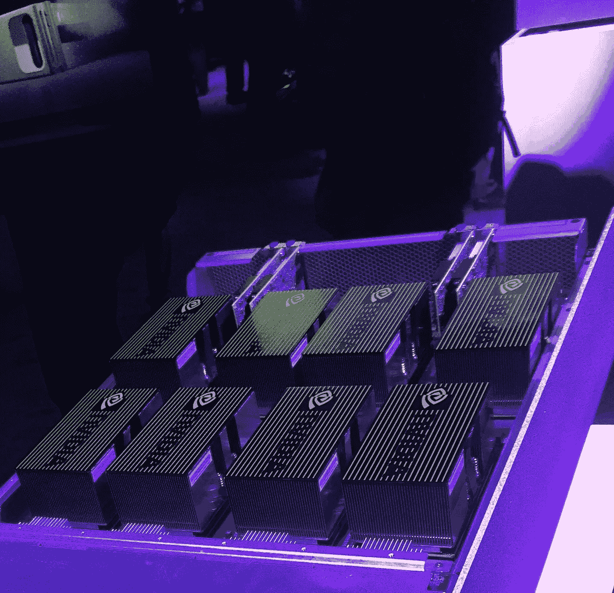
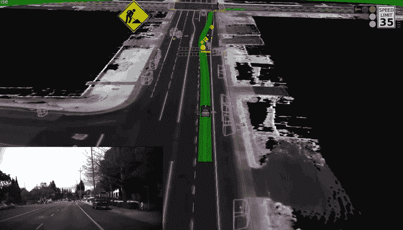
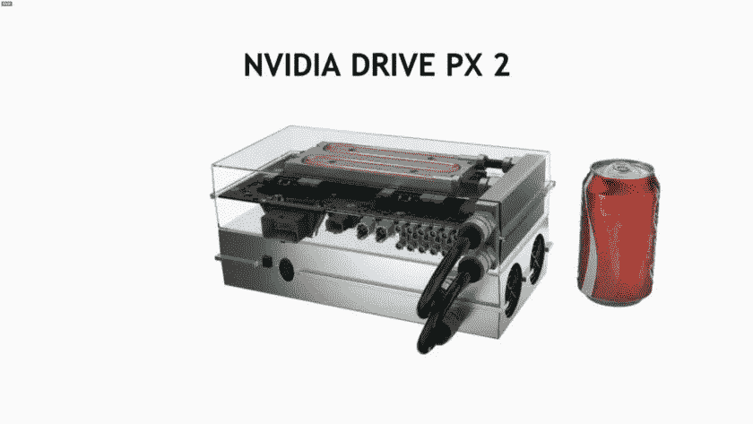
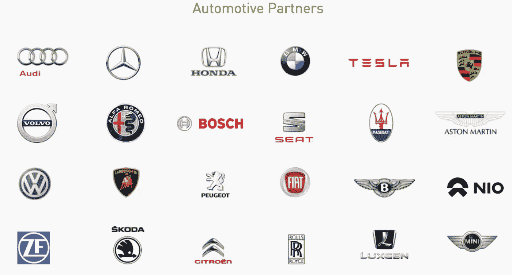
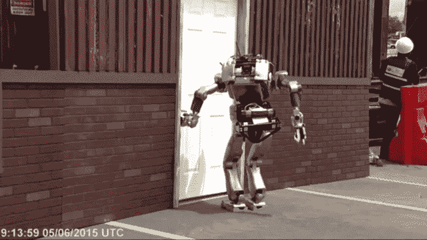
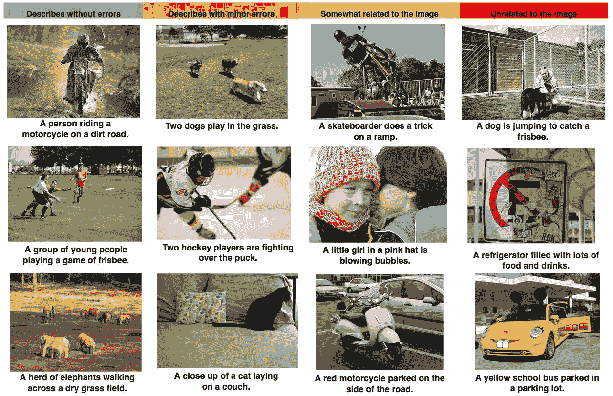
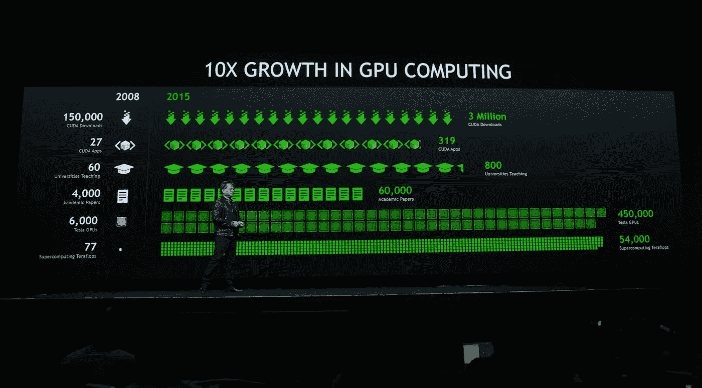

# 英伟达和即将到来的人工智能时代

> 原文：<https://medium.com/hackernoon/nvidia-and-the-coming-ai-age-b48a0087757b>

英伟达发现自己处于一个巨大价值市场的轴心，这个市场对人工智能和思维机器的需求不断增长。如果你看过《终结者》这部电影，还记得天网的创造者 Cyberdyne Systems 公司，你会记得他们正在制造一种能让计算机思考的新芯片。NVIDIA (@nvidia)是今天最接近虚构的 Cyberdyne 的东西。

在过去，唯一了解英伟达的人是一小群依赖英伟达显卡和芯片的游戏玩家和开发者。今天，英伟达的股价达到了新高，因为汽车公司、医疗成像公司和机器人公司的每个人都无法从这家公司提供的芯片和服务中获得足够的价值。我最近在该公司的年会上花了一些时间。

似乎英伟达在正确的时间出现在了正确的地点；一场人工智能革命正在进行，一个需要人工智能工具的市场已经成熟，英伟达在那里利用它。他们只用了 25 年就一夜成名，并且将 IBM 认知业务和 AMD 甩在了身后。和所有公司一样，是运气、时机和努力的综合作用让这家公司走到了今天。如今，英伟达有望成为全球不断增长的人工智能、机器学习和机器人行业最重要的镐和铲供应商之一。今天的计算正在快速变化，不考虑人工智能将如何以某种形式改变他们的业务的公司将有被落在后面的风险。

在看 AI 和 ML(机器学习)将要改变的行业之前，我们需要了解英伟达是如何支撑这个新行业的。英伟达主要生产的芯片是 GPU(通用处理器)。GPU 或图形处理单元主要用于 3d 应用。它是一个单芯片处理器，可以在每次重绘 3D 场景时创建灯光效果并转换对象。这些都是数学密集型任务，否则会给 CPU 带来相当大的压力。
GPU 加速计算是使用图形处理单元(GPU)和 CPU 来加速深度学习和人工智能应用。GPU 加速计算将应用的计算密集型部分卸载到 GPU，而其余代码仍在 CPU 上运行。从用户的角度来看，应用程序运行得更快了。

碰巧的是，这种芯片对于最新的 AI 和 ML 应用极其重要。

让我们来看看今天依赖 GPU 计算的几个行业。

**自动驾驶汽车**

Courtesy of Google (Waymo)

自动驾驶汽车需要“看到”周围的世界，并实时做出判断。为了做到这一点，他们需要进行极快的计算来判断速度、距离，并准确预测其他道路使用者的行为。除此之外，GPU 还必须收集从各种传感器收集的数百万个数据点来创建图像，然后使用这些信息来了解前方的道路。这是一项非常困难的计算密集型任务，几年前这在汽车上是不可能的，除非那辆汽车拖着传统服务器的机架。如今，节能芯片可以在几罐可乐大小的卡上运行极快的计算。

NVIDIA (@nvidiadrive)几乎与所有主要汽车制造商都有交易，提供芯片、算法和许多其他相关产品和服务。

汽车公司开始意识到，除非他们让汽车变得更智能，从最简单的(如自动巡航控制)到最复杂的(自动驾驶)功能，否则他们将输给竞争对手。汽车公司唯一转向的公司是英伟达。当谈到这个市场时，IBM 和 AMD 正在被击败。如果你曾经驾驶过特斯拉([特斯拉汽车](https://medium.com/u/24413768aadb?source=post_page-----b48a0087757b--------------------------------))并尝试过自动驾驶，你就会明白计算机能够“自己看和思考”是多么重要。

**机器人**

Not all robots are stupid

训练机器人很难。正如我们在上面看到的，并不是所有的机器人都能承受日常工作的压力，比如开门。然而，今天的大多数机器人执行非常常规、重复的任务，如焊接、检查、测量和其他工业工作。随着机器人变得越来越普遍，它们将不得不执行更复杂的程序，并与人类并肩工作。同样，NVIDIA 芯片将变得越来越有用，因为这些机器人需要能够感知周围世界的更多信息，变得更加智能。和人类一样，获得技能的唯一途径是实践。我们人类从小就知道如何练习技能，比如学会踢球或者开瓶。我们学着去做，但不是没有大量的尝试和错误。对机器人来说也是一样，但是这些机器非常昂贵和复杂，它们不会擦伤，而且在大多数情况下，它们不能自己爬起来。除此之外，他们不能在人类周围训练，因为他们可能会伤害或杀死附近的人。NVIDIA 已经认识到教授机器人的必要性，并建立了一个名为 Isaac 的机器人模拟器，这是一个模拟环境，使用算法和计算机模型来训练机器人随着时间的推移执行任务。想要一个更好的解释，请听听黄仁勋在他们最近的会议上的讨论。

**图像&语音识别**

越来越多的设备进入我们的家庭和办公室，使用语音和图像识别，并根据它采取行动。苹果是第一个通过 Siri 将语音识别纳入主流的公司，现在我们看到亚马逊通过 Echo 系列在人工智能和语音识别方面投入巨资。要了解他们对这个市场有多认真，可以看看他们的招聘页面:987 个为拥有语言科学家、机器学习和人工智能等技能的人开放的职位。

For more details go to [Alexa Machine Learning](https://www.amazon.jobs/en/teams/alexa-machine-learning)

同样，语音识别依赖于 GPU 处理，因为大多数语音查询都是在非最佳情况下完成的(嘈杂的背景、口音和推断的语言)。像亚马逊这样的聪明公司明白，语音将成为未来输入计算机命令的标准之一，而不是依赖笨拙的手指。

**图像识别**

Google gets it right and wrong…

图像识别是另一个依赖 GPU 计算的领域，并且已经在许多领域取得了进展。如果你没有用过 Google 相册，你应该试试。不过，要注意的是，谷歌希望你免费上传一生的照片的原因是，他们可以从每张照片中了解你很多。谷歌今天可能不会将此用于广告目的，但将来可能会这样做。谷歌使用图像识别对成千上万的图像进行分类、识别和排序，从中找到任何东西都非常简单。只需简单地搜索“婚礼”和“猫”，你就会找到关于这些类别的所有信息，以及元数据，如 GPS 位置、时间、日期和照片中的其他人，如果你以前在照片中标记过这些人的话。(面部标签在欧洲被禁用是有原因的)

另一家公司 Blippar.com(@ blippar)在一款应用程序中使用了神经网络、机器学习和视觉识别。当你将手机摄像头对准某个物体时，它会立即识别出这个物体是什么，并为你提供更多相关信息。今天，汽车公司使用它来帮助你获得新车型内饰的 360 度视图，只需在杂志上看到的汽车广告上使用该应用程序。然而，该应用程序也能够识别某些名人的面孔。你可以想象，这种技术对于扫描大量人群和搜寻通缉犯非常有用。它也可以适用于眼镜，这样用户就可以从公开的 LinkedIn 或脸书照片上认出街上的每个人。图像识别技术的另一个有趣的用途来自一家以色列公司(UVeye.com)。他们使用光学识别扫描车辆底部，以搜索损坏或不应该在那里的物体，这一切都在几毫秒内，当一辆汽车通过嵌入在道路上的摄像头时。

显然，这带来了许多关于隐私、安全和政府入侵的问题，但那是另一篇博客的事了。在获得非常有用的服务和让更多的公司进入我们的私人生活以提供这样的服务之间有一个权衡。

有一点是肯定的，NVIDIA 正在走向成功，并且正在提供驱动未来的芯片。这家公司才刚刚起步。

Onward and upward.

> [黑客中午](http://bit.ly/Hackernoon)是黑客如何开始他们的下午。我们是 [@AMI](http://bit.ly/atAMIatAMI) 家庭的一员。我们现在[接受投稿](http://bit.ly/hackernoonsubmission)，并乐意[讨论广告&赞助](mailto:partners@amipublications.com)机会。
> 
> 如果你喜欢这个故事，我们推荐你阅读我们的[最新科技故事](http://bit.ly/hackernoonlatestt)和[趋势科技故事](https://hackernoon.com/trending)。直到下一次，不要把世界的现实想当然！

