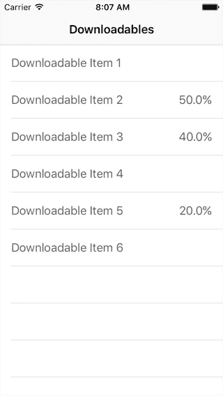
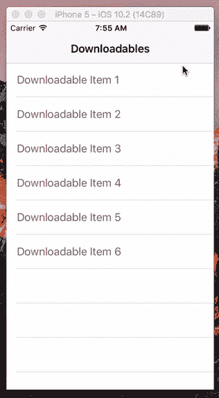

# 带有信号的 Swift 上的观测器模式

> 原文：<https://medium.com/hackernoon/observer-pattern-on-swift-with-signals-4699168e57ec>

## 一个为你的 iOS 项目设计的附加和遗忘库


# 观察者模式

观察者模式(有时也称为通知、广播-监听器或发布-订阅模式)是 OOP 语言中常见的一种通信方式，很像委托(在父子关系中很有用)和块(在并发/异步任务中很有用)。其概念是使对象能够“倾听”或“观察”来自相对不相关来源的数据。

思考:无线电广播。模拟信号源只是在广播中播放，不管是否有任何东西在听。接收器只是倾听，不管信号是否真的在发送。在选择这种数据通信模式时，也要考虑同样的关系。

# 信号库

我在寻找实现观察者模式的替代方法时偶然发现了这个令人敬畏的[库](https://github.com/artman/Signals)。我特别喜欢这个，因为它实现简单。基本上是这样的:

*   创建**信号对象**。
*   **发出物体信号的火**。
*   **在项目中的任何地方订阅**该信号对象。

## **创建信号对象**

初始化一个信号对象，并将广播“消息”的数据类型作为其参数

```
let onData = Signal<(data:NSData, error:NSError)>()
let onProgress = Signal<Float>()
```

## **发出物体信号的*火***

只需在信号对象上调用***fire(_ data:T)***方法，它就会将您的数据广播给它的所有订户。

```
func receivedData(receivedData:NSData, receivedError:NSError) {
    // Whenever appropriate, fire off any of the signals
    self.onProgress.fire(1.0)
    self.onData.fire((data:receivedData, error:receivedError))
}
```

## ***订阅*** 该信号对象

订阅信号以数据作为参数结束。每当数据被激发时都会调用它。

```
onProgress.subscribe(on: self) { (progress) in
    print("Loading progress: \(progress*100)%")
}onData.subscribe(on: self) { (data, error) in
    // Do something with the data
}
```

“附加并遗忘”的用法也很酷，因为它消除了观察对象生命周期的麻烦——避免了由于未绑定的侦听器绑定而导致的内存泄漏。如果您想了解更多关于信号库的信息，请点击此 [github 链接](https://github.com/artman/Signals)获取其官方文档。

# 练习:模拟下载器应用程序

在这个简短的教程中，让我用一个虚拟的“文件下载器”应用程序来演示这个库和[编程](https://hackernoon.com/tagged/programming)模式的使用。这个应用程序应该像下载管理器一样运行。核心数据和异步[网络](https://hackernoon.com/tagged/network)任务本身就是巨大的话题，所以我们将跳过它们，实现一个虚拟的下载任务。我们会让他们向任何你需要的听众广播他们正在进行的任务。



Our target is literally this simple.

为了省去创建表格视图、单元格和数据源的麻烦，我创建了一个启动项目，你可以从这里下载。

## 1.项目概述

好了，这是我们模板项目的一个快速概述。我们将实现一个轻量级的 MVP-MVVM 设计，所以期待常见的疑点(视图、模型、演示者、交互者等)。这里我们有一个简单的 **DownloadViewController** :

简单明了。它包含我们的 tableView(通过 interface builder 插入)及其 datasource 和 delegate 方法。

它包含一组两个模型，一个**可下载项目**的数组和一个**可下载任务**的字典。这两个会自动插入到我们的 tableViewCells 中，以显示我们的下载对象的名称和下载状态(如果当前正在下载的话)。

ViewController 还遵循一个 **PresenterDelegate** 协议，该协议允许我们从我们的演示者那里接收数据。

我们的**展示者**在这里保存了视图之外的所有逻辑，实际上成为了我们的屏幕/场景/页面的逻辑标识。

Presenter 有三个对象来履行其职责，分别是**可以获取的对象**、**可以下载的对象**和**可以广播的任务**。

当然，对于我们的虚拟应用程序，所有这些都将由虚拟类来实现。

**CanFetchItems** 将由 ItemStore 保存，item store 提供一个静态生成的对象数组。

CanDownloadItems 将由一个具有伪 requestDownload(item:)方法的类来实现。

目前这将由我们的 **DownloadManager** 持有，它将通过创建一个 **DownloadTask** 来模拟下载请求——一个可以持有项目下载进度的对象。

CanBroadcastTasks 将由一个持有信号对象的类来完成，特别是一个广播下载任务字典的类。

在我们的例子中，这将(再次)由我们的 DownloadManager 持有，因为这个类将是启动下载和管理它们的任务队列的类。

还跟着？:D 现在让我们开始编码。

## 2.启动下载任务

首先，我们将编辑我们的 DownloadManager 的 requestDownload(item:)方法:

我们将从该项创建一个 DownloadTask，并给它一个初始进度值。

为了异步增加下载进度的值，我们将使用一个定时器调度函数，每 1/4 秒调用一次。这将使用每个增量更新我们当前的任务队列，并在任务完成时删除它。

## 3.广播任务

仍然在我们的 DownloadManager 中，我们将覆盖 init()方法来再次启动一个计时器计划，然后它将连续广播我们的任务队列。

我们将自动播放，这样就不会有太多的电话骚扰我们的听众。每当有更新时，我们的广播将是一致的，而不是自动触发。

## 4.听广播

现在我们已经设置好了我们的广播员，让我们回到我们的演讲者那里开始听。

在我们的演示者的 viewDidLoad()中，添加 subscribe 方法，以便我们可以在视图加载后立即开始监听。将回叫返回的*任务*传递给你的演示者的*任务*。然后它将被传递给你的视图的*任务*，并随后呈现给你的用户。一切都以某种被动的方式发生。

现在运行代码，您应该能够得到如下结果:



没跑？在这里拿一份最终项目[的拷贝，看看你是否做对了。](https://github.com/raymundcat/SignalsTutorialComplete)

## 下一步是什么？

好吧。现在您已经有了一个工作模式实现，通过添加另一个 ViewController 和 Presenter 来尝试拥有更多的观察者。这一次，用一个表格视图，试着只显示所有正在工作的下载任务

## **玩得开心！**

# **在你变得太舒服之前..**

**关于这个主题的一些评论:观察者模式是一个很好的选择，可以避免很多复杂的关系(比如太多的委托和回调)。还是可以滥用的。这里有一些**不要在广播你的对象时记住的**:**

## **1.无意义的过度广播更新**

**我想我们可以说垃圾邮件是这种模式的一部分。不过，要注意实现的可伸缩性，以及您是在有限的硬件上运行的这一事实。**

**在我们的示例中，我将广播调用放在实际的项目更新方法之外，放在一个专用的计时器中。当你有数百个正在进行的下载时，这意味着你将每秒广播数百或数千个下载进度。**

**这可能会由于对视图不必要的更新调用而阻塞主线程，并极大地损害应用程序的可用性。实施该设计时，**尽量保持必要的最小速度**。**

## **2.为了方便而破坏你的架构**

**很诱人。你可以直接收听来自你的视图层的广播，通过你的演示者，因为你可以。这样，你就可以在演示者不知情的情况下更新你的视图。**

**但是如果我们这样做，我们将违背 MVP 的概念。我们的视图开始管理自己的业务模型，我们的演示者开始失去对视图的控制。如果演示者收到更新，它不能确定它的数据是否与视图上显示的一致。**

**当集成这种模式时，要注意你的架构标准，不要让便利凌驾于你自己的规则之上。**

# **你大老远跑来了！**

> **我希望当你打开这篇文章的时候，你已经得到了你想要的东西。如果是这样，如果你能把这个推荐给你的朋友^^，我将非常感激**

**如果您还有任何问题/反馈，请随时留言！**

**[](http://bit.ly/HackernoonFB)****[](https://goo.gl/k7XYbx)****[](https://goo.gl/4ofytp)**

> **[黑客中午](http://bit.ly/Hackernoon)是黑客如何开始他们的下午。我们是 [@AMI](http://bit.ly/atAMIatAMI) 家庭的一员。我们现在[接受投稿](http://bit.ly/hackernoonsubmission)并乐意[讨论广告&赞助](mailto:partners@amipublications.com)机会。**
> 
> **如果你喜欢这个故事，我们推荐你阅读我们的[最新科技故事](http://bit.ly/hackernoonlatestt)和[趋势科技故事](https://hackernoon.com/trending)。直到下一次，不要把世界的现实想当然！**

****