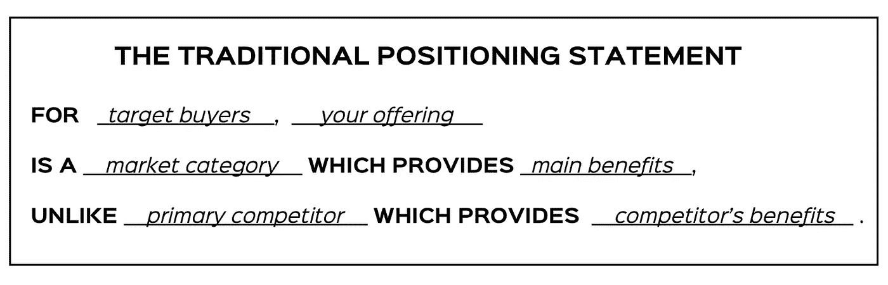
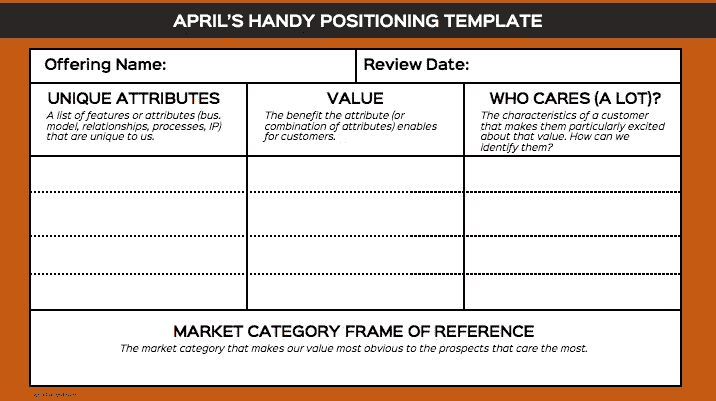
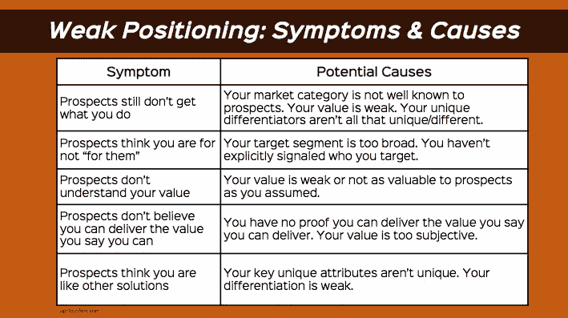

# 显然很棒:产品定位练习

> 原文：<https://medium.com/hackernoon/obviously-awesome-a-product-positioning-exercise-604e8ced841e>

向下滚动寻找模板——但我建议你在尝试使用它之前先阅读这篇文章。

我曾在六家成功的[初创公司](https://hackernoon.com/tagged/startups)担任过[营销](https://hackernoon.com/tagged/marketing)主管，也曾为另外几十家公司做过顾问和咨询。我也和一些大型跨国公司合作过。如果你让我指出我看到的最常见的问题，我的答案会是一样的，不管公司的规模有多大。我工作过的每一家公司都努力让自己的卓越显而易见。

我见过创业公司的创始人，在一个项目上工作了几个星期后，对“那么，你和 XYZ 公司有什么不同？”。我见过大公司的团队开发出真正创新的新产品，但当客户无法理解它们的价值时，他们就失败了。我经常看到，公司创造出重要的、改变世界的、卓越的、令人敬畏的产品，而客户却完全看不到这些产品的任何有趣之处。

# 刻意的定位将你的优势放在最前面和最中心

我们产品的独特之处常常让公司内部的人感觉很明显。对于“客户为什么要选择我们？”这个问题，我们有现成的答案然而，如果我们问客户同样的问题，他们通常会发现我们提供的产品和其他公司提供的产品之间的差异很难理解。出现这个问题是因为我们没有把我们的独特优势放在我们定位的中心。相反，我们将自己定位在我们开始的市场，即使我们的产品已经发展得远远超出了这个范围。 ***我们未能积极地、有意识地围绕我们的优势定位我们的产品，而是退回到“默认”或“现状”的立场，这无助于帮助客户理解我们的与众不同之处。***

***这里有一个简单的例子。*** 在我职业生涯的早期，我加入了一家由数据库专家团队创立的初创公司。他们建立了一个创新的数据库，一个可以快速分析大量数据的数据库，只需普通数据库的一小部分时间。有趣的是，当我们试图销售解决方案时，大多数人甚至不愿与我们会面。“我们不需要数据库，他们解释说，我们有 Oracle”。对他们来说，“数据库”不仅仅意味着快速查询的能力，我们的独特价值被他们信任的 Oracle 所做的一切所取代。

***我们通过将自己*** 重新定位为商业智能工具，最终解决了我们的问题。新的定位将我们的竞争优势——对大量数据进行快速数据分析——置于我们定位的中心，让我们摆脱了“你比 Oracle 强多少”的陷阱。*(我已经讲过其他例子* [*这里*](https://artplusmarketing.com/how-to-transform-your-product-by-giving-it-context-c20850caa81d#.dnn3y1j4f) *和* [*这里*](/@aprildunford/what-the-heck-is-your-product-really-b25c19dbb211#.dpk2yzt3g) *)*

伟大的定位让我们的优势显而易见。它提供了背景和参考框架，使客户能够轻松理解他们为什么应该关注我们的工作。这篇文章将教你如何做到这一点。

# 定位陈述是有害的，你永远不要做

定位作为一个概念已经存在了几十年，但是仅仅因为你知道什么是定位，并不意味着你知道如何去做。

我们见过的最接近创建定位的模板是**定位声明**。这是一个填空练习，你可以创造一个短语来概括你的产品相对于你的竞争对手是什么。模板通常看起来像这样:

[在](/@aprildunford/is-poor-product-framing-killing-your-startup-10b2007346bd#.k0omvpbom)之前，我已经在博客上表达了我对这个工具的深深憎恨，所以我不会再重复我反对它的理由，但是这里有一个总结，告诉你为什么不应该使用它:

> 这个练习假设伟大的定位被神奇地锁定在你的脑海中，你只需要把它写下来。事实是，每种产品都有多种不同的定位方式，你选择哪一种对你的业务有重大影响。定位陈述练习鼓励您假设只有一种方式来定位您的产品(这是一个危险的假设)。
> 
> **2/这个练习的输出是一个笨拙的**[**franken-statement**](http://blog.dictionary.com/frankenstorm/)**of**[**天书**](http://www.merriam-webster.com/dictionary/gobbledygook) **不容易被需要使用它的团队分享、理解或记住**。就像其他完全无用的商业练习一样——它已经完成，并且永远不会再被提及。这项练习充其量只是浪费时间。
> 
> **3/创建定位陈述会给你一种错觉，以为你已经“完成”了定位，你可以继续担心其他事情**。市场随着公司、技术和买家的变化而变化。伟大的定位往往会随着时间的推移而变弱。定位不能是“一劳永逸”的练习。

# 更好的定位方式

在定位练习中，我们想要做的是检查我们的独特优势是什么，并找到将这些优势放在中心位置的方法。我们的目标是想出一种方法来定位我们的产品，让我们的魅力显而易见。当我与公司合作进行定位时，我们分 5 步完成。步骤很容易，但工作却不容易。

# 第一步:放下你从哪里来

***弱势定位通常是坚持“默认”市场定位的结果，这种定位根植于产品理念的历史。***

大多数产品创意都来自于扩展现有能力的愿望。“我们希望为律师建立一个具有特殊功能的 CRM”或“我们希望制作一个孩子们可以使用的动画工具”或“我们希望为游戏玩家建立一个培训平台，以提高他们的游戏技能”。然而，经常发生的是，当你把这个想法延伸得越来越远时，它完全变成了别的东西，以至于你已经不在你开始的市场中了。

回到我之前的“数据库”例子。该公司由数据库专家创建，目标是建立一个更好的数据库。我们从未想过我们构建的解决方案除了数据库之外还能是什么。然而，当我们试图向潜在客户描述我们的价值时，他们不明白为什么要购买“数据库”来实现这一目的。不仅如此，他们已经有了一个比我们做得更好的数据库。我们在数据库市场中的定位突出了我们不能做的事情，使我们与一个非常强大的竞争对手直接竞争，并使我们的关键价值看起来像一个不重要的附加物。我们已经成功地构建了一个分析大量数据的出色解决方案，但它是一个有点糟糕的数据库。我们紧紧抓住自己的历史不放，以至于看不到这一点。

第一步是放弃你开始构建的最初想法。放下历史包袱将有助于你明确自己目前所处的位置、你今天所创造的价值，以及将这些放在你定位中心的最佳方式。

# 第二步——隔离你的独特性

让你独一无二的东西是你的产品首先应该存在的原因。

您拥有其他解决方案没有的功能。你可能有一个商业模式，一套供应链关系，一个专有的过程或其他知识产权，只有你能交付。这就是你想要捕捉的。

在这一步，你应该列出所有让你的产品与众不同的东西。不要太在意这些功能所带来的价值——在这一步，我们只想列出你拥有的、别人没有的东西，不管谁在乎它。例如，几年前我在 IBM 工作过一个产品，我们的关键区别在于我们的产品是高度可定制的。你可能会说我们的关键“特性”是一个错误，因为它也使得我们的产品对于初学者来说很难使用。然而，我们的客户重视灵活性，我们在面对设计更优雅的竞争对手时赢得了大多数交易。在这一步，你应该专注于你所拥有的独一无二的东西，而不要试图判断这种独一无二是一种优势还是劣势。甚至“复杂性”在正确的上下文中也有价值。

# 第三步——价值:你的独特性能为顾客做些什么？

***客户不在乎你的独特功能，他们在乎的是那些功能能为他们做什么。你的定位需要以你自己能够为客户提供的价值为中心。***

在这一步中，您希望了解您的独特属性可以为客户带来哪些价值。例如，如果你的独特之处是“我们拥有快速查询大量数据的专利方法”，那么它的价值可能是“公司可以在客户打电话时回答问题，而不必在第二天回电”。在下面的模板中，您可以将价值与特定功能相匹配，但您也可以捕捉功能组合提供的价值。

***在这个阶段不要太担心哪些客户可能会察觉到这个价值*** 。像上一步一样，保持开放的心态，专注于你的独特功能对任何受众的价值。

# 第四步——谁在乎？

许多潜在客户关心你提供什么，但只有一部分人真正关心。了解如何发现这些潜在客户是使你的 [***营销***](https://goo.gl/ey72rU)***/销售努力获得最大收益的关键。***

既然你已经抓住了你所拥有的和能为客户提供的独特的东西，下一步就是找出谁非常关心这个价值。是什么让潜在客户对你提供的价值特别感兴趣？你如何确定一个非常非常有可能喜欢你的产品的目标客户？

对于初创公司来说，这一点至关重要。你有稀缺的资源来营销和销售你的产品。非常适合你的产品的客户会很容易理解你的价值，会更快地购买，并且不太可能要求折扣。从微薄的预算中获取最大收益的最佳方式是关注那些容易卖给 的潜在客户。

在本练习中定义“谁在乎”时，您需要列出用于识别优秀目标潜在客户的特征。这包括行业、位置和公司规模等显而易见的东西。 ***但要真正抓住这一点，你必须更具体地了解该群体中的哪些潜在客户是你的最佳目标*** 。仅仅说“我们向小企业销售”是不够的——有数以百万计的小企业，它们都是不同的。哪些小企业？最爱你的人是什么样的？

回到我的数据库例子，我们最初认为我们的目标市场是“任何拥有大量数据的公司”。但这还不够具体——许多拥有大量数据的公司只是为了备份而存储数据，并不关心快速查询。当我们问自己谁非常关心从大量数据中快速获得答案时，我们开始变得更加具体。银行和安全公司非常关心，因为他们在寻找数据泄露。从事在线广告业务的公司需要为客户分析数据。共同点是，出于安全或客户服务原因，需要分析大量机器生成的数据的公司非常关心我们所做的事情。这种特殊性让我们在定位时真正做到有的放矢。

第 4 步的目标是帮助你更精确地定义谁应该在你的目标市场。你可以这样想——如果你的产品的未来取决于你这个月能卖出多少，你会关注谁，为什么？你如何列出最优先的潜在客户？

# 第五步——选择你的最佳市场参考框架

***现在你知道什么让你牛逼，谁最在乎了吧。你需要选择一个市场参照系，让你的牛逼完全显而易见。***

现在我们开始了最困难的部分。什么样的市场参照系让你的独特价值对你的最佳潜在客户变得非常明显？有趣的是，当你第一次想到你的产品时，它通常不是你开始的市场。对于成熟的产品，可能不是你一直定位的市场。

这个练习的目的是帮助你摆脱旧的思维，这样你就可以把你独特的差异化价值放在你定位的中心。当你宣布你所处的市场时，你为你的潜在客户设定了背景，这将有助于他们理解你的工作。 如果你说我的产品是一种客户关系管理、一个数据库、一款游戏或一个培训工具，你的潜在客户会立刻把你放在那个市场上。他们会根据对市场的了解，对你的价值、你的竞争对手、你的关键特征、甚至你的定价做出假设。

在我的数据库示例中，我们选择数据库市场作为我们的参考框架，这被证明是一个糟糕的选择。这让我们与甲骨文这一大型老牌公司展开了直接竞争。我们的核心价值“快速分析大量数据”并不是大多数公司购买数据库的目的。我们最好的目标客户(分析机器生成数据的人)已经放弃了用传统数据库解决问题的尝试。 ***使用“数据库”作为我们的市场参照系只会让我们的潜在客户感到困惑，不确定我们的价值。***

商业智能显然是我们使用的更好的框架，因为我们交付的价值就像大多数 BI 工具的核心价值——数据分析。虽然我们确实不是每个人的完美商业智能工具，但对于拥有大量机器生成数据的人来说，我们是一个非常棒的商业智能工具。 ***在数据库市场参照系中，我们有一个很好的特性，但我们仍然是一个糟糕的数据库，即使你有大量的数据。***

初创公司常常会把事情搞砸，因为他们认为除了留在他们以 起家的市场上，他们别无选择。这从来都不是真的。你可以把任何产品放在我面前，我可以在十几个不同的市场定位它。递给我一把螺丝刀，我可以很容易地证明它实际上是一把开罐器。我遇到的每一家 B2C 创业公司，我都能立即重新定位为对企业有价值的东西。你可能犯的最大错误是认为你的产品只能定位于一个市场。总有多个可能的市场，其中一些会让你的价值比另一些更明显。 ***其他的启动例子我已经讲过了*** [***这里***](https://artplusmarketing.com/how-to-transform-your-product-by-giving-it-context-c20850caa81d#.dnn3y1j4f) ***和*** [***这里***](/@aprildunford/what-the-heck-is-your-product-really-b25c19dbb211#.dpk2yzt3g) ***。***

***拥有更多成熟产品的公司会因为不注意监控其市场前景而陷入困境*** 。通常情况下，市场会随着时间的推移而缓慢变化，曾经拥有非常强大、明显差异化地位的产品会随着曾经独一无二的功能成为桌面赌注而削弱其地位。有时，产品建立的市场或新的市场会重叠，使以前的强势地位变弱。

在市场类别中，有不同的定位方式。你可以通过与领导者正面交锋，通过拆分你可以拥有的细分市场，或者通过使用你独特的创新来改变人们对整个市场类别的看法，来试图赢得现有市场。你也可以创建一个全新的市场类别(这是最困难的选择)。我以前写过关于定位风格的文章，你可以在这篇文章中深入探讨。

# 实施—比您想象的更重要

定位的改变是你业务的根本改变。如果你改变了你经营的市场，你的潜在客户的期望将会从根本上改变。竞争对比发生了变化。围绕定价和销售渠道的预期将会改变。潜在客户会对你必须满足的销售渠道和合作伙伴关系做出假设。

在内部，定位的转变通常也会导致巨大的转变。考虑到我们的新定位，我们的路线图应该是什么样的？我们应该具备哪些技能来帮助客户取得成功？我们有客户期望的合作关系和销售渠道吗？定位的改变可以对企业产生巨大的积极影响，但前提是公司要将其内在化，并确保一切——营销、销售、开发、业务发展、支持——都与战略转变保持一致。

# 将它整合在一起—一个定位模板

一旦你有了所有的片段，你会想把它写下来。把它写下来有两个好处:

> 1/您有一份达成一致的定位记录，其形式便于理解定位的原因。
> 
> 2/文件上注明了日期，以便您可以跟踪最近一次审查定位的时间。

因此，如果你想捕捉定位，以便你可以审查和分享它，这里有一个我使用的模板:

A Positioning Template

# 测试和迭代

因此，现在你有了最佳的猜测，你将如何以你的优势为中心来定位你的产品。接下来，您必须对其进行测试，看看您的定位是否如您所想的那样适合客户。以下是定位不佳的一些症状和原因:

# 定位不是传达信息

定位模板不应成为记录您的价值主张或围绕特性或价值的认可信息的方式。一旦你想好了自己的定位，这就成了你传达信息的一系列输入。我通常构建一个引用定位模板的消息传递文档。信息文档更深入地探讨了针对不同购买者角色的价值陈述的认可信息，并提供了可用作营销和销售材料起点的样板信息。

# 你的牛逼显而易见吗？

这个练习的目的是让你的独特价值成为你的定位的中心，这样对顾客来说就显而易见了。如果做得好，这种定位应该以你的优势为中心，这样他们就能很快理解你在做什么以及为什么他们应该关注你。

**喜欢这个帖子？点击**下方的❤按钮

***嘶，你坚持到了最后，所以我告诉你一个秘密——我正在写一本关于定位的书。点击*** [***此处***](http://aprildunford.com) ***进入超级秘密提前访问列表。***

*大拜* [*罗布·泰里*](/@robtyrie)*[*德夫·巴苏*](/@devbasu)*[*瑞亚·卢普顿*](/@rialupton) *【亚力克莎·克拉克】* [*索尔·奥威尔*](/@solorwell)*[*大卫·费尔德*](/@davidfeldt) *，****

******

> *[黑客中午](http://bit.ly/Hackernoon)是黑客如何开始他们的下午。我们是 [@AMI](http://bit.ly/atAMIatAMI) 家庭的一员。我们现在[接受投稿](http://bit.ly/hackernoonsubmission)并乐意[讨论广告&赞助](mailto:partners@amipublications.com)机会。*
> 
> *如果你喜欢这个故事，我们推荐你阅读我们的[最新科技故事](http://bit.ly/hackernoonlatestt)和[趋势科技故事](https://hackernoon.com/trending)。直到下一次，不要把世界的现实想当然！*

**