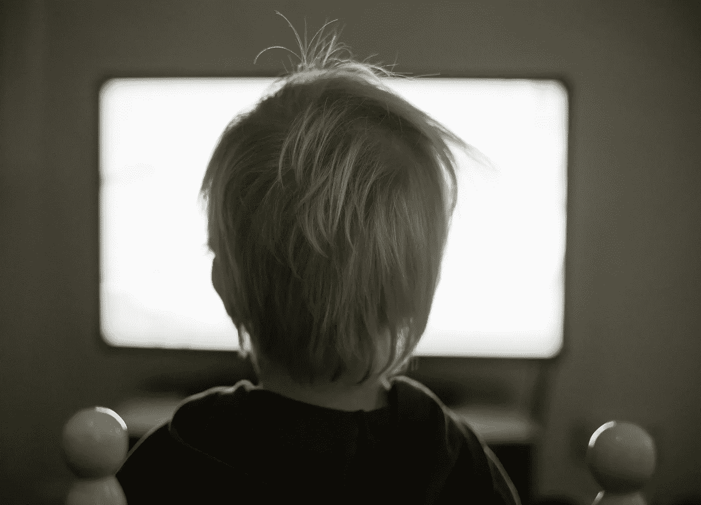

# 供不应求

> 原文：<https://medium.com/hackernoon/off-demand-988ff984a819>

credit: [Tookapic on Pexels](https://www.pexels.com/u/tookapic/)

## 当我们可以随时随地消费我们想要的任何媒体时，会发生什么？

我听两个朋友谈论他们最近喜欢的一些节目。*纸牌屋*、*奇人异事*、*高堡里的男人*等等。他们是断线钳——他们不订阅有线电视，也不看广播电视。他们的媒体生活完全是按需而生的。

我有有线电视，但总的来说，我家的媒体消费也是按需的。我们从菜单选择中决定何时看什么，看什么。无论我们喜欢什么，无论我们什么时候喜欢，这就是我们消费的东西。

我的网络生活也很像那样。我浏览 Twitter，查看 Longform、Instapaper、Medium 和 Pocket 等应用程序。当我需要的时候，我可以从我想要的来源得到这些故事，而且这些故事比我所能读到的要多得多。我根本不需要和向我介绍媒体的人打交道。是自助餐，不是正餐。我选择我想要的，当我想要的时候，忽略其他的。我想回去多少次就回去多少次。供应几乎是无穷无尽的。

## 选择的转变

这是一种新的模式，自 21 世纪初以来一直在发生。选择权已经从生产者转移到消费者，现在几乎完全掌握在消费者手中。

想想 20 世纪 70 年代。有几家电视台。专辑是黑胶唱片。你必须付出认真的努力才能消费一件媒体或艺术作品。制作者可以选择呈现什么，以及何时、何地和如何消费。

40 年后，情况截然不同。生产者仍然选择展示什么，但总的来说，消费者控制着时间、地点和方式。简而言之，消费者控制着消费的环境。结果，凝聚力和策展就被抛到了九霄云外。

专辑、节目和电影现在可以在不同的地方以不同的顺序观看。这是以某种方式呈现的 4 道菜的一餐与杂乱无章的随意摆放的菜肴之间的区别，这些菜肴可能曾经是一餐。

## 失去凝聚力和治愈力

最近，我开始思考:这种随需应变的生活方式会在哪些方面伤害我们？

我们曾经被*呈现给*媒体。电视台在特定时间播放节目，而且只有少数节目。报纸只生产有限数量的故事——每天实体报纸上的内容，仅此而已。现在我可以点击到我想去的任何地方——跳过这么多媒体——我可能会失去什么？

支持点播和媒体扩散的积极论点很容易找到。更多的媒体意味着不同的观点，不同观点之间更活跃的对话。更多的媒体意味着人们有更多的选择，更多的表达渠道，等等。这就是我们的收获。但是想想我们可能会失去什么。

一方面，我正在失去避免确认偏见的能力。如果我对某个主题有固定的看法，我可以搜索并点击，直到找到支持它的媒体。我不需要费事去收集与我当前观点相矛盾的数据。我不认为那是有害的。我认为这不是一个可以掉以轻心的前景。

我也失去了凝聚力和背景。凝聚力在媒体和艺术中意味着什么。这张专辑——凝聚力的典范——几乎已经成为过去。歌曲已经没有真正的顺序了。顺序是相对于用户的——他们甚至可能没有整张专辑——只有这首歌或其中的几首。

对我来说，这是一个艺术家已经失去的表达工具。他们甚至不能轻推你再按顺序听整张专辑了。当然，你以前可以跳过光盘、磁带和黑胶唱片，但你必须买下整张专辑。你在游戏中有皮肤。现在完全不是这样了。

## **比喻**

如果我可以打个比方的话，这就好像媒体以前去过某人的家——制片人的家。他们已经为您准备了一些东西，只要您愿意，您可以坐在那里同意与他们合作。只有少数其他邀请会让你起身离开。总的来说，这是一次经历。

现在的订婚更像是速配，而不是社交访问。您会在您——消费者指定的某个地方见面。如果这是一个繁忙的地方，你有一个充满干扰的约会地点，你会对其他你可以交谈的人感到疑惑，然后过早地离开。联系是偶然的，它们会持续多久？他们有多富有？我对这些问题想了很多。

看起来选择是好的，但是有人认为[太多的选择对我们来说是不好的。因此，无论按需消费文化有什么优点，我们都需要注意它将给我们带来的损失。](https://www.fastcompany.com/3031364/the-future-of-work/why-having-too-many-choices-is-making-you-unhappy)

**你知道什么是不需要的吗？我的时事通讯-羊毛收集*。它每周发送一次给几百个幸运儿。*** [***加入他们，你不***](http://tinyletter.com/mike_sturm) ***吗？***

> [黑客中午](http://bit.ly/Hackernoon)是黑客如何开始他们的下午。我们是 [@AMI](http://bit.ly/atAMIatAMI) 家庭的一员。我们现在[接受投稿](http://bit.ly/hackernoonsubmission)，并乐意[讨论广告&赞助](mailto:partners@amipublications.com)机会。
> 
> 如果你喜欢这个故事，我们推荐你阅读我们的[最新科技故事](http://bit.ly/hackernoonlatestt)和[趋势科技故事](https://hackernoon.com/trending)。直到下一次，不要把世界的现实想当然！

