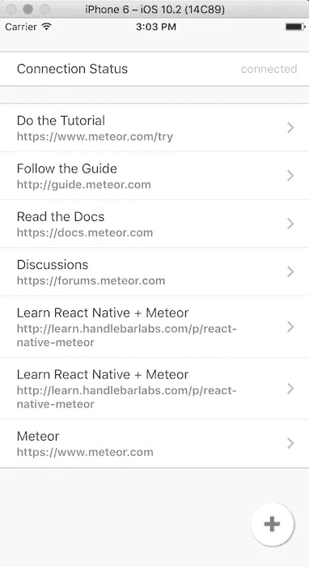
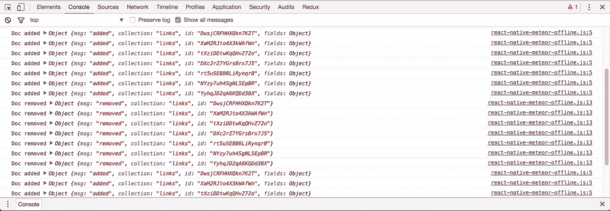
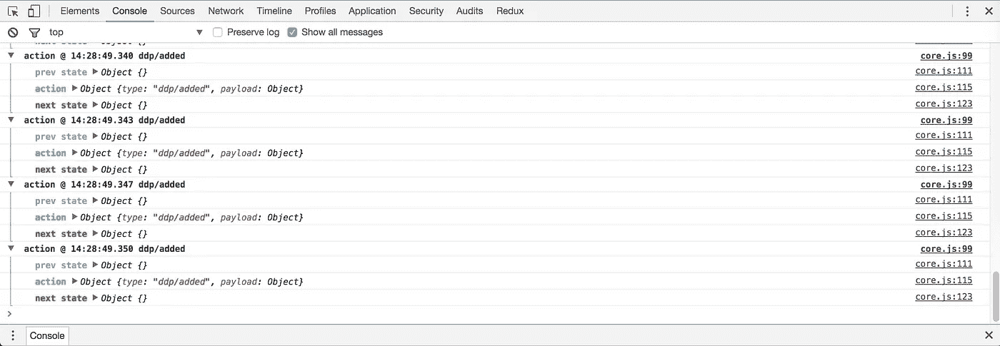
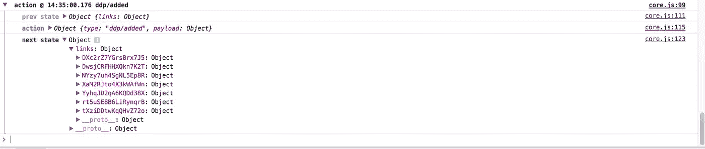
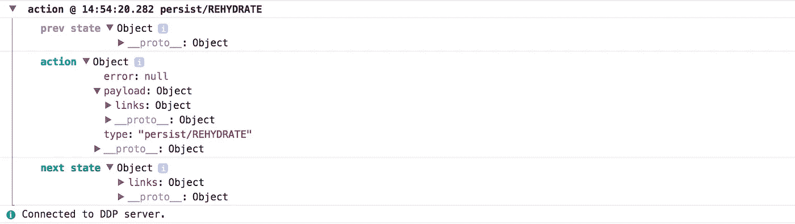

# 离线先反应原生+流星应用

> 原文：<https://medium.com/hackernoon/offline-first-react-native-meteor-apps-2bee8e976ec7>


在我的 [*学习 React Native + Meteor*](http://learn.handlebarlabs.com/p/react-native-meteor) 课程的学生中，以及在 react-native-meteor 的[问题上，咨询电话中多次出现的一个话题是离线支持。简而言之，我如何才能让我的 React Native + Meteor app 离线工作？](https://github.com/inProgress-team/react-native-meteor/issues/154)

我以前也想过这个问题，但是从来没有得出一个很好的结论——尤其是对于来自出版物的数据。我以前总是想到的解决方案依赖于用户必须在他们的应用程序中设置 Redux。

通过各种对话，我发现许多人*没有*在他们的 React Native + Meteor 应用程序中使用 Redux，这很好。Minimongo 做了很多和 Redux 一样的事情，这也是 Meteor 开发者所习惯的。

## 问题是

在 offline first 应用程序的基础上构建有许多问题——将数据保存到客户端以便它可以离线工作，协调离线时采取的操作/方法，以及最大限度地减少任何重复的订阅数据。

## 目标

在这篇文章中，我将尝试在客户端上保存通过 Meteor 订阅带来的数据，以便用户下次启动应用程序时数据就在那里了。它的主要目标是让用户一打开应用程序就能获得有用的体验，而不必等待订阅完成或依赖互联网连接。

数据应保留在设备上，直到收到删除该文档的消息。

## 战略

我可以发布一个包并告诉你使用它，但我想这是一个需要一些时间来发展成真正可用的解决方案，涵盖多种用例。因此，在本文中，我们将介绍如何在您自己的应用程序中实现该逻辑，以便您可以使用它、理解它、试验它并提供反馈。

在深入实现之前，我必须表扬一下开发了一个包`react-native-meteor-redux`的 [Julian_Kingman](https://medium.com/u/891791be2659?source=post_page-----2bee8e976ec7--------------------------------) ，我用它作为我将要介绍的大部分内容的起点。如果你已经在你的应用程序中使用 Redux，他的解决方案可以很好地工作，但是我想要一个更简单的实现。

为此，我们将监听三个 ddp 消息— `added`、`changed`和`removed`。我们还将在幕后实现 redux，以便我们可以使用优秀的`redux-persist`库来实际处理将数据保存到磁盘以及自动“再水合”数据的能力。

## 履行

我们正在构建的应用程序将非常简单。流星应用将只是运行`meteor create --full MeteorApp`的结果。然后，我们将能够使用在那里创建的 web 界面来修改数据。在 react native 方面，我在`react-native-elements` 的帮助下创建了一个非常简单的应用程序，它列出了项目，然后允许我们添加新的链接。为了保持本教程的重点,“新”链接将从一个数组链接中随机选择。

我们还将显示应用程序的 DDP 连接状态，这表明我们是否连接到了 Meteor 服务器。

您可以按照以下步骤创建基本应用程序。

```
react-native init RNDemo
npm i --save lodash redux react-native-elements react-native-meteor react-native-vector-icons redux redux-logger redux-persist
react-native link react-native-vector-icons
```

然后将这个文件的[内容复制粘贴到你的 app 入口点。现在，您应该能够理解本教程了。在这篇文章的最后有一个完整的 Github 链接。](https://gist.github.com/spencercarli/e4f2535ee6314d53952f982993d32e62)



我们要做的第一件事是为这个离线功能设置我们的公共 API。我将在`react-native-meteor-offline.js`中工作并导出一个`initializeMeteorOffline`函数，该函数将在我调用`Meteor.connect`后被直接调用。

这就是我们在现有的 Meteor 应用程序中要做的所有工作。

现在，在我们的`initializeMeteorOffline`函数中，我们想要监听一些与订阅响应相关的 DDP 消息。`react-native-meteor`通过在`Meteor.ddp`公开 DDP 连接，我们可以监听其上的事件，从而使这变得简单。

如果你在`localhost:3000`运行了一个 meteor 应用程序，此时你可能会在你的控制台上看到大量消息。这是我们将用来通过 redux 将数据保存到磁盘的信息，以便用户可以有一个可用的离线体验。



保持这一点的第一步是设置 Redux 存储。我不会深入 Redux 的细节，但我们的商店是我们“存储”所有数据的地方——命名很棘手，是吧？我们还将利用一个便利的包，`redux-logger`，它将帮助我们深入了解 Redux 正在发生的事情。

配置好存储之后，我们就可以开始对这三个 DDP 消息中的任何一个进行调度操作。这将允许 reducer 根据消息的类型做出正确的响应，然后更新磁盘上的数据。



现在，我们需要使用 reducer 在分派某些动作时实际更新我们的存储。这将是我们的大部分代码，它所做的就是逐步用我们所有的数据建立一个对象，如果有必要的话修改任何部分，最后当服务器要求时删除任何数据。如果你发现任何错误，请让我知道。

然后，我们能够通过`redux-logger`检查我们的 redux 存储是否被正确更新。



我们需要完成的最后一项工作是通过 AsyncStorage 将我们正在写入 Redux 的数据持久化到磁盘，然后在应用程序启动时用这些数据填充我们的 minimongo-cache。`redux-persist`让我们很容易做到这一点。

首先，我们必须告诉`redux-persist`我们想把什么存储保存到磁盘，并告诉它一个存储引擎(在我们的例子中是 AsyncStorage)。我们还将利用一些其他选项来提高性能和互操作性。我们将通过“去抖动”写入磁盘的频率来提高性能，这是一个开销很大的操作，意味着写入磁盘将每隔 X 毫秒发生一次(默认为 1000 毫秒)。我们还将尝试通过设置一个惟一的键来在 AsyncStorage 中保存数据，从而提高互操作性。这样，如果你已经在应用中使用了`redux-persist`，它们之间的数据将不会被覆盖。

然后，我们希望告诉 Redux 使用首次初始化时保存在磁盘上的信息自动恢复存储。这将是有益的，因为我们从磁盘读取数据的速度比从网络读取数据的速度更快，并且我们可以确保用户上次使用该应用程序时存在的最后一个数据集仍在设备上。

如果您现在查看控制台日志，您应该会看到一个新的调度操作，并且应该是您看到的第一个操作。



这是从磁盘中提取数据，然后从中填充 Redux 存储，所有这些都是在我们连接到 DDP 服务器之前完成的。但是我们还没有完成。虽然我们的 Redux 商店有我们的缓存数据，但实际的流星应用程序没有。为此，我们需要在成功再水合后将数据插入 minimongo-cache。

这将遍历我们在商店中拥有的所有数据，然后将其插入 minimongo-cache，这就是我们的 Meteor 应用程序所使用的。然后你可以像平常一样使用`Meteor.collection('links').find()`，即使是离线。

[Github](https://gist.github.com/spencercarli/f9aff1633f25a6ea9b4d6c3f4685559d)上有完整的文件。

## 测试

视频有时比文字更容易。我已经录制了一个简短的视频来演示这个代码的功能。

[Github 上的示例应用](https://github.com/spencercarli/react-native-meteor-offline-example)

> 有兴趣了解更多关于 React Native + Meteor 的知识吗？[注册我的电子邮件列表](http://www.handlebarlabs.com/email-list/)，我可以帮忙！

[](http://bit.ly/HackernoonFB)[](https://goo.gl/k7XYbx)[](https://goo.gl/4ofytp)

> [黑客中午](http://bit.ly/Hackernoon)是黑客如何开始他们的下午。我们是 [@AMI](http://bit.ly/atAMIatAMI) 家庭的一员。我们现在[接受投稿](http://bit.ly/hackernoonsubmission)并乐意[讨论广告&赞助](mailto:partners@amipublications.com)机会。
> 
> 如果你喜欢这个故事，我们推荐你阅读我们的[最新科技故事](http://bit.ly/hackernoonlatestt)和[趋势科技故事](https://hackernoon.com/trending)。直到下一次，不要把世界的现实想当然！

