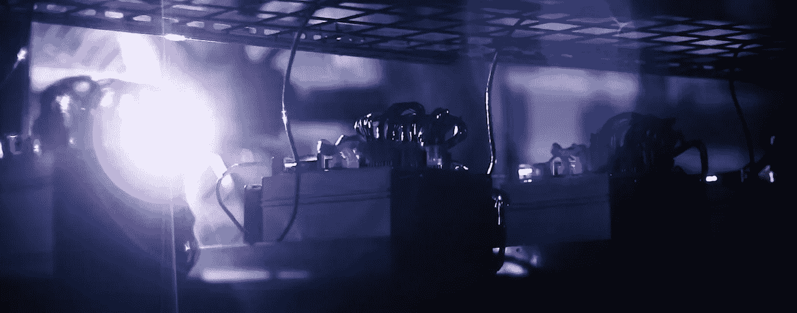
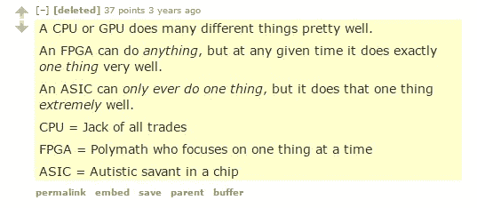
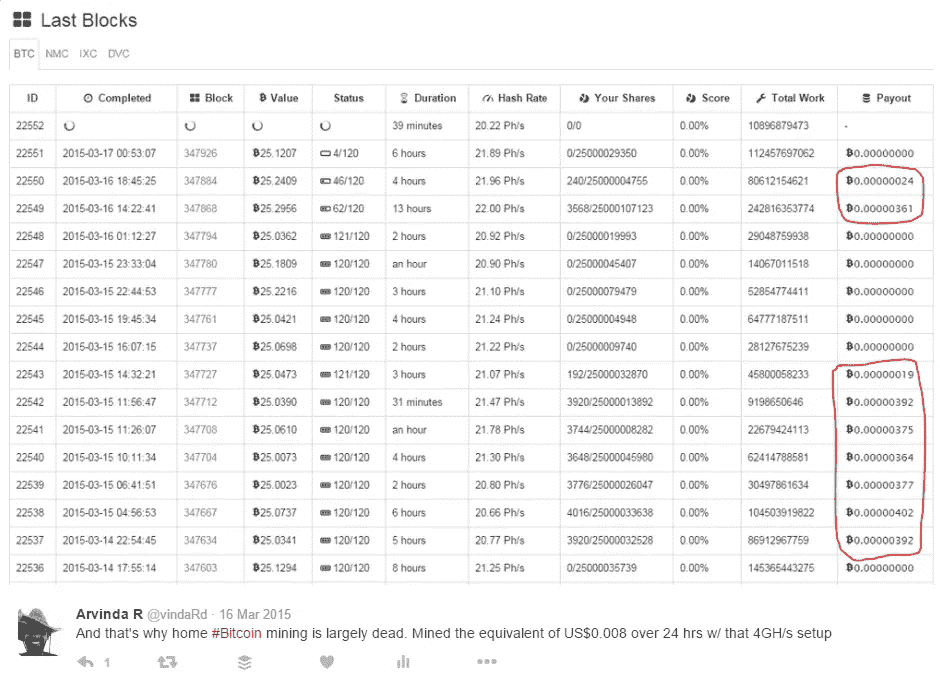
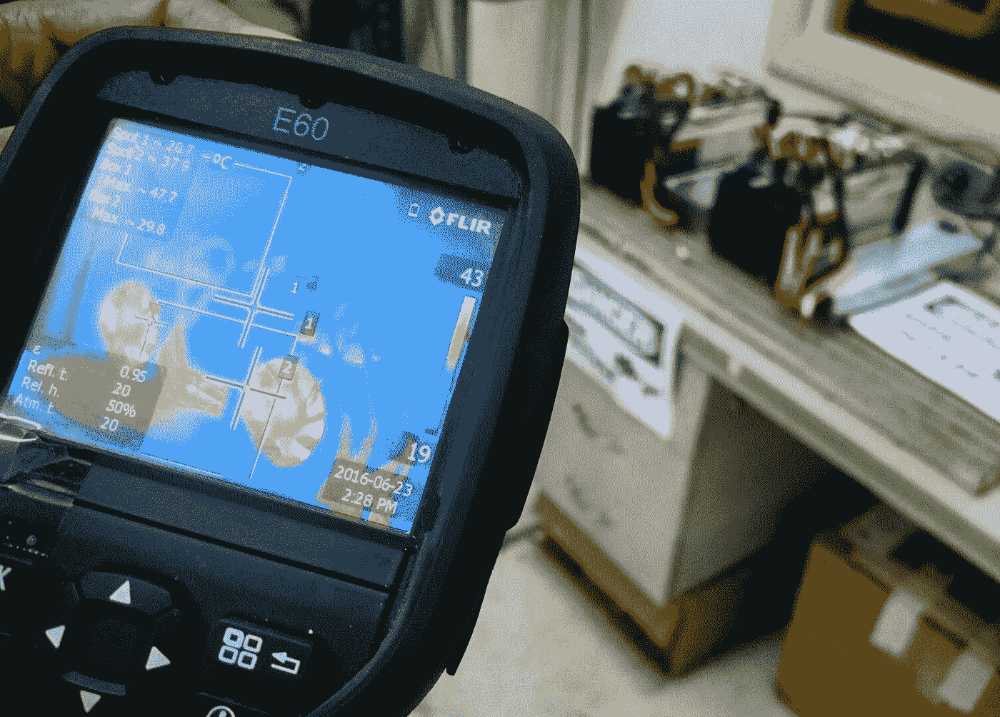
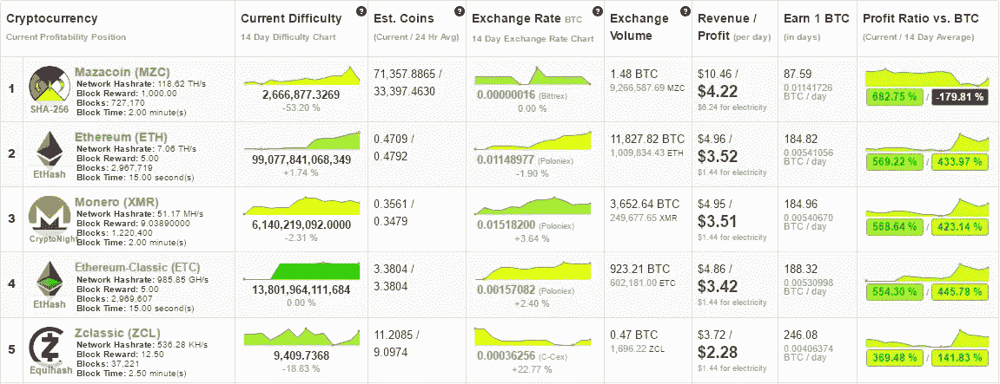

# 哦比特币还是个东西？那我应该开始采矿吗？

> 原文：<https://medium.com/hackernoon/oh-bitcoin-is-still-a-thing-should-i-start-mining-then-f5c015adc1f4>

简而言之，很可能不会。

为什么人们会问这个问题？通常情况下，这个问题会在比特币价格上涨时出现，他们可能会将采矿视为获得比特币的最廉价方式。即“当我可以买一个显卡并免费获得一些时，为什么要以 1000 美元/BTC 的价格购买比特币，对吗？”

然而这并不简单，而且在大多数情况下根本不可行。这里有一个原因分析，以及采矿仍然是一个可行的风险的非常具体的情况。

## **采矿前提**

挖掘的基本前提是来自世界各地的人可以将他们的处理周期(CPU 或其他)贡献给比特币网络。作为回报，他们根据贡献的周期数获得报酬。这些周期用于保护整个比特币网络。

根据一个人可以贡献的“有效 CPU”的数量来按比例付费。这些贡献与采矿网络的当前规模相关。这种报酬，更广为人知的说法是“整体奖励”，是我们感兴趣的事情。

## **了解硬件**

比特币在其白皮书中提出的最初愿景[是“一个 CPU 一票”。人们会贡献他们的 CPU 周期来竞争“将下一个事务块添加到网络中”的机会。反过来，他们每增加一块积木就会得到报酬。](https://bitcoin.org/bitcoin.pdf)

在早期，人们确实按照最初的设计走了 CPU 挖掘的路线。然而，通过不断发展和创造性地使用更先进的硬件，这种情况迅速加速。

比特币的[挖掘](https://docs.google.com/spreadsheets/d/1xCXycKf2sYSgROnV_B9FEH94dTF7gNKxfaP3IIX9EJM/edit#gid=1816493630)过程如下:

*   **CPU** 挖矿最终让位于 **GPU** 挖矿
    (其中 1 个 GPU = ~28 个 CPU)
*   **GPU** 挖矿最终让位于 **FPGA/ASIC** 挖矿
    (1 ASIC first-gen = ~ 33 GPU)
*   **ASIC** 开矿迅速提高，直到一头栽进**摩尔定律** (今天 1 个 ASIC = ~ 212 个 ASIC 第一代)

A comment from Reddit on different hardware types

## **今日网络规模**

值得注意的是，比特币在全球范围内的绝对支付率**不会根据矿工人数**而变化。它实际上是由一个[固定供应时间表](https://en.bitcoin.it/wiki/Controlled_supply#Currency_with_Finite_Supply)决定的。早期是每 10 分钟 50 个 BTC，现在是每 10 分钟 12.5 个 BTC。这相当于每天约 1800 BTC，无论是 1 人采矿还是 1000 万人采矿，这都是不变的。

今天，比特币网络已经发展到相当于 2460[PHash/s](https://en.bitcoin.it/wiki/Hash_per_second)的水平，这比 10 亿有效 GPU(如果你是游戏玩家)或 176 亿有效 CPU(如果你已经建造了一台高端台式电脑)还差一点。

A Bitcoin mining farm operation

为了了解这些数字有多大，让我们考虑一下赢得 1 . 49 亿美元强力球的几率。中奖大概是 1.75 亿分之一的[几率。](https://youtu.be/ZloHVKk7DHk?t=14m3s)

> 比起使用**GPU**找到一个比特币块，你 [***赢得***](https://docs.google.com/spreadsheets/d/1xCXycKf2sYSgROnV_B9FEH94dTF7gNKxfaP3IIX9EJM/edit#gid=1816493630)**强力球**的可能性要高 5 倍。
> 
> 你 [***中***](https://docs.google.com/spreadsheets/d/1xCXycKf2sYSgROnV_B9FEH94dTF7gNKxfaP3IIX9EJM/edit#gid=1816493630) 赢**强力球**的几率比用**CPU**找到一个比特币块的几率大 100 倍。

这转化为平均支出，看起来像下面的:

*   以当前价格计算，满负荷运行的 1 个 CPU 每天净赚 0.000107 美元(或每年 0.025 美元)
*   **1 个 GPU** 满负荷运行，当前价格为每天 0.001970 美元(或每年 0.47 美元)

我在大约一年前自己安装的一个小型采矿钻机上看到了这一点。我的钻机是强大的，因为使用 2 个最高端的图形处理器，你可能会发现今天。即便如此，每日支出看起来就像你在下图中看到的那样。

Results from my tiny 4 GH/s ASIC rig

## **可行的比特币挖矿**

不过，这并不是说采矿业已经完全消亡。相反，它已经演变成一种全球能源套利游戏，其可行性取决于两个因素:

*   获得最新、最高效的专用集成电路(价格合理)
*   获取廉价的电力，无论它在哪里

对我们特立尼达来说幸运的是，我们拥有世界上最低的电力成本。我和我的一个朋友利用了这一点，我们一直在用一些 Antminer ASICs 进行实验，看看采矿在当地有多可行。

A heat gun pointed at two Antminer S7s we’ve been toying with

我们发现，如果你能获得工业费率(每千瓦时 0.02-0.03 美元)，并且你能避免定期清算开采的 BTC 以满足日常成本，那么采矿可能是可行的。当然，这是假设你已经接受了比特币的整体价值主张，并预计其价值会随着时间的推移继续增长。

通过我们自己的操作，并基于 200 天的数据，我们发现，我们可以预期在 2.5 年后最终推出比我们直接购买这些硬币便宜约 70%的硬币。*这是一个非常乐观的预测，基于许多不确定的假设。*

## altcoin 路线:GPU 挖掘生命！

如果你有点创意，用非 ASIC 设备采矿也是可行的。Altcoins(替代[区块链](https://hackernoon.com/tagged/blockchains))通常有小得多的挖掘网络和不同的挖掘算法。这些属性使它们对 CPU 或 GPU 挖掘更具吸引力。人们也可以从这些替代区块链中获得收益，并定期将它们转换回比特币。不过这是一条更有技术含量的路线，这种方法的诀窍是密切关注哪一个替代矿的。这是因为特定的 altcoin 采矿网络规模和汇率可能会非常迅速地波动。

幸运的是，有像下面这样的网站将各种因素考虑在内，并提供了在任何时间点都值得挖掘的替代硬币的综合表格。

A sample from coinwarz.com

# **这意味着什么**

回到最初的问题“我应该采矿吗？”，人们通常会问，因为他们在想什么是获得比特币的最佳方式。在大多数情况下，答案通常是他们应该 ***在交易所直接购买*** ，因为这将为你提供任何[未来](https://hackernoon.com/tagged/future)价格上涨的所有好处，而没有 ***不得不管理小型采矿作业的令人头疼的*** 。

这些头痛来自于:

*   必须维护设备并支付电力/冷却成本
*   必须将它们安置在合适的位置(气候可控、耐噪音、防火)
*   承担硬件问题或网络突然增长的风险，这可能会显著降低您的支出比例

*你通过接受这项挖掘任务最终获得的是一条通往* [*的路线，也许是稍微便宜一点的比特币*](https://99bitcoins.com/mining-vs-buying-bitcoins-whats-profitable) *。*

也就是说，在有些情况下，即使将上述因素考虑在内，采矿也是有意义的。如果您具备以下条件，可能会更好:

*   备用资本(对于推荐的 Antminer S9 ASICs，以约 1，800 美元的倍数计算)
*   低廉的电力成本
*   您可以在相对气候可控的环境中运行高噪音、高负载设备的空间

在由于缺乏交易所或货币管制而难以获得比特币的国家，这种方式也更受欢迎。矿工是将当地电力转化为流动资产的一个很好的方式，他们有效地为这些地区的所有者直接赚取外汇。

>在 Twitter 上给我打电话

>分享一些 BTC 爱情:[1 jrub 7 nxgududle 2 rrbd 7 c 561mg 8 aa 3 rcq](https://blockchain.info/address/1JruB7NxGuduDLE2rRbd7c561Mg8Aa3RcQ)

1.  [*【^】*](https://hackernoon.com/oh-bitcoin-is-still-a-thing-should-i-start-mining-then-f5c015adc1f4#2687)*统计数据摘自* [*数字黄金*](https://www.amazon.com/Digital-Gold-Bitcoin-Millionaires-Reinvent/dp/006236250X) *图书*

> [黑客中午](http://bit.ly/Hackernoon)是黑客如何开始他们的下午。我们是这个家庭的一员。我们现在[接受投稿](http://bit.ly/hackernoonsubmission)并乐意[讨论广告&赞助](mailto:partners@amipublications.com)机会。
> 
> 如果你喜欢这个故事，我们推荐你阅读我们的[最新科技故事](http://bit.ly/hackernoonlatestt)和[趋势科技故事](https://hackernoon.com/trending)。直到下一次，不要把世界的现实想当然！

