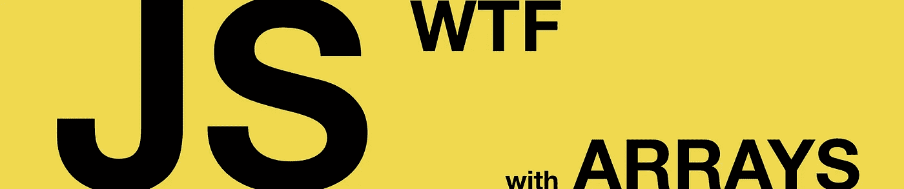

# JS WTF🦄使用数组

> 原文：<https://medium.com/hackernoon/oh-my-goodnejs-arrays-f9e9e4f03c97>

## 让我们利用一些带有 JavaScript **数组**的 WTF。

# [] == ![]

出现这种情况是因为`[precedence](https://developer.mozilla.org/en/docs/Web/JavaScript/Reference/Operators/Operator_Precedence)`和`[coercion](https://www.safaribooksonline.com/library/view/you-dont-know/9781491905159/ch04.html)`。

***旁注—优先级*** *决定了运算符执行的顺序。优先级越高，操作执行得越快。例如，* `***` *的优先级高于运算符* `*+*` *。至于* ***强制*** *，这是 JS 将(一个运算符的)其中一个操作数转换为另一个操作数的“等价”值的能力。当操作数的类型不同时，就会发生这种情况。例如，对于* `*boolean == integer*` *，* `*boolean*` *操作数将被转换为* `*integer*` *。*

由于`[precedence](https://developer.mozilla.org/en/docs/Web/JavaScript/Reference/Operators/Operator_Precedence)`，JS 首先执行操作`![]`，然后执行`==`。

**逻辑非**运算`![]`对`[]`的[真值](https://developer.mozilla.org/en-US/docs/Glossary/Truthy)求反，并返回布尔值`false`。在[上步进](https://www.ecma-international.org/ecma-262/6.0/index.html#sec-logical-not-operator):

1.  评估表达式`[]`；
2.  将结果转换为布尔值，即`ToBoolean([])`。[根据定义](https://www.ecma-international.org/ecma-262/6.0/index.html#sec-toboolean)结果是`true`；
3.  返回`false`，是`true`的逻辑否定；

> **我们得到了** `**[] == false**` **。**

现在，它开始发挥作用了。

因为我们的第二个操作数是一个布尔值，所以该操作被翻译成`[] == ToNumber(false)`。布尔运算的`ToNumber`在`true`时返回`1`或`false`时返回`0`(参见[规范](https://www.ecma-international.org/ecma-262/6.0/index.html#sec-tonumber))。

> **我们得到了** `**[] == 0**` **。**

通过[规范](https://www.ecma-international.org/ecma-262/6.0/index.html#sec-reference-specification-type) , `[] == 0`转化为`ToPrimitive([]) == 0`，进而产生操作`OrdinaryToPrimitive([], "number") == 0`。

参数`Object`和`"number"`的`OrdinaryToPrimitive`运行`Object`的`**.valueOf()**`和`**.toString()**` 两种方法，返回结果**不是对象**。在我们的例子中，因为`[].valueOf()`返回一个对象(即`[]`，所以返回的是`[].toString()`的结果(即`""`)。

> **我们得到了** `**"" == 0**` **。**

耐心。我们快到了😅

现在，一旦第一个操作数是一个字符串，我们的操作就被翻译成`ToNumber("") == 0`。[根据定义](https://www.ecma-international.org/ecma-262/6.0/index.html#sec-tonumber-applied-to-the-string-type)，空字符串被转换成`0`。

> **我们得到了** `**0 == 0**` **。**

也就是`true`🎉

> 这就对了。

***注:*** *我在第一次 WTF 上尽可能深入地让你知道 JS 有多方便。从现在开始，我会尽量简短。*

# 。应用()

这个“特性”是由 **ECMAScript 第五版**带给你的。

从`ES5`开始，我们可以用任何类似[****的数组对象****](https://developer.mozilla.org/en-US/docs/Web/JavaScript/Guide/Indexed_collections#Working_with_array-like_objects) **来调用`Function.prototype.apply()`。这意味着`apply()`的第二个参数([见定义](https://developer.mozilla.org/en-US/docs/Web/JavaScript/Reference/Global_Objects/Function/apply))需要有属性`length`和范围`0…length — 1`内的整数属性。**

**例如，数组`[6,8]`的属性长度为`2`，整数属性来自`0…1`(意为，`[6,8][0]`和`[6,8][1]`)。)所以它是一个类数组的对象(这是一个简单的解释，你可以在这里阅读详情[。)](http://2ality.com/2013/05/quirk-array-like-objects.html)**

**因为**所有的 4 个例子都是带有属性`length`的** **类数组** **对象**，`apply()`将执行`Array`函数，并将来自`0…length — 1`的每个值作为其参数。**

**对于示例`{length: 3}`，它有一个`3`的`length`，并且`apply()`将如下执行`Array`:**

# **。排序()**

> **这不是搞什么鬼。**

**这就是`sort()`的工作原理。但是我们还是可以玩得开心😃**

**根据[规范](https://developer.mozilla.org/en-US/docs/Web/JavaScript/Reference/Global_Objects/Array/sort)，`sort()`根据字符串 unicode 值对数组元素进行排序。**

**因为`10`(即`1`)的第一个字符的 unicode 值低于字符`2`的 unicode 值，所以“排序”时`10`出现在`2`之前**

****

> **我现在觉得好笑！**

# **🔥。切片()**

**你们可能都记得我们的朋友`slice()`，根据它的[规范](https://developer.mozilla.org/en-US/docs/Web/JavaScript/Reference/Global_Objects/Array/slice)，“它接受两个参数`start`和`end`，并且**返回一个数组，该数组包含从元素** `**start**` **到** `**end**` (不包括`end`)的数组元素”。)**

***语法***

> ****array.slice(begin，end)****

**在我们的两个例子中，`**begin**` **= 0。****

**然而，尽管`null`和`undefined`都表示没有值，但是`**end**`= null 的结果与`**end**`= undefined 的结果无关。**

## ****原因是** [**ECMAScript 规范**](https://www.ecma-international.org/ecma-262/6.0/#sec-array.prototype.slice) **。****

**上面写着，**

*   **如果“`**end**` **是** **未定义**，那么“`**end**` **是** **数组的长度**”。**
*   **else "[**to integer**](https://www.ecma-international.org/ecma-262/6.0/#sec-tointeger)**(**`**end**`**)**"，即翻译成"[**to number**](https://www.ecma-international.org/ecma-262/6.0/#sec-tonumber)**(**`**end**`**)**"。**

> **顾名思义，`**toNumber**(null)`就是`0`。**

**我们的声明`[1, 2, 3].slice(0, null)`实际上是`[1, 2, 3].slice(0, 0)`。**

> **你猜对了。那就是`[]`。**

**🍻***感谢注:*** *非常感谢*[*@ jooffalcao*](https://twitter.com/joaoffalcao)*为了这个 WTF。***

# **< your WTF >**

**如果你发现任何应该在这里的 WTF，请告诉我👐**

> **这就是数组的全部内容。**

# **感谢:**

*   **[MDN 文档](https://developer.mozilla.org/en-US/docs/Web)**
*   **[凯尔·辛普森](https://twitter.com/getify)为他的[视频](https://www.youtube.com/watch?v=2pL28CcEijU)和[书](https://www.safaribooksonline.com/library/view/you-dont-know/9781491905159/)**
*   **[威尔·费雷尔](https://twitter.com/WillFerreI)为[gif](https://giphy.com/search/will-ferrell)**
*   **[稻力必发](https://twitter.com/PPBetfair)伙计们，特别是[乔](https://twitter.com/@Joa0)和[佩德罗](https://twitter.com/pmacorreia)，进行审核🦄**
*   **WTF 撰稿人[若昂·法尔科](https://twitter.com/joaoffalcao)👊**
*   **[骇客正午](https://twitter.com/hackernoon)为出版❤️**

**一定要看看我在 JS WTF 上的其他文章**

** [## JS WTF🦄带编号

### 是时候用数字来驾驭一些 JavaScript WTF 了。

hackernoon.com](https://hackernoon.com/js-wtf-with-number-5cd73514befb)**