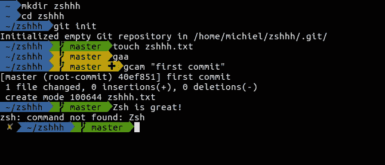
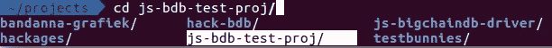
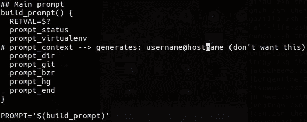
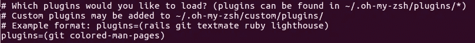
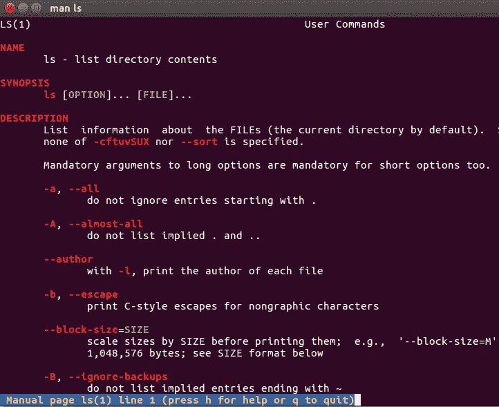
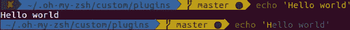
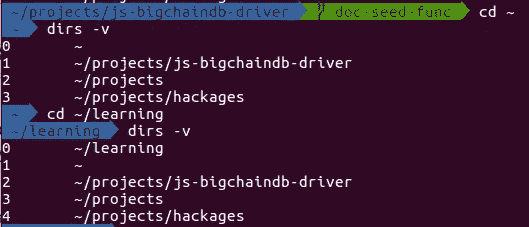

# 我的天呐。专为 CLI 爱好者打造

> 原文：<https://medium.com/hackernoon/oh-my-zsh-made-for-cli-lovers-bea538d42ec1>



Oh-My-Zsh Agnoster Theme

我非常喜欢我的 Ubuntu 机器上的命令行界面…我讨厌用我的电脑鼠标！这促使我寻找优秀的工具来增强我在 CLI 上的用户体验。我在实习的时候遇到了“哦，我的天啊”。一些朋友说服我使用 Zshell，因为它的简单性和可调整性。另外，CLI 可以通过许多插件进行扩展。

这是它的*功能*列表:

*   命令验证
*   拼写纠正
*   在所有运行的 shells 之间共享命令历史
*   主题提示(Agnoster、RobbyRussell、…)
*   目录历史
*   通过`zshenv`、`zprofile`、`zshrc`、`zlogin`和`zlogout`的启动/关闭脚本
*   强大的自动完成功能。您可以使用 TAB 键浏览不同的选项，并使用 enter 键选择正确的文件夹。例如，Bash 会打印所有选项。这是相当垃圾和污染你的滚动回来。



*   添加[插件](https://github.com/robbyrussell/oh-my-zsh/tree/master/plugins):例如 Git 插件，有一大堆有用的 Git [别名](https://github.com/robbyrussell/oh-my-zsh/wiki/Plugin:git)。
    这个插件显示活动的分支，并给出关于您的 Git 状态的视觉反馈:
    -绿色:如果没有发生变化则分支
    -黄色带圆圈图标:未跟踪的文件
    -黄色带加号图标:准备提交的文件


# 安装指南

我正在我的 Ubuntu 16.04 虚拟机上执行这个安装指南。为了向您展示 Oh-My-Zsh 的底层功能，我将安装 Git 插件(Git-core)。这个插件给出了关于项目 Git 状态的视觉反馈。

1.  安装必备包
    $ **sudo 来安装 git-core zsh**
2.  从 Robby Russell 的资源库
    $**sh-c " $(curl-fsSL**[**https://raw . github . com/robbyrussell/Oh-My-Zsh/master/tools/install . sh**](https://raw.github.com/robbyrussell/oh-my-zsh/master/tools/install.sh)**)"**
3.  安装电力线字体，用图标
    $ **增加你的命令行界面的趣味**
4.  将传奇的 Oh-My-Zsh 主题
    $ **nano ~/的主题从“robbyrussell”改为“agnoster”。zshrc**
5.  找到`ZSH_THEME`变量并改变它:`ZSH_THEME="agnoster"`
6.  我不喜欢主题显示我的用户名和主机。为了解决这个问题，我们将目录改为
    $ **cd ~/。天啊/主题**
7.  接下来，我们在编辑器中打开“agnoster”的主题文件
    $**nano agno ster . zsh-theme**
8.  现在我们可以更改“主提示”了。我们不需要在函数`build_prompt()`中提示 _context。只需注释掉这一行或删除它。最后，将`PROMPT`变量改为`$(build_prompt)`。



Agnoster theme configuration

要真正看到主题，你必须像这样获取你的`.zshrc`文件:`source ~/.zshrc`。如果一切顺利，您应该会看到类似封面图片的东西！

**Extra** :将 zsh 设置为我们的默认 shell。在您的默认 shell 中执行，在大多数情况下，这将是 bash。如果在 zsh 中执行这个命令，它不会改变任何事情:
**$ chsh -s $(哪个 zsh)**

**注意**:如果你使用`sudo`它会为 *root 更换外壳，但*不会为你的工作用户更换外壳。

# 安装插件

[插件 Github 页面](https://github.com/robbyrussell/oh-my-zsh/tree/master/plugins)列出的所有插件都在`~/.oh-my-zsh/plugins`预装了 Oh-My-Zsh。自定义插件可以在`~/.oh-my-zsh/custom/plugins`安装。要使用一个插件，你可以简单地把它添加到你的`~/.zshrc`文件的插件列表中。明智地添加，因为太多插件会降低外壳启动速度。在每个插件之间留出空白。



## 彩色手册页

在这个例子中，我安装了一个有用的插件来突出显示你的`man pages`。为了能够使用这个插件，将你的`.zshrc`文件:
**$ source ~/。zshrc**



Colored Man Page of **ls** command

## zsh-语法-突出显示

另一个很棒的插件是为你的 shell 突出显示语法的[。除此之外，这个插件有能力验证你的命令的正确性。](https://github.com/zsh-users/zsh-syntax-highlighting)


这个插件没有和“我的天啊”一起安装。导航到`~/.oh-my-zsh/custom/plugins`并将代码从 Github 克隆到这个文件夹:
**$ git 克隆**[https://github.com/zsh-users/zsh-syntax-highlighting](https://github.com/zsh-users/zsh-syntax-highlighting)

您将看到一个名为`zsh-syntax-highlighting`的文件夹。这是需要添加到插件列表中的名称。

## zsh-自我暗示

您也可以使用`zsh-autosuggestions`来完成命令。它会根据您的命令历史记录建议命令。非常有用！要选择建议的命令，请按右箭头键。



安装同`zsh-syntax-highlighting` :
**$ git 克隆**[https://github.com/zsh-users/zsh-autosuggestions](https://github.com/zsh-users/zsh-autosuggestions)
并将`zsh-autosuggestions`添加到插件列表中。

# 照顾别名爱好者

## 目录历史

哦，我的 Zsh 会自动记住你最近访问过的 20 个目录。你可以用`dirs -v`或`d`按时间顺序列出历史。



正常情况下可以用`cd +1`转到上一个目录等等。哦，我的 Zsh 让这变得更加简单，现在你可以使用你想要访问的目录历史中条目的编号… `1`。

## 其他有趣的别名

*   `alias`:列出所有别名。您可以通过管道将输出传递给`grep`来搜索特定的别名。
*   `/` : `cd /`
*   `~` : `cd ~`
*   `...` : `cd ../..`
*   `....` : `cd ../../..`
*   我想你明白了，对吗？
*   `take test_folder`:创建一个名为`test_folder`的文件夹，并对其进行更改
*   `x`:提取档案类型`tar, bz2, rar, gz, tbz2, tgz, zip, Z, 7z`
*   `upgrade_oh_my_zsh`:升级安装的简易突击队

# 众所周知的问题和解决方案

## 损坏的历史文件

历史文件可能会损坏。不要问我具体细节。每次启动新终端时，您都会收到以下消息:

```
zsh: corrupt history file /home/myusername/.zsh_history
```

让我们用下面的命令来修复它。确保您位于 homefolder 的根目录下。fc 命令列出、编辑或重新执行以前输入到 shell 中的命令。history 命令允许您在正在键入的命令行中使用以前命令行中的单词。

```
mv .zsh_history .zsh_history_bad
strings .zsh_history_bad > .zsh_history
fc -R .zsh_history
```

# 结论

哦，我的天啊，太棒了！

# 有用的链接和来源

*这篇文章是在*[](https://medium.com/wearetheledger)**的帮助下完成的。**

*   *我的天呐:[http://ohmyz.sh/](http://ohmyz.sh/)*
*   *插件:[https://github . com/robbyrussell/oh-my-zsh/tree/master/plugins](https://github.com/robbyrussell/oh-my-zsh/tree/master/plugins)*
*   *主题:[https://github . com/robbyrussell/oh-my-zsh/tree/master/themes/](https://github.com/robbyrussell/oh-my-zsh/tree/master/themes/)*
*   *带有所有别名的 Git 插件:[https://github.com/robbyrussell/oh-my-zsh/wiki/Plugin:git](https://github.com/robbyrussell/oh-my-zsh/wiki/Plugin:git)*
*   *定制您的 shell 提示符:[http://www.nparikh.org/unix/prompt.php#zsh](http://www.nparikh.org/unix/prompt.php#zsh)*
*   *ArchWiki 关于 Zsh:[https://wiki . arch Linux . org/index . PHP/Zsh # auto start _ X _ at _ log in](https://wiki.archlinux.org/index.php/zsh#Autostart_X_at_login)*
*   *Zsh 语法高亮插件:[https://github.com/zsh-users/zsh-syntax-highlighting](https://github.com/zsh-users/zsh-syntax-highlighting)*
*   *Zsh 自动建议插件:[https://github.com/zsh-users/zsh-autosuggestions](https://github.com/zsh-users/zsh-autosuggestions)*
*   *关于定制 Zsh 的 RobbyRussell Wiki:[https://github . com/RobbyRussell/oh-my-Zsh/Wiki/Customization](https://github.com/robbyrussell/oh-my-zsh/wiki/Customization)*