# 老海盗死不了

> 原文：<https://medium.com/hackernoon/old-pirates-die-hard-20b0ce4a3a15>

Keeping the flag flying

几天前，在一次例行的 Mac OS 更新后，我的老款 iMac(大约 2011 年)死机了。曾几何时，这将是一场灾难。但那是在时间机器出现之前。所以我经历了一些困难，直到我设法让磁盘工具在 Mac 上运行(按住 R 重新启动)，然后插上我古老的时间胶囊(大约在 2008 年)。在一阵喘息和呼呼声之后，时间胶囊连接到了我 Mac 的时间机器，并通知我上次备份我的 Mac 是在几个月前。

然而，我似乎跳过了备份我的 iTunes 资料库，因为我的 Time Capsule 已经用完了 500GB 的磁盘空间。这并不像听起来那么糟糕，因为我的 iMac 也只有 500GB 的硬盘。备份所有这些增量时间机器备份意味着我必须选择放弃一些东西。所以我决定让音乐离开，因为我已经在我的便携式 1TB WD 磁盘上做了第二个备份。

从我的旧 Time Capsule 恢复整个系统花了将近 24 个小时。这很好，因为我所有的工作文件都在云中，我可以从我的任何其他设备上访问它们。Mac 重启后，我插上 WD 盘，换上 iTunes 文件夹，却发现我 75%的歌都不见了。

曾几何时，我会发疯。但如今，我倾向于用一句无忧无虑的“我不知道他们去了哪里”来打发它。

苹果不错，但也确实时不时偷偷来个这样的低吹。就像昨天，一个朋友痛苦地抱怨他的 iOS 日历上保存的所有生日都不见了。我安慰他说，不久前我也遇到过同样的事情。尽管我突然从生日祝福名单上消失了，但天并没有真的塌下来。“我活着，我学习”我想是阿兰妮斯·莫利塞特曾经说过的话。

她的歌是叫这个名字吗？出于习惯，我打开 iTunes，搜索 Alanis。但是她已经走了，可能已经消失在我扭曲的时间机器的时间皱纹里了。

这并不重要，因为正如鲍勃·迪伦(Bob Dylan)预测的那样，“时代在变”(尽管我怀疑老鲍勃是否会预见到自己被授予诺贝尔奖)。毕竟我们生活在 YouTube 的时代。快速搜索弹出了阿拉尼斯的视频“你学会了。'

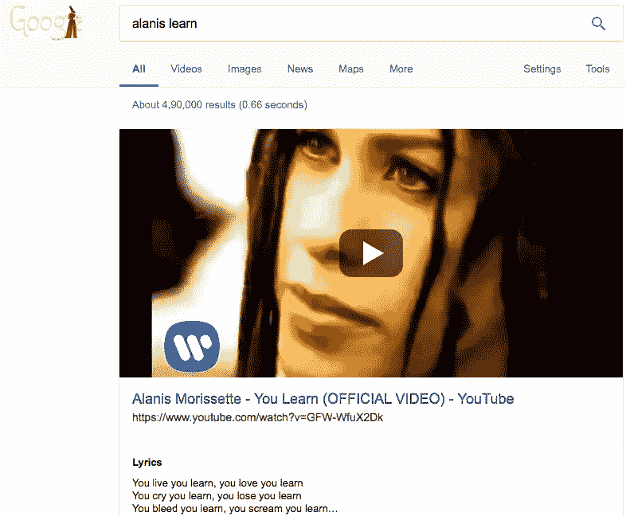

谁还需要音乐库？

我知道。

旧习难改。在经历了 Microsoft Word 崩溃和丢失所有未保存数据的一生后，我对自动保存、备份和备份备份非常偏执，我甚至想都没想就这么做了。

我的意思是，YouTube 可能会关闭，那我该怎么办？哦，不，我已经把阿拉尼斯的话记在心里了。我生活，我学习，并把我的歌藏在其他离线的隐蔽处。

哦，好吧，我要用那个“我的”取一点创意许可但是我希望音乐产业不再起诉人们了。也许诉讼时效或任何适用，因为这首歌早在 1995 年就出来了。

总之，一次快速搜索后，我找到了我的旧 clickwheel iPod 的 50Gb 备份(顺便提一下，它也有这个备份的备份，因为它忠实地履行了作为我的汽车音乐播放器的职责)。我向下滚动到“Y ”,它就在那里。

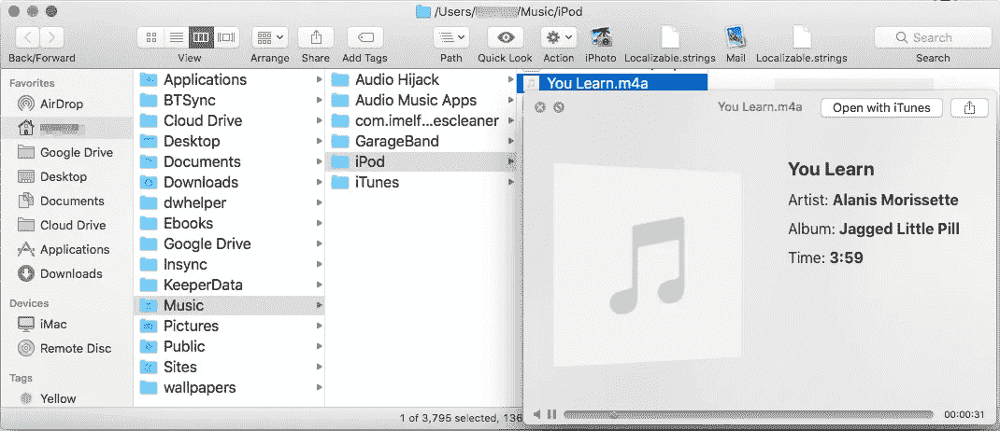

到现在，我对自己的偏执有点吃惊。我还备份到哪里了？我依稀记得几年前我注册了 Google Play Music，当时它提供了我所有音乐的备份。我认为谷歌试图与苹果的 iTunes 竞争。我真的在谷歌备份了我的音乐吗？

我打开 Chrome 浏览器，登录谷歌账户，导航到 play.google.com/music.，音乐播放器打开了。我寻找无处不在的谷歌搜索栏，它就在它应该在的地方。一次快速搜索后，我找到了阿拉尼斯。

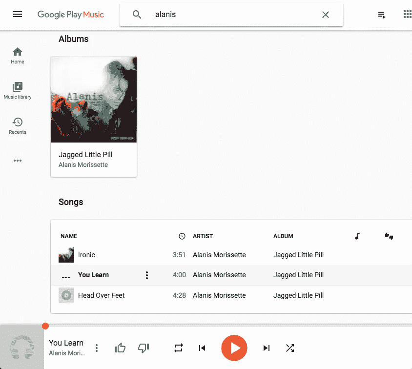

这有点令人惊讶，因为我已经停止了我的 Google Play 订阅。总之，我很好奇，想知道我是否可以在手机上访问我的谷歌音乐库。我在我的 Android 上打开了 Google Play 应用程序。是的，我可以访问我的歌曲。事实上，谷歌还让我从音乐播放器上播放了 Alanis 歌曲的 YouTube 视频。我想这没什么大不了的，因为谷歌拥有 YouTube。

我很好奇为什么谷歌仍然允许我访问我上传到谷歌音乐库的 4348 首歌曲。这可能是因为我偶尔会从谷歌上买一首歌，这会让他们把我当成一个活跃用户。或者也许谷歌已经忘记了我和我那微不足道的 4348 首歌。

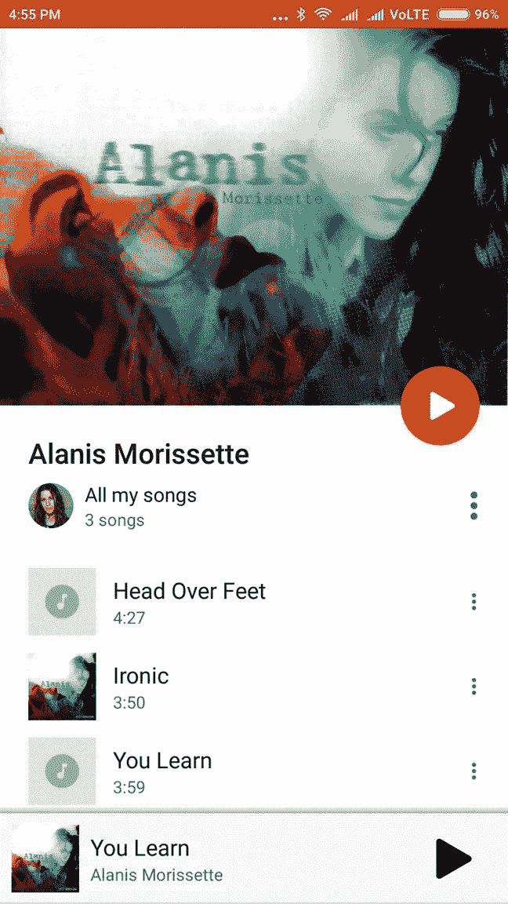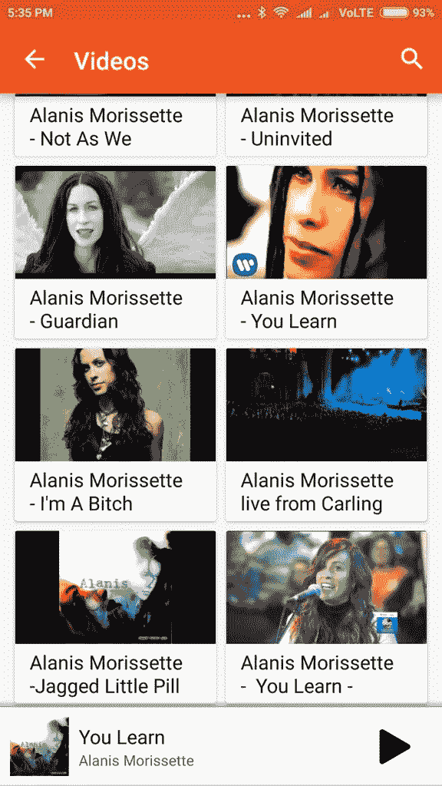

Inside my Google Music Library; option to watch videos; and option to download purchased music

但事实证明，我所有的偏执都是毫无意义的。如今，在印度你可以合法地免费听几乎所有的音乐。

这是我停止订阅谷歌音乐的原因之一。我的第二个原因是，印度的数据价格暴跌，现在已经变得更加实惠了。我目前的 70 天移动套餐花费了我₹349(5 美元)，我每天可以获得 1GB 的 4G 数据，外加无限制的免费通话和短信。

这意味着即使在我的手机上也可以播放音乐了。Spotify 还没有进入印度，但是通过 VPN 很容易解决这个问题。

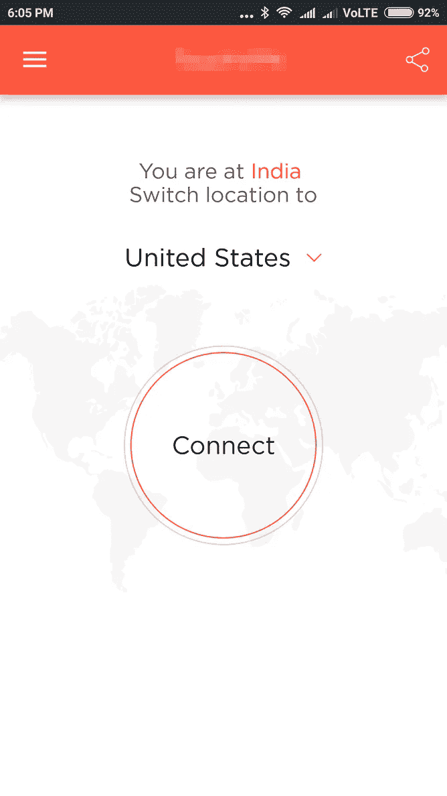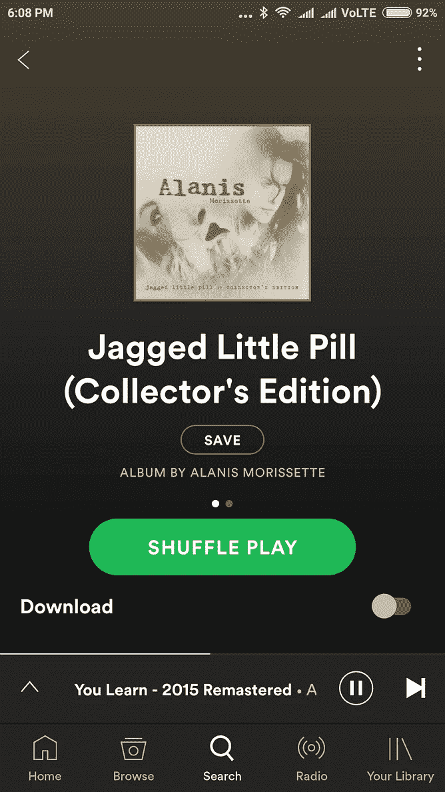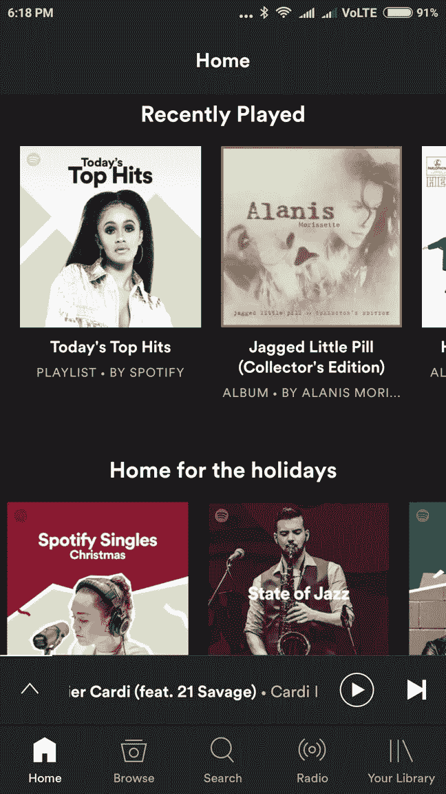

Spotify keeps going on and off in India depending on how good your VPN is

如果 VPN 的合法性困扰任何人，还有其他完全合法的选择。YouTube 上几乎有你想听的每一首歌。我的移动 ISP jio 将一个音乐应用程序与我的数据包捆绑在一起，让我可以免费听任何我想听的东西。印度顶级音乐应用 Saavn 也是如此。苹果音乐还允许印度人每月完全使用其₹120 图书馆。也就是每月 1.87 美元，还不到 Apple Music 在美国月费的五分之一。

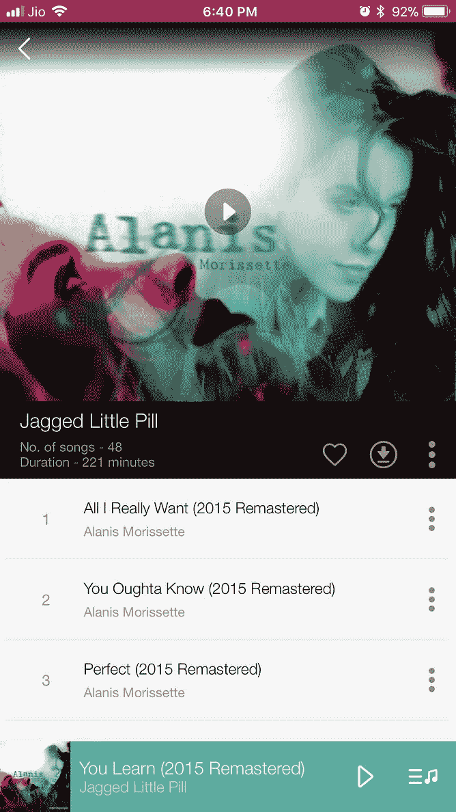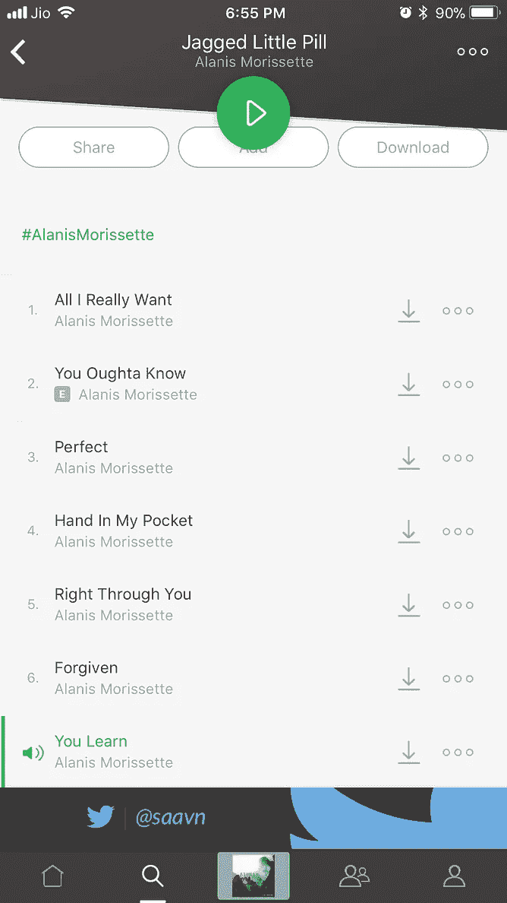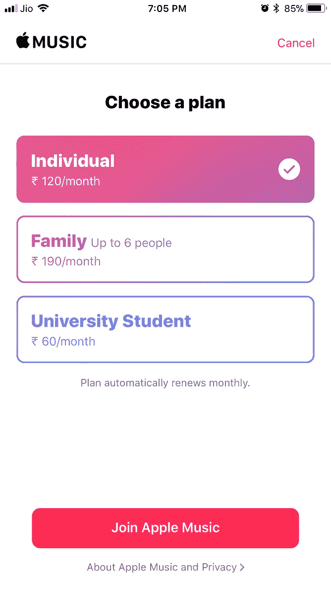

Jio Music, Saavn and Apple Music apps give you all the music you want to hear for free, or almost free.

简而言之，我现在可以听阿拉尼斯或我想听的任何人的音乐，合法且免费。YouTube、Jio、Saavn 和 Apple Music 以及其他网站为艺术家使用他们的音乐付费。他们用从广告中赚取的钱，或者从我的移动数据订阅包中抽取的部分，或者其他商业模式来做到这一点。这是典型的双赢。

我想我应该高兴，我对音乐部分很感兴趣。我特别高兴的是艺术家们得到了报酬，而不是他们的音乐被剽窃。我过去一直对此感到内疚。毕竟，我知道我不会喜欢任何人免费剽窃我创造的东西。

但不知何故，我怀念过去的快乐时光。

我认为这与其说是因为钱，不如说是因为克服了获得音乐的许多障碍而带来的兴奋。会有这样的挑战:溜进危险的盗版网站，然后带着我的战利品逃跑，而网站尽最大努力将一些病毒溜进我的电脑，或者窃取我的信用卡数据，或者通过色情或赌博或其他方式引诱我放弃我的钱。然后会有 ISP 试图阻止对某些网站的访问，这必须通过使用匿名器来绕过，破解一些付费应用程序需要解压缩包含音乐的文件夹，以及破译盗版者伴随音乐文件的奇怪指令。

还有学习翻录音乐和分享音乐的技能的任务。在 iTunes 出现之前的日子里，没有 99 美分的歌曲，只有昂贵的专辑。磁带很便宜，但是质量不如音乐 CD 甚至是 LP 唱片。因此，如果一群破产的孩子非常想要一些音乐，唯一的可能就是集资，买一张音乐 CD，翻录音乐，并在小组成员中分享。这种情况下的挑战是找到工作最好的应用程序，并找出最佳的设置和音乐格式组合。当然，这完全是非法的。但事实就是如此。

如今，你只需打开一个应用程序，音乐就会以理想的形式呈现在你面前。那这有什么意思呢？

一次是海盗，永远是海盗。

前几天，我偶然看到了莱昂纳德·科恩的《哈利路亚》的翻唱版。这是其中一个我更喜欢的翻唱版本，它本身就是一首很棒的歌。视频下方有一个从 iTunes 购买歌曲的链接。我试了一下，但我得到的信息是这首歌在美国商店没有。我转到印度商店没有用。你不能说我没试过。

当我查找从 YouTube 上下载这首歌的最佳方式时，我可以感觉到我脸上的笑容在绽放。过了一会儿，它出现在我的音乐库里，现在是我最珍爱的歌曲之一。

哈利路亚！