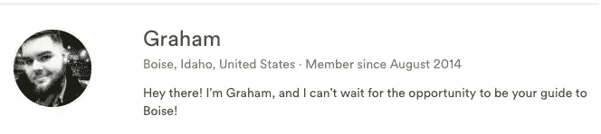

# 点对点短期租赁市场的老派保理业务

> 原文：<https://medium.com/hackernoon/old-school-factoring-for-the-peer-to-peer-short-term-rental-market-f5f12647785a>

## Payfully 的计划是成为任何 Airbnb 主机的 go-to 平台

布鲁克林创业公司[正在用一种久经考验的商业实践来解决零工经济工作者最大的问题之一:缺乏现金流。](http://payfully.co/)

> ***保理——从商家处购买未付发票。***

这家初创公司开发了一个[平台](https://www.payfully.co/)，允许 Airbnb 主机出售未支付的预订以获得现金。使用该解决方案，主人可以在 24-48 小时内收到银行账户中的钱，而不是等待几周或几个月，让客人入住并获得付款。

Airbnb 的房东发现自己也面临类似的问题，所以大多数时候，预付的资金被用于翻新一处房产以提高其价值，投资另一处房产，预订旅行，支付意外账单，或者只是购买额外的床或教练，而无需刷爆他们的信用卡。

Payfully 从交易中获利，因为它以折扣价购买发票。这使得该公司能够从 Airbnb 的最终付款中提取一笔费用。该公司使用自己的算法和 Airbnb 预订数据来确定费用金额。

## 专为 Airbnb 主机设计

Airbnb 是 payable 的完美试验场，因为短租解决方案支付预订费用的速度之慢是出了名的。它的用户甚至要等几个月才能拿到钱。有时主人发现自己有很多预订，而银行账户却空空如也。不得不等待 Airbnb 付款让像来自爱达荷州博伊西的 Graham Seymour 这样的房东日子不好过。

> “有偿托管消除了猜测；我喜欢在需要的时候能够获得资金，尤其是在我需要为客人安排住宿的时候，”西摩说。

Graham Seymour, Airbnb host and Payfully user.

## 灵感的闪现

佩莉开始于在纽约街头散步时灵感的经典闪现。联合创始人阿尔贝托·谢菲尔德正在散步，听他的朋友们说话；他是 Airbnb 的主持人，当他得到这个好主意时，他抱怨付款太慢。

那次不经意的谈话让这位科技行业的资深人士对 Payfully 有了基本的了解。为了让它成为现实，Sheinfeld 求助于他的委内瑞拉朋友兼同事 Luis Scull Baptista。Scull 筹集了风险资本，而 Sheinfeld 则搭建了平台。找到第三个伴侣后；丹妮拉·伯恩鲍姆(Daniela Birnbaum)为了管理运营，三人组在布鲁克林的威廉斯堡开设了一个办公室，并雇佣了一个小团队来实现这个想法。

## **全国性的解决方案**

伯恩鲍姆说:“一开始我们认为这项服务只适合千禧一代和自由职业者，但事实并非如此。”“物业管理公司和企业也加入了该平台，并要求获得更多资金来改善他们的业务现金流。

除了专业人士，许多退休人员也利用了 Payfully 的保理业务。伯恩鲍姆估计，数百名年龄在 21 岁至 69 岁之间的主机已经使用了来自全国各地的服务。Payfully 的大多数用户都是在佛罗里达州、科罗拉多州、纽约州、华盛顿州、马萨诸塞州、宾夕法尼亚州、德克萨斯州和加利福尼亚州上市的主机。

典型的付费预付款约为 3000 美元，但长期用户可以获得更多。该公司专有的承销算法能够识别最赚钱的主机，并向它们预付更多的钱。

该团队还与其他迎合 Airbnb 房东的企业建立了关系，比如物业管理公司和清洁公司。在大多数情况下，主人需要在客人到达之前支付清洁和管理费用。因此，对于这些服务来说，提前向主机支付费用是很方便的，这样他们也可以在。

Payfully 以“以客户为中心”为荣，因为它试图提供全天候的客户服务。这对一个小团队的公司来说是一个真正的挑战。幸运的是，该公司取得了成功。

> “他们的团队(一直到创始人/首席执行官)平易近人，敏锐，反应迅速——就像平台本身一样，”Airbnb 主持人格雷厄姆·西摩说。

Payfully 的下一个挑战将是将其保理业务扩展到 Airbnb 主机之外。该团队已经确定了另一组存在现金流问题的网络，并希望在今年年底前向他们提供 Payfully。

> [黑客中午](http://bit.ly/Hackernoon)是黑客如何开始他们的下午。我们是 [@AMI](http://bit.ly/atAMIatAMI) 家庭的一员。我们现在[接受投稿](http://bit.ly/hackernoonsubmission)，并乐意[讨论广告&赞助](mailto:partners@amipublications.com)机会。
> 
> 如果你喜欢这个故事，我们推荐你阅读我们的[最新科技故事](http://bit.ly/hackernoonlatestt)和[趋势科技故事](https://hackernoon.com/trending)。直到下一次，不要把世界的现实想当然！

