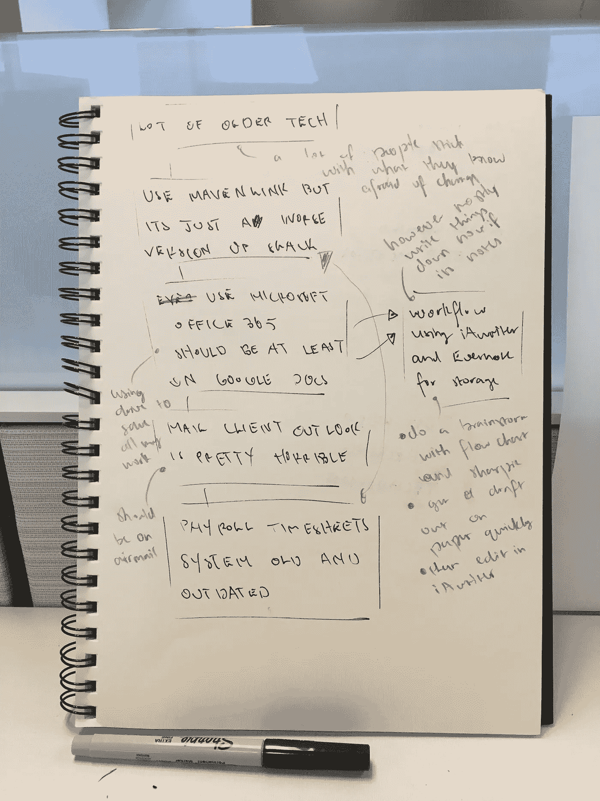

# 旧技术

> 原文：<https://medium.com/hackernoon/older-tech-46f60ff97740>

自从开始实习以来，我发现有一件事有点奇怪，那就是我们使用的一些软件有多旧。从作者的角度来看，很多都是过时和低效的。

我们可以从苹果商店下载应用程序供自己使用，但这只能解决一些问题。许多问题将会存在，直到整个机构的重组发生。

为了兼容性和简单性，公司里的每个人都应该运行相同的应用程序。我们应该成为超级用户，通过举办内部研讨会，不断学习新的功能和快捷方式。我们甚至可以在博客上发布视频教程。

我想对于我们为什么使用大量陈旧缓慢的技术有一些基本的逻辑。人们喜欢坚持他们所知道的，害怕改变。即使某种软件比它好一百万倍，也很难让这种类型的人过线。

## 我会做什么

作为一名实习生，我显然没有能力改变这一切。但是这里有一些我的想法作为开始。

我们目前使用 Mavenlink。从我的经验来看，它可以完成工作，但是缺乏真正令人满意的用户体验。感觉很勉强，很难找到自己需要的内容。

去年，我不断听说 Slack 有多好。当我在一家体育杂志做试用时，我被邀请参加他们的一个休闲小组。简单地说，将 Mavenlink 与 Slack 进行比较就像将 iPhone 与诺基亚的旧砖块进行比较。双方都完成了工作，但你得到了图片。

Slack 还可以解决另一个问题，那就是时间表。我们目前不得不在 Mac 上使用 Windows 远程桌面来处理账户工作，即使在最好的情况下也会出现故障。使用起来也很混乱，因为同一个公司有不同的代码。我刚刚快速搜索了一下，Nikabot 看起来是一个完美的解决方案。

最大的问题是，我们是 Office 365 的奴隶。Outlook 是一个可怕的邮件客户端，当你看它超过 5 分钟就会流眼泪。

我能看到电子邮件的优点。它永远不会消亡，但当它被使用时，总会有东西被放弃。这个团队应该被连接到航空邮件，但我们也应该都在[信使](https://messenger.com/)。这将减少发送内部邮件的需要。

微软 Word 也没那么差。我不介意使用它，但它远不是最好的处理器。[谷歌](https://hackernoon.com/tagged/google)文档是迄今为止最好的[工具](https://hackernoon.com/tagged/tool)，用于打字、编辑、提出建议和评论合作项目。

它与 Google Drive 的集成也非常容易用于备份文件。我在这里做的每一个项目，无论大小，我都会把它备份到硬盘上，把它当成我的文件夹。当我与人见面时，我可以在手机上向他们展示我的作品，无论文件格式如何。

这也有助于解释我作为文案实际上是做什么的！

## 我的工作流程

讽刺的是，我实际上变得越来越不依赖软件了。我主要在纸上起草和写我所有的笔记。

首先，我要用黑色记号笔做一个流程图风格的头脑风暴。然后，我会以此为参考，在划线纸上快速写出草稿。我喜欢用双倍行距来写，因为这样会留下足够的修改空间。它也更具可读性。

然后我在 iA Writer 中编辑这份草稿，我认为 iA Writer 是 app store 中最好的文字处理器。基本上没有格式选项，这意味着你可以专注于写作。它在调整大小时非常灵敏，这使得在谷歌 Chrome 上阅读和打字变得很容易。

我也喜欢它的字数统计和阅读时间功能。一个非常有用的工具。

特定项目的笔记存储最好保存在 Evernote 中。这甚至可以取代某些团队的懈怠。我现在并不经常使用它，但如果我有一台 iPad Pro 和一支 Apple pencil，我肯定会使用它。

现在，我只是把我的笔记写在纸上，即使事情最终变得有点杂乱无章和不可理解。

> [黑客中午](http://bit.ly/Hackernoon)是黑客如何开始他们的下午。我们是 [@AMI](http://bit.ly/atAMIatAMI) 家庭的一员。我们现在[接受投稿](http://bit.ly/hackernoonsubmission)，并乐意[讨论广告&赞助](mailto:partners@amipublications.com)机会。
> 
> 如果你喜欢这个故事，我们推荐你阅读我们的[最新科技故事](http://bit.ly/hackernoonlatestt)和[趋势科技故事](https://hackernoon.com/trending)。直到下一次，不要把世界的现实想当然！

