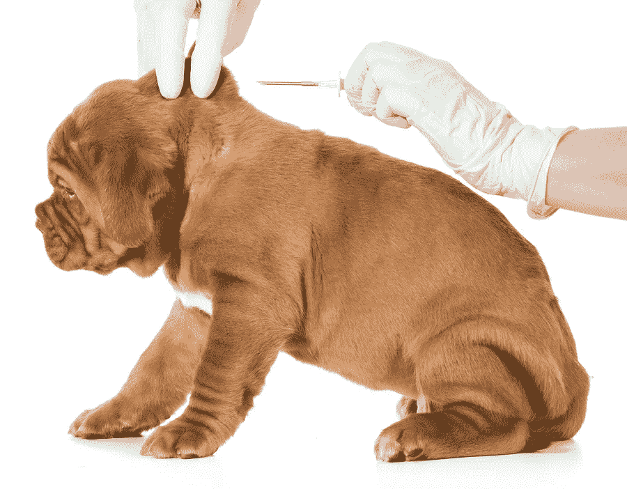
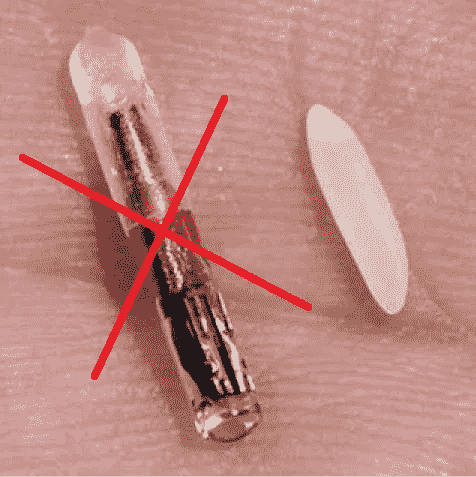

# 奥林匹克协会首席执行官提议给运动员“像狗一样”植入芯片是不可接受的

> 原文：<https://medium.com/hackernoon/olympic-association-ceo-proposal-to-microchip-athletes-like-dogs-is-unacceptable-f4fbb58f781d>

World Olympians Association official proposes athletes be chipped and tracked like dogs to prevent “drug cheats”

世界奥林匹克协会的一名官员提议，给运动员植入芯片并像狗一样追踪，以防止“药物作弊”，这一提议已经越界了。

[据《卫报》报道，](https://www.theguardian.com/sport/2017/oct/10/call-for-athletes-to-be-fitted-with-microchips-fight-against-drug-cheats)世界奥林匹克协会首席执行官麦克·米勒在最近伦敦的反兴奋剂论坛上提出了有争议的人体芯片提案，建议精英运动员必须接受植入手术或退出奥运会级别的比赛:

“为了杜绝兴奋剂，我们需要给运动员植入芯片……有人说这是侵犯隐私，嗯，体育是一个俱乐部，如果人们不想加入，如果他们不遵守规则，他们可以不加入这个俱乐部，”米勒说。

> “我们需要立法来保证公民有权拒绝跟踪植入物，而不必担心失去工作或享受其他追求的权利。”~利兹·麦金太尔，CAMCAT.org

虽然米勒没有详细说明他希望在奥运候选人身上植入何种微芯片[技术](https://hackernoon.com/tagged/technology)，但有[种带有生物传感器的可植入 RFID 微芯片，可以检测人类或其他动物的健康状况、疾病和血液中的物质](https://www.sciencedirect.com/science/article/pii/S2214180416301350)。理论上，芯片/生物传感器组合可以全天候监控运动员的血液，并在附近的阅读器[设备](https://hackernoon.com/tagged/device)查询时报告异常情况——例如，可能是一部内置阅读器的手机。

当处于米勒位置的人厚颜无耻地提出 RFID 狗跟踪芯片是参与任何努力的可接受的先决条件时，是时候采取行动了。任何人都不应该被迫接受跟踪植入，以充分参与社会。

This microchip implant is bigger than any grain of rice I’ve encountered!

我们需要立法来保证公民有权拒绝侵入性跟踪技术，而不必担心失去工作或享受其他追求的权利。CEO 米勒的蛮横推荐让我意识到我们的时间不多了。这就是我成立 CAMCAT 的原因——公民反对标记、切割和追踪。立法者需要现在就行动起来保护他们的选民。CAMCAT 将努力实现这一目标。

> **请在 Twitter 上关注我，了解 CAMCAT 人体追踪的最新进展:@LizMcIntyre**

虽然我完全相信人们应该有权改变自己的身体，包括植入跟踪设备，但他们需要做出 ***知情*** 决定并控制什么将被跟踪和监控。

有些人可能会指出最近在威斯康星州举行的[三广场市场](https://www.32market.com/public/)公关盛会[筹码派对](https://www.cnbc.com/2017/08/11/three-square-market-ceo-explains-its-employee-microchip-implant.html)是人类自愿筹码的一个例子，但这是真的吗？当你的老板对一项新技术感到兴奋，并认为这项技术可以提高他的业务的地位和价格时，你敢违背初衷吗？每个人都知道不成文的期望。想获得下一次晋升、获得奖励账户还是仅仅保住这份工作？最好说“是”。

(顺便说一句，威斯康星州已经有一项法律禁止强制植入芯片，我预计我们会看到三名 Square 员工提起诉讼——他们中有植入芯片的，也有没有植入芯片的。)

我认为三个正方形的场景类似于老板要求“志愿者”在一个关键项目上工作到很晚，或者在周六下午为公司的棒球队加油——只是有更长期的后果。

请鼓励你的州代表制定法律，阻止你的政府、专业协会、看护人或雇主伤害你——无论是通过武力、威胁还是心照不宣的“志愿者”理解。

在[www.CAMCAT.org 了解更多！](http://www.CAMCAT.org!)