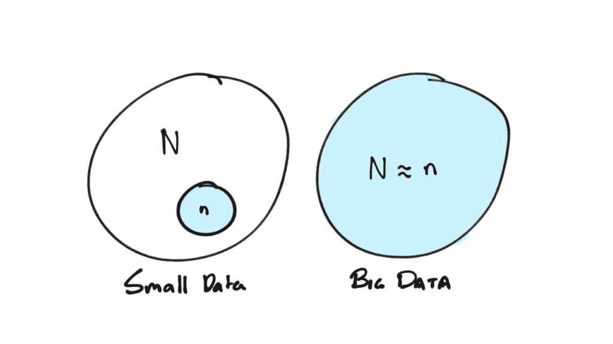
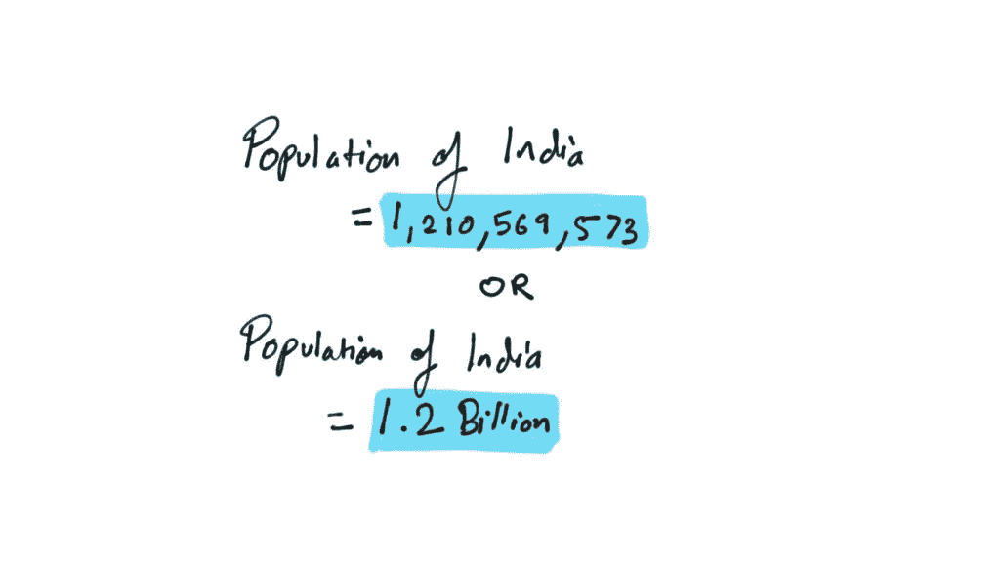
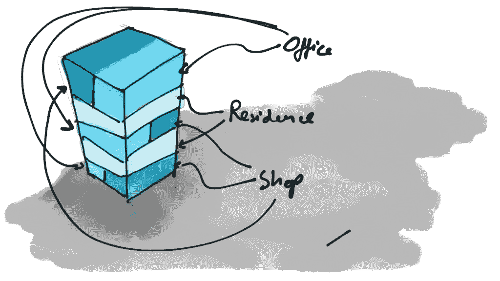
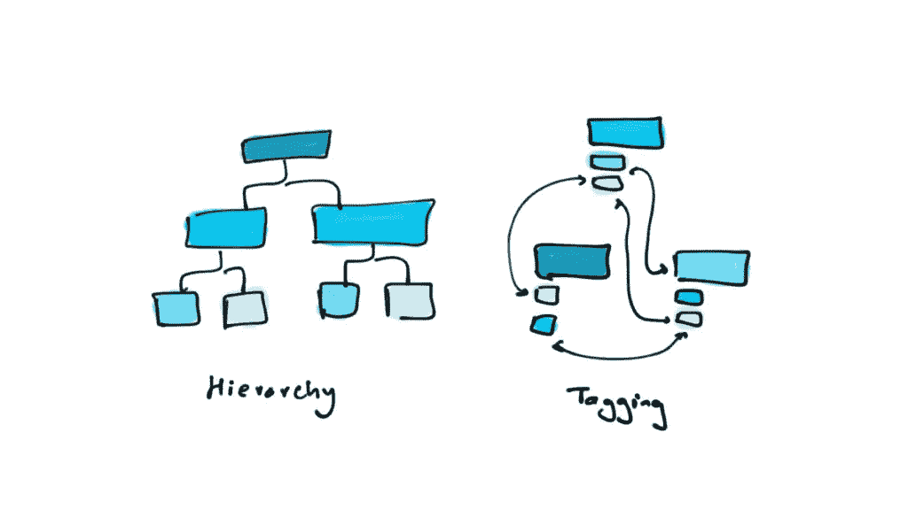

# 关于大数据

> 原文：<https://medium.com/hackernoon/on-big-data-eb6b4b509902>

> “韦恩先生，如果你不想告诉我你到底在做什么，当我被问到的时候，我没必要撒谎。但不要把我当傻逼。”——卢修斯·福克斯对《蝙蝠侠诞生》中的蝙蝠侠

蝙蝠侠是最能引起我共鸣的超级英雄之一。因为他没有什么是凡人无法企及的？有可能赚到大笔的钱，这将使你能够开发或购买最好的技术。有可能获得心理学、武术方面的技能，并拥有敏锐的智力。尽管他普遍缺乏“超能力”，但不知何故感觉他可以击败任何英雄/恶棍(是的，我们可以在以后的某个时候进行这场辩论)。然而，蝙蝠侠最珍贵的资产不是蝙蝠战车、蝙蝠洞，甚至不是阿尔弗雷德。我相信这不仅仅是一种幻想，而是一种顶级的象征性装置。更确切地说，是他获取信息的能力，大量的信息让蝙蝠侠如此强大。我们将这些信息的每一位称为数据。

仅供参考，一个单一的信息位被称为“数据”，虽然没有人再使用这个术语。你周围的一切或多或少都可以用一个比特或一组数据来表示。一切都创造数据或者是数据本身。我们同时都是信息和信息处理者。你读这篇文章是在处理我呈现给你的信息或数据，这些信息或数据是从阅读(书籍是由其他数据处理者即人创造的浓缩数据源)和过去的生活经历中浓缩而来的。你分享这篇文章就是在复制这些数据。所有这些形成了一个数据和数据处理器的网络，计算设备只是这个复杂网络的一部分。的确，计算机成倍地加快了信息的传播和处理，然而它们只是一部分。宇宙无非就是物质、能量和信息。一切都可以测量，几乎一切都可以数据化。

数据化是将信息转换成有用的格式，如数字、图像等。在计算机出现之前，我们并不是不能更早地做到这一点。如我所说，计算机成倍地加快了这个过程。速度是一个重大的进步，因为快速将继承地球。计算机还能在很小的空间里存储大量的信息。有多小？理论上可以在一个直径一厘米、厚度约一毫米的磁盘上存储 10.5 万亿字节的数据，足以容纳 500 本《大英百科全书》和 100 万张照片超过十倍([链接](http://www.forbes.com/2009/02/19/nanotechnology-data-storage-technology-breakthroughs_nano.html))。我们也可以在 DNA 结构中储存信息。稍后将详细介绍。

> 宇宙无非就是物质、能量和信息。一切都可以测量，几乎一切都可以数据化。

数据是允许自己以某种形式被记录的东西，是可以被分析的东西，是可以被排序或重组的东西。数据本质上通常是短暂的。它可以移动，大多数情况下可以重新组合以创建更多的数据。通过我们在社交媒体上的互动，每天都有大量关于你和我的数据被收集和存储。每个人都在通过每次在线互动创作一本自传。我们将通过 Z 一代父母发布的猖獗的婴儿照片、帖子和视频记录下这个群体中很大一部分人的生活，很快这些家伙也将有一个他们称之为自己的存在。我们将能够看到他们的生活轨迹被这一代人和他们的社交圈记录下来，这是前所未有的。通过告诉世界这么多关于它的存在，他们确实是在表明一个观点。一切都很重要。既然我们可以获得一切，为什么不全部利用呢？

## 全部

那些学过统计学入门的人都知道总体和样本的概念。样本是总体的子集。当有人提到一个样本时，它很可能是一个随机样本。简单地说，如果一家制药公司想推出一种新的药物，他们会在随机的人群中进行测试。如果药物对这个随机样本集有效，则假定它对目标群体的全部人群都有效。随机抽样将大数据问题简化为小数据问题。这是一种可以接受的方法，因为在全体人群中测试药物或产品是不可行的。数字媒体完全改变了这种模式。我们突然可以访问所有可用的数据点。我们不再需要样本了。我们的样本可以是整个人口。在大数据的世界里，所有的都胜过一些。

## 完美是一个神话，混乱是真实的

太长时间以来，我们一直痴迷于数据的准确性。当我们处理的数据集很小时，这种细致的要求是很好的。然而，当涉及到大数据集时，始终获得准确的数据几乎是不可能的，而且非常耗时，因为这些数据集通常是由人类打字、点击或传感器感应生成的。每天都会产生数十亿个数据点，假设所有这些数据都精确到“T”是愚蠢的。当处理这些大型数据集时，我们需要放弃旧的准确性概念，接受数据和整个世界固有的混乱。我们需要原谅并坦然接受数据的不准确性。

然而，不准确并不意味着不正确。把它想象成印度人口的数据。在目前的情况下，要知道任何给定时间的确切人口数量几乎是不可能的，或者代价非常昂贵。尽管如此，我们对现有的知识和信息的轻微不准确感到满意，因为说印度人口是 1，210，569，573 或 12 亿之间没有太大区别。我们对这个估计很满意，因为随着规模的扩大，知道准确的数字变得不那么重要了。从某种意义上说，大数据代表了我们生活的世界。这个世界错综复杂，不完美，不精确，极其混乱。精确是昂贵且耗时的。大问题需要用它们内在的混乱来处理。我们需要拥抱混乱。

> 这个世界错综复杂，不完美，不精确，极其混乱。精确是昂贵且耗时的。大问题需要用它们内在的混乱来处理。我们需要拥抱混乱。

## 链接，不要复制

元数据是关于数据的数据。当你拍摄一幅风景的照片时，你点击的图片就是数据。元数据是关于图片的附加信息，如日期、时间、地理位置、图片中的人物等。这些数据的很大一部分传统上存储在通常称为关系数据库的表格结构中。想象一个 excel 表，每一列代表一种元数据类型。这是一个由行和列组成的结构化系统。随着数据可用格式的不断改进，我们一直在添加额外的元数据。每添加一个元数据，都会向该数据库添加一列。然而，旧数据通常不包含这种额外的元数据，并且这种元数据的单元格为空或称为空值。这个空单元格还会占用数据库中很少的空间，本质上是多余的。现在想象一下这个包含数十亿个数据点的空单元格，突然之间，我们变得效率不高了。关系数据库用于我们使用的数字系统的主要部分，并且几乎完全用于在线货币交易。这种数据存储格式的一个主要缺点是它带来了冗余。假设您在一块混合使用的土地上建造了一座建筑，即主要用于居住，但在一楼和二楼有商店和办公室。您是为这样的建筑创建一个单独的类别，还是在数据库中为同一建筑创建多个条目？多次复制相同的数据不仅浪费计算能力，还需要额外的存储空间。想想数十亿个数据点。此外，如果你决定将建筑的一部分改造成社区空间，你可以创建多少个类别？你会创建另一个类别吗？想象一下，在不久的将来，一个单独的建筑有数百个用例。

大数据集的潜在价值在于相关性、重叠和随后的模式生成。当数据点的数量很小时，像 SQL 这样的层次数据库系统工作得很好，而且效率更高。然而，在每秒钟有数百万个数据点不断流入的大数据环境中，在许多情况下，这些数据点包括对底层元数据的添加，这些分层系统开始变得高度冗余。

尽管仍然可以将这些系统用于大数据，但有一种更简单的方法来存储数据点，这种方法基于相关性而不是分类的思想。我们之前看到的表格风格的数据库被称为关系数据库，而这个新系统正好相反，我们称之为非关系数据库。它有时也被称为 NoSQL。每个数据点充当一个独立的单元。一种常见的格式是 JavaScript object notation 或 JSON，发音为“Jason”。这是一个基于标记数据点的系统，而不是在一个层次结构中对它们进行分类。标记允许创建一个节点和一个链接，每个节点可以有多个链接。每个数据点作为独立单元的优点在于，未来的数据点可以包含无限量的元数据，并且这不会以任何方式影响系统的性能。理论上，这个系统是无限可扩展的。一栋建筑现在可以有任意数量的用例，我们可以在不影响任何其他建筑数据的情况下合并这些用例，无需分类，只需通过标记或链接即可。

Traditional hierarchical systems vs Tagging

Twitter 是使用链接和标签的一个很好的例子。当您使用某些标签或在推文中标记其他用户时，例如“新年快乐@kanikakaul22 #2017 #newyear”，您正在创建或添加多个节点/类别，如“2017”和“new year”。上述推文属于“2017”和“新年”类别。这条推文现在有多种身份，取决于你想从哪里查看/搜索它。链接到用户(@kanikakaul22)类似于一个特殊类型的类别；它代表了你和你在公共平台上发送推文的人之间的关系。同样，标记和链接如此多的数据点可能会变得混乱，并且这个系统看起来不像关系表格系统那样整洁或有组织。这个看似混乱的系统，我相信是世界自然混乱的一种表现。东西，人是装不下盒子的。一个人可以同时成为程序员、艺术家、厨师和诗人。

页（page 的缩写）本文是系列文章的第五部分。以下是之前帖子的链接:

*   [面具下是数据—第一部分(或如何制作柠檬水)](http://akor.in/blog/beneath-this-mask-is-data-part-1/)
*   [这个面具下面是数据—第二部分(或学习编码)](http://akor.in/blog/beneath-this-mask-is-data-part-2/)
*   [面具下是数据—第三部分(或展示我的东西)](http://akor.in/blog/beneath-this-mask-is-data-part-3/)
*   [在这个面具下面是数据——第四部分(或开放数据的崛起——ARDS)](http://akor.in/blog/beneath-this-mask-is-data-part-4-or-rise-of-the-open-data-ards/)

参考文献:
[肯尼斯·库基尔和维克托·迈尔·舍恩伯格的《大数据》](https://amzn.to/2zomSEc)