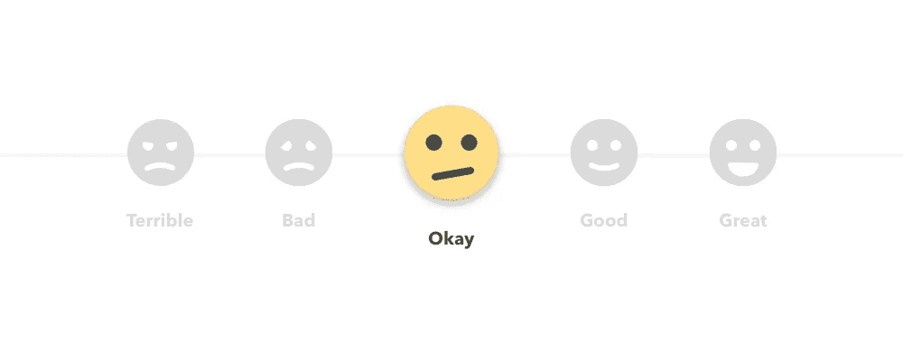

# 如何给出更好的设计反馈

> 原文：<https://medium.com/hackernoon/on-design-feedback-2263d9151690>

Image copyright Drafted 2017

作为一个身兼两职(设计师和反馈者)的人，我发现即使是最好的[设计](https://hackernoon.com/tagged/design)评论家也不擅长以最有益的方式向设计师传达他们的反馈。

我充其量是一个平庸的设计师，在给[反馈](https://hackernoon.com/tagged/feedback)时，我犯了大部分的罪，所以我写这篇文章是为了提醒自己给设计反馈，也提醒其他人:)

产品设计师自然渴望得到反馈。如果你在一个产品团队中，或者只是和一个产品团队一起工作，你可能会经常发现自己在看模型或设计。

优秀的设计师总是欢迎反馈，并经常要求听力范围内的每个人给他们反馈他们正在研究的任何概念。

然而，设计师得到的大部分反馈都是无用的。下面是一些你可以记住的事情，下次你的设计师让你“看一看”时，你可以给出更好的设计反馈

## 了解他们想要什么样的反馈

设计师寻求的反馈大致分为三类

1.  可用性反应(用户使用该产品时的感受)
2.  验证(这个设计实际上为用户解决了问题吗？)
3.  设计评论(这个设计有风格上的缺陷或创新吗？)

他们不一定总是在寻找第四类

4.集思广益替代设计解决方案

如果你想在给出设计反馈方面做得非常好，那么在提到它的时候，把你的反馈分成上面的 1-3 类——这样会更容易被接受，对你的设计师也更有帮助。

## 识别问题，而不是解决方案

当给出设计反馈时，你扮演两个角色之一——试验品或评论家。当你发现自己在说

> “那你为什么不把这个过滤器移到左边…”

停下来。设计师的工作是为设计问题创造解决方案。给出好的反馈时，你的工作是帮助他们发现问题并评估解决方案。试图创造解决方案是你能做的**最无益的事情**，除非设计师明确要求。

相反，你可以这样说

> “我不确定该怎么过滤，因为我一开始没注意到。”

## 通过你的专长带来价值(提示，这不是设计)

除非你也是一名设计师(在这种情况下，你不需要读这个)，你有一些其他领域的专业知识。由于产品设计几乎会影响到任何业务的方方面面，所以对于设计师来说，了解他们的设计会如何影响其他方面是很重要的，这也是你真正有价值的地方。

**如果你是一名工程师**，你可以就设计中暗示的会影响用户体验的工程权衡给出反馈。帮助设计者理解权衡是非常重要的，而不是给出做出选择的意见。例如，你可能会说

> “在这种设计中，每页的搜索结果数量会影响页面的加载时间。如果结果数低于 10，则接近即时。如果结果数量超过 100，可能需要几秒钟。”

这对设计师来说非常有价值，因为如果他们选择第二个选项，他们可能需要设计一个额外的加载屏幕，除非他们有你的反馈，否则他们可能不知道这一点。

**如果你是一名营销人员**，你可以就设计暗示的营销权衡给出反馈，这会影响营销团队的目标。重要的是帮助设计师理解你团队的目标，而不是提出要求。比如，不要说

> “我们真的需要在这个表单上询问用户的电子邮件地址”

相反，说

> “对于营销来说，我们有办法重新吸引对该页面感兴趣的人，这一点非常重要。”

如果你是一名销售人员，你可以就它将如何影响销售过程给出反馈。重要的是帮助设计师理解设计如何影响销售，而不是要求你认为有助于销售的修改。比如，不要说

> “我希望请求演示按钮在这里”

相反，说

> “体验的这一部分是在演示过程中让客户最兴奋的部分”

或者如果你想更挑剔的话，

> “在销售演示中最让客户兴奋的功能在新设计中似乎被淡化了”

这里的共同思路是，在提供反馈时，您应该关注

1.  帮助设计师评估他们的解决方案
2.  给设计师提供他们可能没有的信息
3.  意识到他们想要什么样的反馈

在极少数情况下，当你积极地与设计师合作设计时，你可以从上面做第四步。

**头脑风暴设计**

如果你的设计师让你帮助他们想出解决方案或给出建议，那很好——但这并不意味着你可以全权开始设计。为了在与设计师搭档时更有建设性，遵循上面的一些想法还是有很多好处的，主要是

*   专注于贡献你的专业知识(提示:这不是设计)
*   识别要解决的设计问题比解决它们更有帮助

如果你是一名设计师，现在你可以❤与你的团队分享，并获得更好的反馈。

> [黑客中午](http://bit.ly/Hackernoon)是黑客如何开始他们的下午。我们是 [@AMI](http://bit.ly/atAMIatAMI) 家庭的一员。我们现在[接受投稿](http://bit.ly/hackernoonsubmission)，并乐意[讨论广告&赞助](mailto:partners@amipublications.com)机会。
> 
> 如果你喜欢这个故事，我们推荐你阅读我们的[最新科技故事](http://bit.ly/hackernoonlatestt)和[趋势科技故事](https://hackernoon.com/trending)。直到下一次，不要把世界的现实想当然！

