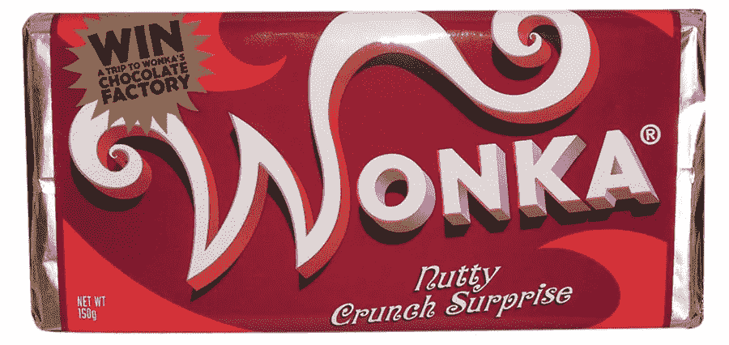

# 论不变性

> 原文：<https://medium.com/hackernoon/on-immutability-15409e8846bb>

W 帽子赋予比特币价值？为了清楚地理解这个古老而又有些抽象的问题的答案，我们必须从一个不同的角度来看待它。换个方式问这个问题。比特币*有*价值，为什么？价值真的是 T4 赋予网络的吗？还是网络已经有了内在价值？一些人认为，比特币的效用赋予了它价值，但随着费用越来越高，价格似乎越来越快。这是为什么呢？确认时间变得越来越慢，交易费用变得越来越贵，这意味着网络的价值越来越低，对吗？大众将很快意识到这一点，并转向更复杂的硬币或叉硬币，对不对？

大错特错。本发明的全部目的是创造一种表达价值的方式，而完全不涉及第三方。创造一个没有汇率操纵风险的环境，不管背后的政策如何，汇率操纵似乎总是会发生。关键是权力下放。权力下放将消除通货膨胀的隐性税收，并给我们一个数学上安全的锚，我们可以在上面停泊我们的商船，并在我们认为合适的时候在我们的海盗同伴之间分配掠夺物。

跟随累积难度最大的链是*整个要点。比特币协议如此难以篡改，这一事实正是赋予这种新的抽象存在生命的超级力量。比特币的共识规则构成了整个密码社区的命脉。如果比特币失败，所有加密货币都会失败，这一切都归结于网络的不变性。没有人负责的事实决定了一切。*我们已经有了比比特币更快更便宜的中央系统。你更愿意拥有什么——花 1 美分搬家的 100 美元还是花 10 美元搬家的 10 000 美元？

比特币的分叉和最大份额的替代币的出现是因为有人想要变得富有。*也许*比特币也是如此，*也许*我们永远不会知道，但我们知道的是，某个叫中本聪的人或东西开采了第一批硬币，然后消失了，留下大约一百万枚硬币未动。卖出那 100 万英镑会让 Satoshi 立即跻身全球金融精英的行列，但它仍保持原样。不管 Satoshi 的意图是什么，从那以后，比特币一直设法保持去中心化和不可改变。如果失败了，比如一群矿工决定通过成立卡特尔来试图改变协议并成功了，整个 T4 的秘密经济将会崩溃。立刻。如果任何给定的实体可以脱离主链，并不时铸造自己的货币，那么 2100 万硬币市值将几乎没有意义。比特币分叉*的价值需要*被输送回比特币，以便整个经济能够长期生存。在此之前发生的事情只是一个更大的傻瓜游戏。大多数替代币也是如此，除了那些目的与比特币完全不同的人。

缺乏中央发行人和网络的可预测性是比特币的价值所在。它是自己的野兽，如果你愿意，它是一种新的生命形式，唯一真正威胁到这种生命的是人类的愚蠢。这种看似丰富的资源威胁着我们星球上许多美丽的东西，包括这个脆弱的新生命。如果你想让这些新技术改善你的生活，不要学习经济学或如何预测市场。研究技术本身，它背后的数学和博弈理论。剩下的只是一个纸牌屋。