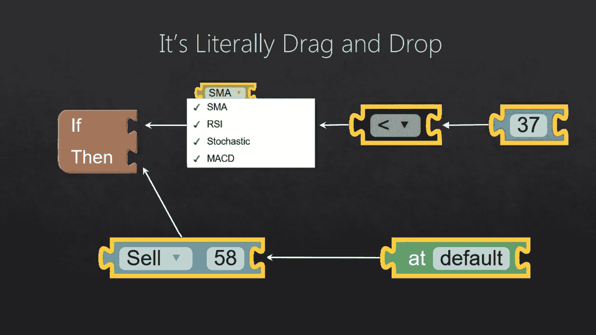

# 未来的自动交易系统

> 原文：<https://medium.com/hackernoon/on-kloudtrader-and-visual-programming-5161e1e2b89f>

三年前，当 KloudTrader 被构思出来时，人们的想法是，散户希望对交易策略自动化有更大的控制权。我们设想的未来不是简单的触发器和规则引擎，而是每个人都可以毫不费力地开发出与华尔街专业定量分析师不相上下的复杂交易策略。快进 3 年，编码现在被认为是[金融领域的一项基本技能](https://www.bloomberg.com/news/articles/2017-10-19/coders-who-trade-wall-street-designs-its-staff-for-the-future)，然而它既不容易也不简单。有效的软件开发人员和程序员通常需要多年的经验和实践。对于那些因为缺乏计算技能而被解雇的普通专业交易者来说，没有其他选择或解决方案。由于机器的出现，几十年的经验和机构知识将被浪费，无数人将失业。

Our Strategy Creation System

我们不相信这样的未来。在 KloudTrader，我们的目标是降低计算机行业的门槛。计算思维是所有人都具备的能力。当你制作食谱或写下购物清单的时候，你就在进行计算思维。人机有效交互的主要障碍主要是由于文化和经济原因；很少有人研究更好的界面系统，少数快速开发工具要么已经寿终正寝，要么已经不再流行。然而，在诸如[科学软件](http://www.ni.com/en-ca/shop/labview.html)、[游戏开发](https://docs.unrealengine.com/latest/INT/Engine/Blueprints/)和[音频/视频](https://cycling74.com/products/max/) [特效](https://vvvv.org/) [产业](http://puredata.info/)等利基领域，这类工具已经蓬勃发展，并且很可能在可预见的未来继续发展。

KloudTrader 由开源技术支持。我们的前端构建在谷歌的 Blockly T1 中，而我们的后端由 T2 Quantopian 的 zip line T3 驱动。通过这种方式，我们提供了一种建立在可信且经过充分测试的基础上的图灵完全编程语言，同时在程序创建方面提供了无限的灵活性，为所有技能水平的用户提供了一个强大的解决方案。一旦你连接了你的经纪账户，创建了你理想的交易策略，回测它，并完全在云端运行；剩下的我们会处理。KloudTrader 预示着一个有着丰富历史的研究领域。加上像 [Bubble](https://bubble.is/) 这样的平台，我们代表了可视化编程和算法交易的下一步。有了 KloudTrader，由于我们高度直观的界面，即使是业余爱好者也可以在几分钟内掌握它的用法。i̇f:听起来你会喜欢的，我们强烈推荐你注册我们的邮件列表。敬请期待！

P.S. KloudTrader 正在[招聘](https://angel.co/kloudtrader/jobs)！我们正在寻找一名首席技术官/高级软件工程师。如果这听起来很有趣，[给我们发电子邮件](mailto:hi@kloudtrader.com)。