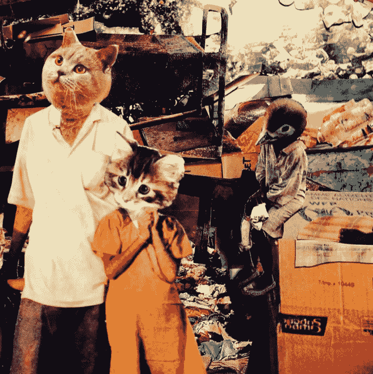

# 创意行业的机遇

> 原文：<https://medium.com/hackernoon/on-opportunity-in-the-creative-sector-5f206117562f>

建设创意部门的集体能力既是最大的机遇，也是最大的障碍。随着数字时代趋向于知识产权消费的大幅增长，同时也使其更容易商品化，文化参与的经济学[将取决于能够与“再生文化”的新兴叙事互动的机构再生文化视人们为他们感知和](https://hackernoon.com/tagged/engagement)[环境](https://hackernoon.com/tagged/enviroment)的管理者，肩负着创造一个繁荣星球的使命。

collage by Pilar Moreno

巴克明斯特·富勒和阿尔伯特·爱因斯坦都有一个著名的评论，当面对根本性的社会危机时，“新思维”的必要性。如今，“生产率”和“增长”是相对无意义的公理，除非被“正念”(有趣的是，作者莎伦·萨尔茨堡将东方语言学对“正念”一词的理解等同于西方的“创造力”概念)方法论所语境化。类似地，创造“再生”文化叙事的机会通过暗示一种繁荣的存在而不是“勉强度日”来取代“可持续性”的架构。正如爱默生在他的文章《诗人 T4》中所写的那样，“一种新的高贵是在小树林和牧场中被授予的，而不再是在城堡中或在剑刃旁。”

简而言之:*故事就是演变的*。

只有创意部门掌握着促进文化运作系统的关键，这一系统将虚无主义、自我毁灭的唯物主义驱动的消费表达方式重新导向体验市场，这有利于更健康的地球生物系统实践，以及人类共处中更“开放”的个人-人际-社会动态。

一个小小的例子是[自 2006 年](http://www.statista.com/statistics/191240/participants-in-hiking-in-the-us-since-2006/)以来，徒步旅行在美国的受欢迎程度稳步上升，阿尔伯特·加缪(“幸福物理学”)和日本人( *Shinrin-yoku* 或“森林沐浴”)一直认为这是一种与再生个人幸福相关的做法。因此，“徒步旅行路线”为各种机构提供了一个文化参与的流行节点，这些机构包括内城青年组织、医院、冥想社区、国家公园、非政府组织、移动应用、增强现实、新闻和真人秀。人们甚至可以建立一种以个人行走的英里数为基础的货币。

任何文化转变的成功都涉及其整合各部门的能力(如医疗保健、制造业、农业等)。)变成一个与规模无关的合作平台。良好的领导力对于通过远见卓识的原则、清晰的沟通和健康的关系建立信任至关重要。应该代表最大的声音多样性，繁荣应该通过艺术、创业、技术、信息和生计等载体获得和参与创新表达的财富来反映。

基于再生平台的操作系统将创造力置于这些文化趋势的核心。

一个趋势是，公私合作模式在创意部门变得越来越普遍，以便将管理、繁荣、效率、透明、创新和社会影响等组织特征编织在一起。虽然作为一种运动，平台合作社还处于幼稚阶段，但作为一种新兴的组织形式，它可能处于这一趋势的最前沿，因为它能够将工人拥有和管理的业务结构与在线点对点共享服务相结合。作为一个组织前提，这将所有权和治理分配给那些为平台创造最大价值的人。随着所有权在未来市场中变得更加分散，合作共享平台可以将用户对访问、社区、可靠性、生计和道德的并发需求转化为更加平衡、公正和富有创造性的生活方式。

无论是各大媒体网络、创业公司、教育机构，还是非营利组织；越来越多的机构必须真正致力于激励他们的社区。

然而，灵感不是无限的资源——它需要好奇心、耐心，最重要的是那种以各种形式揭示真理的创造力。尽管学者萨斯基亚·萨森(Saskia Sassen)认为“掠夺性编队”可能会很难尝试，但制度无法从试图为了个人利益而否认现实相互依存的驱逐理论中获得灵感。脱离了这一真理，通过宣传一种缺乏可能公开进化人类审美理解的文化叙事的社会角色，产生了自我衰退和自我腐败的机构。

由于我们与我们的感官如此紧密地联系在一起来处理我们的存在，当它们遇到不可否认的灵感时——在被剥夺了丰富的经验可能性之后——它们的刺激变得更大。形式可能是托马斯·塔利斯的 *Spem in Alium* 或者披头士的*有没有你*。然而，除非一个机构能够在不要求“信仰”的情况下服务于它的目的，否则它的使命将充满偏狭和愚蠢。我们社会正在发生的变化是，我们的相互联系正在成为常识。它现在就像深奥的传统一样经常出现在广告活动中。随着信息更自由地通过各种曾经看似不可渗透的文化薄膜流通，即使像埃克森美孚和可口可乐这样的巨头也开始认识到我们作为人类的真正意义，以及我们的机构永远保护所有生命的责任。

> [黑客中午](http://bit.ly/Hackernoon)是黑客如何开始他们的下午。我们是 [@AMI](http://bit.ly/atAMIatAMI) 家庭的一员。我们现在[接受投稿](http://bit.ly/hackernoonsubmission)并乐意[讨论广告&赞助](mailto:partners@amipublications.com)机会。
> 
> 如果你喜欢这个故事，我们推荐你阅读我们的[最新科技故事](http://bit.ly/hackernoonlatestt)和[趋势科技故事](https://hackernoon.com/trending)。直到下一次，不要把世界的现实想当然！

