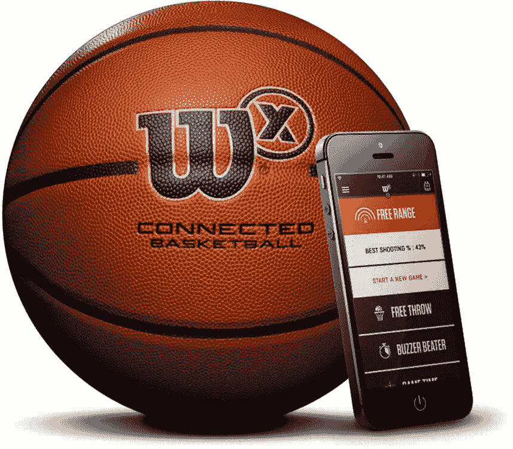

# 粒子、物联网和解决难题

> 原文：<https://medium.com/hackernoon/on-particle-iot-and-solving-hard-problems-cf3a210a36b1>

[粒子](https://hackernoon.com/tagged/particla)是一个物联网平台。这是一种非常专业的描述我们的方式，这在科技发达的湾区引起了很好的共鸣。但是，用简单的英语来描述我们的工作，更好的方式是:**我们帮助生产实体产品的公司将这些产品放到网上**。我们为他们的产品添加连接性(Wi-Fi 或蜂窝)，我们提供安全性和设备管理，我们让他们推出软件更新，并且通常我们帮助他们克服与我们已经开始称之为“物联网”的激动人心的新行业相关的许多障碍和技术挑战。

但是让我们倒回去一点。*到底什么是*物联网，为什么像 Particle 这样的公司需要存在？

物联网已经以某种形式存在了几十年。在早期，我们习惯称它为*遥测*(字面意思是“远程测量”)，后来当我们开始添加远程控制时，我们开始称它为*远程信息处理*。然后，在 90 年代，我们开始称之为*机器对机器*，或 M2M。物联网这个术语诞生于 1999 年，并在 2010 年代初真正实现了飞跃。业内资深人士会告诉你，这些术语的意思都略有不同，但出于各种意图和目的，我们只是随着市场的扩大不断重塑这个领域。

三十年来，除了名字，其他的东西都变了。有线连接正在变成无线连接。本地网络和服务器正在被云取代。但也许最重要的是，物联网的组成部分——计算和连接——已经变得便宜了很多。给设备增加一台电脑和一台收音机的成本只是几年前成本的一小部分。

这也有助于我们现在在口袋里随身携带智能手机——为我们所有的连接“东西”提供小型便携式接口。由于连接很便宜，我们都带着屏幕，感觉是时候让物联网爆炸了。

If this is why we’re doing this whole IoT thing, then GET ME OUT OF HERE

但是，虽然有一些东西已经联网——比如 Nest 恒温器、特斯拉电动汽车和通用电气风力涡轮机——但感觉并不是所有的东西都联系在一起。相反，感觉你有几个市场领导者在创造顶级的物联网产品，周围是一堆毫无价值的垃圾。与此同时，对于每一个正在连接的“事物”，有成千上万个“事物”没有连接。

经常感觉物联网被夸大了。为什么？是什么阻止了这场革命按照预期的方式发生？

以下是物联网的肮脏小秘密:**打造一个功能良好的物联网产品真的真的很难。**

很难明确为什么很难打造一款优秀的物联网产品。那是因为你要做好大约一千件事情，任何一个错误都可能让你沉没。您可能会在天线设计、安全实施或可靠的网络方面出错。您的服务器可能会停机。你的设置过程可能在 iOS 10 上工作，但在 iOS 11 上出错，或者 Android 版本可能在除三星 Galaxy S8 之外的所有手机上工作。你希望通过无线固件更新来保护你的设备，但任何可靠性问题都可能导致[砖块设备](http://mashable.com/2015/04/20/wink-bricks-hubs/)，任何安全问题都可能将你的设备群变成[僵尸网络](https://en.wikipedia.org/wiki/2016_Dyn_cyberattack)。

实际情况是，公司低估了构建物联网产品的复杂性。他们投入有限的资源并设定紧迫的期限，然后他们的物联网团队无法交付。 [Gartner 在 2016 年报告称](http://www.gartner.com/newsroom/id/3185623)75%的物联网项目将花费两倍于计划的时间:

> Gartner 预计，四分之三的物联网项目将面临高达 100%的进度延期，从而导致成本超支。项目越是雄心勃勃和复杂，进度超支就越大。对于一些项目来说，为了保证项目如期进行，需要做出一些妥协，这将导致在性能、安全性或与现有流程的集成方面出现重大缺陷。从中长期来看，这些妥协将要求物联网项目被重构，甚至可能被召回和重新部署。

思科最近的一项调查也支持了这一估计:在接受调查的 1，845 名业务或 IT 决策者中，74%的人认为他们的物联网项目未能实现。

A stock photography representation of how it feels to try to launch an IoT product in 2017 without support.

Particle 于 2013 年推出，旨在让人们更容易构建物联网产品。在我们自己的[失败的消费者物联网产品](http://mashable.com/2013/01/20/kickstarter-fail-post-mortem/#HLdLKZ80MaqT)之后，我们开始为构建物联网产品的工程师推出开发工具。我们接受了严峻的挑战，例如实施适合 RAM 10K 的基于软件的安全性，以便在资源受限的微控制器上运行，可靠的无线固件更新工具，以及针对蜂窝连接设备的带宽优化。我们建立了一个供应链来提供物联网硬件。我们建立了一个 MVNO 来提供 SIM 卡和数据计划。我们制造了硬的东西，这样我们的客户就不必这么做了。

成功了。粒子的易用性让我们[相当受欢迎](https://www.hackster.io/particle)。我们已经建立了业内最大的开发人员和工程师社区，超过 120，000 人正在使用 Particle 构建物联网产品。我们的客户以 1/10 的成本在 1/3 的时间内将他们的物联网产品推向市场，他们的产品安全、可靠，并且“工作正常”。

结果我们建立的公司有点…奇怪。是的，我们是一个云平台。也是一家硬件公司。也是一个手机运营商。我们提供专业服务。我们构建定制解决方案。我们什么都做。

这听起来与*聚焦*的普遍创业精神背道而驰。当你创办一家初创公司时，你应该做一件事，并且做好。但是如果我们只做一件事，我们就不能解决我们客户的问题，因为那样的话*他们*将不得不处理集成物联网技术堆栈所有不同层的所有复杂性。我们接受这些挑战，因为我们的客户需要我们这样做。

An Opti stormwater management system, powered by Particle

如今，粒子正在为新兴的物联网提供动力。你可以在雨水系统中找到我们，确保在暴雨期间水库不会溢出。我们在加油站下面，确保燃料箱没有泄漏。我们在天然气钻井平台上，监测甲烷排放，以符合环保局的规定。我们正在启动工业马达，确保它们正常运转。我们在咖啡机、宠物玩具、汽车和园艺系统中。

你会在 IDEO、Lunar Design 和 Mindtribe 建造的原型中找到我们；在 Met Gala 的[上，穿着 IBM Watson 设计的礼服](https://qz.com/674342/ibm-watson-co-designed-the-most-high-tech-dress-at-the-met-gala/)；在[徽章中的 Twilio 信号](https://twitter.com/jeffiel/status/865693084691988480)；在谷歌追踪他们的校园自行车。

你会发现我们在财富 500 强中一半的 R&D 实验室里，在财富 500 强中 90%的 IT 公司里。我们在 P&G，美国国家航空航天局，以及它们之间的任何地方。

我们在一个激动人心的时间处在一个激动人心的地方。物联网刚刚起步，粒子正在悄然扮演重要角色。现在是我们大声一点的时候了。

今天，Particle 宣布我们已经筹集了 2000 万美元的新投资，由 Spark Capital 领投 Slack、Twitter、Oculus 和 Warby Parker 等公司的早期投资者。Spark 因投资于拥有一流产品和宏大愿景的伟大创始人而赢得了声誉。我很感激他们认为我们值得他们付出时间和精力，也很高兴他们加入我们的董事会。

筹集这笔资金对我们来说是一个重要的里程碑——它使我们能够在增长方面进行大量投资。我们将利用这笔资金为更多的客户解决更多的问题；我们正在壮大我们的团队，以便我们能够与更多公司合作并为其提供支持，我们将扩大我们平台的工作范围，以进一步简化构建物联网产品的过程。

目前，将物联网产品推向市场需要花费数百万美元。我们的目标是让它花费数千美元。在这种情况下，整个行业都将发生革命性的变化。网络为零售和出版等行业所做的，物联网将为制造和物流等行业所做的。我们会在那里，带头冲锋。

*要了解更多关于 Particle 的 B 轮融资，请阅读来自* [*【安德鲁·帕克(星火资本)*](/@andrewparker/our-investment-in-particle-5a31dbe2f71b) *和* [*帕特里克·埃根(高通创投)*](/qualcomm-ventures/bringing-cellular-connectivity-to-the-iot-long-tail-8728efafdcd1) *的投资公告。*