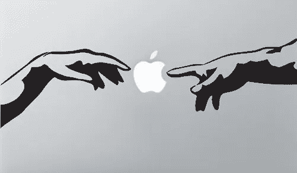
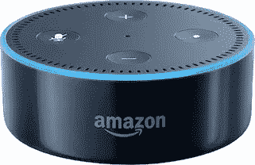

# 第八天，上帝造出了 iPhone，他觉得很好

> 原文：<https://medium.com/hackernoon/on-the-8th-day-god-made-the-iphone-and-he-saw-that-it-was-good-352670481f7a>

于是，这个人给所有的牲畜、空中的鸟和所有的野兽起了名字。但是对于亚当来说，没有找到合适的伴侣。于是，上帝让那人沉睡了。在他睡觉的时候，他抓住了那个人的一只手，把一部 iPhone 放在了里面。~不是创世纪

我可能有点记错了我的经文，但你明白了。iPhone 的推出是技术进步的关键时刻，有人可能会说这是天赐之物。

10 年前 iPhone 的推出将摩尔定律带入了手持时代。[摩尔定律](https://en.wikipedia.org/wiki/Moore%27s_law)观察到集成电路中的晶体管数量大约每两年翻一番，这意味着更快的计算机。然而，这一声明本身并不意味着什么。规模经济是将这些提高的速度带给大众所必需的。80 年代和 90 年代，个人电脑承担了重任，这促使更多的资金投入到英特尔等芯片制造商的研发中。这反过来又确保了摩尔定律的快速发展。从 2007 年开始，iPhone 成功地将电脑内部进一步小型化。这并不是说没有取得进展，但 iPhone 充当了加速计算机小型化所必需的经济驱动功能。快进到现在，最新的手机足够强大，可以创造类似桌面的体验。

除了牛虻说这是为已建立的电话行业，除了这为通信和互联网带来的革命，不仅仅是从这项发明中诞生的新的应用程序行业，iPhone 为我们今天谈论的每一个*下一个大事件*埋下了种子，在它问世 10 年后。

这是怎么回事。

你有没有想过苹果公司是如何一年卖出 2 亿部 iPhones 的？这不是魔法。这是一个全球联系的经济体，采购计算机芯片、照相机、触摸屏和电池。这里有很多钱。2007 年，在最初的 iPhone 发布后，智能手机领域成了众所周知的金矿。自然，大量竞争者涌入，试图从苹果、三星和其他手机制造商那里赢得利润丰厚的大额交易。有些兴旺，有些衰落。但最终结果是为最终消费者创造了难以置信的价值。

市场压低了价格，有效地将许多组件商品化。为了保持利润，制造公司被迫创新，制造更快、更强大、更便宜的组件。只有最具创新性的幸存下来，在尘埃落定后，高科技智能手机的价格大幅下降，而质量却有所提高。现在，随着流程的到位，公司开始寻找其他市场来销售他们的芯片、相机和屏幕。幸运的是，虚拟现实、物联网和无人机的创造者正好在那里利用更低的成本、更小的占地面积和更强的计算机能力

所有这些创新导致了新一代的制造者、黑客和 DIY 者。想想 20 世纪 70 年代和 80 年代硅谷的电脑爱好者趋势，正是这种趋势催生了苹果，只不过这次是智能手机技术。它发生在中国，更确切地说是深圳，而不是美国。

这部纪录片很长，但相关的部分是在 1:01:37 马克。所示的商品化智能手机技术允许制造商将类似弗兰肯斯坦的设备组装在一起。这是解决产品缺陷的一种极其廉价的方法。一旦有了火花，一切都是为了细化和走向市场。这场运动的核心？DJI。如果你见过无人机飞行，或者看过无人机拍摄的视频，很可能是他们的。 [DJI 于 2006 年在——你猜对了——深圳创办了](https://www.forbes.com/sites/ryanmac/2015/05/06/dji-drones-frank-wang-china-billionaire/),将 DIY 无人机框架和飞行控制系统组装在一起。2016 年，他们实现了 15 亿美元的收入。

在物联网智能家居部门，我们现在都认识到了这一点:

事实证明，任何有一点技术和一些闲钱的人都可以建立自己的。echo 最有价值的部分不是独特或专有的硬件，而是软件。

 [## 构建基于 Raspberry Pi 的 Amazon Echo 的最简单方法

### 不久前，我们详细介绍了如何使用 Raspberry Pi 制作自己的亚马逊 Echo 设备，但如果有任何问题…

lifehacker.com](http://lifehacker.com/the-simplest-way-to-build-a-raspberry-pi-powered-amazon-1794218212) 

坦率地说，这是一个令人难以置信的消息，特别是亚马逊向第三方硬件制造商开放 Alexa API，允许与 Alexa 生态系统集成。这个例子完美地说明了从硬件角度构建可用的物联网设备变得多么容易。组件的价格既便宜又简单，我们可以在自己的公寓里为物联网公司奠定基础。这种准入将确保更多拥有较少资本的人能够参与科技经济。我们都从中受益。

所以感谢上帝给了我们 iPhone——我真的不能责怪亚当吃树上的果子，当我得到一部新的 iPhone 时，我也整天想着苹果。

点击这里关注马修·比金斯或者 T2 的 LinkedIn 了解更多

> [黑客中午](http://bit.ly/Hackernoon)是黑客如何开始他们的下午。我们是 [@AMI](http://bit.ly/atAMIatAMI) 家庭的一员。我们现在[接受投稿](http://bit.ly/hackernoonsubmission)并乐意[讨论广告&赞助](mailto:partners@amipublications.com)机会。
> 
> 如果你喜欢这个故事，我们推荐你阅读我们的[最新科技故事](http://bit.ly/hackernoonlatestt)和[趋势科技故事](https://hackernoon.com/trending)。直到下一次，不要把世界的现实想当然！

