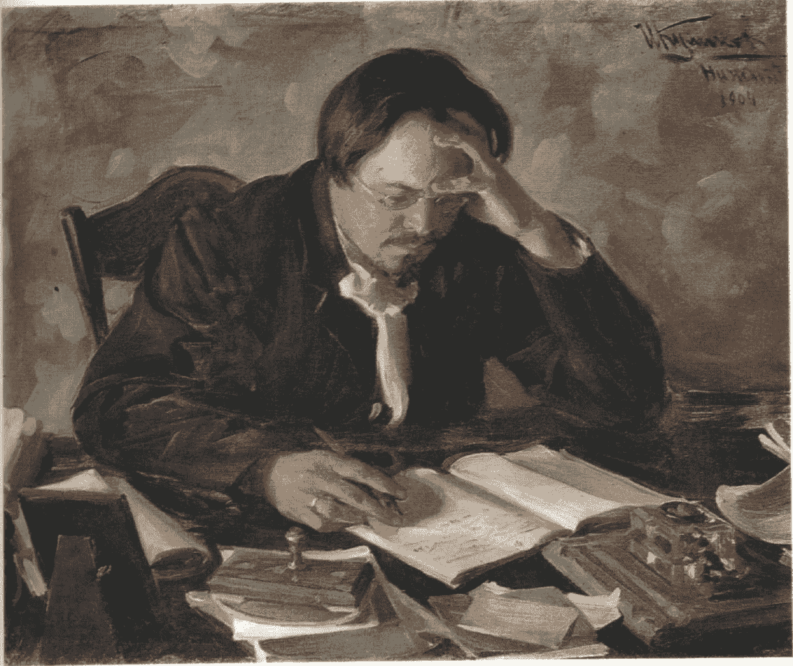

# 关于“侧挤”的概念

> 原文：<https://medium.com/hackernoon/on-the-concept-of-a-side-hustle-f4019f5f3790>

“Painting of Russian writer Evgeny Chirikov” by Ivan Kulikov

## 激情、付出和毅力

在我整个童年时期，我父亲每天工作 14 个小时，做着他讨厌的工作。他会在我睡着后回家吃冷餐。在周末，他做任何他能做的兼职来赚钱，这样我们就可以搬到郊区，那里的学校更好。

在漫长而疲惫的工作周的间隙，我父亲向我灌输了下面的信息:不要为了钱而工作，要找一份你热爱的工作。这是幸福的关键。

他的基准测试是这样的:如果你在工作中做的事情是你无论如何都会免费做的——因为你热爱它——那就是理想的工作。

## 我跑着寻找…

我接受了这个建议，并遵照执行。我跑步是为了寻找一件本身就是奖励的事情——让职业道路见鬼去吧。

我跑到艺术学校。当我对那次冒险失去热情时，我跑去主修哲学。我从那里来回跑政治学。我跑遍了整个学术界，确保我找到了能确保我不会像我父亲工作时那样感觉的东西。

我在 20 多岁的时候经历了一些非常不愉快的情况——都是为了找到那份通过了我父亲测试的工作。

事实证明，我最终进入了一个正常的朝九晚五的办公室工作。为什么？因为那是钱的所在——因为生活中有比职业成功更重要的事情，而这些事情需要钱。我每天做的大部分事情都不是我会免费做的，所以这份工作没有通过我爸爸的测试。但是正如我们大多数人已经意识到的，成长的一部分就是意识到我们的父母在很多方面都是错的。对不起，爸爸，但作为一个千禧一代，我不得不“破解”你的建议。

## 诀窍:终端侧打

我去过的所有地方:艺术、哲学、政治学——都是死胡同。我最终意识到,**写**是自始至终的事情。我想做的，我会做的——*正在做的——是免费的**写作**。我只用了 14 年左右的时间就意识到了这一点。*

所以，是的，我一份接一份的工作。我用电子表格做事，我给人们做绩效评估，我给客户送报告并与客户谈判。作为一个 20 岁的人，我会对这样的工作描述嗤之以鼻。我认为那样的工作不会满足我——它没有通过我父亲的测试。

但现在我更清楚了。就像所有的事情一样，我破解了，我找到了一个解决办法。我有兼职。我在网上免费写这样的东西。我这样做是因为我真的很喜欢。把这些东西写在纸上，并且知道我认为对你们读者有帮助的想法——不管它们可能是多么半生不熟——让我感到很满足。

那么我为什么要转述这一切呢？这怎么能推广到其他人身上呢？我认为兼职的概念可以让我们摆脱那种困扰的感觉，即我们没有在给我们报酬的工作中榨干我们的一切。它为我们的激情生活和呼吸提供了一个安全的地方，而不会被商业的担忧和妥协所污染。

这听起来是不是太嬉皮了，太不成熟了？也许是吧。我很难对此做出评价。但我知道的是，当我写作时，我感到激动和充满活力——尤其是那些抓住我兴趣的想法。但是，如果我也不得不继续修补和担心如何赚钱，我不太确定我会得到那种刺激。这越成为工作的一部分，就越像是一份正式的工作。所以现在，我把它作为一个终极副业。刺激是第一位的，钱是第二位的。

## 市场的变幻莫测

在我内心深处，我认为这可能是一个更可持续的模式。我可以修改我的作品，以求在写作时做得更好，而不是试图让《T2》作为一个产品更有市场。然后，如果当我已经在做的事情出现了市场，钱就会来了，而我不必扭曲我的写作来试图与市场挂钩。我的工作可以吸引和塑造部分市场——而不是相反。

这是一个疯狂的梦吗？大概吧。但是现在，我可以继续做我正在做的事情——在不同程度上。如果成功了，我可以写我喜欢写的东西，并获得报酬——太好了！如果没有，我会继续写我爱写的东西。我将能够保持这样做的兴奋感，因为我这样做是为了写得更好，而不是将其用于职业生涯。这是一个奇怪的立场，当然，但我最近想了很多。

所以我想这里有一个更普遍的想法:如果你有一件你喜欢做的事情，但它不符合人们愿意为之付出的东西，那就把它作为一个终极目标。坚持做下去，磨练。不要磨砺它以使它更适合市场，而是磨砺它以使它本身更好。因此，当市场需求的风向改变时(这种情况经常发生)，它们可能会朝着你的方向吹。你猜怎么着。你所要做的就是把你的东西货币化*继续做你的事情——就像你一直做的那样*。那该多酷啊。

如果你能支持我的副业，我会很高兴，不需要钱。订阅我每周一期的简讯，[***【wool gathering】***](http://tinyletter.com/mike_sturm)**。每周一封邮件。就是这样。**

> [黑客中午](http://bit.ly/Hackernoon)是黑客如何开始他们的下午。我们是 [@AMI](http://bit.ly/atAMIatAMI) 家庭的一员。我们现在[接受投稿](http://bit.ly/hackernoonsubmission)，并乐意[讨论广告&赞助](mailto:partners@amipublications.com)机会。
> 
> 如果你喜欢这个故事，我们推荐你阅读我们的[最新科技故事](http://bit.ly/hackernoonlatestt)和[趋势科技故事](https://hackernoon.com/trending)。直到下一次，不要把世界的现实想当然！

