# 指数视角下的⭐️

> 原文：<https://medium.com/hackernoon/on-the-exponential-view-75cd24525d14>

以下是我 2016 年 12 月 1 日在旧金山做的一次演讲的文字。

观众是我的通迅， [*指数视图的读者。*你可以在这里报名。](http://azeem.io/s)

这是一份很长的(7500 字)谈话记录。如果方便的话，你可以扫描一下，看看幻灯片和附带的展品。或者甚至不止一次地阅读它…

为了清楚起见，这篇文章稍加编辑。

*指数观点*有目的。在所有表情符号和所有拼写错误之间，这就是它的意义所在:

*   变化的速度正在加快。
*   我们看到的变化是不可避免的。它们有一种必然性，这并不意味着是一种技术乌托邦主义，这只是一种务实的观察。
*   技术、规范、群体、身份、文化、政治经济和商业体系之间的关系将会改变，并将变得紧张。
*   鉴于我们知道所有这些，我们可以选择成为旁观者或参与者，我希望我们所做的和我们在阅读*指数视图*中所涵盖的一些材料时共同做的是开始成为参与者。我不是给你如何参与的方向，我真的建议我们应该是参与者和旁观者。

## 关于我

这是 1976 年我上学的第一天。那时我住在撒哈拉以南非洲的赞比亚。右边是我的朋友雷汉，我最近通过[脸书](https://hackernoon.com/tagged/facebook)重新联系了他。他现在被称为[冷冻博士](http://drfreeze.com/)，他在奥兰治县从事非侵入式塑身工作。我可以给你一个好价钱。

但是我觉得很重要，这个出发点很重要。我们经常从我们来自的地方获得灵感，我到底在赞比亚做什么？

我的父亲受过经济学家和会计师的训练，他现在退休了，但那时他是一名经济学家，在赞比亚[建立那种我们在美国和英国等国家视为理所当然的机构，以使国家运转。赞比亚刚刚从英国获得独立。它需要一个更深入的公务员制度，它必须建立自己的法律制度，创造自己的分配制度等等。我很早就认识到了经济制度对于让社会变得更加富裕和运转的重要性。](https://books.google.co.uk/books?id=zKdLAAAAYAAJ&dq=namboard%20zambia%20banda&source=gbs_book_other_versions)

当我在赞比亚的时候，那是一个内陆国家，没有很大的出海口，这是 20 世纪 70 年代。我们没有种类繁多的玩具。

右上角的是 Lexidata，它是一台机械计算机，可以让你做这些常识和智商测试。儿童用的橙色包装和青少年用的紫色包装，我们有，我非常喜欢。这是一个固定数量的问题，即使玩了几年，我仍然没有把所有的事情都做对。

但是我们的另一件东西是这个双音视频游戏机。它有一位图形&插入你的电视监视器。我们有很多游戏，比如乒乓球和篮球，当然还有射击游戏。事实上，我唯一能找到的照片都是低分辨率的，因为在 70 年代末，一切都是低分辨率的。

你可以看到，我是在一个建立机构的社会环境中长大的，这个社会没有那些正在运作的早期 T2 技术。Lexidata 甚至没有一个芯片，它就像一个机械计算设备。双音确实有芯片在里面。

这些东西——机构和芯片——在那张照片拍摄后的过去 40 年零 6 个月里真正影响了我。

## 技术时代

我们生活在当今的科技时代，没有什么比这张图表更能说明这个问题了。这显示了市场资本在过去 10 年中的变化。

早在 2006 年，世界上最大的公司是石油公司、企业集团、电力公司和金融业。微软在那份名单中。然而今天基本上都是科技公司。

这是一个从一个部门转移到另一个部门的巨大价值变化。你可以计算一下，仅在 10 年内，排名前七的公司就创造了两万亿美元的新价值。

我们绝对生活在科技时代。

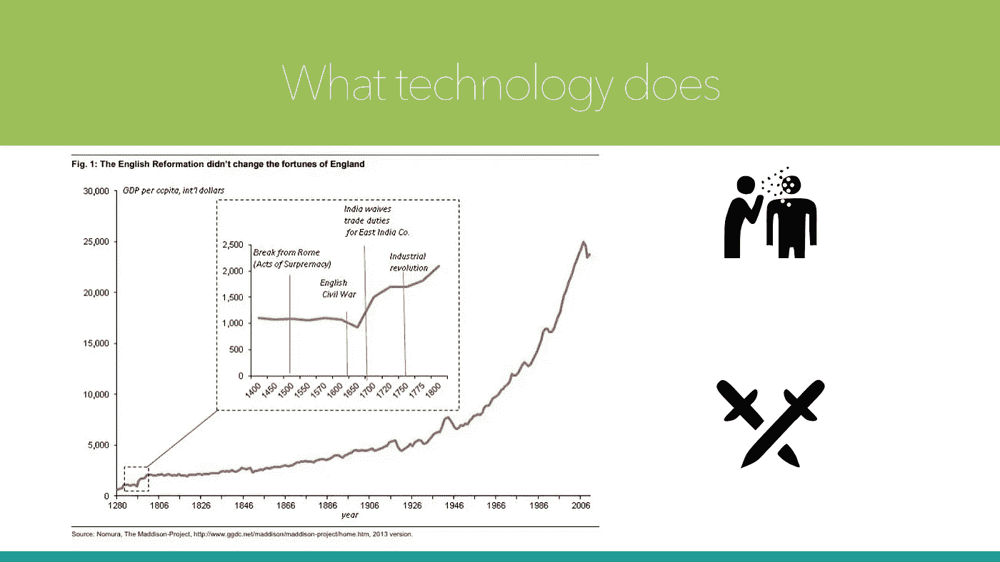

思考技术实际上做什么和什么是技术是很重要的，我们在技术行业工作，但它到底是关于什么的？

如果你看看这个图表，看看英格兰 800 年的收入。你看到这条向右上方的曲线。我知道你们中的一些人在创业计划中使用了这张图表，但这是真实的数据。这是真实的数据，从本质上说，技术让我们变得更富有，在这种上升趋势中，只有两件事真正造成了问题。

首先是疾病。你会得到黑死病，这是一种袭击欧洲的瘟疫，它让人们变得更加贫穷。第一次世界大战后的西班牙流感也是如此。

还有战争。第一次世界大战，第二次世界大战，英国内战，也使人们变得更穷，我们通过技术所做的是减少疾病的数量，实际上我们生活在一个比我们作为一个物种真正生活过的更和平的时代。我们在灾难性战争和管理方面做得相当好。

总的来说，这是一幅积极的画面。

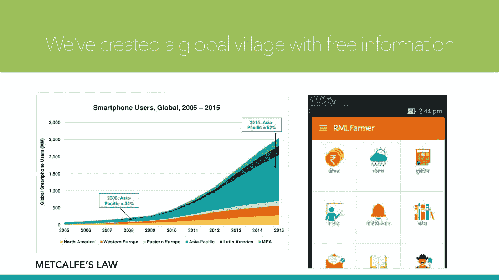

我们用免费信息创造了这个地球村。

试想一下，10 年前，没有人拥有智能手机，而今天，地球上大约 50%的人拥有智能手机。(*注:* [*参见对此的澄清。*](/@azeem/great-point-1f24fd359c1b#.wtawishmq) *)* 那简直不可思议。

在接下来的 5 到 10 年里，拥有智能手机的人将会增加几十亿，这种变化出现的速度有多快值得思考。

在右边，你可以看到一张 [RML 农民](http://www.rmlglobal.com/web/)的截图。这是一项为印度农民提供的服务，他们非常贫穷，生活在偏远的农村地区，这基本上是给他们一个彭博或路透社的终端在他们的桌面上，在他们的手中。

我很幸运地在 2006 年孵化了这项业务，当时我们将它交付给功能手机，这是一个挑战。10 年后，这些农民可以进入商品市场并获得定价，从而更好地做出日常决定。

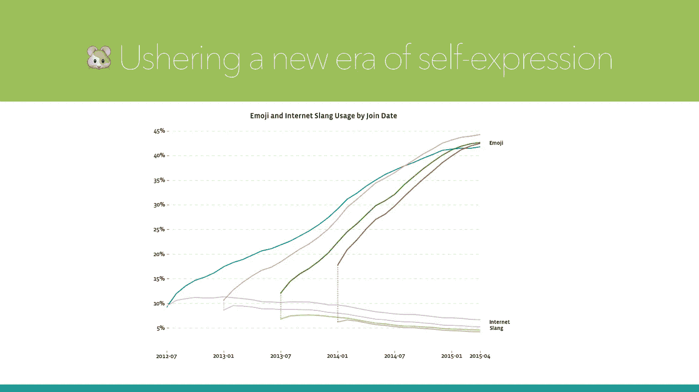

技术正在以各种方式引领一个自我表达的新时代。不仅仅是垂直视频和 Snapchat。只考虑表情符号为了论证。当苹果在 2011 年推出表情键盘时，你会看到 Instagram 中表情使用的惊人增长。

这是 Instagram 的数据以及“WTFs”和“LOLs”的衰落，因为人们希望以新的方式表达自己。回想一下两三百年前人类的表达方式，它要有限得多。([表情符号甚至进入了工作场所。)](https://www.ft.com/content/f2b672ca-0257-11e6-99cb-83242733f755)

我们在人工智能领域也取得了惊人的突破。你还记得今年早些时候[谷歌 DeepMind 的 AlphaGo 击败世界围棋冠军](https://www.theguardian.com/technology/2016/mar/15/googles-alphago-seals-4-1-victory-over-grandmaster-lee-sedol)吗？我在我的房子里跑来跑去，大喊，“这就像登月一样，人们对此说得还不够多。”

我认为这个特别有趣的地方并不在于有 10 个⁷⁰可能移动的计算空间，暴力太难了，所以你必须想出新的方法。

那是……那是第 37 招。在其中一场比赛中，AlphaGo 走了一步人们不理解的棋。它已经下了数千万盘围棋，并且走了一步棋。Lee Sedol 看起来很吃惊，评论员形容它很漂亮。

这不是深蓝蛮力强行通过国际象棋。这不是一个计算如何优化搜索空间的聪明算法。这是一个算法，找出一种新的思考问题的方式，一种创造性的思考问题的方式。

这是 AlphaGo 玩这些游戏时发生的令人震惊的事情，现在已经引发了许多围棋大师试图理解新的路线，新的策略，这些都是我们作为人类对游戏所做的所有研究中没有想到的。

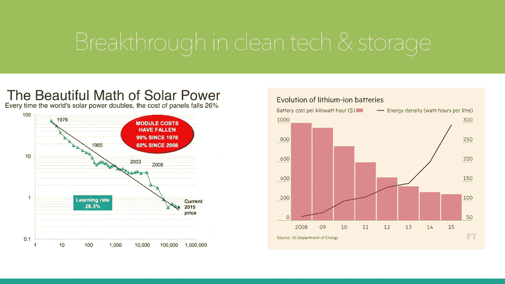

我们也看到了太阳能、清洁技术和存储领域令人难以置信的突破。如你所知，太阳能正在非常、非常迅速地衰退。比许多乐观主义者想象的还要多，而且每千瓦时两美分的价格区间，这是世界上无可比拟的竞争力。

当然，太阳能需要它的伙伴，也就是存储，我们看到的存储也是惊人的。右图显示了电动汽车电池的能量密度，单位为瓦特小时/升。在过去的七八年里，随着电池价格的下降，价格上涨了六七倍。这些是不可思议的，不可思议的结果。

然后是交通方面的突破。如果你想到汽车的首要地位，想到在过去的 100 年里，汽车为我们的生活带来的丰富多彩，那真是令人难以置信。

另一方面，想想汽车现在对我们的环境造成了什么影响，以及它们占用的城市空间或配套的石油基础设施。[汽车夺走了我们的城市空间。我们毕竟是这里的居民。以及我们最终花在汽车上的时间和注意力，交通的突破将是至关重要的。](http://www.citymetric.com/transport/pictures-do-cars-take-too-much-space-city-streets-483)

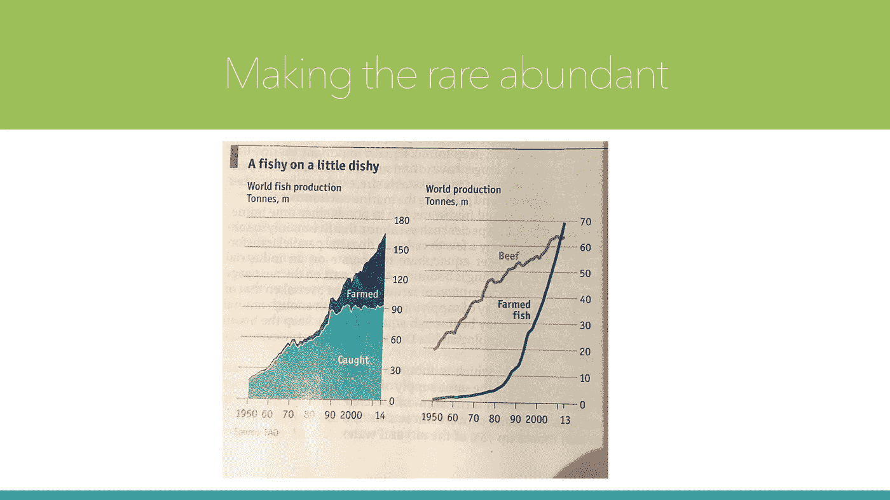

我们所做的就是让稀有物种变得丰富，甚至在一些非常奇怪的地方。回到 70 年代，赞比亚从来没有鱼，因为它是一个内陆国家。然而，当我 1980 年来到英国的时候，这里没有一吨鱼。

我们想出了一些养鱼的技术，这条曲线又来自于一个创业计划。我们现在生产的鱼蛋白比牛肉蛋白多。正如你们中的许多人所知，随之而来的是许多关于这种鱼蛋白对人类的实际质量的问题。集约化养鱼出现的[问题](https://www.ciwf.org.uk/media/3818689/in-too-deep-summary.pdf)或捷径是什么？

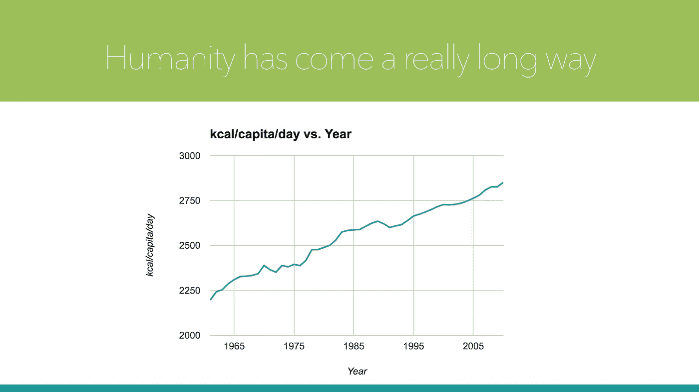

公平地说，我们已经走了非常非常长的一段路。今天，我们为地球上的每个人生产 2700 卡路里的食物。

人类平均每天需要 2100 卡路里。普通美国人每天有 3800 卡路里的热量。

我们终于发现，死于暴饮暴食的人比死于饮食不足的人多，因为死于肥胖相关疾病，如冠心病和 T2 糖尿病的人比死于营养不良的人多。

事实上，如果有人确实死于饥饿，这不是因为缺乏食物，而是因为政治选择，因为有足够的食物供应。归根结底，饥荒是由政府或伪政府决定他们需要这样做造成的。(*注:Yurval Harari 在 2016 年我在伦敦参加的一次演讲中很好地阐述了这一点。)*

这是从稀缺到丰富的基本趋势，这听起来真的真的很棒，显然在很多方面都很棒，但它确实开始引发问题。

## 挑战

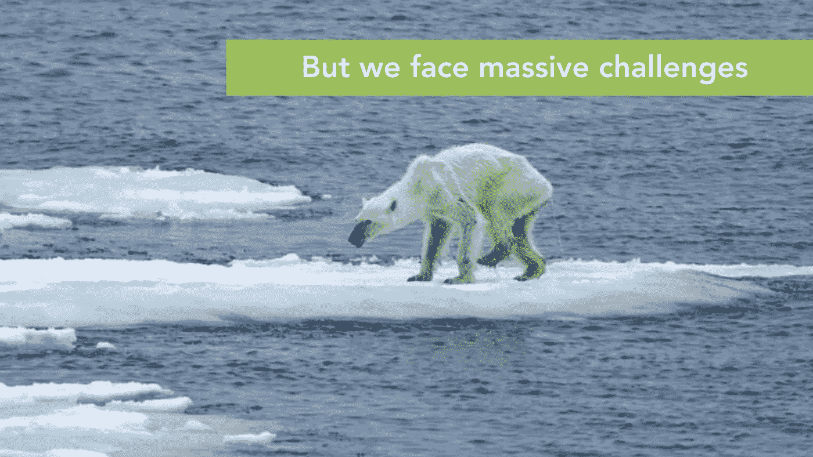

正如你从气候变化时事通讯中所知，这是一个巨大的挑战，从各方面来看都很可怕。

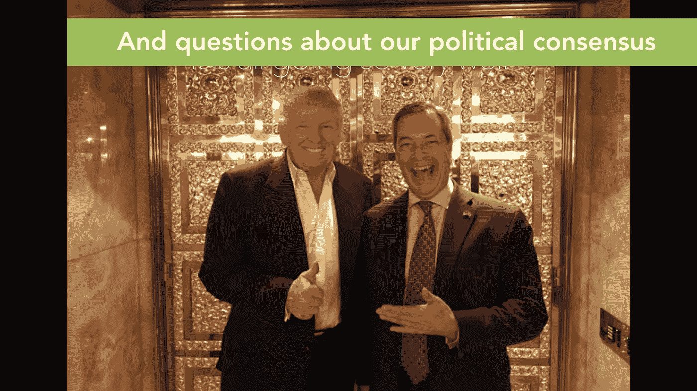

这些问题也围绕着我们的政治共识，以及我们在 2016 年这个有趣的一年看到了什么。我们失去了大卫·鲍依和莱昂纳德·科恩，但赢得了英国退出欧盟和川普。这告诉我们什么？如果你是像我一样观察系统的人，就会发现一些有趣的事情正在发生。

有些事情值得调查。

# 框架

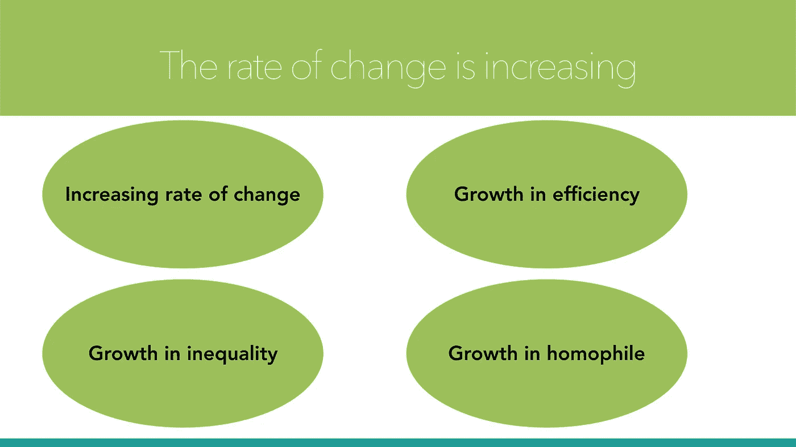

现在我想用一个框架的快照来分析这些问题。我将简单谈一下这四个方面:

*   变化的速度越来越快
*   效率的惊人增长和提高
*   关于平等和不平等的问题
*   同性恋的增长

# 变化率增加。

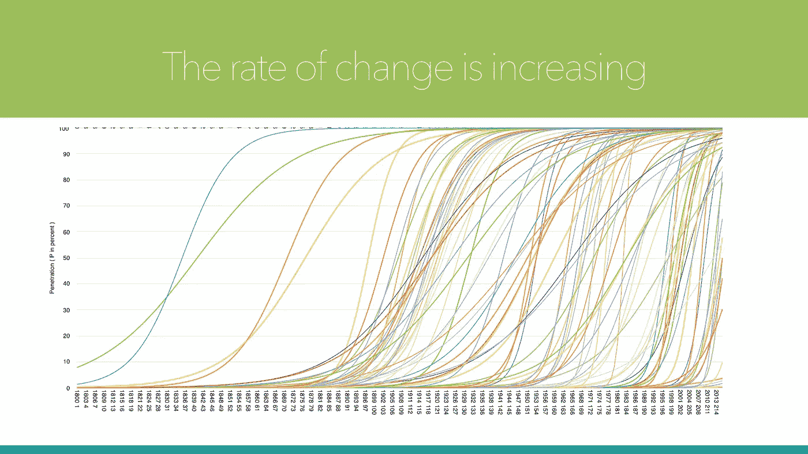

Source: Horace Dediu, Asymco

我们都听说过这个，但这里有一些来自 Asymco 的 Horace Dediu 的数据，它显示了追溯到 1800 年某些技术产品创新渗透到美国所花的时间。y 轴显示的是渗透率。你可以看到不仅曲线变得不可思议的陡峭，而且在任何给定的时间内都有更多的曲线。(我承认这张图表没有 Horace 的数据显示得那么清楚！这是来自不同来源的另一个观点。)

产品从创新到被 20%、50%、90%的人使用的时间越来越短。变化的速度真的，真的在增加。

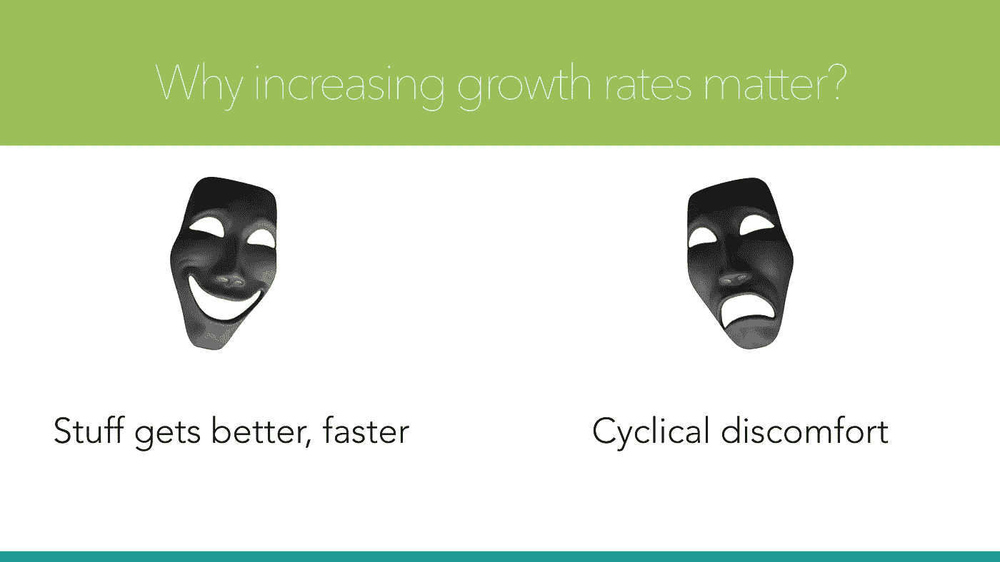

增长率提高带来的挑战是双方面的。一方面，好的一面是，事情变得好得更快。疑难杂症得到治疗。发生在你日常生活中的恼人的事情，比如你的食物变坏了，因为你有冰箱而得到治疗。这很好，但是也有这个改变带来的不适的问题。

如果你把自己放在一个出生于 1920 年的人的位置上，你会发现产品进入主流的周期可能是 30 或 40 年。你会活 70 年。你会看到两个主要的变化。从无线电到电视，再到电话的广泛使用。这就是你将会看到的，这需要时间，几年，来进入你的生活并改变你的生活。

想象一下，一个 1980 年出生的人会活到 120 岁或 130 岁，平均周期可能是 5 年，但如果真的变快了，可能是 3 年、2 年或 1 年。

重大变化的数量，相当于从广播电视到互联网或从固定电话到手机的变化，你一生中可能会看到几十个这样的变化。你将不得不应对它们，并了解如何应对它们。

# 效率的惊人提高

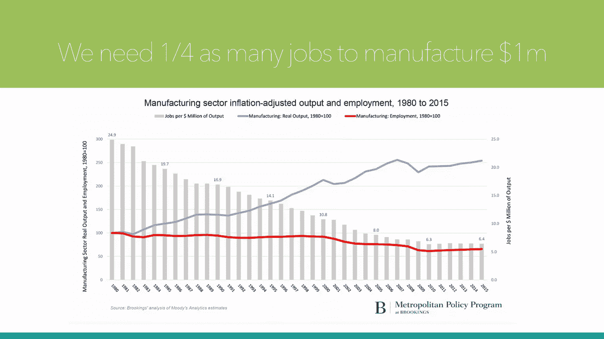

自 1980 年以来，我们已经减少了生产价值 100 万美元的产品所需的人数。以前是 25 人，现在是 6 人，所以少了四分之一。这就是制造效率，而且这一趋势还将继续。

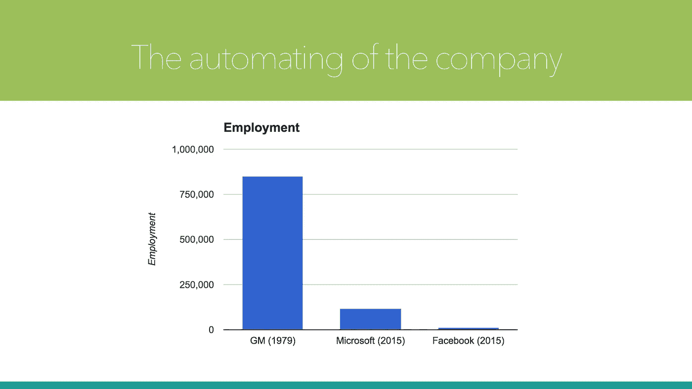

继续关注公司的自动化。1979 年的通用汽车是一家大公司。实际上，那一年可能会亏损，但从总收入来看，它是巨大的，是纽约证券交易所第四大公司，市值 150 亿美元，在全球拥有 80 万名员工。从员工数量来看，比去年微软的 10 万人要多得多。脸书的市值与微软相当，创造了大量价值，但员工不到 15000 人。那张趋势图延伸到了渐近线。

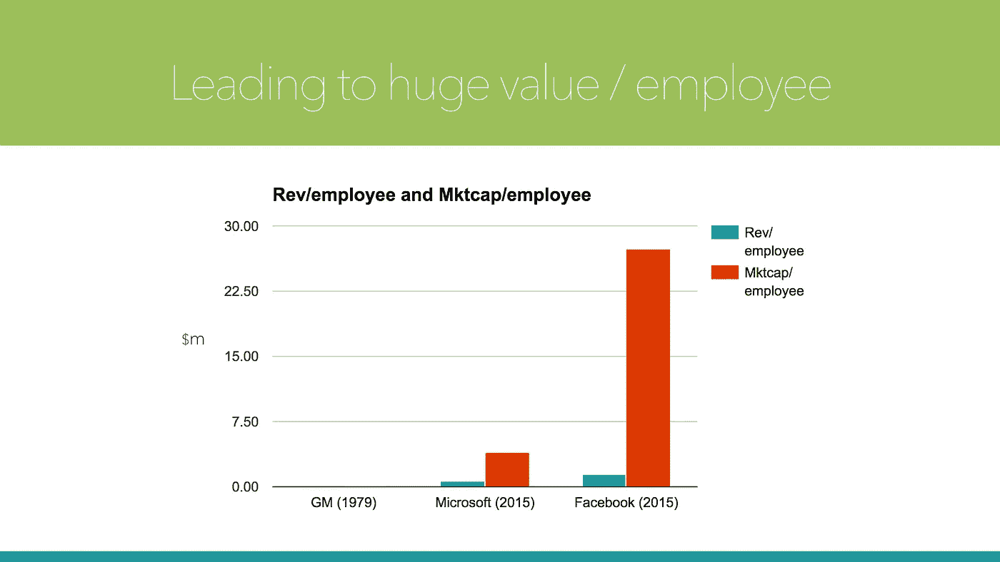

这给每个员工带来了巨大的价值。蓝色表示员工人均收入，红色表示市场资本员工。通用甚至不注册。可能是 1979 年最伟大的公司之一。

与脸书相比，微软是一家了不起的公司，在脸书，每个员工的收入是微软的两倍多，每个员工的市值是微软的五、六倍。

但不止于此，对吧？这种高效率一直持续着。

谷歌是一家非凡的公司，脸书也是。看看支持 100 万月活跃用户所需的软件工程师数量会发生什么。

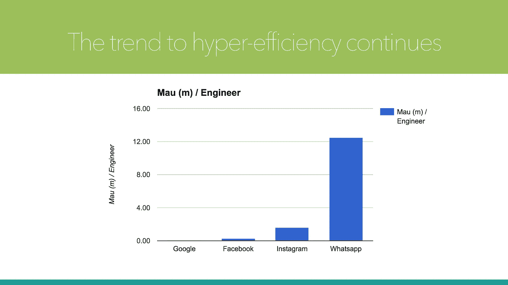

谷歌，这家神奇的公司，甚至没有出现在我的图表上。脸书几乎没有注册。Instagram 在百万级别，WhatsApp 在 1200 万级别。这是相同的曲线，相同的趋势，但它在跳跃式增长，因为我们有这种由技术进步驱动的效率趋势。

因此，我们甚至可能会发现自己得到了第一个单人独角兽，甚至是零人独角兽，[用一把刀和一些人工智能猛击顶部](https://en.wikipedia.org/wiki/Decentralized_autonomous_organization)。不需要人类参与就能创造价值十亿美元的东西。

# 同质性增长

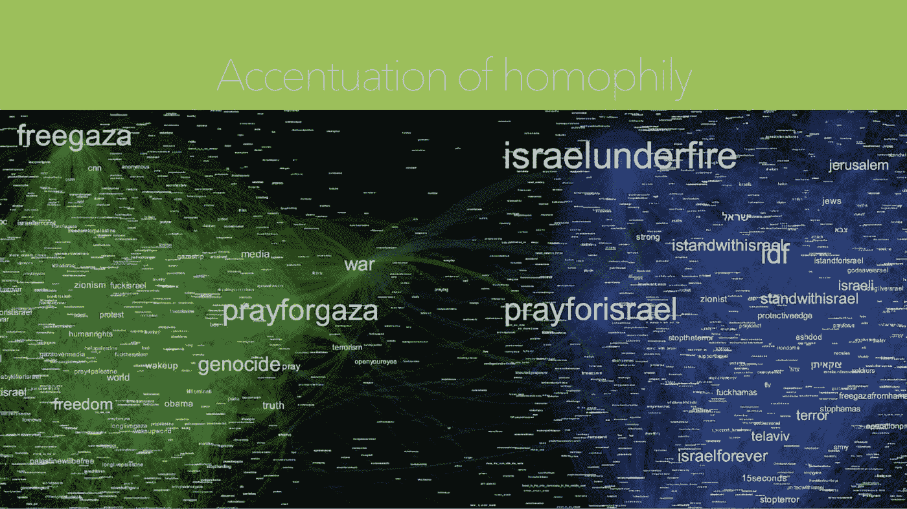

这就引出了我想关注的第三个趋势，这就是同质性问题，也就是所谓的“过滤泡沫”。滤镜泡泡并不是什么新鲜事物。

同性意味着[物以类聚](http://www.annualreviews.org/doi/abs/10.1146/annurev.soc.27.1.415?journalCode=soc)，这一点我们早就明白了。

每个城市都有一个唐人街，一个意大利人居住的地方，一个所有医生的手术室都在的地方。一般来说，他们不会逐家逐户地混合和交往。你看看你的朋友，你的朋友和你挺像的。

真是物以类聚，人以群分。我的意思是，如果你和与你完全不同、没有共同兴趣的人在一起，谈话就不会有好处。[戈德温定律将占主导地位。](https://en.wikipedia.org/wiki/Godwin's_law)

我们对此很熟悉，甚至在我们的物理世界的物理架构中，我们也意识到了它的好处。18 世纪的罗斯柴尔德家族意识到了将银行业保留在家族网络中的好处。20 世纪的商学院意识到了 HBS 校友网络的重要性等等。

当然，在数字领域，我们可以强调这些过滤气泡，这只是一个小小的图表，显示了一些围绕以色列和巴勒斯坦正在进行的冲突危机的讨论。蓝色的是所有人都在谈论以色列的条件，绿色的是所有人都在谈论巴勒斯坦的条件，坦率地说，除了“战争”这个词之外，没有任何桥梁，这有点令人沮丧。没有桥梁，这种同性恋的趋势更加明显。

我们只是根据脸书和脸书的新闻来思考这个问题，但它发生在现实世界中，发生在我们与非脸书的关系中。

# 不平等的增长

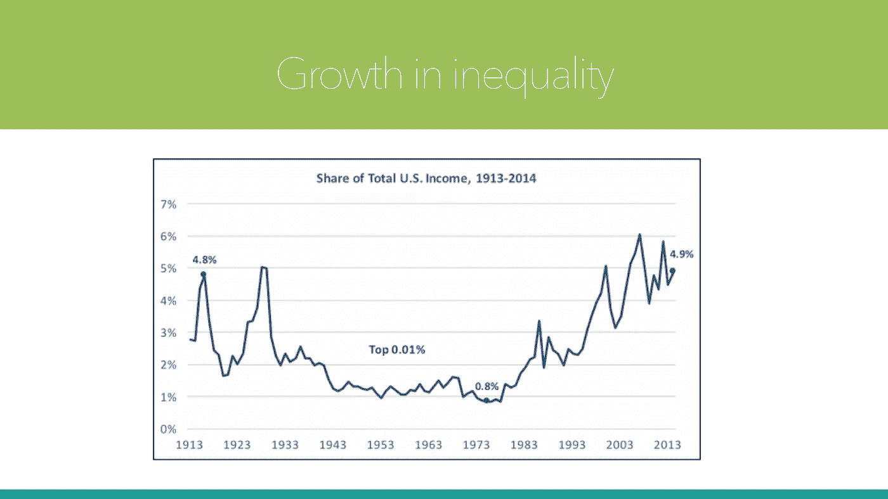

下一个需要思考的趋势是不平等性的增长，图表显示了美国收入最高的 0.1%的人所占的份额，你会注意到不平等性的水平，这里更严重，与 20 世纪 20 年代和 20 世纪 10 年代一样高。坦率地说，自罗纳德·里根以来，这种急剧上升一直持续到现在，而且相当强劲。

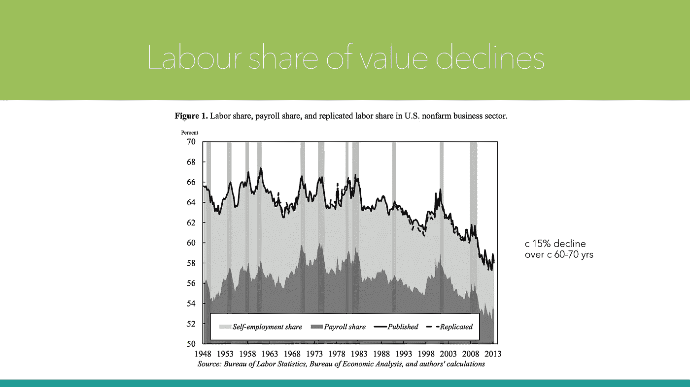

劳动力的价值份额，也就是一个国家的收入中分配给从事工作的人的部分，而不是被雇佣的资本，正在显著下降，在这个长期研究中下降了 15%,这是 60 年前的水平。

换句话说，人们从我们的国民收入中得到的报酬越来越少，把这些点和我们之前谈到的效率联系起来，资本得到了越来越多的回报。

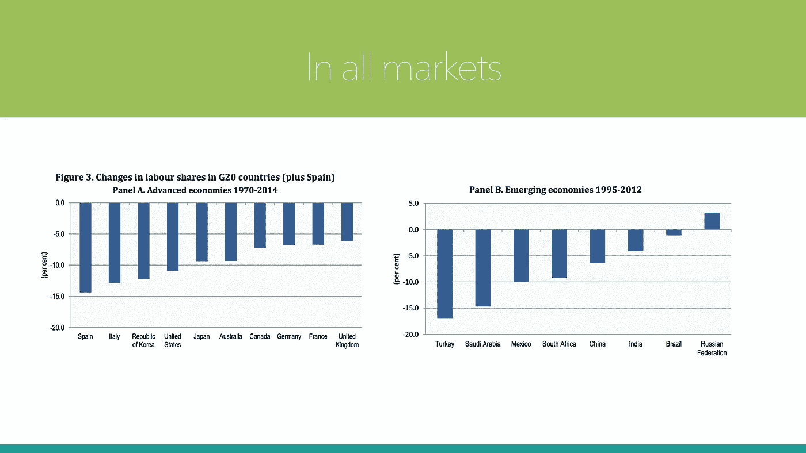

所有市场都是如此。看看西班牙、意大利和英国的纵向数据，你会看到这些负数。唯一一个劳动力回流情况有所改善的国家是俄罗斯。这不是你的样本。

而且收益真的参差不齐。我想我们已经在指数视图中谈论了很多布兰科·米拉诺维奇的大象图，但这里发生的是我们，在 C 点，在过去的 30 年里做得非常非常好，这是印度和中国的中产阶级，他们做得非常好，这是西方的工人和中产阶级，他们的收入在 20 年里没有真正提高。

观众参与的第一点。我会问一些问题来说明这一点。我们当中有多少人认识年收入超过 10 万美元的人？把手举起来。好吧。

我们当中有多少人认识年薪百万甚至更多的人？[全体举手]。我们都知道风险投资家！

让我们转向财富。我们当中有多少人认识资产(非住房资产)达到或超过 1000 万美元的人？[全体举手]。

一亿或者更多？[大多数人举手]。

十亿或更多？[大多数人举起手来]。

一百亿还是更多？[几个手撑起来]。

有人超过 750 亿吗？所以没人认识盖茨或卡洛斯·斯利姆。

好的，我们现在换个方向。我们当中有多少人知道全职工作的人年收入为 1 万美元或更少？[大约一半的手举起来了]。这比我想象的要多。

年薪低于 5000 美元怎么样？[很少有人举手。]

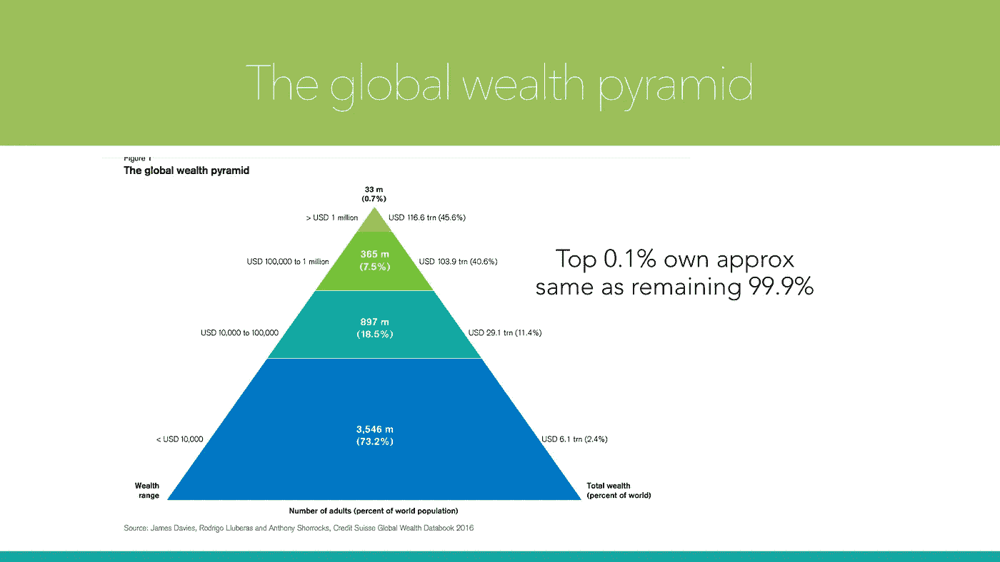

这是证明同质性的一个有趣的观点。让我们看看全球财富金字塔，这是来自瑞士信贷第一波士顿。问题是这是最不真实的图表，我马上会解释为什么。黄色顶点是指拥有超过一百万美元的人群，它不代表 0.7%的人口。3300 万成年人，我们都认识这个领域的一些人。

这是基本的蓝色层，代表收入低于 10，000 美元的人群。它代表了 36 亿人，可能包括孩子，地球上的 60 亿人，基本上我们很少有人认识这里的任何人。

这张 CSFB 图表是不真实的，因为它实际上应该显示的是每个群体拥有的财富规模，因为这个微小的顶层群体实际上拥有的财富与这个庞大的底层群体一样多，或多或少。

不平等的挑战是很难解决。解决不平等问题很重要，原因有很多。但我将重点讨论两个没有争议的问题。

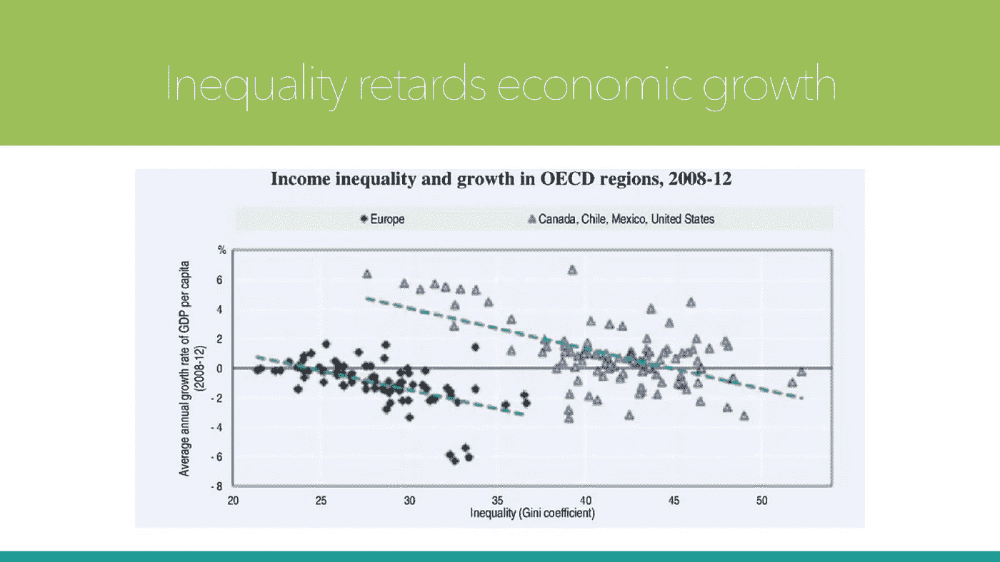

首先，有证据表明不平等会减缓经济增长。你可以看到这种负相关，这是基尼系数，衡量不平等或平等的指标，这是增长率。事实表明，由于各种各样的原因，不平等减缓了经济增长。换句话说，它让我们变得更穷。

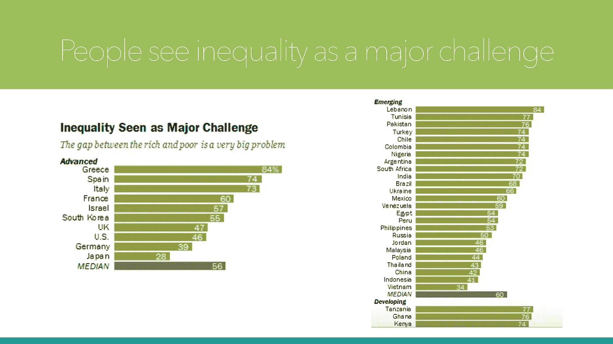

另一件事是，当你问人们时，他们把不平等视为一个主要挑战。这是 2013 年的一项调查，即使在美国，也有 46%的人认为贫富差距是一个大问题，在新兴市场也非常严重。在日本，每个人都经历了 20 年的糟糕时光，所以不要太担心。(参见皮克特和威尔金森论平等。)

# 把所有的放在一起

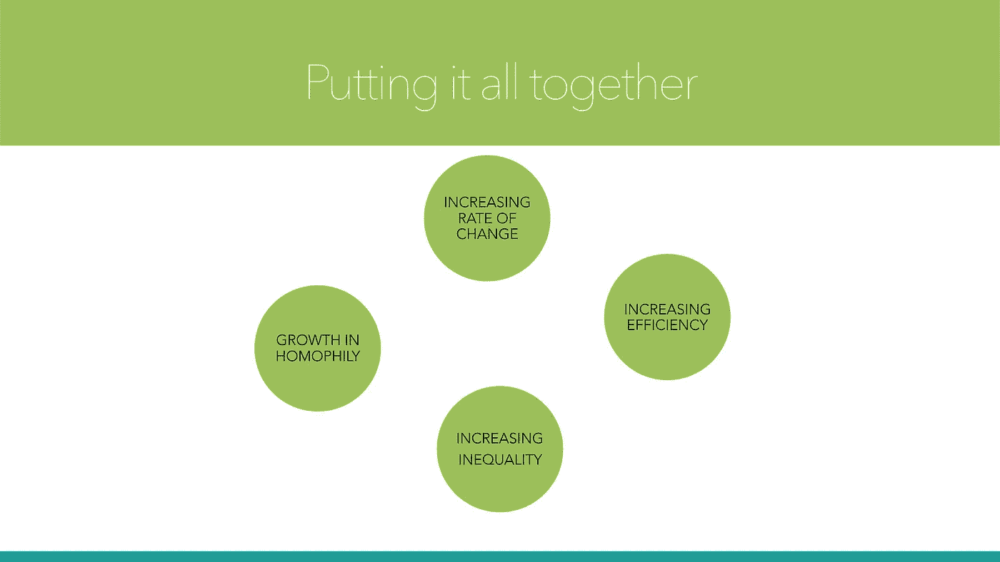

如果我们将所有这些东西放在一起，变化的速度越来越快，这意味着我们可以更快地获得很多好处，但一切都在增加，包括我们开始看到的效率的增加。

在传统的资本主义体系中，更少的人能够产生更大的回报。随之而来的是越来越多的不平等和真正的渐近线。

这不是一个高斯分布，这里有一个很好的中间值，超级富豪的数量和不太富裕的人数是一样的。

这是一个权力法则，极端的那一端变得非常非常富有，而中间的那一端却没有。

再加上同性恋的增长，这是志趣相投的人和具有相似属性的人在一起闲逛，我们媒体的架构就是为了强调这种差异。

## 问题是:外部性、调整成本、手推车

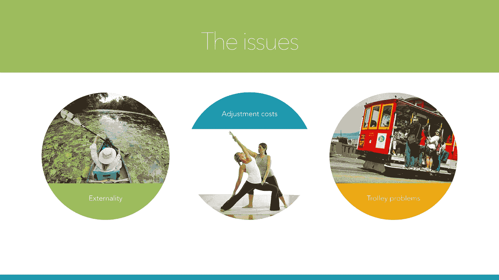

我会把这个想法留给我们几分钟时间，然后快速浏览其他三件重要的事情。

1.  一个是关于外部性
2.  第二个是关于可怕的剪贴画和调整成本，顺便说一下，如果你在谷歌图片中输入调整，它会建议将瑜伽作为一个附加词。
3.  第三个是关于电车问题。

## 外部效应

关于外部性…这是路易斯·莱恩，她在脸书上贴了一张她和超人的照片。脸书的人工智能系统已经说过，“你想标记克拉克·肯特吗？”她意识到了一些事情。

用外行人的话来说，外部性只是意想不到的后果，但用经济学的术语来说，当交易的结果是改善社会福利时，它们就是外部性。

我从你那里买了一个巧克力棒，糖果棒，这是一笔很好的交易。我得到我想要的糖果，你得到你想要的钱。然后我把包装纸扔在街上，这毁了其他人的体验。

我没有为这个成本定价，当然，我们知道的最糟糕的外部性是温室气体，因为它可能会毁灭我们的物种，但还有许多其他的外部性出现。

在全球金融危机期间，投资银行将各种奇怪的风险打包到这些 CDO 和 CDO 平方中，并打着基本的赌，即当它们污染了世界时，政府会出手救助它们。他们将成本社会化，这是外部性的一个例子。

外部性通常来自真正的意外后果。

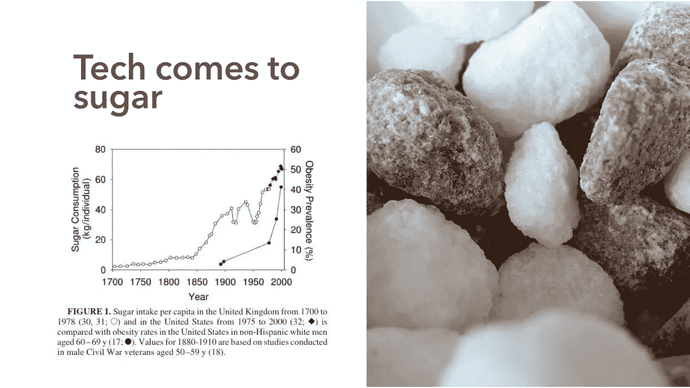

如果你看看糖。糖对我们来说是非常罕见的东西，所以它作为一种美味具有价值。很难培养。在 19 世纪的某个时候，由于英国的封锁阻止糖从西印度群岛到达欧洲，我们开发了种植甜菜的技术，从地里的甜菜中获取糖，而不仅仅是从甘蔗中获取。

我们大幅提高了糖的产量。我们有效地开始收集无限的糖，我们可以将这些糖注入人体系统，压倒我们身体的稳态功能，从而引发肥胖的上升。(参见[伊恩·莱斯利关于糖的精彩文章](https://www.theguardian.com/society/2016/apr/07/the-sugar-conspiracy-robert-lustig-john-yudkin)。有趣的是[一篇将糖与动脉硬化和肥胖联系起来的关键论文](http://www.nature.com/nature/journal/v239/n5369/pdf/239197a0.pdf)发表于 1972 年 9 月下旬，我出生的那一周。)

在 19 世纪的这个时候，卖糖的人可能没有真正考虑过肥胖问题，因为他们不知道。这是一个很好的外部性的例子，仅仅是因为几十年前发生的一些效率改进。

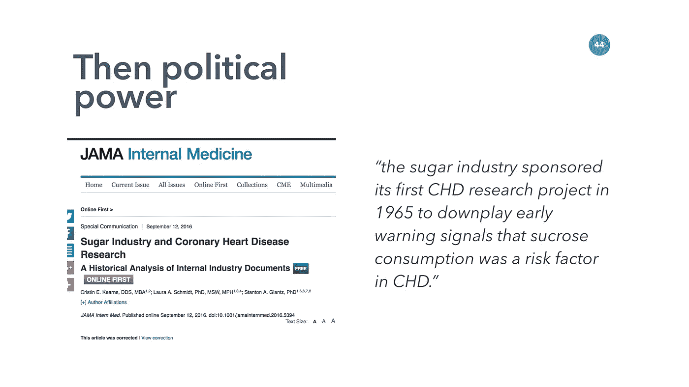

糖业游说团体开始获得权力并变得富有，他们开始支持研究并利用这种权力来施压和改变辩论。该行业赞助了第一个针对冠心病的研究项目，以淡化蔗糖是冠心病风险因素的信号。

50 年前，他们付给一些哈佛科学家 30 块银币或其他东西来做这件事。(它[实际上是 5 万美元](https://www.yahoo.com/beauty/sweet-lies-sugar-industry-tricked-us-worrying-fat-233649580.html)。)

他们几乎不知道当时埃克森公司在气候变化方面做得更差。这是一个类似的模式，然后在[20 世纪 70 年代及以后，你有美国食品管理局的食物金字塔](http://www.salon.com/2015/04/12/the_fdas_phony_nutrition_science_how_big_food_and_agriculture_trumps_real_science_and_why_the_government_allows_it/)，它给家庭提供了错误的建议。

我认为认识到这些很重要。

## 调整成本及其背景

为了在世界上发挥作用，我们真的需要我们的世界发挥作用。

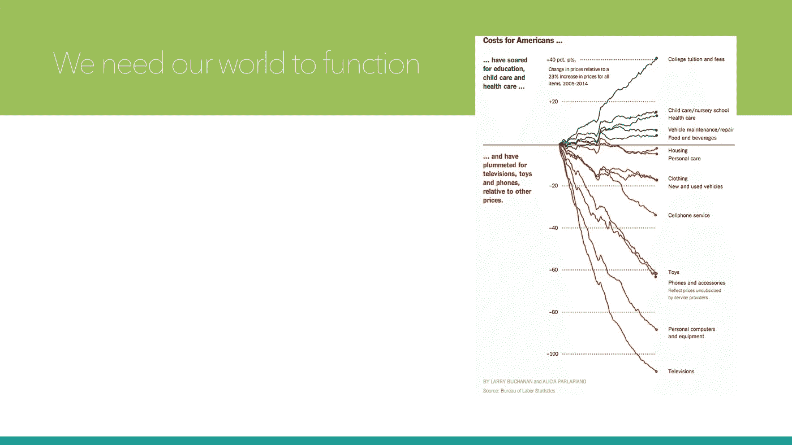

在过去的 30 年里，我们看到的是，我们最需要的产品，因为它们创造了能够以健康和知情的方式生活的公民，大学学费，儿童保育，健康，变得超级昂贵。

我们真正不需要的产品，电视，变得非常非常便宜。

一个原因是，如果你没有健康、快乐、受过教育、知情的公民，你就会制造摩擦，摩擦就会变成争斗。

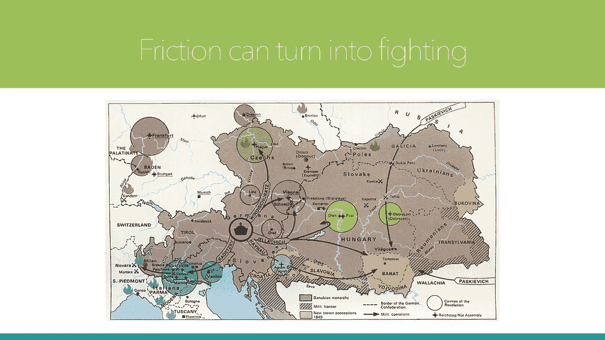

这是 1848 年欧洲的地图，那里发生了一系列的革命。它被称为“革命之夏”或者“革命之年”。但本质上，从更长的历史时期来看，你会开始看到，当出现分歧和错位时，有些东西需要给予，有些人必须放弃一些东西给其他人。

一个很好的例子是 19 世纪末到 20 世纪初，劳工工人觉得他们没有得到足够的馅饼，他们没有得到足够公平的待遇。在一些地方，他们改变了政治共识，他们获得了工会法和工人保护，或者他们获得了投票权。

在其他系统不适应他们的地方，发生了革命，对吗？1917 年在俄罗斯。

思考什么是调整成本真的很重要，因为我们告诉你技术从来没有让工作付出代价，净净。

[科技永远都在帮助创造更多的就业机会，至少在过去的 140 年里是如此。这是真的。这是一个伟大的故事。然后我们再谈“调整成本”。](https://www.google.co.uk/amp/s/amp.theguardian.com/business/2015/aug/17/technology-created-more-jobs-than-destroyed-140-years-data-census?client=safari)

让我们试着理解那些调整成本是什么。

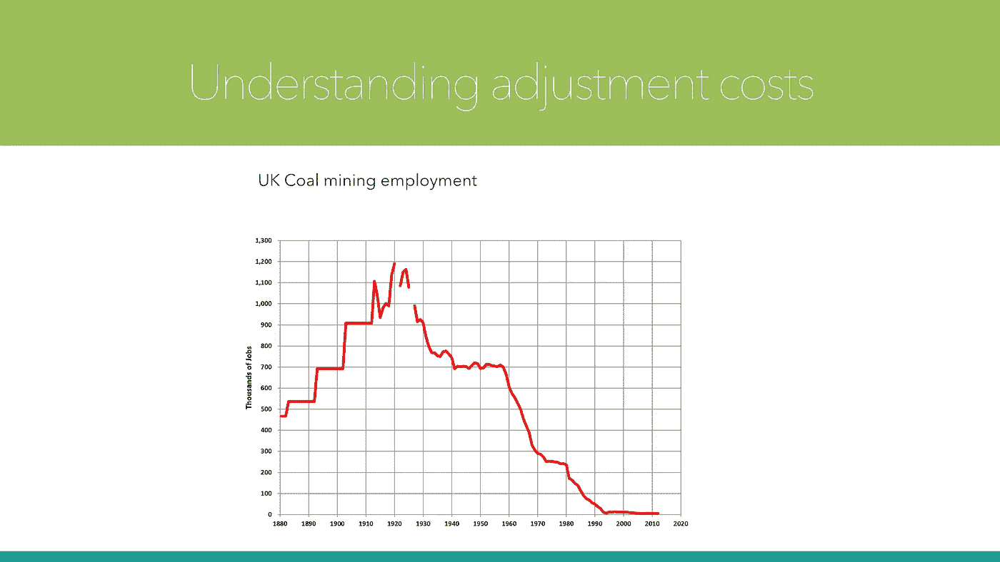

英国有非常非常繁荣的煤矿业。随着工业革命的开始，詹姆斯·瓦特蒸汽机需要煤，一个由创新、企业家精神和资源开采组成的产业诞生了。

在上世纪初的某个时候，该行业从业人员超过 100 万。快进到 1980 年。我穿着那件毛衣从赞比亚来到这里。

煤炭行业长期以来一直处于低迷状态，主要是因为人们对城市空气质量的担忧。但是仍然有 250，000 人参与到英国的煤炭工业中，同样是群聚在这些围绕煤炭工业建立的小社区中，这些社区就是这样。

玛格丽特·撒切尔，我们版的罗纳德·里根，决定要打破矿业工会的权力，关闭无利可图的煤矿……我压缩了很多历史，她做得非常非常快。

我们现在可以说，“调整过程是什么样的？”

这是一个社会科学实验。因此，随着所有出租车司机和卡车司机都将失业，这只是一个调整过程。

我们有同样的实验，这是它看起来的样子。那些是警察，警员，警员，这些是矿工。这是一个双方都非常暴力的一年，也是一个令人讨厌的调整过程，确实给社区带来了创伤。撒切尔正从这个货币主义者，早期的新自由主义核心小组中走出来，相信这种类型的经济学。她不相信福利网和社会保障能管理这种调整。

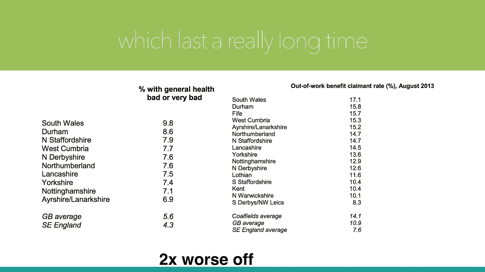

但是这种影响会持续很长时间。如果你看看 30 年后的这些社区，这是 2013 年，30 年后，这些是社区，这是他们的失业救济金申领率，是 17 . 16%。它是这个国家富裕地区的两倍。实际上，当我们进去的时候，顺便说一下，这不是技术造成的，但这只是证明调整问题的另一件事，我们没有建立正确的系统，我们创造了一个持续了三十年的非常困难的设置。

## 介绍软件的伦理问题

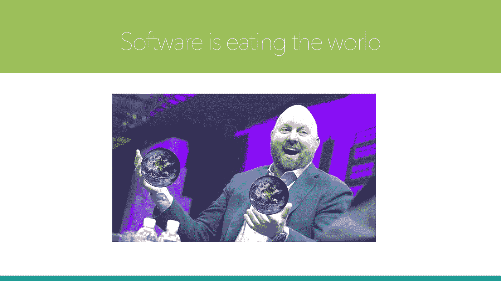

我们知道软件正在吞噬世界。马克说这句话已经五年了，但那是什么意思呢？

这意味着软件现在是我们访问所有资源的界面，无论是作为消费者、父母还是公民，都是通过软件完成的。

我想查我的银行账户，我去找我的手机。我想买一张票，我去我的手机。我想知道我是怎么了，我去找我的健康聊天机器人。

这一切都是由软件调节的，所以在某种程度上，产品经理开始成为控制我们获得的资源的人，这些产品经理是…猜猜看，他们有季度 [OKRs](https://en.m.wikipedia.org/wiki/OKR) 。

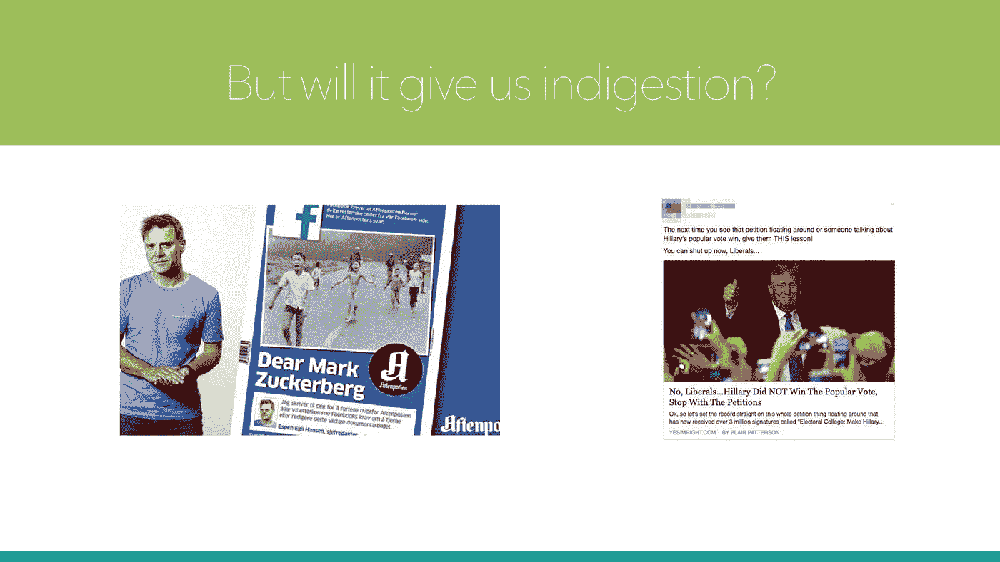

这里的问题是，“这会让我们消化不良吗？”两个消化不良的小例子。首先是假新闻，我不会谈论它。

第二个是关于算法控制。我在一家挪威媒体公司工作，这位是[埃斯彭·埃吉尔·汉森](https://mobile.twitter.com/eghan?lang=en)，我们最古老的报纸之一的编辑。(大约有 150 年的历史了。)

他写了一个关于战争报道的故事，关于战争报道的重要性，关于为什么国家之间会发生战争。他发表了这张照片和其他九张照片。这是我们这个物种拥有的最著名的战争照片。这是一个九岁的越南女孩潘氏潘金淑的照片。她被美国凝固汽油弹击中，现在很痛苦。

脸书认为这是不适宜的内容。它实际上控制了一个基本的政治观点，即战争报道让我们弄清楚一场战争是否公正，一场战争是否应该继续，我们是否应该将生命置于危险之中。我们是否应该在这上面花钱。顺便说一下，这是软件吞噬世界最糟糕的一面。有很多好的方面，但这是不好的一面。

挑战在于，一切都开始看起来像电车问题。电车难题是一个来自英国哲学家 Phillipa Foot 的哲学游戏。

场景是你在轨道的岔口，这是一辆下来的电车。你可以看到，如果电车沿着正常路径运行，它将会撞到这五个人，因为某种原因，他们躺在铁轨上。你可以拉下开关，然后把它沿着这根树枝送下去，它会击中那边的人，杀死一个人。测试是你选择做什么？

我们的第二次观众参与。在这种情况下，我不会给你更多的信息，有多少人拉下开关，杀死无辜的人，但挽救了五条生命？举手表决，有多少人这样做？[几乎所有人都举手了。]

哇，你们是一群苛刻的人[反映出他们都是多么的功利主义者]。]

好吧，那么有多少人让电车自己跑呢？很少有人举手。]好吧，其实你们更多的是功利主义者。

你会杀死一个无辜的人而不是五个。

现在让我们考虑一下这个场景。

你坐在转辙器旁，电车正在急速下降。你已经看过新闻了，你知道五名杀人犯从圣昆廷监狱逃跑了。他们是华尔街的对冲基金投资者，他们变得疯狂，欺骗他们的投资者，然后杀死的不是他们的律师，而是一些无辜的人。

他们现在在监狱里，他们已经逃跑了，你可以看到他们的鼻子，这已经发生了。每个人都在社交网站上分享。

他们在那里，你记得在 [Nuzzle](http://nuzzel.com) 中看过另一个故事，关于一个在恶劣环境中长大的孤儿，她自学了小提琴。所有人都认为她会成为新的陈美。她正穿过火车铁轨，步行 17 英里去找她的小提琴老师。她把小提琴掉在铁轨上了。想象一下。

我们现在来问一下，有多少人会去拉杠杆去救那五个，去杀那一个？[几乎没有人举手。]

好吧。我们的观点确实改变了不是吗？

我们已经做出了道德判断。我们真的做出了道德和伦理的判断。艰难的判断。今天，在某种程度上，这些决定将在类似这样的情况下自主做出，但实际上，它们每天都在做出。对于我们的很多话语来说，现在处于这种转变的人是马克·扎克伯格。

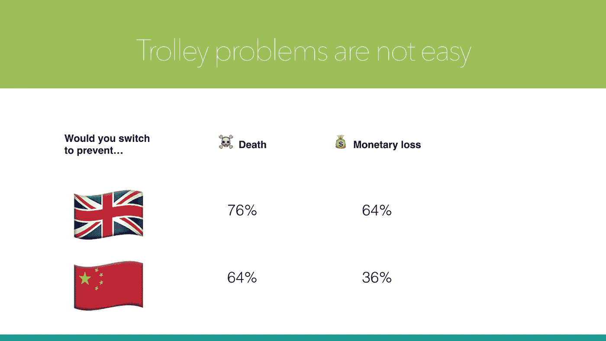

问题是电车的问题真的很难解决。他们只是没那么容易。除了拯救小提琴手之外，我们甚至没有在房间里达成一致——尽管当时有几个人认为我们不应该——但是我们在房间里没有达成一致。

如果你看看这两种情况下会发生什么。一个是涉及死亡的电车问题，另一个只是相同价值的金钱损失，你去英国或其他奇怪的国家。受过西方教育的，工业化的，富裕的，民主的，他们很功利，对吗？救五个，杀一个。如果你去中国，他们就不那么想了，他们的理论有点像儒家的“顺其自然”。(参见[对现实生活和假设的电车问题的反应中的文化差异](http://journal.sjdm.org/12/121101/jdm121101.html)，作者娜塔莉·戈尔德等人)

我们不能同意一群几乎是一丘之貉的人。我们每个人都认识身价超过 1 亿美元、年收入超过 100 万美元的人。我们都在同一个行业工作，无法达成一致。

然后我们有一个问题，关于我们如何对待其他社会？这些都是相当困难的问题，它们不仅仅会发生在自动驾驶汽车上，它们会发生是因为，特别是在实施人工智能系统的情况下，它们将变得很常见。

## 为什么机器学习会带来伦理问题

传统的编程隐喻(幻灯片鸣谢:Brocade)是，你获取某个程序，向它抛出一些数据，然后抛出一些输出。你知道你想要什么。机器学习的方法是你获取一些数据，你知道你想要什么样的输出，训练设置好了，然后你生成一个程序，它无情地执行。

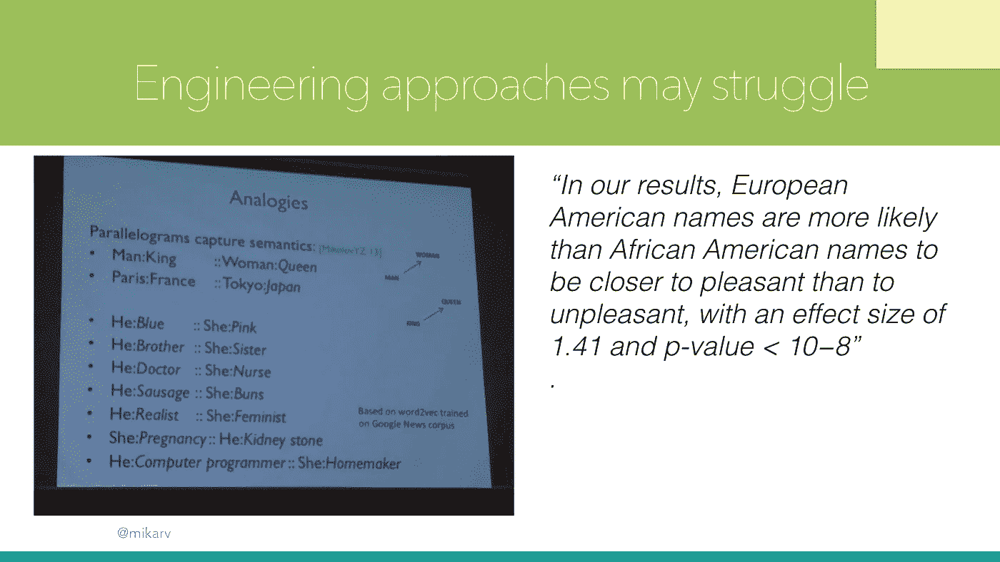

问题是你输入的数据决定了这里输出的内容。因此，这种机器学习的新工程方法可能会遇到困难。我相信你们中的许多人对 [Word2vec](https://papers.nips.cc/paper/5021-distributed-representations-of-words-and-phrases-and-their-compositionality.pdf) 很熟悉，这是一种基本理解词义高阶表达的方式。

Word2vec 可以做这样的事情，比如说，“如果是男人对国王，那么就是女人对王后。如果是巴黎对法国，那就是东京对日本。如果是他去看病，那就是她去护理。如果说他是现实主义者，那么她就是女权主义者。”那是从我们喂给机器的语料库里学来的。

这不是一个电车问题，而是一个哲学问题，一个伦理问题。从另一篇学术论文的结果来看，欧裔美国人的名字比非裔美国人的名字更容易让人感到愉快，而不是不愉快。文本语料库反映了收集语料库时的社会。

自从罗莎·帕克斯在公共汽车上没有让座以来，实际上已经 61 年了。如果你考虑在布莱巴特上训练一个系统，你会从那个系统得到一组非常不同的结果。

## Janus 面临的进展

进步有点两面三刀，因为它可能同时令人惊奇和困难。

只看城市。城市是创新和教育的中心，人们在这里相聚、创新、融合和交流。奇妙的事情，城市对人类来说是伟大的，拥有[这些伟大的环境足迹](https://www.theguardian.com/environment/2009/mar/23/city-dwellers-smaller-carbon-footprints)。但它们也是各地人口激增的源头。看一看，这是今年 7 月份的数据。

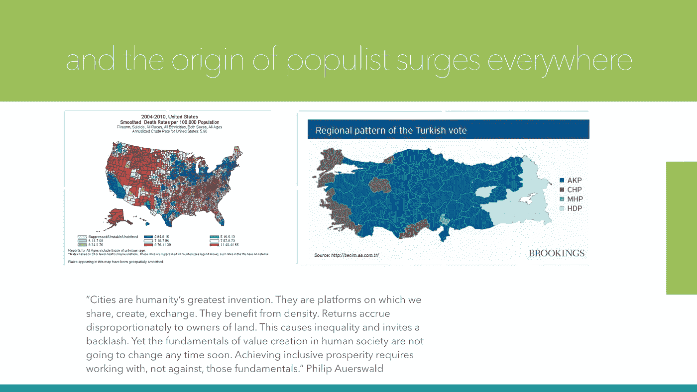

这是菲利普[奥斯瓦德](https://twitter.com/auerswald?ref_src=twsrc%5Egoogle%7Ctwcamp%5Eserp%7Ctwgr%5Eauthor)在《英国退出欧盟》之后写的。人口众多的土耳其人的投票模式都在蓝色区域，这不是城市所在的地方，他当时展示了当前选举的支持可能来自哪里。菲利普说的是:

> 城市是人类最伟大的发明。它们是我们分享、创造和交流的平台。他们受益于高密度，但这导致了不平等，并招致强烈反对。实现独家繁荣需要遵循这些基本原则，而不是与之相悖。

我们在这里进行这场对话的原因之一是，企业家真的很擅长把事情做好。在过去的 20 分钟里，我让每个人都有点沮丧，现在让我们回到过去。

## 企业家的角色

作为企业家，我们是修理者。我们修理东西。我们关注困难的问题，无法完成的事情，当我们说出来时不可信，我们试图创造一些新的东西来满足这种需求。还有谁来组织全世界的信息？

我真的想解决这个问题。

一方面，一件重要的事情是修复破碎的当地社区，部分由于商业模式的改变，这些社区已经被掏空了。[当地报纸已经消失](http://newspaperdeathwatch.com/)，社区已经被掏空。社区信息的来源现在是电台访谈，我们已经阅读了过去六周(自美国大选以来)发生的所有其他事情。[注:这显然是一个非常长期的趋势。参见[罗伯特·普特南的《独自保龄球](https://www.amazon.co.uk/Bowling-Alone-Collapse-American-Community/dp/0743203046)*，出版于 2000 年。]*

*另一方面，城市变得越来越重要，人们不可避免地会涌向城市。它们是合作和创造力的摇篮，需要以某种方式加以保护。*

**

***另一个问题是平台问题**。平台问题本质上就是这个。如果你回想一下劳动份额和资本份额的图表，现在是 60%劳动，40%资本。*

*想想优步，你认为在优步创造的所有价值中，资本和股东相对于劳动力和驱动力的份额是 40%资本，60%驱动力吗？更像是 99:1，对吧？*

*这是我们谈到的其他一些交通问题，因为我们强调了这一点。顺便说一句，它正在对我们做一些讨厌的事情。我的优步一分钟后不来，取消，再试一次。取消，再试一次。*

*就个人而言，我对那些让市场平台避开这些动态的东西非常感兴趣。这让我想到了纽约的 Juno，一个新的拼车平台。*

*优步的旅行里程是 25%。Juno 抽取 10%的分成，但更有趣的是，Juno 50%的股本集中在一个池中，将分配给司机，随着时间的推移，他们将随着乘坐次数的增加而获得这些股本。因此，真正令人着迷的是，Juno 仍然可以在那里建立一个令人惊叹的企业，但从某种意义上说，它是一个社区所有的企业。*

*像优步这样的企业也很难与之竞争。你是做什么的？你会对你的股东说，“我们价值 700 亿美元，但是为了和 Juno 竞争，我们要给司机 360 亿美元。”这是不可能的。我认为，如果你在打造市场平台，这是一件值得思考的事情，而且要在新地方主义的背景下思考。*

*我们**必须找出劳资双方的共识。资本占据了大部分份额，工作没有回报，自动化带来的收益是我们需要的，但它们有其他成本。很多人都在谈论普遍基本收入，我认为这很有趣，但在幂律分布的背景下，这并不能解决不平等，因为人们越来越远。你可以改善底层的人，但他们仍然没有我们所有人都需要的平等和自尊水平。***

*我们还需要**修复社会话语的架构**，这样我们就没有真正的共同语言，因为我们已经使用技术来强调过滤泡沫和强调我们的相同性。我们从上图中看到，在巴以冲突中，对立双方往往没有共同语言。*

## *最后的想法*

*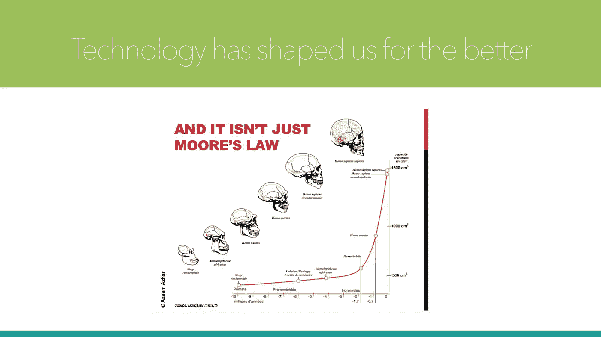*

*总的来说，科技让我们变得更好。*

*这张图表显示了人类和我们可爱的祖先的头盖骨容量，你所看到的是七百万年来的线性增长……几年来没什么变化。然后是上升，哇，我们上升到右边了。*

*可能的原因是我们对火的控制。[火是一项技术](https://www.pathwayz.org/Tree/Plain/SUMMARY%3A+BIOLOGICAL+EVOLUTION+OF+HUMANS)，它让我们能够提高卡路里的摄入量。我们不必花太多时间吃饭，我们有更多的时间去社交、策划、规划、建设文化，成为这个星球上最成功的物种。*

*但是我认为我们也开始问一些关于技术的问题。似乎有一种不安感。我们似乎在问更多关于技术的目的和影响的令人不安的问题。无论我们是业内还是业外，都有这种不安感。*

*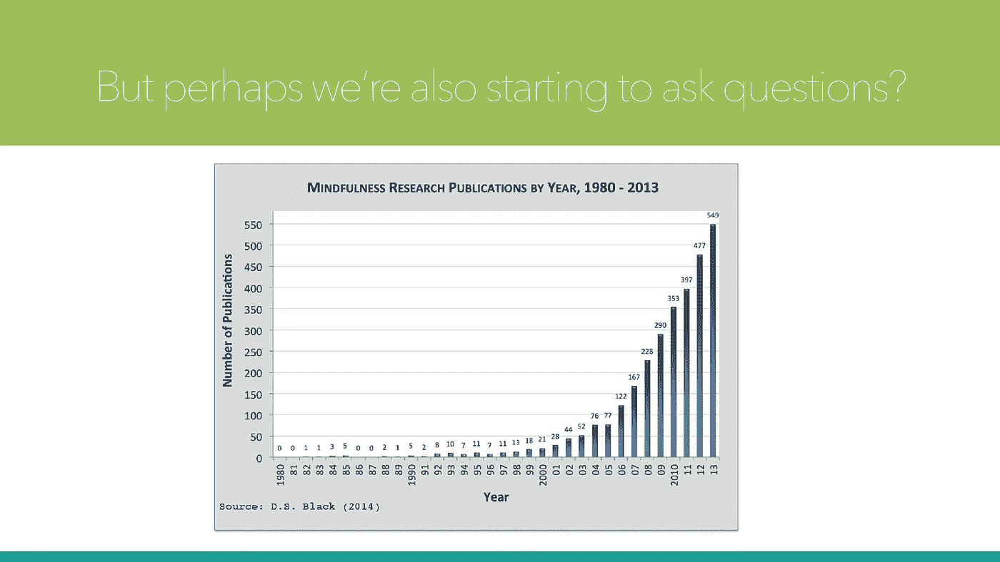*

*这张图表展示了正念研究的发展。它也是一条指数曲线。人们正在研究正念，并试图理解你是如何实现它的。*

*这个问题似乎与我们今晚讨论的一系列其他事情相关联…因为我们最有可能问那些问题并寻找那些答案。*

*谢谢你。*

*【*终点*。]*

*如果你喜欢这个，我想[你会喜欢阅读*指数视图*](http://azeem.io/s) 、我的每周简讯或者在[推特](http://twitter.com/azeem)上关注我。*

******

> *[黑客中午](http://bit.ly/Hackernoon)是黑客如何开始他们的下午。我们是 [@AMI](http://bit.ly/atAMIatAMI) 家庭的一员。我们现在[接受投稿](http://bit.ly/hackernoonsubmission)并乐意[讨论广告&赞助](mailto:partners@amipublications.com)机会。*
> 
> *如果你喜欢这个故事，我们推荐你阅读我们的[最新科技故事](http://bit.ly/hackernoonlatestt)和[趋势科技故事](https://hackernoon.com/trending)。直到下一次，不要把世界的现实想当然！*

**