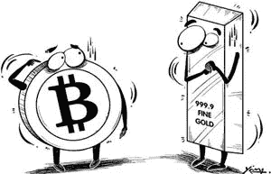
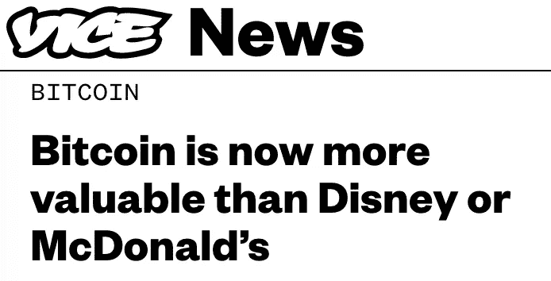

# 比特币的重要性

> 原文：<https://medium.com/hackernoon/on-the-importance-of-bitcoin-858497e50669>

感恩节的时候，你的叔叔阿姨们有没有问过关于比特币的事情？[你并不孤单。](https://www.marketwatch.com/story/how-to-talk-to-your-family-about-bitcoin-at-thanksgiving-dinner-2017-11-20)随着 BTC 现货价格逼近 10，000 美元，许多人都在考虑同一个问题:**比特币对全球经济有多重要？**

在向更广泛的受众描述比特币的重要性时，互联网总是给出糟糕的类比。在过去的两年里，我们已经看到了与一盎司黄金价格的对比。Vice News 正在将数字郁金香与迪斯尼和麦当劳等公司的市值进行比较。这些比较对于确定比特币的重要性都是没有用的。

例如，当一枚比特币的价格超过一盎司黄金的价格时，人们就做了一笔大买卖。他们没有认识到这种度量的任意性。如果 Satoshi(比特币的匿名发明者)创造了 2 . 1 亿枚比特币，而不是 2100 万枚，那么每枚比特币的价值将增加 10%。当然，这不会从根本上改变加密货币。

同样，我们为什么要把现有的所有比特币的价值与迪士尼这样的公司相提并论？一个是盈利组织，其价值(理论上)应该是股东回报的时间贴现函数。另一种要么是交易手段，要么是价值储存手段。我听说我们不应该比较苹果和橘子；但至少这样我们就有可比较的东西了！

将比特币与一盎司黄金或公司股票进行比较的无稽之谈，并不意味着所有的比较都没有价值。没有衡量标准，我们就无法理解比特币在世界经济中的相对重要性。为此，我主张将其“市场资本化”(一个极具误导性的术语)与全球黄金总价值和美国 M0 货币供应量进行比较。

让我们考虑每一个。

# **黄金**

比特币和黄金有很多共同点。它们的供应量有限，开采也是为了盈利。毫不奇怪，比特币被冠以“数字黄金”的绰号。时至今日，黄金是世界经济中最重要的价值储存手段。各国囤积黄金，试图将他们的货币与黄金挂钩，有时还建造[大型堡垒](https://en.wikipedia.org/wiki/Fort_Knox)来保护他们的黄金。

如果你主要将比特币视为价值储存手段，你应该将其“市值”与黄金进行比较。网上到处都是相互矛盾的数字，但是全世界的黄金总量好像在 15 万吨到 20 万吨之间。按照每盎司 1250 美元的[现货价格](https://www.bloomberg.com/quote/GC1:COM)，这使得我们最重要的价值储备的总价值约为 6-8 万亿美元。

[比特币价值 1 万美元/枚，开采了 1650 万枚硬币，总价值约为 1600 亿美元](https://coinmarketcap.com/)。因此，作为一种价值储存手段，黄金的价值大约是所有比特币的 40 倍。这听起来可能很低，但我认为这令人印象深刻——不到十年的东西设法达到了一千年前标准的两个数量级。

# 美国的 M0 货币供应

如果你认为比特币主要是一种交易手段，那么一个合适的比较可能是与一个模糊的经济指标“M0”进行比较。M0 的货币供应并不复杂，它只是对所有实物货币以及像美联储这样的中央银行持有的储备的一种衡量。M0 供应量最好被认为是衡量基础货币，或“狭义货币”——可以立即用于交易的货币。

M0 对美国的供应量目前接近 4 万亿美元。比特币，总价值 1600 亿美元，还远远不够。无视政治和监管方面的担忧，比特币仍需要增长 30 倍，才能对世界经济产生与美元相当的影响。当然，地缘政治非常重要，因此我们应该假设，作为一种交易手段，比特币的价值即使上涨 30 倍，也不会撼动美元的地位。虽然它可能是可比较的。

# **那又怎样？**

我的目标是让人们了解比特币在全球经济中的相对重要性。与一家公司或一盎司贵金属相比，比特币的价格并不是判断比特币重要性的正确方式。相反，爱好者最好将注意力集中在比特币可能挑战(如果不是推翻)的产品上。

另一个有趣的暗示是，设定一个比特币今天可能走向何方的概念。有点巧合的是，无论是美国 M0 和黄金的总价值在世界上是在一个数量级的价值。如果你认为这是两个最好的比较，并且相信比特币可能会取代其中任何一个，或者与之平等共存，那么比特币的价值可能会与这些价值相匹配，这是有道理的。**这将代表 30 倍到 50 倍的收益。**这是一个非常乐观的预测，但考虑起来确实很有趣！

甚至将比特币和加密货币与美元或金条放在一起讨论也是很棒的。对于一个只有八年历史、没有明显盈利机制的[技术](https://hackernoon.com/tagged/technology)来说，取得这样的进展无疑令人印象深刻。也就是说，我们都应该后退一步，认识到比特币在世界上的规模仍然很小。当然，如果你[**【HODL】**](https://coinsutra.com/hodl-popular-cryptocurrency-terms/)**crypto，这是一个好消息，因为这仅仅表明有多大的发展空间。**