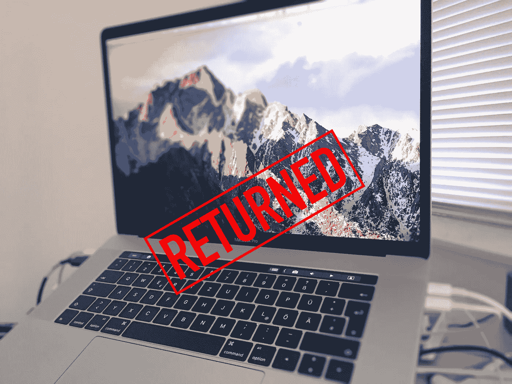
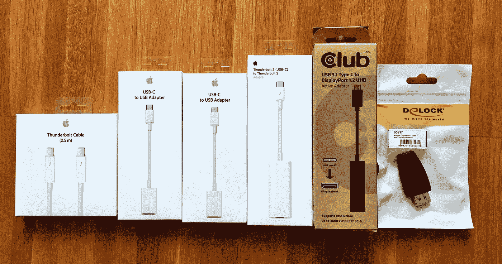
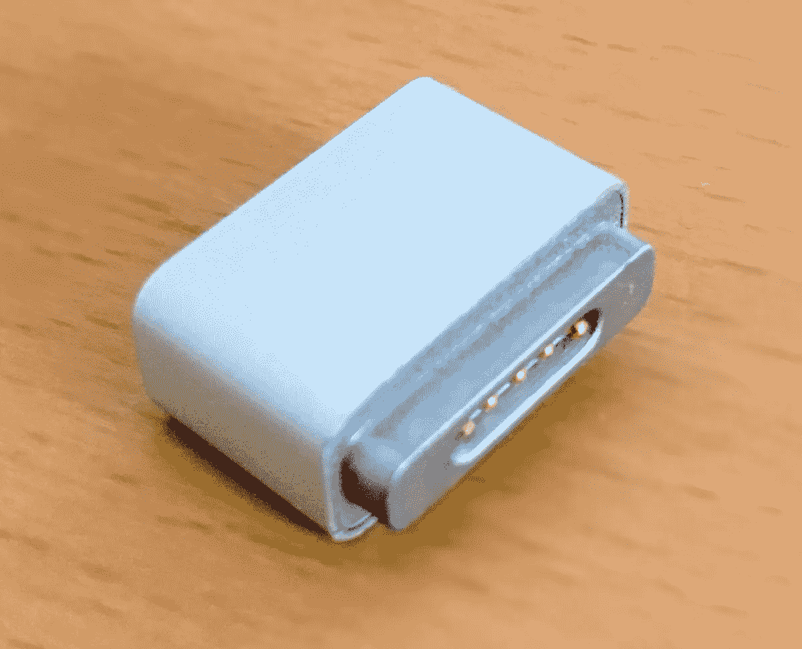
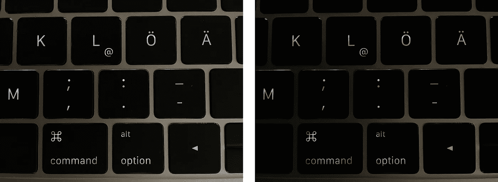

# 在 MacBook Pro 2016 上——以及我退掉我的原因

> 原文：<https://medium.com/hackernoon/on-the-macbook-pro-2016-and-why-i-returned-mine-a9d8ccf5c7b9>

从 2006 年到 2012 年，我平均每年都会买一台新的 MacBook Pro。

但在 2012 年，[苹果](https://hackernoon.com/tagged/apple)卖给我一台 [MacBook](https://hackernoon.com/tagged/macbook) Pro，它如此之好，以至于至今仍是我的主要工作马:第一代 Retina 机型的 15 英寸基本配置(2.3 GHz 四核 i7，256 GB 固态硬盘)，16 GB 内存是唯一的额外选项。

从那以后，我一直在观望，等待一个值得的升级。

下一代 MacBook Pro 2016 似乎终于提供了足够的新技术和面向未来的技术，所以我扣动了扳机，购买了一台新的 15 英寸 MacBook Pro，配备了最快的 CPU (2.9 GHz Core i7)、最快的 GPU(镭龙 460)和 1 TB PCIe 固态硬盘——高达 4.039€。

从那以后，我花了几周时间把新款 MacBook Pro 作为我的主要工作机器。以下是我学到的和观察到的——以及我最终决定归还它的原因。

# Xcode 性能

新 MacBook Pros 中使用的 CPU 的现有基准数据表明，2016 年的高端型号将比我 2012 年的低端配置快 30%至 59%:

不算太坏。

但是*对我来说*，最重要的性能指标是 Xcode 执行典型操作的速度。因此，我使用我的一个大型项目运行了四个测试(所有时间都是构建时间):

*   **清理构建**
    (“清理构建文件夹”，等待索引完成，“构建”)
    MacBook Pro 2012 低端机型: *49.3 秒(平均)*
    MacBook Pro 2016 高端机型: *40.5 秒(平均)*
    提速: *21.7%，节省 8.8 秒*
*   **增量构建**
    (进行单次更改，再次点击“构建”)
    MacBook Pro 2012 低端机型: *12.8 秒*
    MacBook Pro 2016 高端机型: *11.2 秒*
    提速: *14%，节省 1.6 秒*
*   **清理分析
    (“清理构建文件夹”，等待索引完成，“分析”)
    MacBook Pro 2012 低端机型:143.7 秒*秒*MacBook Pro 2016 高端机型:121.9 秒
    提速:17.9 *%,节省 21.8 秒***
*   **增量分析** (做了一次改动，再次点击“分析”)
    MacBook Pro 2012 低端机型:13.3 秒
    MacBook Pro 2016 高端机型:12.7 秒
    提速:4.7 *%,节省 0.6 秒*

新的 MacBook Pro 在最频繁执行的操作(增量构建)上仅节省了 1.6 秒，而完全构建太罕见了，因为在这些操作上 21.7%的性能提升已经足够显著了。如果它能让我每天节省一分钟，我会很惊讶。

# 随机存取存储

我原本希望有 32 GB 的 RAM 选项，但对新的 MacBook Pros 最大 16 GB 感到失望，但在下单时没有想太多。

事实证明，苹果的手似乎受到了束缚，因为新 MacBook Pro 的 sky lake CPU[仅支持最高 16 GB](http://www.imore.com/why-doesnt-new-macbook-pro-have-32-gb-ram) 的低功耗 DDR3 RAM (LPDDR3)。

不过，16 GB 的内存是否能为未来四年留下足够的喘息空间，这个问题仍然存在。

在*我的*案例中，答案变成了*否:*我今天的典型使用已经饱和到 16 GB，以至于 macOS 通常指示 2 GB 或更多的交换使用。

当然，令人难以置信的快速新固态硬盘使交换更少的问题。但我最不希望新 MacBook Pro 将越来越多的数据交换到现在焊接在主板上的固态硬盘上，这增加了过早磨损的风险，从而缩短了整个机器的寿命。

# 雷电 3

我觉得#DongleLife 言过其实了。

我可以接受购买和使用适配器来连接我的旧设备，如果这意味着我的机器能够以比以前高得多的速度与未来的设备进行通信。事实上，这正是我对未来四年想要使用的机器的期望。未来属于雷电 3/USB-C——新的 MacBook Pros 配备了四个这样的端口，这很好。

但是苹果真正搞砸的地方是他们为新款 MacBook Pros 提供的一系列适配器。

## 这没有苹果适配器

从我记事起，苹果就一直在制造和提供你(可能)需要的完整系列的适配器以及新的端口，让切换到一个新的、更强大的端口的整个体验变得相当轻松。

这次不是这样:

*   **千兆以太网**:由 Belkin 制造，苹果提供的 USB-C 适配器既[较慢，CPU 使用率也“高出一吨”](http://mjtsai.com/blog/2016/12/28/macbook-pro-ethernet-adapter-benchmark/)与苹果 2012 年推出的 Thunderbolt 千兆以太网适配器一样。为什么苹果没有生产雷电 3 版本的适配器？

*   **Mini DisplayPort:** 最初由苹果公司在 2008 年开发并推出，并在 LED 影院显示器上使用，直到 2013 年 10 月，令人惊讶的是，苹果公司*没有*制造或销售任何 Mini DisplayPort 适配器。有人建议使用新的雷电 3 到 Thunderbolt 2 适配器，但是——尽管使用了相同的连接器——它[不能](https://support.apple.com/en-us/HT207266)用于连接迷你 DisplayPort 显示器。当时，寻找第三方适配器来连接我的 LED 影院显示器非常耗时。我花了几天时间，终于找到了一个没有“赞助”五星评论的，真正的规格表，良好的制造质量，由一家值得信赖的公司制造的产品:

*   **Apple Watch:** 苹果不卖 Apple Watch 的 USB-C 充电线。

*   **MagSafe:** 如果你想继续在你的 Apple Cinema Display 或 Apple Thunderbolt Display 上使用现有的 MacBook Pro 充电器或 MagSafe 连接器，你就不走运了。苹果拥有专利，不做适配器。如果苹果做了一个 MagSafe 转 USB-C 适配器，它真的会杀了苹果吗？就像他们 2012 年做的 [$10 MagSafe 转 MagSafe 2 转换器](http://www.apple.com/shop/product/MD504LL/A/magsafe-to-magsafe-2-converter)？显然如此。

Apple MagSafe to MagSafe 2 Converter

*   **坞站** : [惠普](http://www8.hp.com/us/en/workstations/zbook-dock.html)、[微软](https://www.microsoft.com/en-us/mobile/accessory/hd-500/)、[戴尔](http://www.dell.com/support/Article/de/de/debsdt1/SLN301105/EN)和其他电脑制造商为他们的设备提供 USB-C 和/或雷电 3 坞站。苹果没有。
    我发现这是一个*重大*错失的机会，因为它真的会简化向雷电 3/USB-C 的过渡，充分展示新端口的优势，并从一开始就提供苹果支持的(因此无忧)对接解决方案。相反，苹果得到了很多负面报道和#DongleLife 标签。而苹果的客户呢？大量有“赞助”五星评论和不明确兼容性的产品可供选择。多么糟糕的表演。

# 触控 ID 的触摸酒吧

迄今为止定义硬件键盘的一个不变因素是键从不改变位置，并且提供触觉反馈来确认键的位置以及键的实际按压。

两者结合在一起，让我们能够建立肌肉记忆，在不看键盘的情况下以高速度可靠地打字。

Touch Bar 改变了这一切:它用一个触摸屏取代了顶行功能键，触摸屏上的“键”会动态改变位置，并且只提供关于按压状态的视觉(如果有的话)反馈。

在实际使用中，我发现这导致了一些问题:

## 退出键

乍一看，没有问题:每当我想按下 Escape 键时，Touch Bar 就会显示出来，并且点击 Escape 键之前所在的位置会被正确识别。到目前为止一切顺利。

但在实践中，缺乏任何触觉确认是一个主要问题:不止一次，每当当前使用的应用程序(hello Xcode！).

我认为苹果有两种方法可以解决这个问题(我希望苹果最终会实现这两种方法):

*   在软件方面:通过为 Touch Bar 按键提供声音反馈，类似于 iOS 在你按下屏幕触摸键盘上的按键时提供的声音反馈。可能为特定的功能键播放不同的声音。使它成为一个系统范围的选项，但也为(音频/视频)应用程序提供了一个 API 来选择退出反馈声音。
*   硬件方面:在 Touch Bar 上增加一个 Taptic 引擎来提供真实的触觉反馈。

## 认知足迹

我在为各种输入设备[开发](https://www.iospirit.com/blog/2016/06/10-years-of-Remote-Buddy)[远程控制软件](https://www.iospirit.com/products/remotebuddy/)的 10 多年中得到的一个重要见解是，第二屏幕很少能成为好的输入设备。

通过在第二个屏幕上呈现输入元素并将交互移动到第二个屏幕，用户必须

1.  将他们的目光从主屏幕移到第二个屏幕
2.  视觉上和心理上解析第二屏幕内容
3.  决定是否进行交互以及进行哪些交互
4.  将他们的目光移回到主显示屏上
5.  从视觉和心理上重新解析主屏幕内容

相比之下，简单地按下一个键或执行一个手势。

*直接*第二屏互动的*认知足迹*显著高于*间接*互动的*。*

而 Touch Bar 对此也不例外。由于可能的触摸目标几乎分布在键盘的整个宽度上，我发现认知足迹特别高，因为我的眼睛经常不得不水平扫视它。

就工作效率而言，Touch Bar 对我来说是一种回归，因为像调节音量或亮度这样的频繁任务比以前需要更长的时间，而在我视野边缘动态更新的 Touch Bar 可能会很快成为分散注意力的视觉噪音。

另一方面，对于那些在打字时总是盯着键盘的用户来说，他们得到的体验可能会大不相同，更像是在 iOS 设备上打字。

此外，触控 ID——我发现这是一个非常有用的补充——依赖于 Touch Bar 的显示屏作为其界面不可或缺的一部分。这很可能就是 Touch Bar 存在的原因。

所以，Touch Bar 并不是一切都不好。事实上，我发现它充满了好主意。但它需要更多的关注和改进，以释放其全部潜力。

就像第一款 Apple Watch 一样，它一开始是一个好主意，在纸面上*非常*引人注目，在实际使用中却乏善可陈，但在一次重大的软件大修后变得非常有用和令人愉快。

我想在我的下一个 MacBook Pro 中有一个。

## 更多触摸酒吧和触控 ID 花絮

*   Touch Bar 使用视网膜级显示器，但它显示的内容往往看起来令人惊讶地模糊。我不清楚这是硬件问题还是软件问题。

*   Touch Bar 使用一个大部分时间都开着的有机发光二极管显示器。受[屏幕老化](https://en.wikipedia.org/wiki/Screen_burn-in)的影响有多大？苹果在保修期内和保修期后会提供哪些选项？
*   虽然触控 ID 本身运行良好，但对于苹果的高端产品来说，这个按钮本身感觉太松了。根据这篇博客的[，触控 ID 按钮实际上应该留在原处——苹果已经开发了一个“](https://www.fujivsfuji.com/fuji-views/returning-my-2016-macbook-pro) [2016 MacBook Pro 垫片套件](https://www.fujivsfuji.com/fuji-views/returning-my-2016-macbook-pro)”来解决受影响机器上的问题。
*   [根据 MacWorld](http://www.macworld.com/article/3142362/hardware/macbook-pro-teardown-reveals-pointless-speaker-grilles-and-hard-to-replace-touch-bar.html) 的说法，触控 ID 传感器在工厂级别与逻辑板的苹果 T1 芯片配对，因此不清楚更换触控 ID 按钮是否也需要一个全新的逻辑板。
    同样，如果需要更换触控 ID 按钮，最好提前知道 Apple 将在保修期内和保修期后提供哪些选项。
*   从 macOS 10.12.2 开始，Touch Bar 经常表现出看起来像是(软件)刷新问题，它突然只显示最近更新的区域，否则会保持黑色。
    一个简单的解决方案是设置 Fn 键，使其显示旧的功能键(在系统偏好设置>键盘中)。按下和释放 Fn 键，然后总是恢复我的全部内容。

# 键盘

就像一个好的专辑一样，新键盘需要一些时间来适应我。与我以前用过的任何东西都不一样，一开始我非常怀疑。只是感觉太响了。但是几个星期的实际使用之后，它真的赢得了我的心。

对我来说，这没什么大不了的，但对于一个像苹果一样渴望完美的公司的产品来说，这仍然值得注意:按键的中心被很好地照亮了，但亮度向边缘明显下降(看看“command”键，“alt”和 L 键上的“@”。

Unevenly distributed key backlight on the new MacBook Pro 2016\. Left: original iPhone photo. Right: with increased contrast.

# 触控板

这台机器上的触控板很大！它的手掌拒绝是可靠的——苹果已经真正掌握了模拟按钮的触觉和声音，而不是实际存在的按钮。几个星期后，它听起来感觉比我以前的更好。

但是用一个手指“按下”按钮，并用另外两个手指来执行滚动手势在大多数时候都不起作用。这种*在我的 MacBook Pro 2012 上确实可靠，我用这种技术选择大块文本或在表格视图中滚动到正确的位置，然后将文件放到上面。*

苹果最有可能在软件中解决这个问题，但就目前的情况来看，这很令人困惑，让我的工作效率更低。

# 电池寿命

过去，在电池续航时间方面，苹果常常承诺不足，承诺过多。这次不会。

电池续航时间可达 10 小时，但我通常只能离开电网 3 到 4 小时。

这大约是我从 2012 年的 MacBook Pro 和四年前的电池中得到的时间。

# 前置摄像头

#ShotOnMac 不是苹果近期应该开展的活动，除非它想公开让自己难堪。尝试 MacBook Pro 2016 的前置摄像头，我仍然得到了与我的 MacBook Pro 2012 相同的模糊图片。

虽然苹果已经表明它可以制造真正像样的前置摄像头 iPhone 6S 配备了 500 万像素的前置摄像头，iPhone 7 配备了 700 万像素的前置摄像头——但 MacBook Pro 的前置摄像头仍然停留在 0.9 万像素(720p)。

但事情可能会更糟:Retina MacBook 配备了一个 0.3 MP (480p)摄像头——[就像它还是 2003 年的](https://en.wikipedia.org/wiki/ISight#Design)。

# 安全性

奇怪的是，我的 MacBook Pro [出厂时关闭了系统完整性保护——迄今为止，苹果公司还没有对此做出任何公开解释。](http://www.theverge.com/2013/12/29/5253226/nsa-cia-fbi-laptop-usb-plant-spy)

我还注意到，如果你使用 macOS 的预装版本，迁移助手只会在传输你的数据后*提到*file vault 全磁盘加密*的存在，但甚至不会提供打开它。由于固态硬盘的工作方式，在*迁移后打开 FileVault *并不能保证不会有未加密的数据副本。所以这很糟糕。*

由于这些天你有充分的理由不信任预装的操作系统副本，你可以通过使用互联网恢复来解决这两个安全问题

1.  检查您的 SIP 状态:
    $ csrutil 状态
    系统完整性保护状态:[启用|禁用]。
2.  如果 SIP 被禁用，则启用它:
    $ csrutil enable
3.  使用“磁盘工具”抹掉新 MacBook Pro 的固态硬盘
4.  从互联网恢复重新安装 macOS

这就是我所做的，令我惊讶的是，这一次我被要求立即启用 FileVault，并且在开始迁移我的任何数据之前*。*

# 已知问题

如果你计划在你的新 MacBook Pro 2016 上使用 Windows，请注意 Bootcamp 驱动程序问题，据报道，该问题可能会对 MacBook Pro 的扬声器造成永久损坏。

有[报告称](http://forums.macrumors.com/threads/psa-the-2016-mbp-is-prone-to-the-same-rattling-display-bug-as-previous-models.2012655/)出现了类似这样的意外卡嗒声:

# 可升级性

## 价值

多年来，苹果一体式设计的两个最大的成就是它的耐用性和使升级变得如此容易，苹果在电脑旁边包括了印刷的升级说明。

使用现成的组件和标准螺丝刀快速升级 RAM 和 HDD 的能力意味着您的机器有*空间随着您的需求而增长*，并承诺提供超过最初购买配置的*价值。*

## 从电脑到电器

2012 年，苹果开始偏离这条升级友好的道路，开始将 MAC 从电脑过渡到电器。

第一代 Retina MacBook Pro(2012–2015)向 Mac 用户介绍了将 RAM 焊接到主板上的概念、底盖上的[五瓣螺钉](https://en.wikipedia.org/wiki/Pentalobe_security_screw)以及非标准引脚配置插槽中的固态硬盘。

第二代 Retina MacBook Pros (2016-？)现在通过将 SSD 焊接到主板上完成了向设备的过渡，消除了最后一个用户可升级的部分。

## 物理？

有人可能会说苹果没有其他选择。在越来越纤薄的外形中，首先没有足够的空间容纳 RAM 插槽，然后是插槽 SSD。物理！

然而，没有 Touch Bar 的 13 英寸 MacBook Pro 2016 *与带有* Touch Bar 的版本*尺寸相同，但[配备了插槽 SSD](https://www.ifixit.com/Teardown/MacBook+Pro+13-Inch+Function+Keys+Late+2016+Teardown/72415) 和更高容量的电池。*

不管真正的原因是什么，将所有组件焊接到主板上的做法降低了新款 MacBook Pro 的*价值*，因为缺乏可升级性，价格更高，升级周期更短。

# 我喜欢什么

除了新的键盘、触控 ID、四个雷电 3 端口和更快的固态硬盘，新款 MacBook Pros 还有更多令人喜欢的地方:

## GPU 性能

2016 年 MacBook Pro 中的镭龙 460 真正实现了其比 2012 年 MacBook Pro 的 GPU 快 2.85 倍的承诺。任务控制动画中几乎完全没有任何与图形相关的东西。

虽然我仍然“更喜欢”影院显示器(这样我就可以很容易地在标准*和*视网膜分辨率下测试我的应用程序)，但我发现未来能够驱动多达四个 4K 或两个 5K 显示器的想法非常有吸引力。

## 更冷、更安静的操作

即使在相当大的负载下，MacBook Pro 2016 也保持了较低的温度，风扇几乎从未开启。

## 更好的扬声器

新的扬声器比 MBP 2012 的要好得多。

## 更好的显示

由于广泛的颜色支持，新显示器上的颜色真的很流行。

# 结论

新的 MacBook Pro 是四年多来该系列的首次重大更新，充满了新的和改进的技术。我真的很想保住我的孩子，但我无法与之和平相处。

Xcode 的性能提升太小，我意识到我的下一台 Mac 真的需要 32 GB 的内存，而不是 16 GB，如果我想继续使用四年的话。此外还有高昂的价格。缺乏任何购买后升级途径。现在几乎所有的东西都焊接到了逻辑板上。维修费用不明。需要更多工作的新组件数量(触摸条、触控板)——或者可能在几个月后出现故障。

关于后者:还记得第一代 Retina MacBook Pro 的早期几期吗？苹果[花了三年](http://www.macrumors.com/2015/10/17/apple-mbp-ar-coating-quality-program-staingate/)才*内部*认可*他们最初发货的三星和 LG 显示器的所有*问题。我坚持不懈，花费时间，反复走访不同的苹果商店和苹果授权经销商，在四年的时间里换了两次显示器——最终得到了一个不受[重影](https://9to5mac.com/2013/03/20/macbook-pro-with-retina-display-problems-in-every-dimension/)或[污点](http://www.staingate.org/)影响的[好显示器](https://twitter.com/felix_schwarz/status/809385234743623680)。我只是不热衷于重复这种经历。

得出的结论是，新的 MacBook Pro 无法为我提供我在其中寻求的价值——上次我从苹果公司购买第一代产品时被严重烧伤，我退回了新的 MacBook Pro。

在接下来的 1-2 年内，英特尔应该会推出适用于 6 核 MacBook Pro 的移动 CPU，并支持至少 32GB 更快、更节能的 LPDDR4 RAM。再加上更快的 GPU，这应该会带来巨大的性能提升，并最终成为一个值得(甚至是不可抗拒的？)升级。

在那之前，苹果应该已经解决了 Touch Bar 和 Trackpad 的剩余软件问题，解决了任何已知的制造问题，可能已经完成了高容量电池的工作，甚至——我知道这听起来很疯狂——再次推出插座式可升级固态硬盘。到那时，我们也应该知道 Touch Bar 的有机发光二极管显示器是否容易老化，以及它是否可以独立于主板进行更换——或者不能。

知道自己至少在一年内不会买新机器，我决定更换我的旧 MacBook Pro 的破旧的 256 GB 固态硬盘，因为我喜欢新的 480GB 固态硬盘的空间和更好的性能:

我有点担心无法使用硬件触控条。但我认为，如果苹果认为这是 Mac 体验的一个相关部分，苹果应该在几个月内与更新的 IMAC 一起推出带 Touch Bar(甚至可能是触控 ID)的新键盘。

喜欢读这个吗？ [*关注我的推特*](https://www.twitter.com/felix_schwarz) *获取更多。*

# 进一步阅读

*   **迈克尔·蔡** : [新款 MacBook Pros 和 Mac 的状态](http://mjtsai.com/blog/2016/10/27/new-macbook-pros-and-the-state-of-the-mac/)
*   **iphone do**:[MacBook Pro 2016 w/Touch Bar——我退掉它的原因——深度回顾和对比](https://www.youtube.com/watch?v=zRIQypuceBI) (YouTube 视频)
*   **富士 vs 富士** : [还我 MacBook Pro](https://www.fujivsfuji.com/fuji-views/returning-my-2016-macbook-pro)
*   **Mac 性能指南** : [2016 款 MacBook Pro:退掉，坚持 2013 款？](https://macperformanceguide.com/blog/2016/20161122_1640-Apple2016MacBookPro-returning.html)
*   **柯蒂斯·赫伯特** : [13 寸 vs 15 寸 MacBook Pro:2016 年开发者视角](https://blog.curtisherbert.com/13-vs-15-macbook-a-developers-perspective-in-2016/)
*   **Ars Technica** : [解释新款 MacBook Pros 的电池寿命问题](http://arstechnica.com/apple/2016/12/explaining-the-battery-life-problems-with-the-new-macbook-pros/)

> [黑客中午](http://bit.ly/Hackernoon)是黑客如何开始他们的下午。我们是 [@AMI](http://bit.ly/atAMIatAMI) 家庭的一员。我们现在[接受投稿](http://bit.ly/hackernoonsubmission)并乐意[讨论广告&赞助](mailto:partners@amipublications.com)机会。
> 
> 如果你喜欢这个故事，我们推荐你阅读我们的[最新科技故事](http://bit.ly/hackernoonlatestt)和[趋势科技故事](https://hackernoon.com/trending)。直到下一次，不要把世界的现实想当然！

