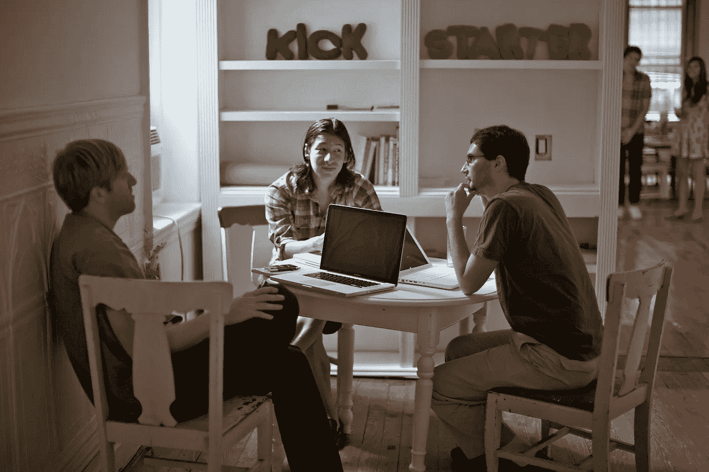
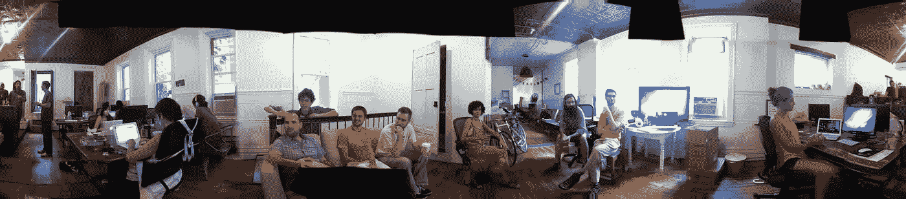
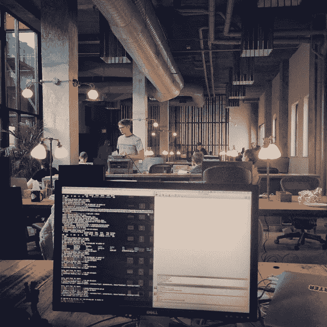
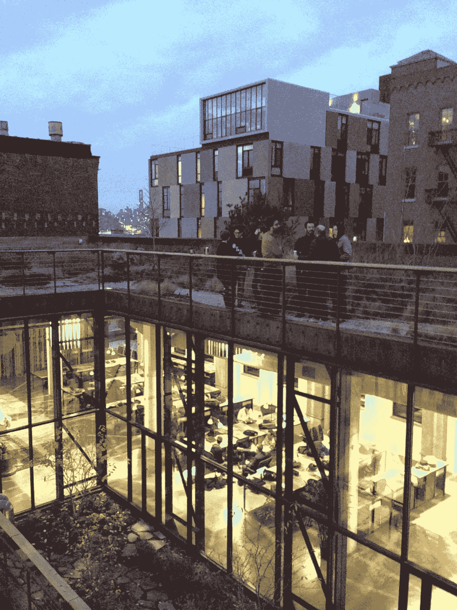

# 接下来的 2271 天…

> 原文：<https://medium.com/hackernoon/on-to-the-next-2-271-days-309d6ba672d7>

“要么全有，要么全无”描述了 Kickstarter 独特的融资模式——创建者设定一个融资目标和达到目标的最后期限。如果他们错过了目标，没有钱转手。它有办法把集体的能量真正集中到一个目标上。这也是一种思维模式，它塑造了我为公司工作的职业生涯和哲学。

现在，2271 天后，我觉得我的项目的最后期限到了，我已经达到了我的目标。这是一次不可思议且有收获的旅程，并以我认为不可能的方式设立了标杆。

Our first HQ — 155 Rivington — December 29th 2009

2009 年，当我加入[成为我们在纽约的第二名全职员工](https://www.youtube.com/watch?time_continue=142&v=qcR_UHV0tKE)时，我们甚至还没有一间办公室。这没关系——我刚刚利用这个网站为[表情符号迪克](https://www.kickstarter.com/projects/fred/emoji-dick)筹集资金，记得当时我在想，如果 [Kickstarter](https://hackernoon.com/tagged/kickstarter) 能够让莫比迪克的表情符号翻译成为可能，很明显这个产品和社区有一个光明的未来。

很快，我听到一个模糊的描述，说下东区可能有一个带按摩浴缸的空间。按摩浴缸原来是一个非常大的浴缸，上面挂着一个小水晶吊灯——因为厨房的水槽坏了，我们后来用它来洗碗。

我们到达时，里温顿街 155 号又冷又空，但随着团队的壮大和项目的推进，这里变得温暖起来。我们的房东非常灵活，后来让我们接管了大楼的大部分。[我们还发现 Rancid 在顶楼为“定时炸弹”拍摄视频](http://fredbenenson.com/2014/01/19/digital-forensics-rancid-reas-kickstarter-hq/)。

Charles, Perry and Brett discuss something product-y. Yancey is in the background with a friend.

早期，我尽我所能帮忙，尽我所能尽我所能。我之前的工作是在 [Creative Commons](http://creativecommons.org/) 工作，我在那里从事外联和一些产品创意，但没有任何东西让我为 Kickstarter 的节奏和需求做好准备。似乎每天都有新的问题需要我们思考，新的决定需要我们做出。突然间,“做生意”和创造“一种产品”的概念变得不那么陌生了——这是良好的判断、信任、优秀的员工和专注的结果。很难描述这种组合有多令人振奋:我们把人们想要的好东西带到这个世界上，而且那东西正在工作。

Before an “all hands” meeting, just as we began to outgrow the floor

虽然我在大学期间学习了哲学和计算机科学，并于 2008 年从 ITP 大学毕业，但我来到 Kickstarter 时并没有对软件或工程产生兴趣。但我决心利用我的背景和技能为公司提供价值，所以这让我接了一些更奇怪、不那么迷人的技术任务。结果发现，很多人使用数据来回答网站上发生(或没有发生)的棘手问题。

我的早期工作最终合并成一个研发角色，专注于提供见解和构建数据驱动的产品。我写了查询，将谷歌分析推到了极限，与 Yancey 一起发表了[OKCupid 风格的博客帖子，并为我们的社区和员工建立了许多仪表盘和图表。这是一项迷人的工作，我喜欢尽可能地将数据带入每一次谈话中。随着纽约数据领域的蓬勃发展，我参加了聚会，自学了足够的统计学和数学知识，以使其发挥作用。](https://www.kickstarter.com/blog/categories/data?ref=blog)

在某个时候，我甚至自愿成为我们的全职招聘人员。结果并不是很好——事实证明我的兴趣和技能更适合企业的产品和开发方面——但我们都能够从那次实验中恢复过来，这要归功于 Kickstarter。
最重要的是，从那次经历中，我对招聘优秀人才有了更深的体会。我在 Kickstarter 上利用我所学到的知识，全力以赴地研究数据，招募了一个由数据科学家、分析师和工程师组成的非常有才华的团队，并作为我们的第一位数据副总裁领导这个团队。

自始至终，Kickstarter 从未动摇过它的目标和使命。每天我们都能看到人们的梦想成真。我可以毫不夸张地说，我们的产品改变了人们的生活，为世界创造了美好。这项任务并非没有风险，而且 Kickstarter 项目的进展并不总是一帆风顺。但是我们总是靠在一起，专注于做正确的事情。

这些原则将 Kickstarter 与技术领域的同行区分开来，而[我们最近重组为公益公司](http://www.nytimes.com/2015/09/21/technology/kickstarters-altruistic-vision-profits-as-the-means-not-the-mission.html)进一步巩固了这一区分。

Kickstarter 让我看到了一家盈利性公司如何既能做好又能做好——以前我相信让世界变得更好的唯一方法是在非营利机构或政府部门工作。我现在知道那不是真的。

Tim O'Reilly 有一些很棒的想法，这些想法与我在这里学到的非常一致。

Kickstarter HQ in Greenpoint

几年后，在我们绿点的家安顿下来后，我们用数据建造了一些令人惊奇的东西，有了一个储备充足的团队，和一个复杂的基础设施来做我们想做的任何种类的研究。

# 我学到了一些东西

我开始注意到的一件事是，我的机构知识的价值已经开始与我的主动知识的价值竞争。类似地，我积累了用数据做事的直觉，这些数据实际上只是第一手经验和行业最佳实践的组合。

我想现在是时候分享一些了。因此，没有特定的顺序，这里是我多年来在运行 Kickstarter 的数据操作时发现的一些事情:

*   数据工作主要包括 a)计数 b)计算分母和 c)a)和 b)的重现性
*   你越是能和某人一起帮助完善他们的问题，这个问题就越容易回答
*   协调来自两个不同来源的类似数据(例如，“为什么 Google Analytics 说 X，而 Mixpanel 说 Y？”)的收益递减，除非必要，否则应该避免使用
*   通过 A/B 测试进行[随机控制实验](https://en.wikipedia.org/wiki/Randomized_controlled_trial)总是比分析历史数据要好
*   测试或研究的结果让你既高兴又惊讶的次数会很少
*   与此相关，接受证实无效假设的测试结果对团队士气有好处
*   [逻辑回归](https://www.quora.com/What-is-logistic-regression)统治着我周围的一切
*   衡量标准对一家公司讲述自己的故事至关重要；诚实而严格地定义它们是至关重要的
*   有时解释数据更多的是管理不确定性，而不是说任何令人兴奋的事情
*   好的实验设计很难；不要让一个伟大的测试框架让你变得懒惰
*   [数据科学](https://hackernoon.com/tagged/data-science) (A/B 测试等。)可以帮助您如何针对特定结果进行优化，但是它永远不会告诉您针对哪个特定结果进行优化
*   无论您是自己使用工具还是从 API 中获取数据，都要设法以最原始的形式记录和获取数据
*   新员工喜欢知道有一个内部风格指南，所以为你的主要语言(SQL，R 等)维护它们是值得的。)

有些事情我经历了艰辛，有些事情我有幸从信任的朋友那里学到。不管怎样，在这样一个合作的环境中，和这样支持我的同伴一起做这件事是很棒的。

这就是为什么继续前进是如此的苦乐参半。

但是有人曾经告诉我不要太舒服。这实际上是我决定是时候了的很大一部分原因——我在 Kickstarter 历史早期开始做的许多事情感觉已经完成了。我们已经[建立了自己的数据基础设施](https://www.kickstarter.com/backing-and-hacking/this-is-the-story-of-analytics-at-kickstarter)，我们拥有进行研究和假设检验的巨大能力，并且数据现在几乎通知了公司内部的每个决策，从高级团队到我们的社区支持。

2 月 19 日将是我的最后一天，但在那之前，我会帮忙寻找接替我的人。 [**知道有谁热爱数据科学，想在纽约最激动人心的地方之一**](https://www.kickstarter.com/jobs/vp_data) **带领团队吗？**

58 Kent in 2013

我不确定我的下一份工作是专注于数据还是机器学习，尽管很难否认围绕人工智能和深度学习框架的所有宣传——我肯定会探索这个领域的一些项目和问题。我所知道的是，无论我接下来在职业上做什么，都将涉及科学地思考问题，我计划将我在快节奏的价值观驱动的环境中所学到的一切运用到工作中。

所以我很兴奋独自去寻求一些我自己的*全有或全无*。短期内，我会在纽约呆一段时间，然后去旅行，冲浪，弹钢琴，希望能写更多的东西。

> [黑客中午](http://bit.ly/Hackernoon)是黑客如何开始他们的下午。我们是阿妹家庭的一员。我们现在[接受投稿](http://bit.ly/hackernoonsubmission)并乐意[讨论广告&赞助](mailto:partners@amipublications.com)机会。
> 
> 如果你喜欢这个故事，我们推荐你阅读我们的[最新科技故事](http://bit.ly/hackernoonlatestt)和[趋势科技故事](https://hackernoon.com/trending)。直到下一次，不要把世界的现实想当然！

