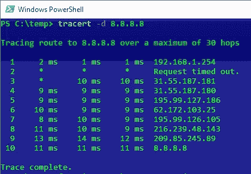
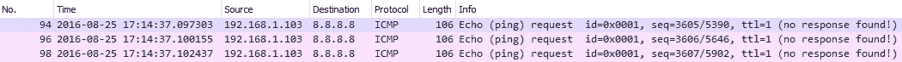
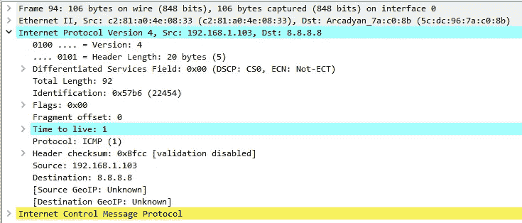
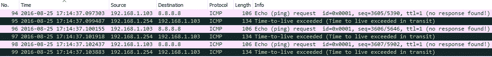
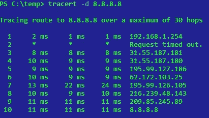
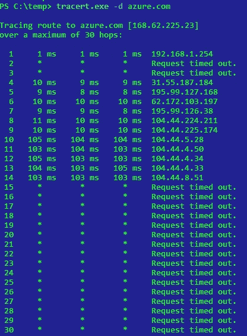

# 网络故障排除:Traceroute

> 原文：<https://medium.com/hackernoon/on-troubleshooting-networks-traceroute-92a1569011f>

我想开始一系列关于网络概念的帖子。没有什么非常复杂的，只是为了好玩。我认为开始讨论 traceroute 是个好主意，因为它是最著名的故障排除工具之一。

希望你喜欢阅读。

# Traceroute。

从事网络工作的人都曾使用过 traceroute 来排除连通性故障，但我们对它的工作原理和结果解释又了解多少呢？

大多数人都知道 traceroute“使用 ICMP”，但这是一个非常宽泛的说法，并不总是 100%准确。我为什么这么说？让我们从分析最常见的 traceroute 实现之一——来自 Windows 的 traceroute 开始。

# tracert.exe

traceroute 的这种实现最简单的用法只需要一个参数:我们希望跟踪路由的目的 IP 地址。
当我们点击进入时，引擎盖下的**tracert.exe**是什么？它立即向目的 IP 地址发送 3 个类型 8 代码为 0 的 ICMP 数据包，也称为回应请求或更常见的 Ping。

These 3 ICMP packets have a particularity though: Their TTL value is 1.

[TTL 是一个 IP 报头](https://en.wikipedia.org/wiki/Time_to_live)，每当一个 IP 分组从一个子网移动到另一个子网时，它就递减 1。换句话说，路由器每转发一次数据包，就会减少数据包的 TTL。

Expanded IP header in Wireshark

于是**tracert.exe**向目的 IP 地址发送了 3 个 pings，TTL 值为 1。这些数据包先去哪里？嗯，假设目的地 IP 地址不是我们网络中的另一台主机，我们运行**tracert.exe**的计算机将查找自己的路由表，决定将这个数据包发送到哪里。在大多数情况下，我们会有一台带有简单默认路由的计算机，它指向我们所说的默认网关(因为它是为默认路由指定的网关)。

数据包到达默认网关，默认网关是具有路由功能的网络设备。可能是路由器或者防火墙。该路由器将查看数据包报头，以决定如何处理它。在正常情况下，我会提到路由器也会检查自己的路由表，但是除了目的 IP 地址之外，路由器还会检查一样东西:TTL 报头。

正如我们之前提到的，TTL 报头的值为 1，路由器在转发数据包时会将其递减，因此在我们的例子中，路由器必须转发 TTL 值为 0 的数据包。这可能吗？好吧，一个坏掉的 IP 堆栈可能想这么做，但简单的回答是**不**。一旦你必须转发一个数据包，并将其 TTL 值减少到 0，你将**丢弃它**并向**原始发送者**发回通知。在我们的例子中，**原始发送者**是谁？我们的电脑。

路由器会向我们的计算机发回什么样的通知？要是我们有某种标准化的网络控制协议就好了！

没错，路由器会发回一个类型 11 码 0 的 [ICMP 包，也就是所谓的“TTL 过期(或 TTL 超出)在途”。此 ICMP 还将包含原始丢弃的数据包作为其有效负载，因此您的计算机可以识别已被丢弃的数据包。](https://en.wikipedia.org/wiki/Internet_Control_Message_Protocol#Control_messages)

嗯，这很好，但是 tracert.exe 如何利用这一点呢？轻松点。ICMP 包当然是 IP 包，所以有 IP 头吧？tracert.exe 可以从 IP 报头中得到什么有用的信息？**源 IP 地址**。由于 TTL 过期数据包是在路由器上发起的新数据包，源 IP 地址是路由器的 IP 地址，因此**tracert.exe**将读取该 IP 地址，并识别谁是第一跳:

在上面的截图中可以看到，我们的电脑 **192.168.1.103** 向**8.8.8.8**发送 3 个 pings(其中 TTL==1 在截图中看不到，但在本文之前的截图中可以看到)并从 **192.168.1.254** 取回 3 个 TTL 过期的数据包。这就是**tracert.exe**如何识别第一跳，以及它如何测量我们与该跳之间的延迟(发送 ping 和接收 TTL 过期数据包之间的时间差)。这个过程是相同的，直到 TTL 足够大，可以到达目的地而不会在传输中过期，在这种情况下，我们将获得对 ping 的回复(Echo Reply ICMP)。

所以，是的，我们可以说**tracert.exe**“使用 ICMP”，因为除了第 3 层之外没有其他协议。

Request timed out at hop #2\. What’s going on?

# 请求超时。

在我们的**tracert.exe**输出中看到这条消息并不少见。这是什么意思？简而言之，这意味着我们从未收到 TTL 过期的 ICMP 数据包，也没有收到回应 ICMP 对发送的 pings 的回复。原因？

-出于安全或经济原因，路由器被配置为不发送这些回复。
-要么是我们的 pings 在到达路由器之前丢失了，要么是 ICMP 回复在返回给我们的途中丢失了。

在上面的截图中，我倾向于认为跳#2 的路由器被配置为不发送这些 ICMP 数据包，只是因为其余的跳看起来运行良好并报告回来，所以我会丢弃路径中严重的数据包丢失(参见？我们已经开始从 tracert.exe 的结果中获得一些有用的东西。

Fun fact: After hop #9 we have crossed the Atlantic Ocean (+100ms).

在其他情况下，在某一跳后会出现**请求超时**消息，但我们从未获得新的跳 IP 地址。在这种情况下，就像上面的截图一样，在跳#14 之后，有一个设备丢弃 ICMP 数据包。在某些情况下，直到最后一个结果之前，您还会错过一堆结果:在这种情况下，中间设备会丢弃不是 ping 的 ICMPs(回应请求和回应回复)。

在这种情况下，只有这个输出，我们不能肯定地说有多少跳，直到目的地和**tracert.exe**将继续下去，直到跳#30(默认)。

你是如何度过这一关的？你不能。*但是我听说过*[*tcptraceroute*](http://linux.die.net/man/1/tcptraceroute)*！* —是的， **tcptraceroute** 有一点不同，但是它在很多场景下都不会起作用。让我解释一下原因:

**Tcptraceroute** 向目的地发送 TCP SYN 数据包，从 TTL == 1 开始，每次得到一个结果后递增其值。尽管如此，我们必须接收 TTL 过期的 icmp 才能确定是谁丢弃了数据包——如果设备丢弃 icmp，我们将无法获得它们。

那为什么 **tcptraceroute** 呢？因为如果最终主机不回复 ping，它可能会回复您的 TCP SYN 数据包。或者中间的防火墙可能允许 TCP 流量入站，但不允许 ICMP 入站(并允许任何内容出站，包括 TTL 过期的 ICMP)。

从上面的截图中，我还想强调一个细节。理论上讲，tracert.exe 跳应该增加它的延迟，即使它不到 1 毫秒并且不反映输出，但是为什么到达跳#6 比到达跳#7 花费更长的时间呢？ICMPs 肯定不会回到过去。就我们现在所知，每一跳都是独立测量的，延迟是指我们发送 ping 命令后多久才能收到 TTL 过期的 ICMP，在更远的一跳上有更高的延迟听起来并不疯狂。从上面的截图我不能确定，但很可能是这两个中的一个:

*   **ICMP 节流**:一些网络管理员，尤其是网络繁忙的 ISP，配置策略以非常低的优先级回复这些 ICMP，这样他们可能会非常快地将你的 ICMP 转发到下一跳，但是当他们必须回复时，他们可能会进一步延迟响应。
*   **网络波动**:路径中的一个设备可能比我们测试第 7 跳时负载更重。

#6 和#7 之间的延迟差异不是很大，但在某些情况下，您可能会在更近的跃点上看到高达 100 毫秒的延迟。不要被这个迷惑，即使有那些奇怪的结果，也可能根本没有问题。

> 有趣的事实:Linux 中的大多数 traceroute 实现默认使用 UDP。

所以，同样，traceroute 不一定“使用 ICMP”，但它肯定依赖于它:-)。

如果你认为这篇文章有用或有趣，请不要忘记点击下面的小绿心，推荐给其他读者。如果你能在你最喜欢的社交网络上与你的朋友和同事分享，我会非常感激。你也可以看看 [*虫洞网络*](https://wormhole.network/) *，一家提供按需安全私有网络即服务的公司。你可能会感兴趣。*

*谢谢！*

> [黑客中午](http://bit.ly/Hackernoon)是黑客如何开始他们的下午。我们是 T21 家庭的一员。我们现在[接受投稿](http://bit.ly/hackernoonsubmission)并乐意[讨论广告&赞助](mailto:partners@amipublications.com)机会。
> 
> 如果你喜欢这个故事，我们推荐你阅读我们的[最新科技故事](http://bit.ly/hackernoonlatestt)和[趋势科技故事](https://hackernoon.com/trending)。直到下一次，不要把世界的现实想当然！

